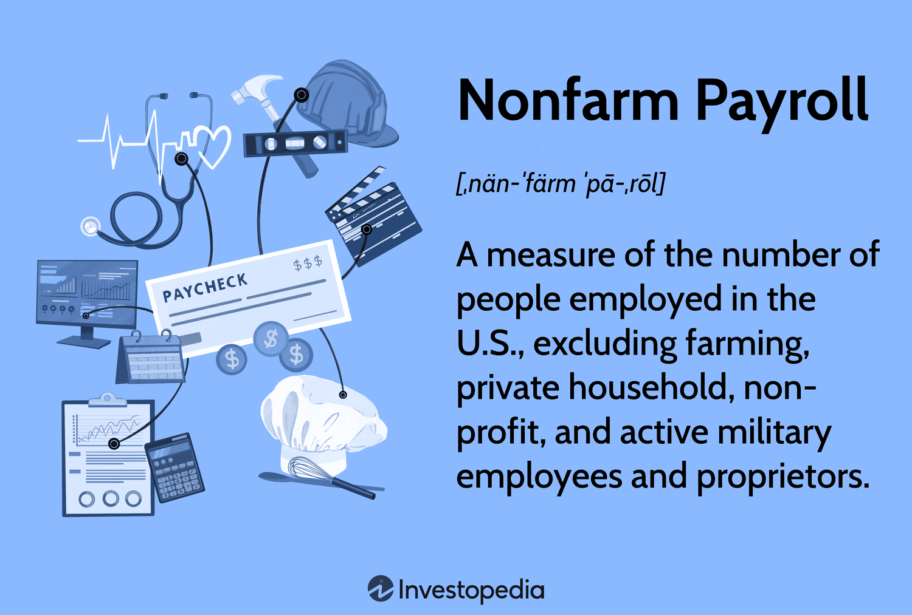

## Table of Contents

## What is Nonfarm Payroll?

Nonfarm Payroll is a report that tells us how many people are working in the United States, except for those who work on farms. It comes out every month from the U.S. Bureau of Labor Statistics. This report is important because it helps us understand if the economy is doing well or not. If more people are working, it usually means the economy is growing. If fewer people are working, it might mean the economy is slowing down.

People who invest money, like those who buy and sell stocks, pay close attention to the Nonfarm Payroll report. It can affect the stock market and other investments. For example, if the report shows that many more people got jobs, stock prices might go up because people think the economy is strong. On the other hand, if the report shows fewer people are working, stock prices might go down because people might worry about the economy.

## Why is Nonfarm Payroll data important?

Nonfarm Payroll data is important because it shows how many people are working in the United States, except for farm workers. This number helps us understand if the economy is getting better or worse. When more people have jobs, it usually means the economy is growing and people are spending more money. If fewer people are working, it might mean the economy is slowing down and people might be spending less.

This data is watched closely by people who invest in the stock market and other financial markets. If the Nonfarm Payroll report shows that many more people got jobs, it can make investors feel good about the economy, and they might buy more stocks, which can make stock prices go up. On the other hand, if the report shows that fewer people are working, investors might worry and sell their stocks, which can make stock prices go down. So, the Nonfarm Payroll data can affect not just the economy, but also the decisions people make with their money.

## How is Nonfarm Payroll data collected?

Nonfarm Payroll data is collected by the U.S. Bureau of Labor Statistics every month. They send out surveys to about 145,000 businesses and government agencies across the country. These surveys ask how many people are working and how many hours they are working. The businesses and agencies fill out the surveys and send them back to the Bureau of Labor Statistics.

Once the Bureau of Labor Statistics gets all the surveys back, they add up all the numbers. They look at how many people are working in different industries, like construction, manufacturing, and services. They also look at how many people are working part-time versus full-time. After they have all this information, they put it together into a report called the Nonfarm Payroll report. This report is then shared with the public, and it helps everyone understand how the job market is doing.

## What sectors are included in Nonfarm Payroll?

Nonfarm Payroll includes a lot of different sectors where people work, but it leaves out farming. Some of the big sectors it covers are construction, where people build houses and buildings; manufacturing, where people make things like cars and clothes; and services, where people do things like cut hair, serve food, or help customers in stores. It also includes sectors like mining, logging, and transportation, where people work with natural resources or move things around.

Other sectors in Nonfarm Payroll are finance, where people work with money and investments; education and health services, where people teach or take care of others; and government, where people work for local, state, or federal agencies. All these sectors together give us a big picture of how many people are working in the U.S., except for those in farming.

## How often is Nonfarm Payroll data released?

Nonfarm Payroll data comes out every month. The U.S. Bureau of Labor Statistics is the group that puts it together and shares it with everyone. They usually release the report on the first Friday of the month.

People wait for this report because it tells them about how many people are working in the U.S., not counting farm workers. It helps everyone see if the job market is getting better or worse. This information is important for people who invest money and for those who want to know how the economy is doing.

## What impact does Nonfarm Payroll have on financial markets?

Nonfarm Payroll data has a big effect on financial markets. When the report comes out, it tells everyone how many people are working in the U.S., except for farm workers. If the report shows that a lot more people got jobs, it makes investors feel good about the economy. They might think the economy is strong and growing, so they buy more stocks. This can make stock prices go up. But if the report shows that fewer people are working, it can make investors worry. They might sell their stocks, thinking the economy is slowing down, which can make stock prices go down.

The Nonfarm Payroll report also affects other parts of the financial markets, like bonds and currencies. If more people are working, it might mean they will spend more money, which can lead to higher inflation. This might make the government raise interest rates to control inflation. Higher interest rates can make bonds more attractive to investors because they offer better returns. On the other hand, if fewer people are working, it might mean less spending and lower inflation, so the government might lower interest rates. Lower interest rates can make currencies weaker, affecting how much they are worth compared to other countries' money. So, the Nonfarm Payroll report can move a lot of different parts of the financial markets.

## How can Nonfarm Payroll data influence monetary policy?

Nonfarm Payroll data can influence monetary policy because it shows how many people are working in the U.S., except for farm workers. When more people have jobs, they usually spend more money. This can lead to higher inflation, which is when prices for things like food and gas go up. The government, through the Federal Reserve, might decide to raise interest rates to slow down spending and keep inflation under control. Higher interest rates can make it more expensive for people and businesses to borrow money, which can help cool down the economy.

On the other hand, if the Nonfarm Payroll report shows that fewer people are working, it might mean that people are spending less money. This can lead to lower inflation or even deflation, which is when prices go down. To help the economy grow, the Federal Reserve might lower interest rates. Lower interest rates make it cheaper for people and businesses to borrow money, which can encourage more spending and help create more jobs. So, the Nonfarm Payroll data helps the Federal Reserve decide whether to raise or lower interest rates to keep the economy balanced.

## What are some common misconceptions about Nonfarm Payroll?

One common misconception about Nonfarm Payroll is that it includes all jobs in the U.S. But it actually leaves out farm workers. This is because farming jobs can change a lot because of things like weather, and they might not show the overall health of the economy as well as other jobs do. So, when people talk about Nonfarm Payroll, they're really talking about jobs in places like factories, stores, and offices, but not on farms.

Another misconception is that Nonfarm Payroll data is always accurate and final. But the truth is, the first numbers that come out can change later. The U.S. Bureau of Labor Statistics might update the numbers after they get more information. So, the first report you see might not be the last word on how many people are working. It's important to look at the updates and changes over time to get a better picture of the job market.

## How does Nonfarm Payroll data correlate with other economic indicators?

Nonfarm Payroll data is closely linked to other economic indicators like the unemployment rate and the Consumer Price Index (CPI). When Nonfarm Payroll numbers go up, it usually means more people are working, which can lead to a lower unemployment rate. A lower unemployment rate often means people feel more confident about their jobs and might spend more money. This can push up prices, which is what the CPI measures. So, if Nonfarm Payroll is strong, it can lead to higher CPI numbers, showing that inflation might be going up.

Nonfarm Payroll also connects with indicators like Gross Domestic Product (GDP) and consumer confidence. When more people have jobs, they earn more money, which can help the economy grow. This growth is measured by GDP, which looks at all the goods and services produced in the country. If Nonfarm Payroll is high, it can mean that GDP is growing because people are working and spending more. Also, when people have jobs, they feel better about the future, which can boost consumer confidence. This confidence can lead to more spending and more economic activity, showing how Nonfarm Payroll can influence other parts of the economy.

## What historical trends can be observed in Nonfarm Payroll data?

Over the years, Nonfarm Payroll data has shown some clear patterns. One big trend is that the number of jobs goes up and down with the economy. When the economy is doing well, like in the late 1990s and the mid-2010s, Nonfarm Payroll numbers usually go up a lot. This means more people are working, and the job market is strong. But when the economy is not doing well, like during the Great Recession in 2008-2009 or the early days of the COVID-19 pandemic in 2020, Nonfarm Payroll numbers can drop a lot. This shows that fewer people are working, and the job market is weak.

Another trend we see is that some industries grow faster than others. For example, the service sector, which includes jobs like working in restaurants or stores, has been growing a lot over the last few decades. On the other hand, manufacturing jobs, where people make things like cars or clothes, have been going down. This shows how the economy is changing and how different kinds of jobs are becoming more or less important over time. By looking at these trends, we can learn a lot about how the job market and the economy are changing.

## How do analysts forecast Nonfarm Payroll numbers?

Analysts forecast Nonfarm Payroll numbers by looking at a lot of different information. They check things like how many people are working in different industries, how many new businesses are starting up, and how many people are looking for jobs. They also look at other reports that come out before the Nonfarm Payroll data, like the ADP National Employment Report, which gives an idea of how many private sector jobs were added. By putting all this information together, analysts can make a guess about how many jobs were added or lost in the last month.

Sometimes, analysts also use special math models to help them predict Nonfarm Payroll numbers. These models look at past data and try to find patterns that can help predict what will happen next. For example, if the economy has been growing for a while, the model might predict that more jobs will be added. But if there have been signs that the economy is slowing down, the model might predict fewer jobs. By using all these different pieces of information and tools, analysts try to get as close as they can to the actual Nonfarm Payroll numbers before they come out.

## What advanced statistical methods are used to analyze Nonfarm Payroll data?

Analysts use several advanced statistical methods to analyze Nonfarm Payroll data. One common method is time series analysis, which looks at how the data changes over time. This helps analysts spot trends, like if the number of jobs is going up or down steadily, or if there are seasonal patterns, like more jobs in the summer. Another method is regression analysis, where analysts try to see how Nonfarm Payroll numbers are affected by other things, like interest rates or consumer spending. This can help them understand what might cause job numbers to go up or down.

Another advanced method is the use of econometric models, which combine economic theory with statistical techniques to predict future job numbers. These models can take into account many different factors at once, like how the economy is doing, how many people are looking for jobs, and how many businesses are hiring. By using these models, analysts can make more accurate predictions about what the Nonfarm Payroll numbers will be in the future. All these methods help analysts get a better understanding of the job market and how it's changing.

## References & Further Reading

[1]: Bureau of Labor Statistics. ["Employment Situation Summary."](https://www.bls.gov/news.release/empsit.nr0.htm)

[2]: López de Prado, M. (2018). ["Advances in Financial Machine Learning."](https://www.amazon.com/Advances-Financial-Machine-Learning-Marcos/dp/1119482089) John Wiley & Sons.

[3]: Chan, E. (2009). ["Quantitative Trading: How to Build Your Own Algorithmic Trading Business."](https://github.com/ftvision/quant_trading_echan_book) John Wiley & Sons.

[4]: Jansen, S. (2020). ["Machine Learning for Algorithmic Trading."](https://github.com/stefan-jansen/machine-learning-for-trading) Packt Publishing.

[5]: Phillips, A. W. ["The Relation Between Unemployment and the Rate of Change of Money Wage Rates in the United Kingdom, 1861–1957."](https://onlinelibrary.wiley.com/doi/full/10.1111/j.1468-0335.1958.tb00003.x) Economica, New Series, Vol. 25, No. 100 (Nov., 1958), pp. 283-299.

[6]: Aronson, D. R. (2006). ["Evidence-Based Technical Analysis: Applying the Scientific Method and Statistical Inference to Trading Signals."](https://www.amazon.com/Evidence-Based-Technical-Analysis-Scientific-Statistical/dp/0470008741) John Wiley & Sons.

[7]: Macroeconomic indicators from the Federal Reserve Economic Data (FRED): ["Nonfarm Payroll Employment."](https://fred.stlouisfed.org/series/PAYEMS)