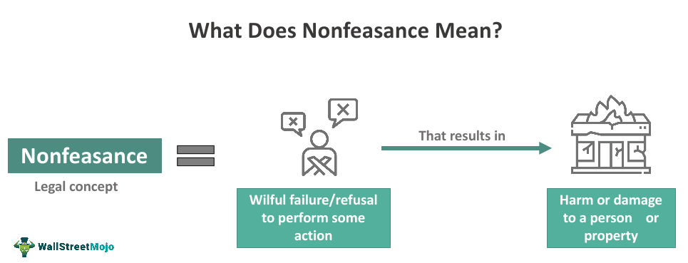

## Table of Contents

## What is nonfeasance in the context of finance?

Nonfeasance in finance refers to the failure to act when there is a duty to do so. This can happen when someone, like a financial advisor or a bank, does not do something they are supposed to do. For example, if a financial advisor knows a client's investment is about to lose a lot of money but does nothing to warn them, that is nonfeasance.

This concept is important because it can lead to legal problems. If someone suffers a financial loss because of nonfeasance, they might be able to take legal action against the person or company that failed to act. It's all about making sure that people in finance do what they are supposed to do to protect their clients' money.

## How does nonfeasance differ from misfeasance and malfeasance?

Nonfeasance, misfeasance, and malfeasance are three different ways people can mess up in their jobs, especially in finance. Nonfeasance is when someone doesn't do something they should have done. For example, if a bank employee forgets to process a client's withdrawal request, that's nonfeasance because they failed to act when they were supposed to.

Misfeasance is different because it's about doing something wrong, but not on purpose. It's a mistake or an error in how something is done. For instance, if a financial advisor gives a client bad advice because they misunderstood the client's needs, that's misfeasance. They did something, but they did it incorrectly without meaning to cause harm.

Malfeasance is the most serious of the three because it involves doing something wrong on purpose. It's about intentional wrongdoing or illegal actions. If a bank manager knowingly approves loans to friends without proper checks, that's malfeasance. They are deliberately breaking rules or laws to benefit themselves or others.

## Can you provide examples of nonfeasance in financial institutions?

A common example of nonfeasance in a financial institution happens when a bank employee fails to process a customer's request to stop payment on a check. The customer might have asked the bank to stop the payment because they found out the check was lost or stolen. If the bank employee forgets to do this, the check might still be cashed, causing the customer to lose money. This is nonfeasance because the bank had a duty to act on the customer's request but did not.

Another example is when a financial advisor does not update a client's investment portfolio even though the client's financial situation has changed. For instance, if the client gets a new job with a much higher salary, they might need to adjust their investments to match their new financial goals. If the advisor knows about the change but does nothing, the client's investments might not perform as well as they could. This is nonfeasance because the advisor failed to take action when it was needed.

## What are the legal implications of nonfeasance in finance?

When nonfeasance happens in finance, it can lead to legal trouble. If someone loses money because a bank or a financial advisor didn't do something they were supposed to do, that person might be able to sue. The person who didn't act, like a bank employee or an advisor, could be held responsible for the financial loss. This is because they had a duty to act and they failed to do so, which caused harm to someone else.

Courts look at a few things when deciding if nonfeasance led to a legal problem. They check if there was a clear duty to act, if the failure to act caused harm, and if the harm was a direct result of not doing something. If all these things are true, the court might make the person or the company pay for the damages. This could mean paying back the money that was lost or even more if the harm was really bad.

## How can nonfeasance affect the financial market?

Nonfeasance in finance can shake up the whole financial market. When people in financial institutions don't do what they're supposed to do, it can lead to big problems. For example, if a bank doesn't process a lot of stop payment requests, it could cause a lot of customers to lose money. This might make people lose trust in the bank, and if word gets out, it could even make people worried about other banks. That worry can spread, making the whole market less stable because people might start pulling their money out of banks.

On a bigger scale, nonfeasance can also mess with how well the market works. If financial advisors aren't updating their clients' portfolios when they should, the clients might not be investing their money in the best way. This can slow down the flow of money into the market, which is important for keeping the economy moving. When lots of people aren't investing as well as they could be, it can make the whole market grow slower or even shrink. So, nonfeasance isn't just a problem for individuals; it can affect everyone in the market.

## What measures can financial institutions take to prevent nonfeasance?

Financial institutions can take several steps to prevent nonfeasance. One important measure is to have clear rules and procedures for employees to follow. This means making sure everyone knows what they are supposed to do and when they need to do it. Regular training sessions can help keep these rules fresh in employees' minds. Also, having a system where employees can easily report any issues or mistakes can help catch problems before they get big.

Another way to prevent nonfeasance is by using technology to keep track of tasks. Many financial institutions use software that reminds employees of important deadlines and tasks. This can help make sure things like processing stop payment requests or updating client portfolios don't get forgotten. Regular checks and audits can also help spot if someone is not doing their job, so the problem can be fixed quickly. By combining clear rules, training, technology, and regular checks, financial institutions can reduce the chances of nonfeasance happening.

## How is nonfeasance detected in financial operations?

Nonfeasance in financial operations can be detected through regular audits and checks. Financial institutions often have internal teams or hire outside experts to go through their records and make sure everything is being done correctly. These audits look for things that haven't been done, like unprocessed requests or outdated client portfolios. If they find something that was supposed to be done but wasn't, they can investigate further to see if it was just a mistake or if it's a sign of nonfeasance.

Another way to spot nonfeasance is by using technology. Many financial institutions use software that tracks tasks and sends reminders to employees. If a task shows up as incomplete in the system, it can be a red flag that someone didn't do their job. Also, if customers complain about things not being done, like a stop payment request that was ignored, it can help the institution find out where nonfeasance might be happening. By keeping an eye on these signs, financial institutions can catch and fix problems before they get worse.

## What are the ethical considerations surrounding nonfeasance in finance?

Nonfeasance in finance raises big ethical questions. When someone in a financial job doesn't do what they're supposed to do, it can hurt people. For example, if a bank employee forgets to stop a payment and a customer loses money, that's not just a mistake—it's wrong. People trust banks and financial advisors to look after their money, so when they don't do their job, it breaks that trust. It's important for people in finance to always do what they're supposed to do because they have a big responsibility to their clients.

Ethics also come into play when thinking about why nonfeasance happens. Sometimes, it's just a mistake, but other times, it might be because someone is lazy or doesn't care enough about their job. Either way, it's not fair to the people who depend on them. Financial institutions need to make sure their employees understand how important their work is and that not doing it can cause real harm. By focusing on ethics and responsibility, they can help prevent nonfeasance and keep their clients' trust.

## How do regulatory bodies address nonfeasance in the financial sector?

Regulatory bodies like the Financial Industry Regulatory Authority (FINRA) and the Securities and Exchange Commission (SEC) keep a close eye on financial institutions to make sure they are doing their jobs right. If they find out that a bank or a financial advisor didn't do something they were supposed to do, they can take action. They might fine the institution or the person who didn't act, or they could even take away their license to work in finance. This is to make sure that everyone in the financial world knows they have to do their job properly, or they will face consequences.

These regulatory bodies also set rules and guidelines that financial institutions have to follow. They do regular checks and audits to see if everyone is sticking to these rules. If they find nonfeasance, they look into why it happened and how it can be fixed. They might make the institution change its rules or train its employees better to stop it from happening again. By doing this, they help keep the financial market fair and safe for everyone.

## What role does corporate governance play in preventing nonfeasance?

Corporate governance is like the rulebook for how a company is run. It helps prevent nonfeasance by making sure everyone knows what they are supposed to do. Good corporate governance sets clear rules and responsibilities for everyone in the company, from the top bosses to the people working in the bank branches. It also makes sure there are checks and balances, so if someone isn't doing their job, it gets noticed quickly. By having strong corporate governance, a company can make sure its employees do what they need to do to protect their customers' money.

Another way corporate governance helps is by making sure the company's leaders are always watching out for problems. They do this by having regular meetings and reports to see how things are going. If they find out that someone isn't doing their job, they can step in and fix it before it causes big problems. Good corporate governance also means having a culture where everyone feels responsible for doing the right thing. This helps stop nonfeasance because people know they will be held accountable if they don't do their part.

## Can nonfeasance lead to systemic risk in the financial system?

Nonfeasance can lead to systemic risk in the financial system if it happens a lot and affects many people. Systemic risk is when problems in one part of the financial system can spread and cause trouble everywhere. For example, if a big bank doesn't do what it's supposed to do, like not processing a lot of stop payment requests, it can make a lot of customers lose money. If those customers start to worry and take their money out of the bank, it can make the bank weaker. If this happens to many banks, it can shake the whole financial system because people might start to distrust all banks.

To stop nonfeasance from causing systemic risk, it's important for financial institutions to have good rules and checks in place. They need to make sure everyone does their job right and fix problems quickly if they happen. If nonfeasance is caught early and dealt with, it's less likely to spread and cause big problems. But if it's ignored, it can grow and make the whole financial system less stable, which is bad for everyone.

## What are the latest case studies or research findings on nonfeasance in finance?

A recent case study that looked at nonfeasance in finance was about a big bank that didn't process stop payment requests for many customers. The study found that the bank's employees were too busy and didn't have the right systems to remind them of these important tasks. This caused a lot of customers to lose money because their checks were cashed even after they asked the bank to stop them. The study showed that better training and technology could help stop this kind of nonfeasance from happening.

Another research finding came from a study on financial advisors and how they manage their clients' portfolios. The research found that some advisors didn't update their clients' investments even when the clients' financial situations changed a lot. This nonfeasance happened because the advisors were either too busy or didn't have good systems to track changes in their clients' lives. The study suggested that financial institutions should have better ways to remind advisors of their duties and make sure they follow through to protect their clients' money.

## References & Further Reading

[1]: ["Algorithmic Trading and DMA: An Introduction to Direct Access Trading Strategies"](https://www.amazon.com/Algorithmic-Trading-DMA-introduction-strategies/dp/0956399207) by Barry Johnson

[2]: Lopez de Prado, M. (2018). ["Advances in Financial Machine Learning."](https://www.amazon.com/Advances-Financial-Machine-Learning-Marcos/dp/1119482089) Wiley.

[3]: Aronson, D. (2006). ["Evidence-Based Technical Analysis: Applying the Scientific Method and Statistical Inference to Trading Signals."](https://www.amazon.com/Evidence-Based-Technical-Analysis-Scientific-Statistical/dp/0470008741) Wiley.

[4]: Jansen, S. (2020). ["Machine Learning for Algorithmic Trading: Predictive Models to Extract Signals from Market and Alternative Data for Systematic Trading Strategies with Python."](https://github.com/stefan-jansen/machine-learning-for-trading) Packt Publishing.

[5]: Chan, E. P. (2009). ["Quantitative Trading: How to Build Your Own Algorithmic Trading Business."](https://github.com/ftvision/quant_trading_echan_book) Wiley.

[6]: Sidhu, I. (2018). ["Trading and Exchanges: Market Microstructure for Practitioners."](https://academic.oup.com/book/52292) Oxford University Press.

[7]: Carver, R. (2019). ["Systematic Trading: A Unique New Method for Designing Trading and Investing Systems."](https://books.google.com/books/about/Systematic_Trading.html?id=y3dxCgAAQBAJ) Harriman House.

[8]: Chincarini, L. B. (2010). ["The Crisis of Crowding: Quant Copycats, Ugly Models, and the New Crash Normal."](https://www.wiley.com/en-us/The+Crisis+of+Crowding%3A+Quant+Copycats%2C+Ugly+Models%2C+and+the+New+Crash+Normal-p-9781118250020) Wiley.