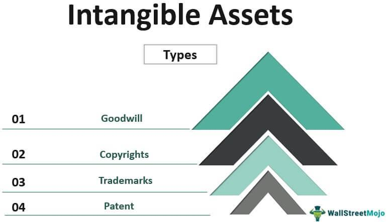

Assets are fundamental to investment and financial strategies for both individuals and institutions. While many investors are familiar with financial assets such as stocks, bonds, and other securities, there is a distinct segment of assets known as nonfinancial assets that hold substantial value due to their physical properties rather than contractual claims. These include assets like real estate, vehicles, machinery, and even intangible intellectual properties such as patents and trademarks.

This article focuses on nonfinancial assets, examining how they are valued and the role that algorithmic trading can play in optimizing their management. The unique characteristics of nonfinancial assets not only contribute to an entity's overall market value but also affect its borrowing capacity and financial health. By understanding the various examples, valuation methods, and the transformative impact of algorithmic trading, stakeholders can unlock new opportunities for leveraging these assets effectively in a dynamic financial landscape. The increasing integration of advanced trading algorithms provides a sophisticated approach to managing these assets, thereby bridging traditional and technologically-driven asset management strategies.



## Table of Contents

## Understanding Nonfinancial Assets

Nonfinancial assets are characterized by their intrinsic value derived from physical presence or inherent qualities rather than contractual claims or expected financial returns. They traditionally include tangible assets like real estate, vehicles, and machinery, as well as certain intangible assets such as intellectual property, which encompasses patents and trademarks. These assets, despite lacking the immediate liquidity of financial instruments like stocks and bonds, are vital in both personal and institutional investment strategies.

Examples of nonfinancial assets extend across various categories: 

1. **Real Estate**: Encompasses a wide range of properties, including residential, commercial, and industrial spaces. The value of real estate is influenced by factors such as location, market demand, and macroeconomic conditions. These assets often represent a substantial portion of corporate and individual portfolios due to their potential for capital appreciation and income generation.

2. **Vehicles and Machinery**: Essential components for operational efficiency in many businesses, these assets are valued based on their purchase cost, age, functionality, and depreciation. They are crucial for sectors like manufacturing, transportation, and logistics.

3. **Intellectual Property (IP)**: Includes patents, trademarks, copyrights, and trade secrets. While these assets lack physicality, they provide value through exclusive legal rights and potential revenue streams from licensing or direct commercialization. The valuation of IP assets often requires specialized knowledge, considering legal protections and market potential.

Despite their importance, nonfinancial assets are often less liquid than financial assets, meaning they cannot be quickly converted to cash without a substantial loss in value. This distinction is critical in [liquidity](/wiki/liquidity-risk-premium) planning and investment strategies. Nonfinancial assets generally require complex valuation methods that consider multiple factors beyond immediate market prices.

Valuation of nonfinancial assets also differs substantially from that of financial assets. While financial assets are primarily valued based on market factors and expected cash flows, nonfinancial asset valuation involves analyzing physical attributes, potential for income generation, and broader economic conditions. These differences necessitate detailed appraisals and often involve methodologies such as the cost, market, and income approaches. Understanding these nuances is essential for effective asset management and optimizing the economic benefit derived from these critical resources.

## Types of Nonfinancial Assets

Nonfinancial assets encompass a diverse range of items, each with unique characteristics and valuation methods. Understanding these asset types is essential for assessing their contribution to market value and economic activities.

Real Estate comprises residential, commercial, and industrial properties. These properties are valued based on market demand, geographic location, economic conditions, and sometimes the future cash flows they can generate. The valuation involves analyzing comparable sales, income potential, and replacement costs. Real estate not only contributes to the wealth of individuals and corporations but also affects borrowing capacities and financial stability.

Physical Commodities include raw materials such as gold, oil, agricultural products, and metals. Their value is dictated by intrinsic physical properties, including scarcity, utility, and market demand-supply dynamics. These commodities serve as economic indicators and inflation hedges. Market mechanisms like futures contracts and spot pricing significantly influence their valuation and trading.

Intangible Assets consist of non-physical items such as patents, trademarks, and copyrights. These assets derive their value from legal protections and the potential for revenue generation. Their valuation considers factors such as market competition, remaining legal life, and historical earnings. Intangible assets are crucial in industries reliant on intellectual property and brand recognition.

Equipment and Machinery are pivotal for production in various sectors. They are valued based on original cost, current condition, productivity levels, and depreciation rates. These physical assets directly impact operational efficiency and production capability, making their maintenance and valuation essential for businesses.

Natural Resources, including forests, minerals, and water bodies, are fundamental to numerous economic activities. They have intrinsic value based on their availability, extraction costs, and utility. Valuing natural resources often involves environmental assessments, legal considerations, and sustainability metrics, reflecting their long-term economic and ecological significance. 

Understanding these nonfinancial asset categories provides a comprehensive view of their role in economic functions and investment strategies. They collectively contribute to the wealth and operational efficiency of entities and have broader implications for market dynamics.

## Methods of Asset Valuation

In the context of nonfinancial assets, various valuation methods account for physical characteristics, economic conditions, and legal considerations. Commonly employed methods include the cost approach, market approach, income approach, and environmental and legal considerations.

**Cost Approach**: This method assesses an asset's value based on the cost of reproduction or replacement, subtracting any depreciation. It is particularly applicable to equipment, machinery, and buildings where the physical creation cost provides a baseline for valuation. Depreciation calculations account for factors like wear and tear or obsolescence. The formula typically used is:

$$

\text{Value}_{\text{Cost Approach}} = \text{Cost}_{\text{New}} - \text{Depreciation} 
$$

Where $\text{Cost}_{\text{New}}$ is the current cost to reproduce or replace the asset, and $\text{Depreciation}$ includes both physical degradation and technological obsolescence.

**Market Approach**: This approach determines an asset's value based on recent sales of comparable assets, making it popular for real estate valuation. It utilizes market comparables, assuming that similar assets will command similar prices under typical market conditions. This method involves a careful analysis of the asset's characteristics, location, and market conditions to adjust comparative values accordingly.

**Income Approach**: The income approach evaluates an asset based on its ability to generate future income, applying present value analysis. This involves projecting future cash flows generated by the asset and discounting them to present value using a suitable discount rate. The formula can be expressed as:

$$

\text{Value}_{\text{Income Approach}} = \sum_{t=1}^{n} \frac{CF_t}{(1 + r)^t} 
$$

Where $CF_t$ is the cash flow in year $t$, $r$ is the discount rate, and $n$ is the number of years over which the cash flows are projected.

**Environmental and Legal Considerations**: Valuation of natural resources demands attention to environmental and legal frameworks, reflecting sustainability practices and regulatory compliance. Valuers must account for potential liabilities arising from environmental restoration or restrictions imposed by legislation. For instance, forest valuation might include considerations for sustainable harvest rates and conservation policies, while mineral rights valuations could be influenced by extraction permits and environmental regulation costs.

These valuation methods provide a structured framework to assess the worth of nonfinancial assets. determining accurate valuations is essential for informed decision-making in investments, sales, and management of these assets. As the field of asset valuation evolves, integrating advanced data analytics and algorithm-driven methodologies is expected to enhance precision and adaptability in valuation practices.

## Algorithmic Trading and Asset Management

Algorithmic trading leverages sophisticated computer algorithms to automate trading strategies, efficiently optimizing the buying and selling of assets. This technology transforms asset management, allowing for the analysis and management of vast datasets. By utilizing algorithms, asset managers can enhance decision-making processes, particularly in the management of nonfinancial assets.

In asset management, the implementation of [algorithmic trading](/wiki/algorithmic-trading) allows for the efficient processing of large volumes of data. Nonfinancial assets, such as real estate or commodities, generate substantial data points including market trends, price movements, and asset-specific metrics. Algorithms can sift through this data at unparalleled speeds, yielding insights that may not be visible through traditional analysis. For instance, by applying statistical models or [machine learning](/wiki/machine-learning) techniques, algorithms can forecast property values based on historical data and current market trends.

One of the primary benefits of algorithmic trading is the increased efficiency with which trades are executed. Algorithms operate at high speeds, executing orders in fractions of a second, minimizing the latency concerns associated with manual trading. This speed reduces transaction costs by optimizing order timing and taking advantage of momentary price discrepancies. Furthermore, the efficient execution mitigates the risk of market impact cost, where large trades could otherwise influence asset prices undesirably.

In addition to efficiency, algorithmic trading promotes adaptability in dynamic market conditions. By continuously monitoring market environments, algorithms can adjust strategies in real-time, responding to fluctuations and ensuring that asset portfolios remain optimized. This adaptability is particularly valuable in managing nonfinancial assets, where market conditions can be volatile, influenced by factors such as geopolitical events or natural disasters.

Moreover, algorithmic trading serves as a bridge between financial and nonfinancial assets, helping to unlock the potential value intrinsic in these nonfinancial entities. Algorithms enable the integration of diverse asset types into cohesive management frameworks, where the financial characteristics of assets like stocks are analyzed alongside nonfinancial assets. This integration can lead to more comprehensive risk assessments and portfolio optimizations, ensuring that the potential value of all assets is fully realized.

Therefore, algorithmic trading represents a significant advancement in asset management strategies, offering substantial advantages in terms of speed, cost, and adaptability. As technological capabilities continue to evolve, the role of algorithmic trading in managing both financial and nonfinancial assets will undeniably expand, opening new avenues for innovation and profit generation in the investment landscape.

## Examples of Algorithmic Trading in Nonfinancial Asset Markets

Real estate platforms have revolutionized property valuation and market forecasting using advanced algorithms. These algorithms process large datasets, including historical sales data, local economic indicators, and neighborhood trends, to estimate property values and predict future market movements. Platforms like Zillow use machine learning models to provide Zestimate values, offering users insights into current property appraisals and trends. By evaluating variables such as location desirability, amenities, and economic forecasts, these algorithms enable more informed decision-making for buyers, sellers, and investors in the real estate market.

In commodity trading, algorithms play a crucial role by optimizing trades through real-time analysis of supply-demand dynamics and pricing trends. Commodities such as oil, gold, and agricultural products are subject to volatile market conditions influenced by geopolitical events, weather patterns, and economic shifts. Algorithms use statistical models and machine learning techniques to analyze market data and execute trades at optimal prices. By continuously monitoring market conditions and executing trades instantly, these algorithms enhance efficiency and profitability in commodity markets.

Portfolio management algorithms are designed to manage diverse asset portfolios, balancing risk and return by including nonfinancial assets. These algorithms assess the performance metrics of various assets, consider correlation coefficients, and apply risk management strategies to optimize portfolio allocation. A portfolio manager could use Python libraries such as NumPy and pandas to calculate essential metrics like expected return and [volatility](/wiki/volatility-trading-strategies). For instance, a simple Python code snippet to calculate portfolio variance might look like:

```python
import numpy as np

# Expected returns and covariance matrix for the assets
expected_returns = np.array([0.05, 0.02, 0.04])
covariance_matrix = np.array([[0.1, 0.02, 0.04],
                              [0.02, 0.08, 0.02],
                              [0.04, 0.02, 0.07]])

# Portfolio weights
weights = np.array([0.4, 0.3, 0.3])

# Portfolio variance calculation
portfolio_variance = np.dot(weights.T, np.dot(covariance_matrix, weights))
print(f"Portfolio Variance: {portfolio_variance:.4f}")
```

This calculation assists in creating optimal portfolios by minimizing risk while achieving desired returns. Such tools allow portfolio managers to incorporate nonfinancial assets like real estate and commodities alongside traditional financial instruments, achieving a diversified and resilient investment strategy. Algorithmic trading thus bridges financial analysis with strategic asset management, uncovering opportunities across diverse asset classes.

## Conclusion

Nonfinancial assets play a vital role in shaping both individual investment portfolios and the broader economic landscape by providing tangible and intangible value. Their unique characteristics and inherent value separate them from financial assets, which are predominantly driven by market perceptions and liquidity. By understanding how to effectively value and manage nonfinancial assets, investors can unlock substantial financial opportunities. 

The integration of algorithmic trading into the management of these assets marks a significant advancement in the field. Algorithmic trading uses sophisticated algorithms to process and analyze large data sets, enabling more efficient and informed decision-making. This technological approach reduces transaction costs, enhances efficiency, and allows market participants to quickly adapt to changing conditions. For instance, algorithms can be employed to optimize the timing of buying and selling nonfinancial assets, thereby realizing potential value that may otherwise be overlooked.

As technology continues to evolve, the role of algorithmic trading is expected to grow, opening up new pathways for investment and profit. The ongoing development of [artificial intelligence](/wiki/ai-artificial-intelligence) and machine learning technologies further promises to enhance the capability of algorithms in managing nonfinancial assets. By effectively leveraging these technological advancements, investors and institutions can better navigate the complexities of the market, maximizing the returns from their asset portfolios and contributing to economic growth.

## References & Further Reading

[1]: Bergstra, J., Bardenet, R., Bengio, Y., & Kégl, B. (2011). ["Algorithms for Hyper-Parameter Optimization."](https://dl.acm.org/doi/10.5555/2986459.2986743) Advances in Neural Information Processing Systems 24.

[2]: ["Advances in Financial Machine Learning"](https://www.amazon.com/Advances-Financial-Machine-Learning-Marcos/dp/1119482089) by Marcos Lopez de Prado

[3]: ["Evidence-Based Technical Analysis: Applying the Scientific Method and Statistical Inference to Trading Signals"](https://www.amazon.com/Evidence-Based-Technical-Analysis-Scientific-Statistical/dp/0470008741) by David Aronson

[4]: ["Machine Learning for Algorithmic Trading"](https://github.com/stefan-jansen/machine-learning-for-trading) by Stefan Jansen

[5]: ["Quantitative Trading: How to Build Your Own Algorithmic Trading Business"](https://www.amazon.com/Quantitative-Trading-Build-Algorithmic-Business/dp/1119800064) by Ernest P. Chan