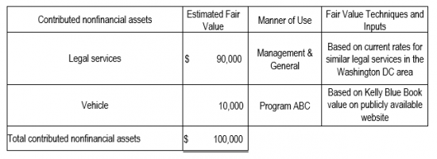

## Table of Contents

## What are nonfinancial assets?

Nonfinancial assets are things that a person or a business owns that are not money or investments like stocks and bonds. These can include things like buildings, land, equipment, and even things like patents or trademarks. They are important because they help businesses operate and grow, and they can also increase in value over time.

For example, if a company owns a factory, that factory is a nonfinancial asset. It's not cash, but it's valuable because it can be used to make products that the company can sell. Nonfinancial assets can also include natural resources like oil or timber, which a company might own and use to make money. These assets are different from financial assets because they are not easily turned into cash, but they are still very important for the long-term success of a business.

## Can you provide some examples of nonfinancial assets?

Nonfinancial assets are things you own that are not money or investments like stocks. Some examples are a house or an apartment you own. If you have a car, that's also a nonfinancial asset. Businesses might own things like factories or machines they use to make their products. These are all things that you can touch and use, but they are not cash.

Another type of nonfinancial asset is land. If you own a piece of land, it's valuable because you can build on it or use it for farming. Companies might own land to build offices or stores. There are also intangible nonfinancial assets, like patents or trademarks. These are legal rights that protect inventions or brand names. They are not physical things, but they are still very important because they help businesses make money and stand out from others.

So, nonfinancial assets can be things like houses, cars, factories, machines, land, patents, and trademarks. They are all valuable in different ways and help people and businesses do what they need to do.

## How are nonfinancial assets different from financial assets?

Nonfinancial assets are things you own that are not money or investments. They include things like houses, cars, and land. These assets are important because they can help you live your life or run your business. For example, a house is a place to live, and a factory helps a company make products. Nonfinancial assets can also include things like patents or trademarks, which are not physical but still valuable because they protect inventions or brand names.

Financial assets, on the other hand, are things like money, stocks, and bonds. These are easier to turn into cash quickly. For example, if you own stocks, you can sell them and get money right away. Financial assets are important because they can grow in value over time and help you save for the future. The main difference between nonfinancial and financial assets is that nonfinancial assets are usually things you can touch and use, while financial assets are more about money and investments.

So, nonfinancial assets are things like houses and cars that help you live or work, while financial assets are things like money and stocks that can be easily turned into cash. Both types of assets are important, but they serve different purposes in your life or business.

## Why is the valuation of nonfinancial assets important?

The valuation of nonfinancial assets is important because it helps people and businesses understand how much their things are worth. When you know the value of your house, car, or land, you can make better decisions about buying, selling, or using them. For example, if you want to sell your house, knowing its value helps you set a fair price. Businesses also need to know the value of their factories and machines to make smart choices about growing or investing in new things.

Valuing nonfinancial assets is also important for financial planning and reporting. If a business wants to borrow money from a bank, the bank will want to know the value of the business's assets to decide if it's a good loan. Also, when businesses report their financial health to investors or the government, they need to include the value of their nonfinancial assets. This helps everyone understand the true worth of the business and make informed decisions.

## What are the basic methods used to value nonfinancial assets?

There are several ways to figure out how much nonfinancial assets are worth. One common way is called the cost approach. This method looks at how much it would cost to replace the asset today. For example, if you own a factory, you would estimate how much it would cost to build a similar factory now. This approach is useful for things like buildings and machines, but it can be hard to use for things like land or unique items.

Another way to value nonfinancial assets is the market approach. This method looks at what similar assets have sold for recently. If you want to know the value of your house, you would look at the prices of similar houses in your area that have sold recently. This approach works well for things like houses and cars because there are lots of similar items being bought and sold. However, it can be tricky if there are not many similar assets to compare.

The third way is the income approach. This method looks at how much money the asset can make in the future. For example, if you own a rental property, you would estimate how much rent you can collect over time. This approach is often used for businesses and income-generating properties because it shows how the asset can help make money. Each of these methods has its own strengths and weaknesses, so people often use a mix of them to get a good idea of an asset's value.

## How does the market approach to valuation work for nonfinancial assets?

The market approach to valuation looks at what similar nonfinancial assets have sold for recently to figure out the value of your asset. If you want to know how much your house is worth, you would look at the prices of similar houses in your neighborhood that have sold lately. This helps you get a good idea of what people are willing to pay for houses like yours. The same goes for other things like cars or land. You find out what similar items have sold for and use that information to guess the value of your asset.

This method works well when there are lots of similar items being bought and sold. For example, there are many houses and cars being sold all the time, so it's easy to find good comparisons. But it can be tricky if there aren't many similar assets to compare. If you own a unique piece of land or a special type of machine, it might be hard to find recent sales of similar items. Even so, the market approach is a useful way to get a good estimate of what your nonfinancial assets are worth.

## What is the cost approach to valuing nonfinancial assets and when is it used?

The cost approach to valuing nonfinancial assets looks at how much it would cost to replace the asset today. If you own a factory, you would figure out how much it would cost to build a new one just like it right now. This method is useful because it gives you an idea of what you would need to spend to get a similar asset. It's often used for things like buildings, machines, and other physical items that can be replaced.

This approach is really helpful when you need to know the value of something that is unique or doesn't have a lot of similar items being sold. For example, if you own a special piece of equipment that isn't commonly bought and sold, the cost approach can help you figure out its value. However, it can be hard to use for things like land or artwork, where the replacement cost might not be easy to figure out. Overall, the cost approach is a good way to value nonfinancial assets when you need to know how much it would cost to replace them.

## Can you explain the income approach to nonfinancial asset valuation?

The income approach to valuing nonfinancial assets looks at how much money the asset can make in the future. If you own a rental property, you would estimate how much rent you can collect over time. This approach is useful because it shows how the asset can help you earn money. It's often used for businesses and income-generating properties like rental homes or commercial buildings.

This method works by figuring out the future income the asset will bring in and then calculating what that income is worth today. For example, if you own a store, you would estimate how much money the store will make over the next few years. Then, you would use a formula to figure out what that future income is worth right now. This approach is really helpful for understanding the value of assets that are used to make money, but it can be tricky because you have to make good guesses about future earnings.

## What challenges are commonly faced when valuing nonfinancial assets?

Valuing nonfinancial assets can be tough because they are not as easy to turn into cash as financial assets like money or stocks. One big challenge is that nonfinancial assets, like houses or factories, can be unique. This makes it hard to find similar items to compare them to. For example, if you own a special piece of land, it might be hard to find other pieces of land that are just like it. This makes the market approach tricky because there aren't many sales to look at.

Another challenge is figuring out how much it would cost to replace an asset today. The cost approach can be hard to use because the cost of building a new factory or buying a new machine can change a lot over time. Also, some things like land or artwork don't have a clear replacement cost, which makes this method even harder to use. Finally, the income approach can be challenging because you have to guess how much money the asset will make in the future. This can be tricky because future earnings can be hard to predict, especially for things like businesses or rental properties.

## How do depreciation and amortization affect the valuation of nonfinancial assets?

Depreciation and amortization are important when figuring out the value of nonfinancial assets. Depreciation is when the value of things like buildings or machines goes down over time because they get old or worn out. For example, if you own a car, it loses value as it gets older and needs more repairs. This means that when you value the car, you have to think about how much it has depreciated. Amortization is similar, but it's used for things like patents or trademarks, which lose value over time because they have a limited life. Both depreciation and amortization help you get a more accurate idea of what your nonfinancial assets are really worth.

These concepts can make valuing nonfinancial assets more complicated. When you use the cost approach, you have to think about how much the asset has depreciated since you bought it. If you bought a factory ten years ago, it's worth less now because it's older and might need repairs. With the income approach, you also have to think about how depreciation and amortization will affect the future earnings of the asset. For example, if a rental property needs a new roof soon, that will cost money and reduce the income you can get from it. So, understanding depreciation and amortization is key to getting a good idea of the true value of your nonfinancial assets.

## What role do intangible nonfinancial assets play in business valuation?

Intangible nonfinancial assets are things like patents, trademarks, and brand names that you can't touch but are still very important for a business. These assets help a business make money and stand out from others. For example, if a company has a famous brand name, it can sell its products for more money because people trust and like the brand. Patents protect new inventions, which can help a business be the only one selling a certain product for a while. This can make the business more valuable because it has something special that others don't.

When figuring out how much a business is worth, intangible nonfinancial assets can make a big difference. They are often hard to value because they are not physical things, but they can be very valuable. For example, a company with a strong brand might be worth more than a similar company without one. To value these assets, businesses might look at how much money the brand or patent brings in or how much it would cost to build a similar brand from scratch. So, even though they are hard to see and touch, intangible nonfinancial assets play a big role in deciding how much a business is worth.

## How can advanced valuation techniques, such as real options valuation, be applied to nonfinancial assets?

Real options valuation is a way to figure out how much nonfinancial assets are worth by looking at the choices or "options" that come with owning them. Imagine you own a piece of land. You could build a house on it, or you could wait and see if the land becomes more valuable later. Real options valuation helps you put a price on these choices. It's like having a special ticket that lets you decide when and how to use your asset in the future. This method is really helpful for things like land, factories, or even patents, where the value can change a lot depending on what you decide to do with them.

Using real options valuation for nonfinancial assets can be tricky because it involves making guesses about the future. You have to think about things like how much the land might be worth in a few years or how much money a new factory could make. This method is different from other ways of valuing assets because it looks at the value of having choices, not just the value of the asset itself. Even though it's complicated, real options valuation can give you a better idea of the true worth of your nonfinancial assets by considering all the different ways you could use them.

## What are the methods of asset valuation?

In the context of nonfinancial assets, various valuation methods account for physical characteristics, economic conditions, and legal considerations. Commonly employed methods include the cost approach, market approach, income approach, and environmental and legal considerations.

**Cost Approach**: This method assesses an asset's value based on the cost of reproduction or replacement, subtracting any depreciation. It is particularly applicable to equipment, machinery, and buildings where the physical creation cost provides a baseline for valuation. Depreciation calculations account for factors like wear and tear or obsolescence. The formula typically used is:

$$

\text{Value}_{\text{Cost Approach}} = \text{Cost}_{\text{New}} - \text{Depreciation} 
$$

Where $\text{Cost}_{\text{New}}$ is the current cost to reproduce or replace the asset, and $\text{Depreciation}$ includes both physical degradation and technological obsolescence.

**Market Approach**: This approach determines an asset's value based on recent sales of comparable assets, making it popular for real estate valuation. It utilizes market comparables, assuming that similar assets will command similar prices under typical market conditions. This method involves a careful analysis of the asset's characteristics, location, and market conditions to adjust comparative values accordingly.

**Income Approach**: The income approach evaluates an asset based on its ability to generate future income, applying present value analysis. This involves projecting future cash flows generated by the asset and discounting them to present value using a suitable discount rate. The formula can be expressed as:

$$

\text{Value}_{\text{Income Approach}} = \sum_{t=1}^{n} \frac{CF_t}{(1 + r)^t} 
$$

Where $CF_t$ is the cash flow in year $t$, $r$ is the discount rate, and $n$ is the number of years over which the cash flows are projected.

**Environmental and Legal Considerations**: Valuation of natural resources demands attention to environmental and legal frameworks, reflecting sustainability practices and regulatory compliance. Valuers must account for potential liabilities arising from environmental restoration or restrictions imposed by legislation. For instance, forest valuation might include considerations for sustainable harvest rates and conservation policies, while mineral rights valuations could be influenced by extraction permits and environmental regulation costs.

These valuation methods provide a structured framework to assess the worth of nonfinancial assets. determining accurate valuations is essential for informed decision-making in investments, sales, and management of these assets. As the field of asset valuation evolves, integrating advanced data analytics and algorithm-driven methodologies is expected to enhance precision and adaptability in valuation practices.

## References & Further Reading

[1]: Bergstra, J., Bardenet, R., Bengio, Y., & Kégl, B. (2011). ["Algorithms for Hyper-Parameter Optimization."](https://dl.acm.org/doi/10.5555/2986459.2986743) Advances in Neural Information Processing Systems 24.

[2]: ["Advances in Financial Machine Learning"](https://www.amazon.com/Advances-Financial-Machine-Learning-Marcos/dp/1119482089) by Marcos Lopez de Prado

[3]: ["Evidence-Based Technical Analysis: Applying the Scientific Method and Statistical Inference to Trading Signals"](https://www.amazon.com/Evidence-Based-Technical-Analysis-Scientific-Statistical/dp/0470008741) by David Aronson

[4]: ["Machine Learning for Algorithmic Trading"](https://github.com/stefan-jansen/machine-learning-for-trading) by Stefan Jansen

[5]: ["Quantitative Trading: How to Build Your Own Algorithmic Trading Business"](https://www.amazon.com/Quantitative-Trading-Build-Algorithmic-Business/dp/1119800064) by Ernest P. Chan