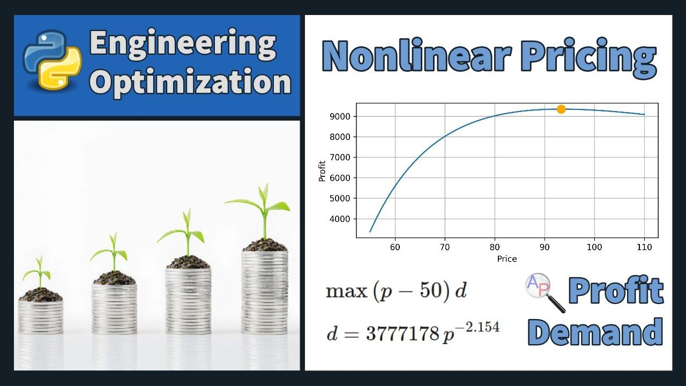

## Table of Contents

## What is a nonlinear pricing model?

A nonlinear pricing model is a way for businesses to charge customers based on how much they use or buy, instead of a fixed price for everything. This means the price can change depending on the amount of the product or service a customer wants. For example, if you use more electricity, you might pay a higher rate per unit than someone who uses less. This type of pricing can help companies make more money by charging more to customers who need or want more.

Nonlinear pricing can be seen in many places, like phone plans where you pay more for more data, or bulk discounts where you pay less per item if you buy more. It's different from linear pricing, where you pay the same rate no matter how much you use or buy. Nonlinear pricing can be good for businesses because it can attract different types of customers. Some might want to pay less by using less, while others might be okay with paying more for more. This way, the business can meet different customer needs and make more profit.

## How does nonlinear pricing differ from linear pricing?

Nonlinear pricing and linear pricing are two different ways companies can charge for their products or services. With linear pricing, the price stays the same no matter how much you buy or use. For example, if you buy one apple or ten apples, you might pay the same price per apple. This makes it easy for customers to know what they will pay, but it might not be the best way for a company to make the most money.

Nonlinear pricing, on the other hand, changes based on how much you buy or use. If you use more of a service, like electricity, you might pay a higher rate per unit than someone who uses less. This can help companies make more money by charging more to people who need more. It can also attract different kinds of customers, some who want to save money by using less and others who are willing to pay more for more. This way, the company can meet different customer needs and increase their profits.

## What are the common types of nonlinear pricing models?

There are several common types of nonlinear pricing models that businesses use. One type is called tiered pricing, where the price changes based on how much you buy or use. For example, a phone plan might have different prices for different amounts of data. If you use a little data, you pay less, but if you use a lot, you pay more. Another type is bulk pricing, where you pay less per item if you buy more. This is common in stores where buying a big pack of something costs less per item than buying it one at a time.

Another common type of nonlinear pricing is called peak and off-peak pricing. This is when the price changes based on the time of day or the time of year. For example, electricity might cost more during the day when everyone is using it and less at night when fewer people need it. This helps companies manage demand and make more money during busy times. Finally, there's bundle pricing, where you get a discount if you buy a group of products or services together. This can make customers feel like they are getting a good deal and encourage them to buy more.

These different types of nonlinear pricing help businesses attract different kinds of customers and make more money. By changing the price based on how much someone buys or uses, or the time they buy it, companies can meet different customer needs and increase their profits.

## Can you explain the concept of volume discounts in nonlinear pricing?

Volume discounts are a type of nonlinear pricing where the price per item goes down if you buy more. Imagine you're at a store and you want to buy some pens. If you buy just one pen, it might cost you a dollar. But if you buy ten pens, the store might give you a deal where you only pay 80 cents per pen. This is a volume discount because the more you buy, the less you pay per item.

This kind of pricing is good for both the store and the customer. For the store, it helps them sell more items at once, which can save them money on things like packaging and shipping. For the customer, it feels like a good deal because they save money by buying more. Volume discounts are common in many places, like supermarkets where buying a big pack of soda cans is cheaper per can than buying them one at a time. This way, both the store and the customer can be happy with the deal.

## How do tiered pricing structures work in nonlinear pricing?

Tiered pricing is a way of setting prices where the cost changes depending on how much you buy or use. Imagine you have a phone plan. If you use a little bit of data, you might pay a small amount, like $10 for up to 1GB. But if you use more data, say up to 5GB, you might have to pay more, like $25. And if you use even more, like up to 10GB, you might pay $40. Each level, or tier, has a different price, and the more you use, the more you pay.

This kind of pricing helps companies make more money by charging more to people who need more. It also gives customers choices. Some people might want to save money by using less, so they pick the lower tier. Others might need more and are okay with paying more, so they pick a higher tier. This way, the company can meet different customer needs and make more profit.

## What are the advantages of implementing nonlinear pricing for a business?

Nonlinear pricing helps businesses make more money by charging different prices based on how much customers buy or use. For example, if a customer uses a lot of a service like electricity, they might pay a higher rate per unit than someone who uses less. This way, the business can get more money from customers who need more. It also helps attract different types of customers. Some might want to save money by using less, while others are okay with paying more for more. This means the business can meet different customer needs and make more profit.

Another advantage is that nonlinear pricing can help manage demand. For example, with peak and off-peak pricing, a business can charge more during busy times and less during quiet times. This encourages customers to use the service when it's less busy, which helps the business use its resources better. Also, offering volume discounts or tiered pricing can encourage customers to buy more at once, which can save the business money on things like packaging and shipping. Overall, nonlinear pricing gives businesses a flexible way to set prices that can help them make more money and manage their resources better.

## What challenges might a company face when adopting nonlinear pricing?

When a company decides to use nonlinear pricing, they might face some challenges. One big challenge is that it can be hard to figure out the right prices for each level. If the prices are too high, customers might not want to buy or use more. But if the prices are too low, the company might not make as much money as they could. It takes a lot of work to find the right balance that makes both the company and the customers happy.

Another challenge is that customers might not like the change. If they are used to paying a simple, fixed price, they might get confused or upset when the price changes based on how much they buy or use. This can make them less likely to keep buying from the company. The company needs to explain the new pricing clearly and show how it can be good for the customers, like saving money by using less or getting a better deal by buying more. If they don't do this well, they might lose customers instead of making more money.

## How can nonlinear pricing be used to segment different customer groups?

Nonlinear pricing can help businesses split their customers into different groups based on how much they want to buy or use. For example, a company might offer different levels of a service, like a phone plan with different amounts of data. People who only need a little data might choose the cheapest plan, while those who need a lot might pick a more expensive one. This way, the company can attract different kinds of customers. Some might want to save money by using less, while others are okay with paying more for more.

By using nonlinear pricing, businesses can also encourage customers to buy more at once. For example, a store might offer a discount if you buy a big pack of something instead of buying it one at a time. This is good for the store because they can sell more items in one go, and it's good for the customer because they feel like they are getting a deal. This kind of pricing helps the business make more money by meeting the needs of different customer groups.

## What role does price discrimination play in nonlinear pricing strategies?

Price discrimination is when a business charges different prices to different customers for the same thing. In nonlinear pricing, this can help a business make more money by charging more to people who need or want more of a product or service. For example, a phone company might charge more for a plan with a lot of data than for a plan with less data. This way, the company can make more money from customers who need a lot of data, while still offering a cheaper option for those who need less.

Nonlinear pricing lets a business split its customers into different groups based on how much they want to buy or use. By doing this, the business can offer different prices that match what each group of customers is willing to pay. This can help the business attract more customers and make more profit. For example, a store might offer a discount if you buy a big pack of something instead of buying it one at a time. This way, the store can sell more items to people who want to buy in bulk, while still selling to people who just want to buy one item at a time.

## How can a company analyze the effectiveness of their nonlinear pricing model?

A company can analyze the effectiveness of their nonlinear pricing model by looking at how much money they are making and how happy their customers are. They can compare the money they make before and after they started using nonlinear pricing. If they are making more money, it's a sign that the new pricing is working. They can also ask customers for feedback to see if they like the new prices. If customers are happy and keep buying, it means the pricing is effective.

Another way to check is by looking at how many customers are choosing different pricing levels. If a lot of customers are picking the higher levels and paying more, it's a good sign. But if most customers are only picking the cheapest level, the company might need to change the prices. The company can also use data to see if customers are buying more because of the new pricing. If they are, it means the nonlinear pricing is encouraging people to buy more, which is good for the business.

## What advanced mathematical models are used to optimize nonlinear pricing?

To make the best nonlinear pricing, companies use fancy math models. One common model is called optimization. This model helps find the best prices that make the most money while keeping customers happy. It uses a lot of numbers and data to figure out how different prices will affect how much people buy. Another model is called regression analysis. This helps the company see how prices and how much people buy are connected. By looking at past data, the company can guess how people will react to new prices.

Another useful model is called game theory. This model looks at how customers and the company might act and react to different prices. It helps the company think about what might happen if they change their prices. For example, if they raise the price for a higher level of service, will people still buy it, or will they switch to a cheaper level? Game theory helps the company make smart choices about pricing. These math models help companies set prices that work well for both them and their customers.

## How do regulatory considerations impact the design of nonlinear pricing models?

When companies make nonlinear pricing models, they have to think about rules and laws. Governments and other groups might have rules about how much a company can charge and how they can charge it. These rules are made to make sure companies treat customers fairly and don't charge too much. For example, a company might not be allowed to charge a lot more for using a little bit more of a service. They have to follow these rules, or they could get in trouble and have to pay fines.

Because of these rules, companies have to be careful when they make their pricing models. They need to make sure their prices are fair and easy for customers to understand. This can make it harder for companies to make the most money, but it's important for keeping customers happy and staying out of trouble with the law. So, when a company is planning its nonlinear pricing, they have to think about these rules and make sure their prices fit within them.

## What are the types of nonlinear models used in trading?

Various nonlinear models are employed in trading, each tailored to accommodate diverse types of data and market conditions. Understanding these models and their applications allows traders to enhance their decision-making processes.

Polynomial regression is one of the fundamental nonlinear models used in trading to capture complex relationships between variables. Unlike linear regression that fits a straight line, polynomial regression fits a curve, defined by a polynomial equation, to the dataset. It is particularly effective when the relationship between variables can be represented by higher-degree polynomials, offering flexibility and accuracy in modeling non-linear patterns. The equation for a polynomial regression model is given by:

$$
y = \beta_0 + \beta_1x + \beta_2x^2 + \ldots + \beta_nx^n + \epsilon
$$

where $y$ is the dependent variable, $x$ is the independent variable, $\beta_0, \beta_1, \ldots, \beta_n$ are the coefficients, $n$ is the degree of the polynomial, and $\epsilon$ represents the error term.

Support Vector Machines (SVMs) are another popular choice for modeling complex market dynamics. SVMs find a hyperplane in an $n$-dimensional space that best separates different classes of data points. By employing kernel functions such as linear, polynomial, or radial basis functions, SVMs efficiently handle nonlinear classification and regression tasks. This flexibility makes them especially suitable for identifying patterns and making predictions in volatile and multifaceted financial markets.

Neural networks, particularly [deep learning](/wiki/deep-learning) models, have gained prominence in financial applications due to their ability to learn complex patterns within large datasets. These models consist of multiple layers of interconnected nodes or "neurons," which process and transform input data. By leveraging vast amounts of historical data, neural networks can effectively recognize intricate patterns and relationships, such as those present in algorithmic trading or market sentiment analysis.

Decision trees and ensemble methods like Random Forests and Gradient Boosting Machines provide robust solutions for intricate decision-making processes. Decision trees segment data into branches based on feature values, allowing for clear and interpretable modeling of decision-making rules. Ensemble methods enhance predictive accuracy by aggregating the outputs of multiple decision trees. Random Forests reduce variance by averaging predictions from numerous trees, while Gradient Boosting Machines sequentially improve prediction accuracy through iterative optimization.

Each model type brings distinct advantages to trading applications. Polynomial regression is advantageous for its curve-fitting capabilities, SVMs for their versatility with nonlinear separable data, and neural networks for their pattern recognition prowess across complex datasets. Decision trees and ensemble methods excel in offering robust predictions through simplicity and aggregation, respectively.

Employing these nonlinear models effectively requires understanding their mathematical underpinnings and aligning them with specific market conditions and data characteristics. This ensures that algorithmic trading strategies are optimized for performance, providing traders with the insights needed for successful decision-making in fluctuating financial environments.

## References & Further Reading

[1]: Tsay, R. S. (2010). ["Analysis of Financial Time Series"](https://onlinelibrary.wiley.com/doi/book/10.1002/9780470644560), Wiley. A robust resource exploring the complexity of financial data analysis and advanced time series models.

[2]: Aït-Sahalia, Y., & Lo, A. W. (1998). ["Nonparametric Estimation of State-Price Densities Implicit in Financial Asset Prices"](https://www.princeton.edu/~yacine/aslo.pdf), Journal of Finance, 53(2), 499-547. This paper discusses the application of nonlinear pricing models to financial assets.

[3]: Goodfellow, I., Bengio, Y., & Courville, A. (2016). ["Deep Learning"](https://www.deeplearningbook.org/), MIT Press. Covers neural networks and their applications in complex pattern recognition, relevant for algorithmic trading.

[4]: Vapnik, V. N. (1998). ["Statistical Learning Theory"](https://www.scribd.com/document/241812698/Statistical-Learning-Theory), Wiley. Discusses foundational support vector machines theory, crucial for understanding SVM in trading strategies.

[5]: Lopez de Prado, M. (2018). ["Advances in Financial Machine Learning"](https://www.amazon.com/Advances-Financial-Machine-Learning-Marcos/dp/1119482089), Wiley. Offers insights into machine learning applications in finance, including nonlinear predictive models.

[6]: Hastie, T., Tibshirani, R., & Friedman, J. (2009). ["The Elements of Statistical Learning: Data Mining, Inference, and Prediction"](https://link.springer.com/book/10.1007/978-0-387-84858-7), Springer. An essential resource on machine learning methods, providing context for nonlinear modeling in trading systems.

[7]: Bishop, C. M. (2006). ["Pattern Recognition and Machine Learning"](https://link.springer.com/book/9780387310732), Springer. Explores various machine learning techniques including neural networks and gradient methods applicable in finance.