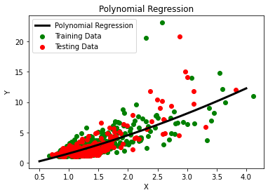

## Table of Contents

## What is nonlinear machine learning?

Nonlinear machine learning involves models that can capture complex patterns in data that are not easily represented by straight lines or simple equations. Unlike linear models, which assume a direct and proportional relationship between inputs and outputs, nonlinear models can learn and represent more intricate relationships. This makes them particularly useful for tasks like image recognition, natural language processing, and other areas where the data does not follow a simple linear pattern.

These models often use techniques like neural networks, decision trees, and support vector machines with nonlinear kernels. For example, a neural network can have multiple layers that transform the input data through nonlinear activation functions, allowing it to learn and represent complex features. This flexibility enables nonlinear models to perform better on datasets where the relationship between variables is complex and not easily captured by simpler linear models.

## How does nonlinear machine learning differ from linear machine learning?

Linear machine learning models assume that the relationship between the input features and the output can be described by a straight line or a simple equation. This means that if you change the input a little bit, the output will change in a predictable, proportional way. For example, if you're trying to predict house prices based on size, a linear model might assume that for every additional square foot, the price goes up by a fixed amount. These models are simple and easy to understand but can only capture simple patterns in data.

Nonlinear machine learning models, on the other hand, can handle more complex relationships between inputs and outputs. They don't assume that a small change in the input will lead to a proportional change in the output. Instead, they can learn and represent curved lines or more complicated shapes. For instance, a neural network might use several layers and nonlinear activation functions to capture the intricate patterns in images or text. This makes nonlinear models more powerful and flexible, but also more complex and harder to interpret.

To illustrate the difference, consider a simple example. If you're trying to predict the growth of a plant based on sunlight, a linear model might suggest that more sunlight always means more growth, represented by a straight line. But in reality, too much sunlight can harm the plant, leading to a nonlinear relationship that a nonlinear model can capture more accurately, perhaps with a curve that rises and then falls.

## What are some common applications of nonlinear machine learning?

Nonlinear [machine learning](/wiki/machine-learning) is used in many areas where the relationships between data points are complex. One common application is in image recognition. For example, when a computer needs to identify objects in a picture, it uses nonlinear models like neural networks. These models can learn the intricate patterns and shapes that make up different objects, even if those patterns are not simple or straightforward. This is why your phone can recognize your face or identify different animals in a photo.

Another important use of nonlinear machine learning is in natural language processing. This involves understanding and generating human language, which is full of nuances and complexities that linear models can't handle well. Nonlinear models, such as those used in language translation apps or voice assistants, can learn the subtle differences in meaning and context that make human language so rich. They can figure out that the same word can mean different things depending on the situation, making them much better at understanding and generating text.

Nonlinear machine learning also plays a key role in financial forecasting. Predicting stock prices or market trends involves understanding many factors that interact in complex ways. Linear models might miss these interactions, but nonlinear models can capture them. For instance, a [neural network](/wiki/neural-network) might learn that certain economic indicators have a nonlinear effect on stock prices, helping to make more accurate predictions. This is why many financial institutions use nonlinear machine learning to guide their investment decisions.

## What are the key algorithms used in nonlinear machine learning?

Nonlinear machine learning uses several key algorithms to handle complex data patterns. One popular algorithm is the neural network, which can learn intricate relationships by stacking multiple layers that apply nonlinear functions. These layers help the network capture details like edges in images or nuances in language. Another important algorithm is the decision tree, which splits data into branches based on different conditions. By combining many decision trees into a random forest, these models can handle nonlinearity and make accurate predictions.

Support vector machines (SVMs) with nonlinear kernels are also widely used. They can map data into higher dimensions where a linear separation becomes possible, effectively handling nonlinear relationships. For example, an SVM might use a kernel like the radial basis function (RBF) to transform the data. Lastly, k-nearest neighbors (k-NN) is a simple yet effective nonlinear algorithm that classifies data points based on the majority class of their nearest neighbors in the feature space. These algorithms show how nonlinear machine learning can tackle complex problems that linear models struggle with.

## How do decision trees work as a nonlinear method?

Decision trees work as a nonlinear method by splitting data into branches based on different conditions. Imagine you're trying to decide whether to go outside based on the weather. A decision tree might first ask if it's raining. If it is, you might stay inside. If it's not, it might then ask if it's sunny. Depending on your answers, the tree leads you down different paths, creating a structure that looks like an upside-down tree. Each split in the tree represents a decision point, and these splits can capture complex patterns in the data that aren't straight lines.

For example, if you're using a decision tree to predict whether someone will buy a product based on their age and income, the tree might first split on age. If someone is under 30, it might then split on income to see if they earn enough to afford the product. These splits create regions in the data space that are not linear, allowing the tree to model complex relationships. By combining many decision trees into a random forest, you can improve the accuracy and handle even more nonlinearity, making it a powerful tool for nonlinear machine learning.

## What role do neural networks play in nonlinear machine learning?

Neural networks are a key part of nonlinear machine learning because they can learn and represent very complex patterns in data. They do this by using layers of connected nodes, called neurons, that pass information through the network. Each neuron applies a nonlinear function to the input it receives, which helps the network capture details that a straight line can't. For example, in image recognition, a neural network can learn to recognize edges, shapes, and even whole objects by stacking these layers. This makes neural networks great for tasks like identifying faces in photos or understanding spoken language.

The power of neural networks comes from their ability to adjust the connections between neurons during training. This process, called backpropagation, allows the network to learn from examples and improve its predictions over time. By using nonlinear activation functions like the sigmoid or ReLU (Rectified Linear Unit), the network can model complex relationships that linear models can't. For instance, if you're trying to predict house prices, a neural network might learn that the relationship between size and price isn't just a straight line but can be more like a curve. This flexibility makes neural networks a go-to choice for many nonlinear machine learning tasks.

## Can you explain how support vector machines handle nonlinearity?

Support vector machines (SVMs) handle nonlinearity by using something called a kernel trick. Imagine you have a bunch of points that you can't separate with a straight line. The kernel trick lets you move these points into a higher-dimensional space where you can separate them with a line. For example, if you have points in a 2D space, you can't separate them with a line, but if you move them into a 3D space, you might be able to separate them with a plane. The kernel function helps do this transformation without actually moving the points, which makes it efficient.

A common kernel used in SVMs is the radial basis function (RBF) kernel. This kernel can transform the data into a higher-dimensional space where the relationship between the points becomes linear. The formula for the RBF kernel is $$ K(x, x') = \exp\left(-\gamma \| x - x' \|^2\right) $$, where $$ x $$ and $$ x' $$ are two data points, and $$ \gamma $$ is a parameter that controls how far the influence of a single training example reaches. By using this kernel, the SVM can find a decision boundary that's not a straight line in the original space but can be a hyperplane in the higher-dimensional space. This way, SVMs can handle complex, nonlinear patterns in the data.

## What are the challenges of implementing nonlinear machine learning models?

Implementing nonlinear machine learning models can be tricky because they are more complex than linear models. These models often have many more parameters to adjust, which makes them harder to train. For example, a neural network might have thousands of connections between its layers, and finding the best values for all of them takes a lot of time and computing power. This complexity also means that nonlinear models can be harder to understand. When a model makes a prediction, it's not always clear why it made that choice, which can be a problem if you need to explain the model's decisions to others.

Another challenge is that nonlinear models can easily overfit the data. This means they might learn the training data too well, including any mistakes or noise, and then perform poorly on new data. To avoid this, you need to use techniques like regularization, which helps keep the model from getting too complicated. For instance, in a neural network, you might add a term to the loss function like $$ \lambda \sum_{i} w_i^2 $$ to penalize large weights and keep the model simpler. Balancing the model's complexity and its ability to generalize to new data is a key part of working with nonlinear machine learning models.

## How can one assess the performance of nonlinear machine learning models?

To assess the performance of nonlinear machine learning models, you can use several methods. One common way is to split your data into training and testing sets. You train the model on the training set and then see how well it does on the testing set. This helps you understand if the model is good at making predictions on new data it hasn't seen before. You can use metrics like accuracy, which tells you the percentage of correct predictions, or mean squared error (MSE), which measures the average squared difference between predicted and actual values. For example, if you're predicting house prices, MSE would be $$ \text{MSE} = \frac{1}{n} \sum_{i=1}^{n} (y_i - \hat{y}_i)^2 $$, where $$ y_i $$ is the actual price, $$ \hat{y}_i $$ is the predicted price, and $$ n $$ is the number of samples.

Another important method is cross-validation, which involves splitting your data into several parts and training the model multiple times, each time using a different part as the test set. This gives you a more reliable estimate of how well the model will perform on new data. You can also use techniques like learning curves to see how the model's performance changes as you give it more data to train on. If the model's performance keeps improving with more data, it might mean you need more data to get the best results. By using these methods, you can get a good sense of how well your nonlinear machine learning model is working and whether it's ready to use in real-world situations.

## What are the techniques to prevent overfitting in nonlinear models?

One way to prevent overfitting in nonlinear models is to use regularization. This technique adds a penalty to the model's complexity, which helps stop it from fitting the training data too closely. For example, in a neural network, you might use L2 regularization, which adds a term to the loss function like $$ \lambda \sum_{i} w_i^2 $$. This term penalizes large weights, making the model simpler and less likely to overfit. Another form of regularization is L1 regularization, which can make some weights zero, effectively removing less important features from the model.

Another technique is to use more data for training. When a model has more examples to learn from, it's less likely to memorize the training data and more likely to learn the general patterns. If getting more data isn't possible, you can use [data augmentation](/wiki/data-augmentation), which involves creating new training examples by slightly changing the existing ones. For instance, in image recognition, you might rotate or flip images to create more data. This helps the model learn to recognize objects from different angles and positions, making it more robust.

Cross-validation is also a useful method to prevent overfitting. It involves splitting your data into several parts and training the model multiple times, each time using a different part as the test set. This helps you see if the model performs well on different subsets of the data, giving you a better idea of its general performance. By using these techniques, you can help ensure that your nonlinear model generalizes well to new data and doesn't just memorize the training set.

## How does the choice of kernel function affect nonlinear SVMs?

The choice of kernel function in nonlinear Support Vector Machines (SVMs) is really important because it decides how the SVM can handle complex patterns in the data. Think of the kernel as a way to transform the data into a higher-dimensional space where it's easier to separate. For example, if you use a linear kernel, the SVM can only draw a straight line to separate the data. But if you use a nonlinear kernel like the radial basis function (RBF) kernel, the SVM can create more complex shapes to separate the data. The RBF kernel, for instance, uses the formula $$ K(x, x') = \exp\left(-\gamma \| x - x' \|^2\right) $$ to measure how similar two points are. By changing the kernel, you can make the SVM better at finding the right way to split the data.

Choosing the right kernel depends on the problem you're trying to solve. If the data has a simple pattern, a linear kernel might be enough. But if the pattern is more complicated, like in image recognition where you need to find curves and edges, you'll need a nonlinear kernel. The RBF kernel is popular because it can handle many different kinds of patterns. However, you need to be careful with the parameters of the kernel, like $$ \gamma $$ in the RBF kernel, because they can affect how flexible the SVM is. If $$ \gamma $$ is too big, the SVM might overfit the data, learning the training examples too well but not generalizing to new data. If it's too small, the SVM might not capture the complex patterns well enough.

## What advanced strategies can be used to optimize nonlinear machine learning models?

One advanced strategy to optimize nonlinear machine learning models is to use techniques like hyperparameter tuning. Hyperparameters are settings that you can adjust to make the model work better, like the learning rate in a neural network or the $$ \gamma $$ parameter in an SVM's RBF kernel. You can use methods like grid search or random search to try out different combinations of these settings and see which ones give the best results. Another technique is Bayesian optimization, which uses a smarter way to choose which hyperparameters to try next based on past results. This can be more efficient than trying every possible combination, especially when you have a lot of hyperparameters to tune.

Another strategy is to use ensemble methods, which combine several models to make better predictions. For example, you can use bagging to train many versions of the same model on different parts of the data and then average their predictions. Random forests are a type of bagging that use decision trees. Another ensemble method is boosting, which trains models one after the other, with each new model trying to correct the mistakes of the previous ones. Techniques like gradient boosting can be very powerful for optimizing nonlinear models. By combining these advanced strategies, you can make your nonlinear machine learning models more accurate and reliable.

## References & Further Reading

[1]: Bishop, C. M. (2006). ["Pattern Recognition and Machine Learning."](https://www.cs.uoi.gr/~arly/courses/ml/tmp/Bishop_book.pdf) Springer.

[2]: Goodfellow, I., Bengio, Y., & Courville, A. (2016). ["Deep Learning."](https://www.deeplearningbook.org/) MIT Press.

[3]: Hastie, T., Tibshirani, R., & Friedman, J. (2009). ["The Elements of Statistical Learning: Data Mining, Inference, and Prediction."](https://link.springer.com/book/10.1007/978-0-387-84858-7) Springer.

[4]: Schölkopf, B., & Smola, A. J. (2002). ["Learning with Kernels: Support Vector Machines, Regularization, Optimization, and Beyond."](https://direct.mit.edu/books/monograph/1821/Learning-with-KernelsSupport-Vector-Machines) MIT Press.

[5]: Murphy, K. P. (2012). ["Machine Learning: A Probabilistic Perspective."](https://www.cs.ubc.ca/~murphyk/MLbook/pml-toc-1may12.pdf) MIT Press.

[6]: Cortes, C., & Vapnik, V. (1995). ["Support-Vector Networks."](https://link.springer.com/article/10.1007/BF00994018) Machine Learning, 20(3), 273-297.