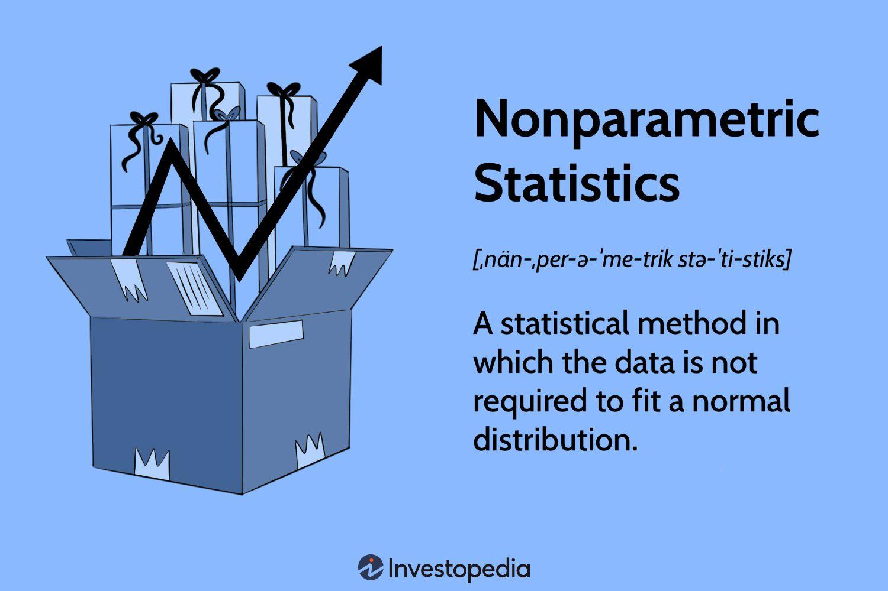

## Table of Contents

## What are nonparametric statistics?

Nonparametric statistics are a type of statistical methods that don't assume your data follows a specific type of distribution, like the normal distribution. This makes them very useful when you're not sure about the shape of your data or when your data doesn't fit the usual patterns. Instead of focusing on parameters like means and standard deviations, nonparametric methods look at the ranks or the order of the data. This approach can be more flexible and applicable to a wider range of situations.

For example, if you want to compare two groups but you're not sure if the data is normally distributed, you might use a nonparametric test like the Mann-Whitney U test instead of a t-test. These tests are often used in situations where you have small sample sizes or data that's not numerical, like rankings or categories. Nonparametric methods can be a bit less powerful than parametric methods when the data does follow a normal distribution, but they're more robust and can give you reliable results even when the data is messy or unusual.

## How do nonparametric methods differ from parametric methods?

Nonparametric methods and parametric methods are two different ways to analyze data. The main difference is that parametric methods assume your data follows a specific type of pattern, like a normal distribution. This means they use things like means and standard deviations to make conclusions. On the other hand, nonparametric methods don't assume any specific pattern. They look at the order or ranks of the data instead of focusing on specific numbers like means.

Because of these differences, nonparametric methods are more flexible. They work well when you're not sure about the shape of your data or when your data doesn't fit the usual patterns. This makes them useful for smaller datasets or data that's not numerical, like rankings or categories. Parametric methods can be more powerful when the data does follow a normal distribution, but they might give wrong results if the data doesn't fit that pattern. So, nonparametric methods are safer to use when you're unsure about your data's shape.

## What are some common nonparametric tests and their uses?

Nonparametric tests are useful when you don't know much about your data's shape or if it doesn't fit common patterns. One common test is the Mann-Whitney U test, which you can use to compare two groups without assuming they follow a normal distribution. It's great for small samples or when your data isn't numerical. Another useful test is the Wilcoxon signed-rank test, which helps you see if there's a difference between paired data, like before and after measurements. This test looks at the size and direction of differences, which makes it good for studying changes over time.

The Kruskal-Wallis test is another nonparametric test that lets you compare more than two groups. It's like the Mann-Whitney U test but for multiple groups, and it doesn't assume your data is normally distributed. If you want to see if there's a relationship between two variables without assuming a linear pattern, you might use the Spearman's rank correlation. This test looks at the ranks of your data, making it useful for data that's not normally distributed or is in the form of rankings.

These tests are powerful tools because they don't need your data to fit specific patterns. They're more flexible and can give you reliable results even when your data is messy or unusual. So, if you're unsure about your data's shape or it's not numerical, nonparametric tests can be a safe choice.

## When should nonparametric methods be used instead of parametric methods?

Nonparametric methods should be used instead of parametric methods when you're not sure about the shape of your data or if it doesn't fit the usual patterns. Parametric methods assume that your data follows a specific distribution, like the normal distribution. But if your data doesn't follow that pattern, using parametric methods might give you wrong results. Nonparametric methods don't make these assumptions, so they're safer to use when you're unsure about your data. They're also good for smaller datasets where it's hard to tell if the data follows a normal distribution.

Another time to use nonparametric methods is when your data is not numerical, like rankings or categories. Parametric methods need numbers to work with means and standard deviations, but nonparametric methods can handle data that's not in numerical form. They look at the order or ranks of the data instead of specific numbers. This makes them more flexible and useful for a wider range of situations. So, if your data is messy, unusual, or not numerical, nonparametric methods are a good choice.

## What are the advantages of using nonparametric statistics?

Nonparametric [statistics](/wiki/bayesian-statistics) are great because they don't assume your data follows a specific pattern, like the normal distribution. This makes them really useful when you're not sure about the shape of your data or if your data doesn't fit the usual patterns. If you use parametric methods when your data isn't normally distributed, you might get wrong results. But nonparametric methods don't have this problem, so they're safer to use when you're unsure about your data.

Another advantage is that nonparametric methods can handle smaller datasets. With small samples, it's hard to tell if the data follows a normal distribution. Nonparametric methods don't need a lot of data to work well, so they're a good choice when you don't have many observations. They're also useful for data that's not numerical, like rankings or categories. Parametric methods need numbers to work with means and standard deviations, but nonparametric methods can look at the order or ranks of the data instead. This makes them more flexible and able to handle a wider range of data types.

## What are the limitations or disadvantages of nonparametric statistics?

Nonparametric statistics are great because they don't assume your data follows a specific pattern, but they do have some limitations. One big disadvantage is that they can be less powerful than parametric methods when the data does follow a normal distribution. This means you might need a larger sample size to find a significant result using nonparametric methods compared to parametric ones. If your data is normally distributed and you have enough data, parametric methods might give you clearer and more reliable results.

Another limitation is that nonparametric methods can be more complex to use and understand. They often involve looking at the ranks or order of the data, which can be harder to explain and interpret than working with means and standard deviations. This complexity can make it harder for people without a strong statistics background to use these methods correctly. So, while nonparametric methods are very useful, they might not be the best choice for every situation, especially if you're looking for simplicity and your data fits the assumptions of parametric methods.

## How do you interpret the results of a nonparametric test?

Interpreting the results of a nonparametric test can seem tricky at first, but it's actually pretty straightforward once you get the hang of it. Nonparametric tests often give you a test statistic and a p-value. The test statistic shows how different your groups are, while the p-value tells you if that difference is likely due to chance. If the p-value is small (usually less than 0.05), it means the difference you see is probably real and not just a random thing. So, you can say there's a significant difference between your groups.

For example, if you use a Mann-Whitney U test to compare two groups, you'll get a U statistic and a p-value. A small p-value means the two groups are likely different in a meaningful way. But if the p-value is large, it suggests the difference might just be due to chance. It's also helpful to look at things like median values or the distribution of your data to get a better sense of what the test is telling you. This way, you can understand not just if there's a difference, but also how big that difference is and what it might mean for your study.

## Can you explain the concept of rank in nonparametric statistics?

In nonparametric statistics, the concept of rank is super important. Instead of looking at the actual numbers in your data, like means or standard deviations, nonparametric tests often use the order or position of the numbers. Imagine you have a bunch of test scores. Instead of focusing on the exact scores, you line them up from lowest to highest and give each score a number based on its position. The lowest score gets rank 1, the next lowest gets rank 2, and so on. This way, you're looking at how the scores compare to each other, not their specific values.

Using ranks helps nonparametric tests work well with data that doesn't follow a normal pattern or when you have small amounts of data. For example, if you want to compare two groups of test scores, you might use a test like the Mann-Whitney U test. This test looks at the ranks of the scores in each group to see if one group tends to have higher ranks than the other. By focusing on ranks, nonparametric tests can give you good results even when your data is messy or unusual. It's like looking at the big picture instead of getting caught up in the small details.

## What is the role of distribution-free methods in nonparametric statistics?

Distribution-free methods are a big part of nonparametric statistics. They are called "distribution-free" because they don't assume that your data follows any specific pattern, like the normal distribution. This makes them really helpful when you're not sure about the shape of your data or if your data doesn't fit the usual patterns. If you use methods that assume your data is normally distributed when it's not, you might get the wrong results. But with distribution-free methods, you don't have to worry about that. They work well even if your data is messy or unusual.

These methods look at the order or ranks of your data instead of focusing on specific numbers like means and standard deviations. This means they can handle data that's not numerical, like rankings or categories, and they're good for smaller datasets where it's hard to tell if the data follows a normal distribution. While distribution-free methods can be a bit less powerful than methods that assume a normal distribution when the data actually is normally distributed, they're more flexible and can give you reliable results in a wider range of situations. So, if you're unsure about your data's shape or it's not numerical, distribution-free methods are a safe choice.

## How do you choose the appropriate nonparametric test for a given dataset?

Choosing the right nonparametric test depends on what you want to find out and what your data looks like. If you want to compare two groups, like test scores from two different classes, you might use the Mann-Whitney U test. This test is good because it doesn't assume your data is normally distributed, and it works well with small samples or data that's not numerical. If you're looking at paired data, like before and after measurements, the Wilcoxon signed-rank test could be what you need. It looks at the size and direction of differences, which makes it great for seeing if something changed over time.

When you need to compare more than two groups, the Kruskal-Wallis test is a good choice. It's like the Mann-Whitney U test but for multiple groups, and it doesn't assume your data follows a normal pattern. If you want to see if there's a relationship between two variables, like how studying time might relate to test scores, you might use Spearman's rank correlation. This test looks at the ranks of your data, so it works well even if your data isn't normally distributed or is in the form of rankings. The key is to think about what question you're trying to answer and what your data looks like, then pick the test that fits best.

## What are some advanced nonparametric techniques used in modern statistical analysis?

In modern statistical analysis, one advanced nonparametric technique is the use of kernel density estimation. This method helps you understand the shape of your data by creating a smooth curve that shows how your data is spread out. It's like drawing a line that goes through the middle of your data points, making it easier to see patterns without assuming a specific type of distribution. Kernel density estimation is useful for visualizing data and can be used to compare different groups or to see if your data fits a certain pattern. It's especially helpful when you have a lot of data and want to get a clear picture of what's going on.

Another advanced technique is the use of bootstrap methods. Bootstrapping is a way to estimate how accurate your results are without making assumptions about your data's distribution. It works by taking lots of samples from your data, with replacement, and then using those samples to calculate things like confidence intervals. This method is great for understanding the uncertainty in your results and can be used with many different types of data. Bootstrapping is especially useful when you have small datasets or when traditional methods might not give you reliable results because your data doesn't fit common patterns.

## How can nonparametric methods be applied in real-world scenarios, including examples from different fields?

Nonparametric methods are useful in many real-world scenarios because they don't need your data to follow a specific pattern. For example, in medicine, doctors might use the Wilcoxon signed-rank test to see if a new treatment works better than an old one. They could compare patients' health before and after the treatment without assuming the data is normally distributed. This is helpful because medical data can be messy and hard to predict. In education, teachers might use the Mann-Whitney U test to compare test scores between two different classes. This test works well even if the scores don't follow a normal pattern, which is common with small groups of students.

In the field of environmental science, researchers might use the Kruskal-Wallis test to compare pollution levels across multiple cities. This test is good for data that might not fit a normal distribution, which is often the case with environmental data. It helps scientists see if there are significant differences without making strict assumptions about the data. In business, companies might use Spearman's rank correlation to understand the relationship between customer satisfaction and sales without assuming a linear pattern. This is useful because customer behavior can be unpredictable, and nonparametric methods can handle that uncertainty well.

## What is the case study about regarding the use of nonparametric methods in algorithmic trading strategy?

A trading algorithm utilizing a k-nearest neighbors (k-NN) approach represents a powerful application of nonparametric methods in predicting stock prices based on historical data. This method effectively captures complex market dynamics without requiring assumptions about the underlying data distribution. The k-NN algorithm categorizes an input feature vector, corresponding to a particular stock's characteristics on a given day, by evaluating the features of its nearest neighbors in the dataset.

The process begins with choosing the integer $k$, representing the number of nearest neighbors to consider. The algorithm then calculates the distance between the input data point and all other points in the training dataset, often using metrics such as Euclidean distance:

$$
d(x, y) = \sqrt{\sum_{i=1}^{n} (x_i - y_i)^2}
$$

Here, $x$ represents the new data point, $y$ a point in the dataset, and $n$ the number of dimensions. The algorithm selects the $k$ data points closest to the input. In a regression task such as stock price prediction, the algorithm averages the target variable (stock price) of these neighbors to estimate the price of the input data point.

Backtesting plays a crucial role in refining and validating the algorithm's efficacy. This involves using historical data to simulate the algorithm's trading decisions as if they were made in real time. Through [backtesting](/wiki/backtesting), traders can assess the model's past performance and make necessary adjustments to parameters like $k$ for better predictive accuracy.

Python offers a convenient platform for implementing k-NN through libraries such as scikit-learn. Here's a simplified example demonstrating its usage in a stock price prediction context:

```python
from sklearn.model_selection import train_test_split
from sklearn.neighbors import KNeighborsRegressor
import numpy as np

# Assume `features` is a matrix of historical stock data
# and `prices` is the corresponding stock prices
features = np.array([...])
prices = np.array([...])

# Split into training and test sets
X_train, X_test, y_train, y_test = train_test_split(features, prices, test_size=0.2, random_state=42)

# Initialize and train the k-NN model
knn = KNeighborsRegressor(n_neighbors=5)
knn.fit(X_train, y_train)

# Predict stock prices
predicted_prices = knn.predict(X_test)

# Evaluate performance (simplified)
accuracy = knn.score(X_test, y_test)
print(f'Model Accuracy: {accuracy:.2f}')
```

Through this framework, k-NN models enhance the predictability and resilience of [algorithmic trading](/wiki/algorithmic-trading) by adaptively responding to diverse market conditions. Traders can fine-tune such models, increasing robustness against market [volatility](/wiki/volatility-trading-strategies) by not making rigid assumptions about the data distribution, ultimately resulting in more informed trading decisions.

## References & Further Reading

[1]: Bergstra, J., Bardenet, R., Bengio, Y., & Kégl, B. (2011). ["Algorithms for Hyper-Parameter Optimization."](https://dl.acm.org/doi/10.5555/2986459.2986743) Advances in Neural Information Processing Systems 24.

[2]: ["Advances in Financial Machine Learning"](https://www.amazon.com/Advances-Financial-Machine-Learning-Marcos/dp/1119482089) by Marcos Lopez de Prado

[3]: ["Evidence-Based Technical Analysis: Applying the Scientific Method and Statistical Inference to Trading Signals"](https://www.amazon.com/Evidence-Based-Technical-Analysis-Scientific-Statistical/dp/0470008741) by David Aronson

[4]: ["Machine Learning for Algorithmic Trading"](https://github.com/stefan-jansen/machine-learning-for-trading) by Stefan Jansen

[5]: ["Quantitative Trading: How to Build Your Own Algorithmic Trading Business"](https://www.amazon.com/Quantitative-Trading-Build-Algorithmic-Business/dp/1119800064) by Ernest P. Chan