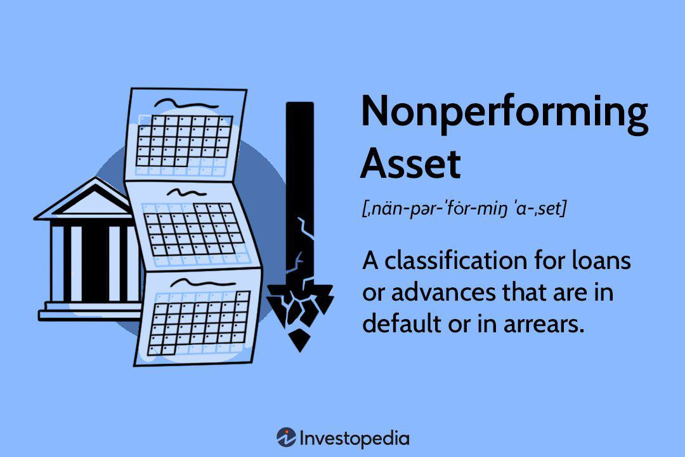

Non-Performing Assets (NPAs) are a pivotal concern within the banking and finance sectors, significantly influencing both profitability and the stability of financial institutions. An NPA is typically a loan or advance for which the principal or interest payment remains overdue for a specified period, often 90 days, failing to generate expected income. This phenomenon bears crucial implications, directly affecting a bank's balance sheet and its capacity to engage in further lending. NPAs can erode financial health by diminishing income sources, compelling banks to allocate resources for provisioning, and potentially leading to liquidity issues.

The broader economic landscape is often influenced by the prevalence of NPAs, as they reflect the underlying health of both borrowers and their respective industries. High levels of NPAs can indicate systemic issues within an economy, such as poor credit practices, inefficient risk management, or economic downturns. These assets challenge banks, necessitating rigorous insight to mitigate associated risks and strategically manage loan portfolios.



For financial analysts and algorithmic trading firms, understanding NPAs is instrumental in assessing a bank’s risk profile. They utilize varied metrics and predictive models to evaluate and interpret the implications of NPAs on market trends and investment strategies. Such knowledge is crucial in making informed decisions and optimizing portfolio performance. As a result, stakeholders in the financial ecosystem must continually refine their understanding of NPAs to navigate the complex interplay of risks impacting economic growth and financial stability.

## Table of Contents

## Understanding Non-Performing Assets

Non-Performing Assets (NPAs) are loans or advances for which the principal or interest payment remains overdue for a specified period, typically 90 days or more. This definition is widely accepted under international financial standards, including those of the Basel Committee on Banking Supervision. The classification of loans as non-performing involves rigorous assessment based on criteria such as overdue duration, financial condition of the borrower, and the loan’s likelihood of being collected in the future.

The economic significance of NPAs lies in their direct impact on the financial health of banks. High levels of NPAs reduce the income generated from loans, thereby affecting the profitability and capital adequacy ratio of banks. From a regulatory perspective, central banks and financial regulatory bodies impose strict guidelines on NPA recognition and provisioning to ensure the stability of the banking sector. This involves setting aside a portion of profits to cover potential losses from NPAs, influencing a bank’s available capital for new lending activities. Statutory compliance with these regulations is crucial for maintaining investor confidence and operational credibility.

NPAs are identified and recorded on bank balance sheets through meticulous accounting processes. Loans are internally reviewed at regular intervals, after which they may be classified as non-performing based on the outlined regulatory criteria. The recording process involves adjusting balance sheet entries to reflect provisions for these assets. Usually, financial statements will show a gross NPA figure and a net NPA figure, where the latter subtracts the provisions made from the total NPAs. This accurate recording allows stakeholders to assess the risk exposure of the financial institution, guiding both managerial decisions and investor evaluations.

## Types of Non-Performing Assets

Non-Performing Assets (NPAs) are classified into three primary categories based on the duration for which the loan installment remains overdue and the likelihood of recovery:

1. **Substandard Assets**: These are loans that have become overdue for a period of less than 12 months. In this phase, the asset is still considered to be potentially recoverable, albeit with increased risk. Substandard classification indicates that the bank's income from these loans is uncertain, requiring the bank to set aside a special allowance for potential losses. This provision is a safeguard, allowing the institution to manage the increased risk associated with these assets.

2. **Doubtful Assets**: Loans categorized as doubtful assets are those that have been overdue for more than 12 months. The progression from substandard to doubtful signifies an escalation in risk, reflecting more significant uncertainty regarding the recovery of dues. Given this elevated risk, banks are required to enhance their provisioning, often earmarking a higher percentage of the outstanding amount. The precise percentage varies based on the risk assessment conducted by the bank or regulatory guidelines. This increased provisioning impacts the bank's profitability, as resources are allocated to cover potential losses instead of generating revenue.

3. **Loss Assets**: Loss assets are loans that have been identified as entirely uncollectible by the bank or a regulatory authority and require 100% provisioning. Despite being written off as a loss, these loans may still remain on the books of the bank for record-keeping purposes, pending legal proceedings or recovery efforts. Their classification as loss assets effectively signals the exhaustion of recoverability efforts, prompting banks to adjust their strategies to mitigate future risks.

The categorization of loans into these types of non-performing assets is guided by regulatory norms and the bank's internal risk assessment policies. These classifications are crucial for determining the appropriate level of provisioning, which is a financial buffer against potential losses from defaults. By understanding these categories, financial institutions can better manage their loan portfolios, ensuring that resources are adequately allocated to counterbalance the risks posed by NPAs.

## Causes of NPAs

Non-Performing Assets (NPAs) arise from several underlying causes, each contributing to the financial instability and operational challenges faced by lending institutions. These factors are multifaceted, encompassing aspects such as risk management, economic conditions, regulatory environments, and even fraudulent undertakings.

**Poor Risk Management and Credit Assessment**

A significant cause of NPAs is inadequate risk management and credit assessment. When lending institutions fail to accurately assess the creditworthiness of borrowers, they make uninformed lending decisions. Often, this involves overlooking key indicators of financial instability or failing to account for sector-specific risks. The absence of sophisticated risk assessment tools or methodologies can exacerbate this issue, leading to a higher likelihood of loan default. This inadequacy is reflected in the discrepancies between the expected and actual performance of loan portfolios.

**Economic Downturns**

Economic downturns play a crucial role in increasing NPAs. During such periods, borrowers may face reduced income, making it challenging for them to service existing debts. This phenomenon is particularly pronounced in cyclical industries that are sensitive to economic fluctuations. The downturns lead to increased unemployment rates, reduced consumer spending, and lower business revenues, all of which directly impact borrowers’ repayment capacities. Consequently, loans that were once serviced reliably can transform into NPAs, should the economic conditions persist.

**Regulatory Changes**

Changes in regulatory frameworks can also contribute to the emergence of NPAs. These changes may include new regulations or amendments to existing ones that inadvertently impact specific sectors adversely. For instance, stricter environmental regulations might increase operational costs for industries reliant on natural resources, thereby affecting their profitability and loan servicing ability. Furthermore, sudden regulatory changes can disrupt business operations, leading to unforeseen financial challenges for borrowers.

**Fraudulent Activities and Political and Legal Factors**

Fraudulent activities are another significant [factor](/wiki/factor-investing) contributing to the rise of NPAs. These activities may involve falsification of financial statements, collusion in overvaluation of assets, or misrepresentation of creditworthiness. Such deceitful actions can mislead lenders, resulting in the issuance of loans that are unlikely to be repaid. Additionally, political and legal influences can affect the loan repayment landscape. Political interference might lead to the granting of loans based on influence rather than financial stability, while legal obstacles can delay recovery proceedings, further complicating the management of NPAs.

In conclusion, understanding the causes of NPAs is essential for developing strategies to mitigate their occurrence and manage their impact on the financial sector. Proactive measures, informed by these causes, are crucial for maintaining the stability and profitability of lending institutions.

## Impact of NPAs

Non-Performing Assets (NPAs) significantly impact financial institutions, largely due to the financial burden they impose. When loans become non-performing, banks face a direct reduction in profitability. Interest income, a critical revenue component, diminishes because banks can no longer accrue interest on these assets. Consequently, NPAs reduce the net interest margin, a key indicator of financial health. Additionally, [liquidity](/wiki/liquidity-risk-premium) constraints arise as funds tied up in non-performing loans are unavailable for further lending or investment activities, limiting a bank's operational flexibility.

The presence of NPAs necessitates increased capital reserves to cushion against potential losses. Regulatory bodies, such as the Basel Committee on Banking Supervision, mandate banks to maintain capital adequacy ratios in line with their risk exposure. As NPAs rise, banks are compelled to allocate more capital to meet these requirements, often leading to constrained lending capacities. This situation is exacerbated by the provisioning norms, which require banks to set aside a percentage of NPAs as a buffer against potential losses. The formula governing capital adequacy can be expressed as:

$$
\text{Capital Adequacy Ratio (CAR)} = \frac{\text{Tier 1 Capital} + \text{Tier 2 Capital}}{\text{Risk-Weighted Assets}}
$$

A surge in NPAs inflates the denominator (risk-weighted assets), thereby necessitating a proportional increase in the numerator (capital) to maintain the prescribed CAR.

Furthermore, NPAs erode investor and shareholder confidence. High NPA levels are often perceived as indicative of underlying operational inefficiencies and poor credit risk management. This perception can trigger a decline in bank stock prices, increasing the cost of capital and potentially leading to a lower market valuation. Investors may demand higher risk premiums, further straining financial resources.

Overall, NPAs undermine market stability as they reflect systemic vulnerabilities. Elevated NPA levels can signal broader economic distress, potentially leading to tighter credit conditions and diminished economic growth. Consequently, managing NPAs effectively is crucial for maintaining a robust banking sector and fostering a stable economic environment.

## Managing and Reducing NPAs

Managing and reducing Non-Performing Assets (NPAs) require a multifaceted approach that combines improved risk management, advanced technological interventions, and effective legal frameworks. 

### Improved Risk Management and Credit Appraisal Processes

Effective risk management starts with robust credit appraisal processes. Banks must use comprehensive credit evaluation models that analyze a borrower's creditworthiness, taking into account factors such as credit history, income stability, and market conditions. Credit scoring models, often using statistical analysis and historical data, can enhance the precision of these evaluations. For instance, applying logistic regression or decision tree models can help predict the likelihood of default, allowing for more informed lending decisions. In practice, this might involve assigning a probability of default (PD) to borrowers and adjusting loan terms accordingly.

### Technological Interventions: AI and Machine Learning

Artificial Intelligence (AI) and Machine Learning (ML) offer powerful tools for predictive analytics, enhancing traditional risk management practices. These technologies can analyze vast datasets to identify patterns and anomalies that signal potential credit risks. For example, [machine learning](/wiki/machine-learning) algorithms can continuously learn from new data, improving their predictive accuracy over time. In Python, popular libraries such as Scikit-learn or TensorFlow can be used to develop models that score and classify loans based on risk factors.

```python
from sklearn.ensemble import RandomForestClassifier

# Sample code to fit a model
# Assume X_train, y_train are features and target respectively
model = RandomForestClassifier(n_estimators=100, random_state=42)
model.fit(X_train, y_train)

# Predicting probabilities of default
prob_default = model.predict_proba(X_test)[:, 1]
```

AI-driven tools also enable real-time monitoring of borrower behavior and market conditions, allowing banks to adjust credit strategies proactively. By employing natural language processing (NLP) algorithms, financial institutions can analyze unstructured data from news articles, social media, and customer communications to identify emerging risks promptly.

### Legal Frameworks, Restructuring, and Recovery Strategies

Legal frameworks are crucial for managing and recovering NPAs. Legislation such as insolvency and bankruptcy codes can streamline the process of asset recovery and loan restructuring. These laws provide creditors with mechanisms to seize assets or restructure troubled loans, aiding in quicker resolution and recovery. Successful NPA management often involves coordinated restructuring strategies, where banks may alter the terms of debt repayment to allow borrowers more time or lower interest rates to prevent defaults.

Furthermore, establishing specialized asset management companies (AMCs) can facilitate the resolution of NPAs by purchasing toxic assets from banks, thereby reducing their burden and aiding in their cleanup process. Such entities can pool resources and expertise to manage and resolve troubled assets effectively.

In summary, a strategic approach combining improved credit appraisal, the deployment of advanced technological tools, and a solid legal framework can significantly aid financial institutions in managing and reducing NPAs, ultimately supporting economic stability and growth.

## Algorithmic Trading and NPA Management

Algorithmic trading has fundamentally transformed the landscape of financial markets by employing complex algorithms to automate data processing and optimize decision-making processes. These algorithms leverage vast amounts of data, enabling financial institutions to swiftly and efficiently address the challenges posed by Non-Performing Assets (NPAs).

One of the primary roles of [algorithmic trading](/wiki/algorithmic-trading) in NPA management is its capacity to harness advanced analytical tools. By integrating machine learning and [artificial intelligence](/wiki/ai-artificial-intelligence), algorithms can identify patterns and trends within large datasets that may indicate potential NPAs. This proactive identification allows banks and financial institutions to monitor and manage NPAs more effectively, mitigating risks before they escalate. For instance, predictive analytics can forecast the probability of a loan becoming non-performing based on historical data and borrower behavior.

Python, widely used in algorithmic trading, offers robust libraries such as pandas, NumPy, and sci-kit-learn, which can be instrumental in predictive analytics. Here is an example of how Python can be utilized to predict potential NPAs:

```python
import pandas as pd
from sklearn.model_selection import train_test_split
from sklearn.ensemble import RandomForestClassifier
from sklearn.metrics import classification_report

# Load dataset
data = pd.read_csv('loan_data.csv')

# Feature selection
features = data.drop('NPA_status', axis=1)
target = data['NPA_status']

# Split data into training and testing sets
X_train, X_test, y_train, y_test = train_test_split(features, target, test_size=0.3, random_state=42)

# Initialize and train the model
model = RandomForestClassifier(n_estimators=100, random_state=42)
model.fit(X_train, y_train)

# Make predictions
predictions = model.predict(X_test)

# Evaluate the model
print(classification_report(y_test, predictions))
```

Algorithmic trading strategies also enhance efficiency in NPA management by facilitating automated decision-making. Automated systems can continuously evaluate the loan portfolio, providing real-time insights into risk exposure and suggesting measures for restructuring or recovery of distressed assets. This continuous monitoring helps maintain the health of the portfolio, ensuring that emerging risks are swiftly addressed.

Furthermore, these algorithms can optimize resource allocation in managing NPAs by identifying which loans require immediate attention and which recovery strategies are most likely to succeed. The integration of algorithmic strategies offers a data-driven approach that minimizes human error and augments the traditional methods of NPA management with precision and speed.

Incorporating algorithms into NPA management not only streamlines operations but also supports the broader objective of sustaining financial stability while enhancing profitability. As financial institutions continue to adopt advanced technologies, the role of algorithmic trading will be pivotal in addressing the complexities associated with NPAs.

## Conclusion

Non-Performing Assets (NPAs) represent a significant challenge to the banking and finance sectors, impacting both profitability and stability. The presence of NPAs can severely constrain a bank’s financial health, leading to diminished returns and restricting its ability to lend further. This situation mandates comprehensive management strategies that encompass technological, regulatory, and strategic approaches to address and mitigate the effects of NPAs.

Technological interventions have become indispensable in managing NPAs. The incorporation of advanced technologies such as Artificial Intelligence (AI) and Machine Learning (ML) facilitates predictive analytics, enabling banks to assess risks more accurately and anticipate potential defaults before they materialize. By processing vast datasets, AI and ML tools can identify patterns and trends that may escape manual analysis, thus playing a pivotal role in risk management and loan portfolio optimization.

Regulatory frameworks also play a crucial role in managing NPAs. Regulatory bodies establish guidelines and norms that banks must adhere to, ensuring prudent lending practices and mitigating the risk of accumulating NPAs. Enhanced regulation encourages transparency and accountability, essential for maintaining the confidence of investors and shareholders.

Strategic approaches involve restructuring and recovery strategies that can be employed to rehabilitate NPAs. This may include negotiating loan terms, such as extending repayment periods or reducing interest rates, to alleviate the financial burden on borrowers and enhance the likelihood of recovery.

Collaboration among financial institutions, regulators, and technology firms is paramount in effectively managing NPAs. Joint efforts can lead to the development of innovative solutions and frameworks that not only address current challenges but also preempt future issues. Through such partnerships, the banking and finance sectors can safeguard against the systemic risks posed by NPAs, thereby supporting broader economic growth and stability.

In conclusion, addressing the complexities of NPAs requires an integrated approach that leverages technology, abides by regulatory standards, and adopts well-thought-out strategies. This holistic effort is essential to sustain the financial ecosystem and drive economic progress.

## References & Further Reading

[1]: Bergstra, J., Bardenet, R., Bengio, Y., & Kégl, B. (2011). ["Algorithms for Hyper-Parameter Optimization."](https://dl.acm.org/doi/10.5555/2986459.2986743) Advances in Neural Information Processing Systems 24.

[2]: ["Advances in Financial Machine Learning"](https://www.amazon.com/Advances-Financial-Machine-Learning-Marcos/dp/1119482089) by Marcos Lopez de Prado

[3]: ["Machine Learning for Algorithmic Trading"](https://github.com/stefan-jansen/machine-learning-for-trading) by Stefan Jansen

[4]: ["Non-Performing Loans and Resolving Private Sector Insolvency"](https://link.springer.com/book/10.1007/978-3-319-50313-4) by the International Monetary Fund

[5]: Basel Committee on Banking Supervision. (2001). ["The Treatment of Asset Securitizations."](https://www.fsa.go.jp/inter/bis/bj_20010117_1/1i.pdf) Bank for International Settlements.