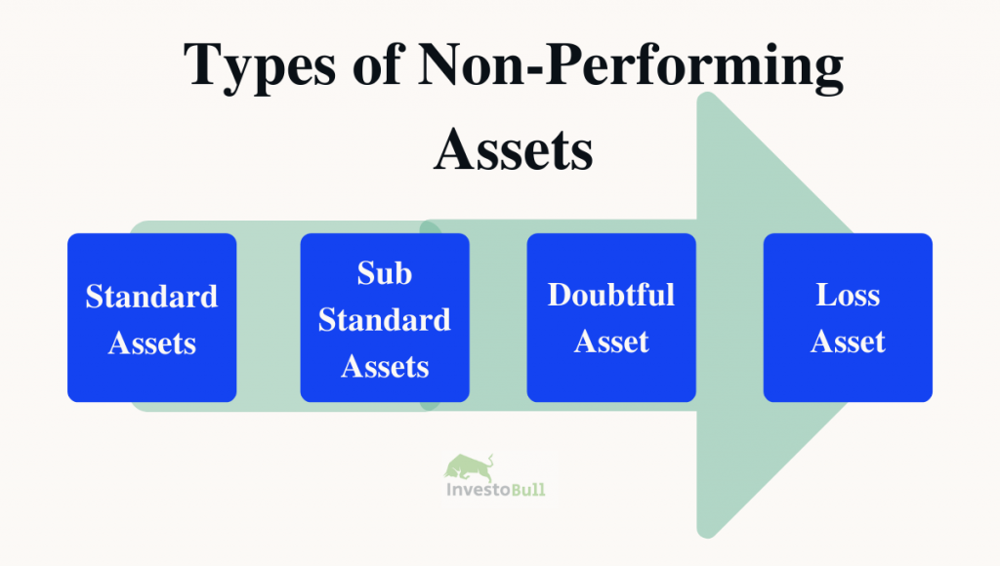

## Table of Contents

## What is a nonperforming asset?

A nonperforming asset, often called an NPA, is a loan or advance that is no longer bringing in money for the bank or financial institution that gave it out. This happens when the borrower stops making payments on the loan for a certain period, usually 90 days or more. When this happens, the loan is considered "nonperforming" because it's not performing its main job of generating income through interest payments.

Banks and financial institutions don't like NPAs because they can hurt their profits and overall financial health. When a loan becomes an NPA, the bank has to set aside money to cover potential losses, which can reduce the amount of money they have available to lend to others. Managing NPAs is important for banks, as too many of them can lead to serious financial problems and even affect the broader economy.

## What are the common types of nonperforming assets?

Nonperforming assets can be split into two main types: loans and investments. Loans become nonperforming when the borrower stops paying back the money they owe. This can happen with different kinds of loans, like home loans, car loans, or business loans. For example, if someone stops paying their home loan for a long time, the bank might call it a nonperforming loan.

The other type of nonperforming asset is investments. This happens when the value of something a bank or financial institution has invested in drops a lot, or the investment stops giving back money. For instance, if a bank invests in a company and that company starts doing badly, the investment might become nonperforming. Both types of nonperforming assets can cause problems for banks and need to be managed carefully.

## How does a loan become a nonperforming asset?

A loan becomes a nonperforming asset when the borrower stops making payments on it for a long time, usually 90 days or more. This means the loan is not doing its job of bringing in money for the bank through interest payments. When this happens, the bank can't count on that loan to make money anymore, so it's called a nonperforming asset.

Banks have rules to decide when a loan becomes nonperforming. For example, if someone stops paying their car loan and doesn't make any payments for three months, the bank will say that loan is nonperforming. This is important because banks need to know how much money they might lose and plan accordingly. When a loan turns into a nonperforming asset, it can affect the bank's overall health and how much money they have to lend to other people.

## What is the difference between a nonperforming loan and a nonperforming asset?

A nonperforming loan is a specific type of nonperforming asset. It happens when someone who borrowed money from a bank stops paying it back for a long time, usually 90 days or more. This means the loan isn't making money for the bank anymore because the borrower isn't paying the interest. So, the bank can't count on that loan to bring in money, and it becomes a problem for them.

A nonperforming asset, on the other hand, is a broader term. It includes not just loans, but also other things that a bank or financial institution owns that aren't making money. For example, if a bank invests in a company and that company starts doing badly, the investment can become a nonperforming asset. So, while all nonperforming loans are nonperforming assets, not all nonperforming assets are loans—they can also be investments or other types of assets that aren't generating income.

## How do nonperforming assets affect financial institutions?

Nonperforming assets can cause big problems for banks and other financial institutions. When loans or investments stop making money, it means the bank loses out on the interest they were expecting to earn. This can make it harder for the bank to make money overall. Banks have to set aside money to cover these losses, which means they have less money to lend to other people who need it. If a bank has too many nonperforming assets, it can hurt their profits and make it tough for them to stay healthy financially.

Dealing with nonperforming assets also takes a lot of time and effort. Banks have to work hard to get borrowers to start paying again or to sell off the assets to get some money back. This can be a slow and complicated process. If too many loans turn into nonperforming assets, it can even affect the whole economy. Banks might become more careful about lending money, which can slow down business and make it harder for people to get loans when they need them. So, managing nonperforming assets is really important for keeping banks and the economy strong.

## What are the regulatory requirements for managing nonperforming assets?

Banks have to follow rules set by regulators to manage nonperforming assets. These rules are there to make sure banks are safe and sound. Regulators want banks to keep track of loans that aren't being paid back and to set aside money to cover possible losses. This money is called a provision. Banks need to report how many nonperforming assets they have and how much money they've set aside. If a bank has too many nonperforming assets, regulators might step in to help fix the problem.

Different countries have their own rules about nonperforming assets. For example, in the United States, the Federal Reserve and other agencies set rules for banks to follow. These rules say how long a loan can go unpaid before it's called nonperforming and how much money banks should set aside. In India, the Reserve Bank of India has its own set of rules, including how to classify loans as nonperforming and what banks need to do to manage them. These rules help keep the banking system stable and protect customers' money.

## What strategies can be used to manage or recover nonperforming assets?

Banks have different ways to deal with loans that aren't being paid back. One way is to work with the borrower to make a new plan for paying back the loan. This might mean changing the loan terms so it's easier for the borrower to pay, like lowering the interest rate or giving them more time to pay. Another way is to take back the thing that was bought with the loan, like a car or a house, and sell it to get some money back. This is called repossession or foreclosure. Banks might also sell the nonperforming loan to another company that specializes in getting money back from borrowers.

Sometimes, banks use a method called debt restructuring, where they change the loan terms to help the borrower start paying again. This can be a good way to get some money back instead of losing it all. Another strategy is to bundle nonperforming loans together and sell them as a package to investors. These investors might be able to get more money back from the borrowers than the bank could. Banks also set aside money, called provisions, to cover the losses from nonperforming loans. This helps them stay financially stable even if they can't get all the money back.

Managing nonperforming assets is important for banks to stay healthy. They need to keep a close eye on loans that aren't being paid and try different ways to get the money back. By doing this, banks can reduce the impact of nonperforming assets on their business and keep lending money to other people who need it.

## How do nonperforming assets impact the economy?

Nonperforming assets can have a big effect on the economy. When banks have a lot of loans that aren't being paid back, they lose money. This can make them more careful about lending money to other people or businesses. If banks stop lending as much, it can slow down the economy because businesses might not be able to grow or start new projects. People might also find it harder to get loans for things like buying a house or starting a business, which can affect their lives and the overall economy.

If the problem of nonperforming assets gets really bad, it can lead to bigger issues. Banks might have to set aside a lot of money to cover their losses, which means they have even less money to lend. This can cause a credit crunch, where it's hard for anyone to get a loan. If many banks are struggling with nonperforming assets, it can shake people's trust in the banking system. This can make the economy weaker and even lead to a financial crisis if things get out of control. So, it's really important for banks to manage their nonperforming assets well to keep the economy strong.

## What role do asset reconstruction companies play in handling nonperforming assets?

Asset reconstruction companies, or ARCs, help banks deal with loans that aren't being paid back. These companies buy nonperforming loans from banks at a lower price than what the loan is worth. This helps banks get rid of bad loans and focus on making new loans. ARCs then try to get the borrowers to start paying again or find other ways to get money back, like selling the assets that were bought with the loan.

By taking nonperforming loans off the banks' hands, ARCs help keep the banking system healthy. When banks sell these loans to ARCs, they can use the money they get to lend to other people who need it. This keeps money flowing in the economy. ARCs also have special skills and tools to work with borrowers and recover money, which can be harder for banks to do on their own. So, ARCs play a big role in managing nonperforming assets and helping the economy stay strong.

## What are the international standards for classifying nonperforming assets?

International standards for classifying nonperforming assets are set by different organizations, like the Basel Committee on Banking Supervision. They say that a loan should be called nonperforming if the borrower doesn't pay it back for 90 days or more. This rule helps banks around the world use the same way to decide when a loan is a problem. It makes it easier for people to compare how well banks are doing in different countries.

These standards also say that banks should set aside money to cover losses from nonperforming loans. This money is called provisions. The amount of money banks need to set aside can depend on how bad the loan is and how likely it is that the bank won't get the money back. By following these international rules, banks can keep track of their nonperforming assets better and make sure they stay healthy financially.

## How can technology be utilized to predict and manage nonperforming assets?

Technology can help banks predict and manage nonperforming assets by using special computer programs called machine learning and artificial intelligence. These programs look at a lot of information about borrowers, like how much money they make, how they've paid back loans before, and what's happening in the economy. By studying this information, the programs can guess which loans might turn into nonperforming assets. This helps banks take action early, like talking to the borrower or changing the loan terms to make it easier to pay back. This way, banks can stop loans from becoming nonperforming before it's too late.

Once a loan becomes a nonperforming asset, technology can still help. Banks can use software to keep track of all their nonperforming loans and see how they're doing. This software can also help banks decide the best way to get money back, like selling the loan to another company or taking back the thing that was bought with the loan. Technology makes it easier for banks to manage these loans and find the best solution quickly. By using technology, banks can handle nonperforming assets better and keep their business strong.

## What are the latest trends and future predictions regarding nonperforming assets?

The latest trends in managing nonperforming assets show that banks are using more technology to help them. They use computer programs that can look at a lot of information to guess which loans might become nonperforming. This helps banks act early and stop loans from turning into problems. Also, more banks are working with asset reconstruction companies to sell off their bad loans. These companies are good at getting money back from borrowers, so it helps the banks get rid of their nonperforming assets and focus on lending to new customers.

In the future, it's likely that technology will play an even bigger role in managing nonperforming assets. Banks will use more advanced computer programs to predict and manage these loans better. They might also use new ways of working with borrowers, like using apps to help them pay back their loans more easily. As for asset reconstruction companies, they will keep helping banks by buying more nonperforming loans and finding smart ways to get money back. This will help keep the banking system strong and make it easier for people and businesses to get the loans they need.

## What is the impact of NPAs?

Non-Performing Assets (NPAs) significantly impact financial institutions, largely due to the financial burden they impose. When loans become non-performing, banks face a direct reduction in profitability. Interest income, a critical revenue component, diminishes because banks can no longer accrue interest on these assets. Consequently, NPAs reduce the net interest margin, a key indicator of financial health. Additionally, [liquidity](/wiki/liquidity-risk-premium) constraints arise as funds tied up in non-performing loans are unavailable for further lending or investment activities, limiting a bank's operational flexibility.

The presence of NPAs necessitates increased capital reserves to cushion against potential losses. Regulatory bodies, such as the Basel Committee on Banking Supervision, mandate banks to maintain capital adequacy ratios in line with their risk exposure. As NPAs rise, banks are compelled to allocate more capital to meet these requirements, often leading to constrained lending capacities. This situation is exacerbated by the provisioning norms, which require banks to set aside a percentage of NPAs as a buffer against potential losses. The formula governing capital adequacy can be expressed as:

$$
\text{Capital Adequacy Ratio (CAR)} = \frac{\text{Tier 1 Capital} + \text{Tier 2 Capital}}{\text{Risk-Weighted Assets}}
$$

A surge in NPAs inflates the denominator (risk-weighted assets), thereby necessitating a proportional increase in the numerator (capital) to maintain the prescribed CAR.

Furthermore, NPAs erode investor and shareholder confidence. High NPA levels are often perceived as indicative of underlying operational inefficiencies and poor credit risk management. This perception can trigger a decline in bank stock prices, increasing the cost of capital and potentially leading to a lower market valuation. Investors may demand higher risk premiums, further straining financial resources.

Overall, NPAs undermine market stability as they reflect systemic vulnerabilities. Elevated NPA levels can signal broader economic distress, potentially leading to tighter credit conditions and diminished economic growth. Consequently, managing NPAs effectively is crucial for maintaining a robust banking sector and fostering a stable economic environment.

## References & Further Reading

[1]: Bergstra, J., Bardenet, R., Bengio, Y., & Kégl, B. (2011). ["Algorithms for Hyper-Parameter Optimization."](https://dl.acm.org/doi/10.5555/2986459.2986743) Advances in Neural Information Processing Systems 24.

[2]: ["Advances in Financial Machine Learning"](https://www.amazon.com/Advances-Financial-Machine-Learning-Marcos/dp/1119482089) by Marcos Lopez de Prado

[3]: ["Machine Learning for Algorithmic Trading"](https://github.com/stefan-jansen/machine-learning-for-trading) by Stefan Jansen

[4]: ["Non-Performing Loans and Resolving Private Sector Insolvency"](https://link.springer.com/book/10.1007/978-3-319-50313-4) by the International Monetary Fund

[5]: Basel Committee on Banking Supervision. (2001). ["The Treatment of Asset Securitizations."](https://www.fsa.go.jp/inter/bis/bj_20010117_1/1i.pdf) Bank for International Settlements.