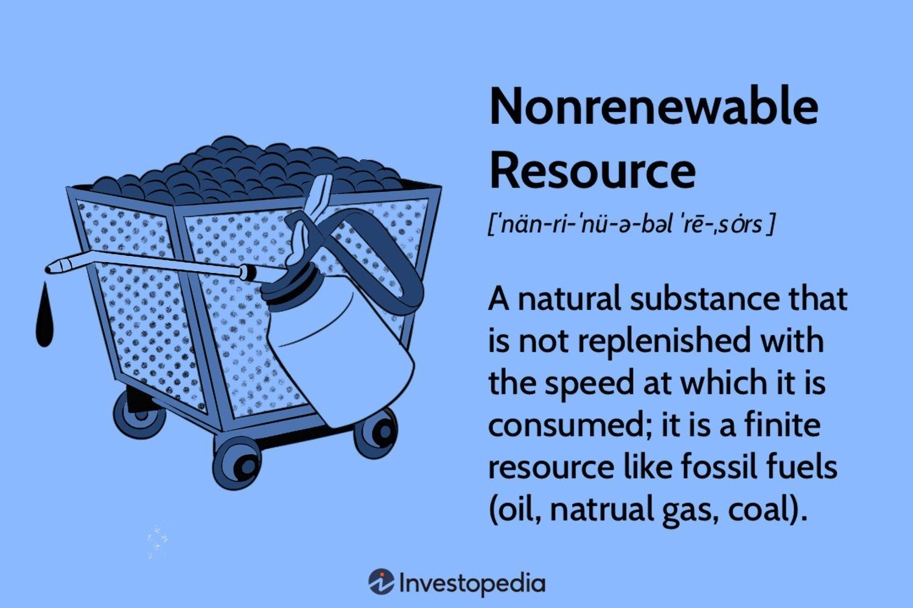

## Table of Contents

## What is a nonrenewable resource?

A nonrenewable resource is something that we use up and can't easily get back. These resources come from the earth and took millions of years to form. Once we use them all up, they are gone forever. Examples include oil, coal, and natural gas. We use these a lot for energy, but because they are limited, we need to be careful.

We rely on nonrenewable resources for many things, like driving cars and heating homes. But because they are limited, using them too much can cause problems. It can harm the environment and make it harder for future generations to have enough energy. That's why it's important to look for other ways to get energy, like using the sun or wind, which are renewable and won't run out.

## Can you list some common examples of nonrenewable resources?

Nonrenewable resources are things we find in the earth that we can't replace easily. Some common examples are oil, coal, and natural gas. We use these a lot to make energy for our cars, homes, and factories. They are called "fossil fuels" because they come from old plants and animals that turned into these resources over millions of years.

Another example of a nonrenewable resource is uranium. We use uranium in nuclear power plants to make electricity. It's different from fossil fuels, but it's still something we can't make more of once we use it up.

These resources are important, but they are limited. That means we need to be careful about how much we use them. If we use them all up, they won't be there for people in the future. That's why it's good to look for other ways to get energy, like using the sun or wind.

## How are nonrenewable resources formed?

Nonrenewable resources like oil, coal, and natural gas come from plants and animals that lived a long time ago. These plants and animals died and got buried under layers of dirt and rock. Over millions of years, heat and pressure from the earth changed them into what we call fossil fuels. This process is very slow, which is why these resources are nonrenewable. Once we use them up, it takes too long for more to be made.

Uranium, another nonrenewable resource, forms in a different way. It comes from the earth's crust and was created when the earth was first formed. Uranium is a metal that we use in nuclear power plants to make electricity. Like fossil fuels, once we use up the uranium we have, we can't make more of it quickly. That's why uranium is also considered nonrenewable.

These resources are important for our energy needs, but because they take so long to form, we need to use them carefully. If we use them too quickly, they will run out, and future generations won't have them. That's why it's important to find other ways to get energy, like using the sun or wind, which are renewable and won't run out.

## Why are nonrenewable resources important for modern society?

Nonrenewable resources like oil, coal, and natural gas are very important for modern society because they give us a lot of energy. We use this energy to drive cars, heat our homes, and run factories. Without these resources, it would be hard to do many of the things we do every day. They are also used to make things like plastic and chemicals that we use in our lives. So, nonrenewable resources help us live the way we do now.

But, there's a problem. These resources are limited, and once we use them up, they are gone. This means we need to be careful about how much we use them. If we use them too quickly, future generations might not have enough. That's why it's important to look for other ways to get energy, like using the sun or wind. These are renewable and won't run out, so they can help us keep our energy needs met without using up all our nonrenewable resources.

## What are the main characteristics of nonrenewable resources?

Nonrenewable resources are things from the earth that we can't easily get back once we use them. They come from deep in the ground and took millions of years to form. Examples include oil, coal, natural gas, and uranium. Because it takes so long for them to be made, we can't make more of them quickly. This means if we use them all up, they won't be there for people in the future.

These resources are important because they give us a lot of energy. We use them to drive cars, heat homes, and run factories. They also help make things like plastic and chemicals that we use every day. But, because they are limited, we need to be careful about how much we use them. If we use them too fast, we might run out, and that could cause problems for the environment and for future generations. That's why it's good to look for other ways to get energy, like using the sun or wind, which won't run out.

## How does the extraction of nonrenewable resources impact the environment?

The extraction of nonrenewable resources like oil, coal, and natural gas can harm the environment in many ways. When we drill for oil or dig for coal, it can mess up the land and water around it. This can lead to things like oil spills or chemicals leaking into rivers and lakes, which can hurt plants, animals, and even people who live nearby. Also, digging big holes for mining can change the land and make it hard for plants to grow back, which can lead to less wildlife and more erosion.

Burning these resources to get energy also adds a lot of pollution to the air. When we burn coal or oil, it makes gases like carbon dioxide, which can cause climate change. Climate change can lead to more storms, hotter temperatures, and other problems that make life harder for people and animals. So, while we need these resources for energy, the way we get them and use them can have big impacts on the environment. That's why it's important to find cleaner ways to get energy, like using the sun or wind, which don't harm the environment as much.

## What is the concept of peak oil and how does it relate to nonrenewable resources?

Peak oil is the idea that at some point, the amount of oil we can get out of the ground will start to go down, even if we keep trying to get more. This happens because oil is a nonrenewable resource, which means we can't make more of it quickly. Once we reach peak oil, it becomes harder and more expensive to get the oil that's left. This can cause problems because we use oil for so many things, like driving cars and making plastic.

Peak oil is important to think about because it shows how limited nonrenewable resources are. If we use up oil too fast, we might run out before we find other ways to get energy. This is why it's good to look for renewable energy sources, like the sun or wind, which won't run out. By using these, we can save the oil we have left and make sure we have enough energy for the future.

## How do nonrenewable resources differ from renewable resources?

Nonrenewable resources are things from the earth that we can't easily get back once we use them. They come from deep in the ground and took millions of years to form. Examples include oil, coal, natural gas, and uranium. Because it takes so long for them to be made, we can't make more of them quickly. This means if we use them all up, they won't be there for people in the future. We use these resources a lot for energy, like driving cars and heating homes, but they are limited, so we need to be careful.

Renewable resources are different because they can be used over and over again without running out. Examples include sunlight, wind, and water. We can use these to make energy without worrying about using them all up. For example, the sun will keep shining, and the wind will keep blowing, no matter how much energy we get from them. Using renewable resources is good for the environment because they don't create as much pollution as nonrenewable resources. That's why it's important to use more renewable energy to help save our nonrenewable resources for the future.

## What are the economic implications of relying on nonrenewable resources?

Relying on nonrenewable resources like oil, coal, and natural gas can have big effects on the economy. These resources are important because we use them to make energy for our cars, homes, and factories. But because they are limited, their prices can go up and down a lot. When the prices go up, it can make things more expensive for everyone. This can make it harder for people to buy things they need, like food and gas. It can also make it harder for businesses to make things and sell them at a good price.

Another problem is that we might run out of these resources one day. If we use them up too fast, we might not have enough left for the future. This could cause big problems for the economy because we would need to find new ways to get energy quickly. It would cost a lot of money to switch to new energy sources, and it might take a long time. That's why it's important to start using more renewable resources, like the sun and wind, which won't run out. By doing this, we can save our nonrenewable resources and make sure we have enough energy for the future.

## Can technology extend the lifespan of nonrenewable resources? If so, how?

Technology can help make nonrenewable resources last longer. One way is by making things more efficient. For example, new cars and machines can use less gas or oil to do the same work. This means we don't have to use as much of the resource, so it lasts longer. Also, technology can help us find new ways to get oil and gas from places that were hard to reach before. This can give us more of these resources to use, but it can also be more expensive and sometimes harm the environment more.

Another way technology can help is by finding new ways to use nonrenewable resources. For example, scientists are working on ways to turn coal into a cleaner form of energy. This can help us use coal without making as much pollution. Technology can also help us recycle some nonrenewable resources, like turning old plastic into new plastic. By doing this, we can use the same resources over and over again, which helps them last longer. But even with all these new technologies, nonrenewable resources will still run out one day, so it's important to use renewable energy too.

## What are the global political issues associated with the distribution and control of nonrenewable resources?

Nonrenewable resources like oil and natural gas are not spread evenly around the world. Some countries have a lot of these resources, while others have very little. This can cause problems because countries that have a lot of oil or gas can have a lot of power. They can control how much of these resources they sell to other countries and how much they charge. This can lead to fights over who gets to control these resources. For example, countries might go to war or try to take over other countries to get more oil or gas.

Another issue is that some countries depend a lot on nonrenewable resources for their money. If the price of oil or gas goes down, these countries can have big problems. Their economy can get weaker, and it can be hard for people to find jobs. This can make the country unstable and can lead to fights or even wars. On the other hand, countries that don't have a lot of these resources might have to pay a lot of money to get them from other countries. This can cause problems between countries and can make it harder for them to work together.

## What strategies can be implemented to transition from nonrenewable to renewable energy sources?

To move from using nonrenewable resources like oil and coal to renewable ones like solar and wind, we can start by making things more efficient. This means using less energy to do the same work. For example, we can use better insulation in homes to save on heating, or drive cars that use less gas. Governments can help by making rules that say new buildings and cars have to be more efficient. They can also offer money to people and businesses that want to use less energy. Another way is to invest more in renewable energy. This means building more solar panels and wind turbines. Governments can give money to companies that build these things, and they can also pay people to use renewable energy instead of nonrenewable energy.

Another important strategy is to change how we think about energy. We need to teach people about why renewable energy is good for the environment and for the future. Schools and the media can help by talking about these things more. We can also start using more electric cars and buses, which run on electricity instead of gas. This can help us use less oil. Governments can help by building more places to charge electric cars and by making rules that say more cars have to be electric. By doing all these things, we can slowly use less nonrenewable energy and more renewable energy. This will help make sure we have enough energy for the future and that we don't harm the environment as much.

## What is the environmental impact of fossil fuels?

The burning of fossil fuels has led to significant environmental repercussions, with climate change being one of the most critical issues. Fossil fuels, including coal, oil, and natural gas, release carbon dioxide (CO2) and other greenhouse gases (GHGs) when burned, which are the primary drivers of global warming. The increased concentration of these gases in the Earth's atmosphere enhances the greenhouse effect, trapping more heat and leading to a rise in global temperatures. 

Scientific data indicates that human activities have already increased the Earth's average surface temperature by approximately 1 degree Celsius since the late 19th century, primarily due to the emissions from burning fossil fuels. The Intergovernmental Panel on Climate Change (IPCC) has consistently warned that continued emissions at the current rate will result in more severe climate phenomena, including heatwaves, rising sea levels, and extreme weather events.

The disruption of the carbon cycle is a significant consequence of fossil fuel consumption. Normally, carbon moves through the Earth’s ecosystems in a balance, with carbon dioxide being absorbed by plants during photosynthesis and released back into the atmosphere through natural processes such as respiration and decay. However, the combustion of fossil fuels introduces carbon that was previously sequestered underground into the atmosphere, thus upsetting this balance. 

This disruption to the carbon cycle can be understood through the concept of carbon flux, which quantifies the amount of carbon moving between different parts of the Earth system per unit of time. The anthropogenic carbon flux has significantly increased due to the combustion of fossil fuels, contributing to the accumulation of atmospheric CO2. This accumulation is represented mathematically as:

$$
\Delta CO_2 = \text{Emissions} - \text{Absorption}
$$

where $\Delta CO_2$ indicates the annual increase in atmospheric carbon dioxide, Emissions represent the CO2 introduced through activities such as fossil fuel combustion, and Absorption accounts for CO2 removal by processes like oceanic uptake and photosynthesis.

Mitigating the negative environmental impacts of fossil fuel consumption requires substantial reductions in CO2 emissions and the adoption of cleaner energy alternatives. Transitioning to renewable energy sources is viewed as a viable strategy to reduce reliance on fossil fuels, thereby decreasing greenhouse gas emissions and slowing the pace of climate change.

## References & Further Reading

[1]: Intergovernmental Panel on Climate Change (IPCC). ["Climate Change 2021: The Physical Science Basis."](https://www.ipcc.ch/report/ar6/wg1/) Contribution of Working Group I to the Sixth Assessment Report of the Intergovernmental Panel on Climate Change.

[2]: Smil, V. (2008). ["Energy: A Beginner's Guide."](https://archive.org/details/energybeginnersg0000smil) Oneworld Publications.

[3]: International Energy Agency (IEA). ["World Energy Outlook 2022."](https://www.iea.org/reports/world-energy-outlook-2022) International Energy Agency. 

[4]: Goodfellow, I., Bengio, Y., & Courville, A. (2016). ["Deep Learning."](https://link.springer.com/article/10.1007/s10710-017-9314-z) MIT Press.

[5]: Lopez de Prado, M. (2018). ["Advances in Financial Machine Learning."](https://www.amazon.com/Advances-Financial-Machine-Learning-Marcos/dp/1119482089) Wiley.

[6]: British Petroleum (BP). ["Statistical Review of World Energy 2021."](https://www.bp.com/content/dam/bp/business-sites/en/global/corporate/pdfs/energy-economics/statistical-review/bp-stats-review-2021-full-report.pdf)

[7]: G20 Climate Risk Atlas. ["Impacts, Policy, Economics."](https://www.cmcc.it/g20) Strategic & Policy Research. 

[8]: Chen, C., Tan, Z.X., & Suen, K.O. (2020). ["Algorithmic Trading and Market Quality: A Literature Review."](https://www.sciencedirect.com/science/article/pii/S2542435120302439) arXiv.