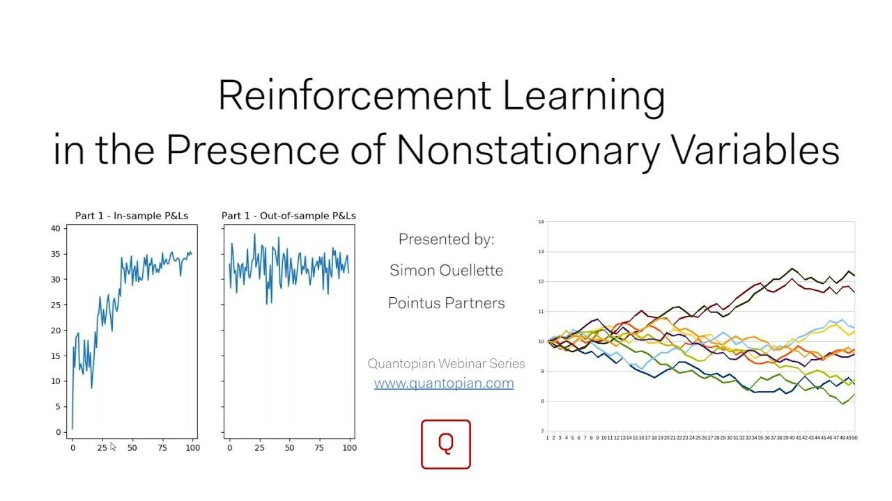

## Table of Contents

## What is nonstationarity in the context of machine learning?

Nonstationarity in machine learning refers to situations where the statistical properties of the data, such as the mean, variance, or correlation, change over time. This means that the patterns the model learns from historical data may not hold true for future data, making it challenging to build reliable predictive models. For example, if you're predicting stock prices, the factors influencing the market can change, causing the model's predictions to become less accurate over time.

To handle nonstationarity, machine learning practitioners often use techniques like time series analysis or adaptive learning methods. Time series analysis can help identify trends, seasonality, and other patterns that change over time, allowing models to adjust their predictions accordingly. Adaptive learning methods, on the other hand, continuously update the model as new data comes in, ensuring that the model remains relevant even as the underlying data distribution shifts. By recognizing and addressing nonstationarity, machine learning models can become more robust and better suited to real-world applications where data evolves over time.

## How does nonstationarity affect the performance of machine learning models?

Nonstationarity can make machine learning models less accurate over time. When the data's patterns change, a model trained on old data might not work well with new data. For example, if you're predicting the weather, the patterns can change from season to season. If your model was trained on summer data, it might not predict well in winter. This is because the relationships between variables, like temperature and humidity, can shift, making the model's assumptions outdated.

To deal with nonstationarity, you can use special techniques. One way is to use time series analysis, which looks at how data changes over time. This can help the model understand trends and seasonal changes, so it can make better predictions. Another way is to use adaptive learning, where the model keeps learning from new data as it comes in. This helps the model stay up-to-date with the latest patterns. By using these methods, you can make your machine learning models more reliable even when the data keeps changing.

## What are some common examples of nonstationary data in real-world applications?

Nonstationary data is common in many real-world situations. For example, stock prices are often nonstationary. The factors that affect stock prices, like economic news or company performance, can change over time. This means that a model trained on past stock prices might not predict future prices well because the relationships between these factors can shift. If you're trying to predict stock prices, you need to keep updating your model with the latest data to stay accurate.

Another example of nonstationary data is weather patterns. Weather changes with the seasons, so a model trained on summer data won't work well for winter. The relationships between temperature, humidity, and other weather variables change throughout the year. To predict the weather accurately, you need to consider these seasonal changes and update your model regularly. By doing this, you can make sure your predictions stay reliable even as the weather patterns evolve.

## What techniques can be used to detect nonstationarity in a dataset?

To detect nonstationarity in a dataset, one common technique is to use statistical tests like the Augmented Dickey-Fuller (ADF) test. This test checks if a time series is stationary by testing the null hypothesis that a unit root is present in the data. If the test rejects the null hypothesis, it suggests that the data is stationary. You can use Python's `statsmodels` library to perform this test. For example, if you have a time series called `data`, you can run the ADF test like this: ```python from statsmodels.tsa.stattools import adfuller result = adfuller(data) print('ADF Statistic:', result[0]) print('p-value:', result[1]) ``` If the p-value is less than a chosen significance level (like 0.05), you can conclude that the data is likely stationary.

Another way to detect nonstationarity is by using visual inspection. You can plot the time series data and look for trends or changes in the mean and variance over time. If you see clear patterns or shifts, it's a sign that the data might be nonstationary. For example, you could plot the data using a simple line plot in Python: ```python import matplotlib.pyplot as plt plt.plot(data) plt.show() ``` By examining the plot, you can see if the data's behavior changes over time, which would indicate nonstationarity. These methods help you understand if your data is changing in ways that could affect your machine learning models.

## How can one preprocess data to handle nonstationarity before model training?

To handle nonstationarity before training a model, one common approach is to use differencing. This means you take the difference between consecutive values in the time series. By doing this, you can remove trends and make the data more stationary. For example, if you have a time series called `data`, you can create a new series of differences like this: ```python diff_data = data.diff().dropna() ``` This new series, `diff_data`, is often more stationary because it removes the trend. You can then use this differenced data to train your model, making your predictions more reliable.

Another way to preprocess nonstationary data is to use normalization or standardization. These methods can help stabilize the variance of the data over time. Normalization scales the data to a fixed range, usually between 0 and 1, while standardization transforms the data to have a mean of 0 and a standard deviation of 1. You can apply these techniques using Python's `sklearn` library. For example, to standardize your data, you can do this: ```python from sklearn.preprocessing import StandardScaler scaler = StandardScaler() standardized_data = scaler.fit_transform(data.values.reshape(-1, 1)) ``` By standardizing or normalizing your data, you can make it more consistent and easier for your model to learn from, even if the original data was nonstationary.

## What are the differences between stationary and nonstationary time series data?

Stationary time series data has statistical properties that stay the same over time. This means the mean, variance, and the way the data points relate to each other don't change. For example, if you measure the daily temperature in a room that's always kept at the same setting, the data would be stationary because the average temperature, how much it varies, and how one day's temperature relates to the next day's would stay consistent. Stationary data is easier for models to work with because the patterns they learn will likely hold true in the future.

Nonstationary time series data, on the other hand, has statistical properties that change over time. This means the mean, variance, or the relationships between data points can shift. For instance, if you're looking at the daily sales of ice cream, the data would be nonstationary because sales go up in the summer and down in the winter. The average sales, how much they vary, and how one day's sales relate to the next day's would all change with the seasons. Nonstationary data can make it hard for models to predict future values because the patterns they learn from past data might not apply to new data.

## Can you explain the concept of concept drift and its relation to nonstationarity?

Concept drift is when the relationships between the input data and the target variable change over time. This means that what you're trying to predict can start to depend on different things or the same things in different ways. For example, if you're predicting how many people will buy ice cream, the factors that influence this might change from summer to winter. In summer, hot weather might be the main factor, but in winter, maybe sales promotions become more important. Concept drift is a big challenge in machine learning because it can make models that worked well in the past start to perform poorly as the world changes.

Concept drift is closely related to nonstationarity because both deal with changes in data over time. Nonstationarity refers to changes in the statistical properties of the data itself, like the mean or variance. Concept drift, on the other hand, focuses on changes in the relationship between the input data and what you're trying to predict. Both can make it hard for models to stay accurate because the patterns they learned from old data might not apply to new data. To handle these issues, you might need to keep updating your models or use special techniques that can adapt to these changes.

## What machine learning algorithms are more robust to nonstationary data?

Some machine learning algorithms are better at handling nonstationary data than others. One type of algorithm that's good at this is called online learning. Online learning algorithms update the model as new data comes in, so they can keep up with changes over time. For example, if you're predicting the weather, an online learning model can adjust its predictions as the seasons change. This makes it more reliable because it doesn't rely on old data that might not be relevant anymore.

Another type of algorithm that can handle nonstationary data well is called ensemble methods. Ensemble methods combine the predictions of several different models to make a final prediction. This can help because if one model starts to perform badly due to changes in the data, the other models can still make good predictions. For example, if you're predicting stock prices, you might use several different models that look at different factors. If the market changes and one model's predictions get worse, the other models can help keep the overall prediction accurate.

## How do online learning methods address the challenges posed by nonstationarity?

Online learning methods address the challenges of nonstationarity by continuously updating the model with new data. This means that as the data changes over time, the model can adapt and stay relevant. For example, if you're predicting how many people will buy ice cream, the factors that affect sales might change from summer to winter. An online learning model can keep learning from the latest sales data, so it knows that hot weather is more important in summer, but sales promotions might be key in winter. By doing this, the model stays accurate even when the world changes.

These methods are especially useful because they don't rely on old data that might not be relevant anymore. Instead, they focus on the most recent data, which helps them capture new patterns and trends. For instance, if you're trying to predict stock prices, the market can change quickly due to news or economic shifts. An online learning model can update its predictions as soon as new data comes in, making it more reliable than a model that only uses old data. This way, online learning helps machine learning models handle nonstationarity and stay useful over time.

## What are the advanced statistical tests used to assess nonstationarity in time series data?

Advanced statistical tests for assessing nonstationarity in time series data include the Kwiatkowski-Phillips-Schmidt-Shin (KPSS) test and the Phillips-Perron (PP) test. The KPSS test is different from the Augmented Dickey-Fuller (ADF) test because it tests the null hypothesis that the time series is stationary against the alternative that it is nonstationary. This means the KPSS test can help you find out if your data is nonstationary even if the ADF test says it's stationary. You can use the KPSS test in Python with the `statsmodels` library like this: ```python from statsmodels.tsa.stattools import kpss kpss_stat, p_value, lags, crit = kpss(data) print('KPSS Statistic:', kpss_stat) print('p-value:', p_value) ``` If the p-value is less than a chosen significance level (like 0.05), you can conclude that the data is likely nonstationary.

The Phillips-Perron (PP) test is another advanced test that, like the ADF test, checks for the presence of a unit root to determine if a time series is nonstationary. However, the PP test is more robust to certain types of autocorrelation and heteroskedasticity in the data. This makes it a good choice when you're not sure if your data meets the assumptions of the ADF test. You can run the PP test in Python using the `statsmodels` library like this: ```python from statsmodels.tsa.stattools import phillips_perron pp_stat, p_value, used_lag, crit = phillips_perron(data) print('PP Statistic:', pp_stat) print('p-value:', p_value) ``` If the p-value is less than a chosen significance level (like 0.05), you can conclude that the data is likely nonstationary. By using these advanced tests, you can get a better understanding of whether your time series data is nonstationary, which is crucial for building accurate machine learning models.

## How can ensemble methods be adapted to improve performance on nonstationary data?

Ensemble methods can be adapted to handle nonstationary data by combining different models that learn from different parts of the data. For example, you could use several models, each trained on different time periods or subsets of the data. This way, if one model starts to perform badly because the data has changed, the other models can still make good predictions. By taking the average or a weighted average of the predictions from all the models, you can get a more stable and accurate prediction that adapts to changes in the data over time.

One specific way to adapt ensemble methods for nonstationary data is to use techniques like boosting or bagging with time-based splits. For instance, you could use boosting where each new model focuses on the errors of the previous models, but you train each model on more recent data. This helps the ensemble stay up-to-date with the latest patterns in the data. Another approach is to use bagging, where you create multiple versions of your model by resampling the data with replacement, but you make sure to include more recent data in each sample. This way, the ensemble can capture the current state of the data and improve its performance on nonstationary datasets.

## What are the current research trends and future directions in handling nonstationarity in machine learning?

Current research trends in handling nonstationarity in machine learning focus on developing more adaptive and robust models. One major trend is the use of online learning algorithms that continuously update themselves with new data. These algorithms can adjust to changes in the data over time, making them more effective for nonstationary environments. Researchers are also exploring ensemble methods that combine multiple models to improve prediction accuracy. By training different models on various subsets of the data or different time periods, these ensembles can better capture the evolving patterns in nonstationary data. Another area of interest is the development of new statistical tests and methods to detect and quantify nonstationarity, such as advanced versions of the Augmented Dickey-Fuller (ADF) test and the Kwiatkowski-Phillips-Schmidt-Shin (KPSS) test.

Future directions in this field are likely to involve the integration of domain knowledge into machine learning models to better handle nonstationarity. For example, incorporating expert knowledge about how certain variables change over time can help models adapt more effectively. There is also a growing interest in developing models that can automatically detect and adapt to concept drift, where the relationship between input data and the target variable changes. This could involve creating algorithms that can identify when a model's performance starts to degrade and trigger retraining or model updates. Additionally, research into transfer learning and meta-learning could provide new ways to leverage knowledge from one task to improve performance on another, even as the data evolves. These advancements aim to make machine learning models more resilient and reliable in real-world applications where data is constantly changing.