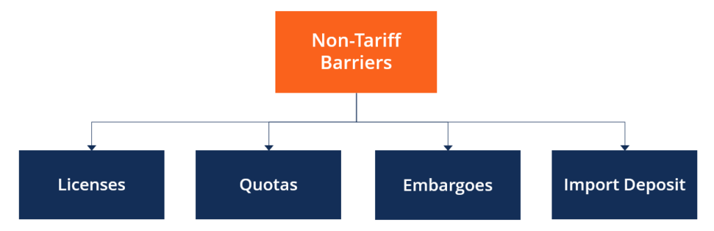

## Table of Contents

## What are nontariff barriers?

Nontariff barriers are rules and restrictions that countries use to control the amount of goods coming into their country, but they are not taxes like tariffs. These barriers can include things like quotas, which limit the number of goods that can be imported, and strict regulations that make it hard for foreign products to meet the standards needed to be sold in a country.

These barriers can protect local businesses by making it harder for foreign companies to compete. However, they can also make products more expensive for consumers and limit the choices available to them. Countries often use nontariff barriers to protect important industries, like farming or manufacturing, but they can lead to tensions between countries if they are seen as unfair.

## How do nontariff barriers differ from tariffs?

Nontariff barriers and tariffs are both ways that countries control what comes into their country, but they work differently. Tariffs are taxes that a country puts on goods coming from other countries. When a product has a tariff, it costs more for people to buy it. This can make people choose to buy things made in their own country instead. Tariffs are easy to see because they are just a price added to the cost of the product.

Nontariff barriers, on the other hand, are not about adding a tax. They are rules and limits that make it harder for goods to come into a country. For example, a country might say that only a certain number of cars can be imported each year, or they might have very strict rules about how food is made that foreign companies find hard to follow. These barriers can be harder to see than tariffs because they are not just about money, but they can still make it tough for foreign products to be sold in a country.

## What are the main mechanisms through which nontariff barriers operate?

Nontariff barriers work in different ways to control what comes into a country. One way is through quotas, which are limits on how much of a product can be imported. For example, a country might say that only 10,000 cars can be brought in from another country each year. This helps protect local car makers by making sure there aren't too many foreign cars to compete with. Another way is through strict rules and standards. These can be about safety, health, or how a product is made. If a country has very tough rules, it can be hard for foreign companies to meet them, so their products can't be sold there.

Another mechanism is through licensing requirements. This means that a company needs special permission to sell its products in a country. Getting this permission can be slow and complicated, which makes it harder for foreign products to enter the market. Also, some countries use embargoes, which are complete bans on certain goods from specific countries. This is a strong way to stop products from coming in. All these methods make it more difficult for foreign goods to compete with local products, which can help protect local businesses but can also limit choices for consumers.

## Can you list the common types of nontariff barriers?

Nontariff barriers are ways countries control what comes in without using taxes. One common type is quotas, which are limits on how much of a product can come into a country. For example, a country might say only 10,000 cars can be imported each year. Another type is strict rules and standards. These can be about safety, health, or how a product is made. If a country has very tough rules, it can be hard for foreign companies to meet them, so their products can't be sold there.

Another common nontariff barrier is licensing requirements. This means a company needs special permission to sell its products in a country. Getting this permission can be slow and complicated, which makes it harder for foreign products to enter the market. Countries also use embargoes, which are complete bans on certain goods from specific countries. This is a strong way to stop products from coming in. All these methods make it more difficult for foreign goods to compete with local products, which can help protect local businesses but can also limit choices for consumers.

## What are some examples of nontariff barriers in international trade?

Nontariff barriers are ways countries control what comes in without using taxes. One example is quotas, which are limits on how much of a product can come into a country. For instance, a country might say only 10,000 cars can be imported each year. This helps protect local car makers by making sure there aren't too many foreign cars to compete with. Another example is strict rules and standards. These can be about safety, health, or how a product is made. If a country has very tough rules, it can be hard for foreign companies to meet them, so their products can't be sold there.

Another example of nontariff barriers is licensing requirements. This means a company needs special permission to sell its products in a country. Getting this permission can be slow and complicated, which makes it harder for foreign products to enter the market. Countries also use embargoes, which are complete bans on certain goods from specific countries. For example, a country might ban all imports of beef from another country because of a disease outbreak. This is a strong way to stop products from coming in. All these methods make it more difficult for foreign goods to compete with local products, which can help protect local businesses but can also limit choices for consumers.

## How do nontariff barriers affect global trade?

Nontariff barriers can make global trade harder. They are rules and limits that countries use to control what comes into their country, but they are not taxes. When a country uses these barriers, it can be tough for foreign companies to sell their products there. For example, if a country has a limit on how many cars can be imported, it means fewer foreign cars can be sold. This can protect local businesses by making it harder for foreign companies to compete. But it can also make products more expensive for people to buy and limit the choices they have.

These barriers can also cause problems between countries. If one country thinks another country's rules are unfair, it can lead to arguments and even trade wars. For example, if a country bans all beef from another country because of a disease, the country that exports beef might get upset. This can make it harder for countries to work together and can slow down global trade. In the end, nontariff barriers can protect local jobs and industries, but they can also make trade more complicated and expensive for everyone involved.

## What are the economic implications of nontariff barriers for importing and exporting countries?

Nontariff barriers can have big effects on the economy of countries that import and export goods. For importing countries, these barriers can help protect local businesses by making it harder for foreign products to compete. This can lead to more jobs and money staying in the country. But it can also mean that people have to pay more for products because there are fewer choices, and it can slow down how fast new ideas and technology come into the country. This can make the economy grow slower over time.

For exporting countries, nontariff barriers can make it tough to sell their products in other countries. This can hurt their businesses and lead to fewer jobs and less money coming in. It can also make it harder for these countries to grow their economy because they can't reach as many markets. If many countries use these barriers, it can lead to trade fights and make it even harder for countries to work together and trade with each other. This can slow down global trade and affect the economy of many countries.

## How can nontariff barriers be measured and quantified?

Measuring and quantifying nontariff barriers can be tricky because they are not as straightforward as tariffs, which are just taxes on goods. One way to measure them is by looking at how much they increase the cost of importing goods. Economists might use something called the "ad valorem equivalent," which is a way to turn the effect of a nontariff barrier into a percentage, like a tax. For example, if a quota on cars makes them 10% more expensive to import, that 10% is the ad valorem equivalent of the quota.

Another way to quantify nontariff barriers is by looking at how they affect the amount of trade between countries. Researchers might compare the actual trade between two countries with what trade would be like if there were no barriers. This can show how much trade is being held back by these rules and limits. They might also use surveys and data to see how often businesses run into these barriers and how much time and money it takes to deal with them. This gives a clearer picture of how nontariff barriers affect global trade and the economy.

## What are the legal frameworks governing nontariff barriers at the international level?

Nontariff barriers are controlled by international rules to make sure trade is fair. The main group that sets these rules is the World Trade Organization (WTO). The WTO has agreements like the General Agreement on Tariffs and Trade (GATT) and the Agreement on Technical Barriers to Trade (TBT). These agreements say that countries should not use nontariff barriers to unfairly stop other countries from trading. They also say that any rules or standards should be clear and fair, and countries should work together to make sure trade is not too hard.

Another important set of rules comes from regional trade agreements. These are deals between groups of countries, like the European Union (EU) or the North American Free Trade Agreement (NAFTA), now known as the United States-Mexico-Canada Agreement (USMCA). These agreements often have their own rules about nontariff barriers to make trade easier within the group. They might say that countries in the group should not use certain types of barriers against each other. Both the WTO and these regional agreements help make sure that nontariff barriers do not hurt global trade too much.

## How do countries justify the use of nontariff barriers?

Countries often say they use nontariff barriers to protect their own businesses and people. They might argue that these rules help keep local jobs safe by making it harder for foreign companies to sell too many products in their country. For example, a country might limit how many cars can be imported to help their own car makers. They also say that strict standards can protect people's health and safety. If a country has tough rules about how food is made, they might say it's to make sure the food is safe to eat.

However, these barriers can also be used for other reasons. Sometimes, countries use them to get back at other countries during trade fights. They might ban certain goods from a country they are not getting along with. Also, some countries might use these barriers to help their own big companies by making it hard for smaller foreign companies to compete. While countries often say these barriers are for good reasons, other countries might see them as unfair and think they hurt global trade.

## What strategies can businesses use to navigate or mitigate the impact of nontariff barriers?

Businesses can use different strategies to deal with nontariff barriers. One way is to learn about the rules and standards of the country they want to sell in. If they know what the rules are, they can change their products to meet them. For example, if a country has strict safety rules for toys, a toy company can make sure their toys meet those rules before trying to sell them there. Another way is to work with local partners. Local companies know the rules and can help a foreign company get the right licenses and follow the right steps. This can make it easier to sell products in a new country.

Another strategy is to use trade agreements. Many countries have deals with other countries that make it easier to trade. If a business can use these agreements, it can sometimes avoid some nontariff barriers. For example, if two countries have a deal that lets them trade cars more easily, a car company from one country can sell cars in the other country without facing as many barriers. Businesses can also talk to the government of the country they want to sell in. Sometimes, if a business can show that a barrier is unfair, the government might change the rules. This can take a lot of time and work, but it can help in the long run.

## What are the current trends and future outlook for nontariff barriers in global trade?

Nontariff barriers are becoming more common in global trade. Countries are using more rules and standards to control what comes into their country. This is happening because countries want to protect their own businesses and make sure products are safe. Also, with more trade happening around the world, countries are using these barriers to get an advantage in trade fights. For example, a country might use strict rules to stop another country from selling too many products there. This trend is making global trade more complicated and can slow it down.

In the future, nontariff barriers might become even more important. As countries keep trying to protect their own industries, they might use more and different kinds of barriers. This could lead to more trade fights and make it harder for businesses to sell their products in other countries. However, there is also a push to make trade easier. Groups like the World Trade Organization are working to make rules clearer and fairer. If countries can work together better, they might be able to reduce some of these barriers and make global trade smoother.

## References & Further Reading

[1]: Non-Tariff Measures: Economic Assessment and Policy Options for Development (UNCTAD). ["UNCTAD Non-Tariff Measures."](https://unctad.org/publication/non-tariff-measures-economic-assessment-and-policy-options-development)

[2]: Bown, C. P. (2015). ["The World Trade Organization and Import Tariffs."](https://www.jstor.org/stable/resrep29885.6) Journal of Economic Perspectives, 27(1), 121–146.

[3]: Duval, R., & Utoktham, C. (2014). ["The Role of NTMs in ASEAN: Behind-the-Border Issues to Overcome."](https://www.unescap.org/sites/default/files/Staff%20Working%20Paper%2004-14_0.pdf) MPRA Paper No. 57245.

[4]: Lokanan, M. E. (2019). ["Algorithmic Trading and the Financial Markets."](https://www.emerald.com/insight/content/doi/10.1108/s1041-706020190000021004/full/html) Heliyon, 6(1).

[5]: Baldwin, R. E. (2000). ["Regulatory Protectionism, Developing Nations, and a Two-Tier World Trade System."](https://www.researchgate.net/publication/4838811_Regulatory_Protectionism_Developing_Nations_and_a_Two-Tier_World_Trade_System) Brookings Trade Forum, 2000, 237-293.