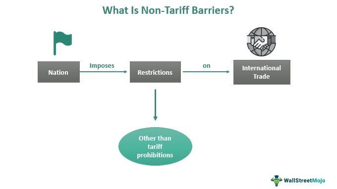

In the intricate world of international trade, non-tariff barriers (NTBs) are increasingly shaping the trade landscape alongside algorithmic trading, a major force in financial markets. NTBs, often manifesting as quotas, embargoes, and licensing requirements, exert significant influence over the flow of goods between nations. This article explores the nature of non-tariff barriers, their various forms, and their implications for global trade dynamics. By limiting the flow of goods and services, NTBs create market inefficiencies and drive up consumer prices, potentially reducing available choices.

Algorithmic trading, which utilizes complex algorithms to optimize trading decisions, is simultaneously affected by these trade restrictions. Changes in market liquidity, volatility, and risk management arising from NTBs necessitate adaptable and resilient trading strategies. As a result, understanding the interface between NTBs and algorithmic trading is crucial for comprehending contemporary trade dynamics and refining economic strategies to navigate these challenges.



Solutions to overcome NTBs are also discussed, highlighting strategies such as market diversification, local collaboration, and the use of technology and data analytics. By effectively managing NTBs, businesses can not only combat these challenges but also leverage them as opportunities for competitive advantage. Thus, this discourse reveals insights into potential strategies for enhancing international trade efficiency and sustaining economic growth.

## Table of Contents

## What Are Non-Tariff Barriers?

Non-tariff barriers (NTBs) are regulatory measures used by countries to control the import and export of goods through means other than traditional tariffs. Unlike tariffs, which impose financial charges directly on imported goods, NTBs encompass a broad range of restrictions, such as quotas, embargoes, sanctions, and trade licenses. These measures are used to influence the flow of goods across borders.

Quotas are a common form of NTB, setting limits on the quantity of specific goods that can be imported or exported during a given timeframe. This can affect supply and demand dynamics within domestic markets, often resulting in alterations to pricing structures and market competition. For instance, importing a maximum of a fixed number of automotive vehicles annually can protect a local car industry, even if it causes price increases due to restricted supply.

Embargoes serve as official bans on trade with specific countries. These can be driven by foreign policy objectives, often as a response to political tensions or human rights issues. Such restrictions can have significant implications for international relations and the global trade environment.

Trade licenses are another prevalent form of NTB. They require businesses to obtain government permits to engage in the trade of certain goods. This layer of regulation can introduce significant administrative overheads, creating potential delays and increased transaction costs. Compliance with licensing requirements often necessitates a thorough understanding of both domestic and international regulations.

Sanctions are strategic NTBs employed to restrict the ability of certain countries to participate in international trade. Often used as a diplomatic tool, sanctions aim to pressure nations into changing particular policies or behaviors by limiting their economic capabilities.

NTBs are frequently utilized to achieve specific political and economic objectives, heavily influenced by a nation's internal and external policies and alliances. These barriers often address concerns such as protecting nascent industries, ensuring national security, or upholding environmental standards.

Unlike straightforward tariffs, NTBs require significant compliance efforts, often due to their complexity involving multiple regulatory layers. The intricacies of NTBs demand a deep understanding of both local and international law, creating a unique set of challenges for businesses operating in the global market. Consequently, navigating NTBs requires meticulous planning and adaptation to maintain efficient trade operations amidst evolving regulatory landscapes.

## Types of Non-Tariff Barriers

Non-tariff barriers (NTBs) are tools used by countries to control trade other than traditional tariffs. They take various forms that can significantly influence the flow and accessibility of goods across borders. Understanding different types of NTBs is crucial to recognizing their impact on international trade dynamics.

**Quotas**

Quotas limit the quantity or value of goods that can be imported or exported during a specified timeframe. By imposing quotas, countries can protect domestic industries from foreign competition, maintain balance of payments, and control the supply and demand dynamics in their markets. Quotas are often used to restrict the import of agricultural products to protect local farmers. For example, a country might place a quota on the number of cars that can be imported annually to support its local automotive industry.

**Embargoes**

Embargoes are official bans on trade with specific countries. These are often enacted for political reasons, such as to express disapproval of a country's policies or actions or to exert pressure on its government to change certain practices. The impact of embargoes on international trade can be substantial, literally stopping the exchange of goods and disrupting established trade routes and partnerships. A notable example is the United States embargo against Cuba, which has lasted for decades and significantly affected trade relations between the two nations.

**Licensing**

Licensing requires businesses to secure government permits to trade specific goods. This added layer of regulation ensures that the trade meets certain standards and complies with national or international regulations. While licensing can prevent the entry of harmful or substandard products into a country, it often results in bureaucratic delays and increased transaction costs. For instance, pharmaceutical products typically require stringent licensing procedures to ensure their safety and efficacy before they can be marketed in different regions.

**Sanctions**

Sanctions are punitive measures that limit a country's ability to engage in certain trade activities and are often used to achieve foreign policy objectives. They can target specific sectors, individuals, or entities and vary in scope and severity. For example, sanctions can restrict the export of dual-use technologies, which can be used for both civilian and military purposes, to countries perceived as threats to national security. While sanctions intend to influence political behavior, they can also lead to unintended economic consequences, affecting not only the target country but also its trading partners.

These non-tariff barriers, while often imposed with the intent of achieving specific policy goals, can significantly alter trade patterns by restricting the free movement of goods and services. Understanding the types and implications of NTBs is essential for businesses and policymakers aiming to navigate the complexities of international trade.

## How Non-Tariff Barriers Impact International Trade

Non-tariff barriers (NTBs) can have profound impacts on international trade by disrupting the seamless flow of goods and services across borders. These barriers tend to create market inefficiencies by imposing restrictions that limit the availability of foreign products and services, thus potentially driving up prices for consumers. This increment in cost can be attributed to several factors intrinsic to NTBs.

Firstly, NTBs may necessitate businesses to adjust their operations to meet diverse international regulations and standards. Such compliance often requires significant investment in both time and resources, thus elevating operating costs. For example, a company might have to alter its product specifications or production processes to align with the regulatory requirements of different countries, which can be both costly and complex.

Moreover, the restriction on the free movement of goods can lead to limited competition in domestic markets. Local producers may face reduced competition from international players, resulting in decreased pressure to innovate or maintain competitive pricing. As a result, consumers might encounter higher prices and fewer choices, ultimately impacting their welfare.

Despite these negative aspects, NTBs can also play essential roles in addressing critical non-economic issues, such as public safety and national security. For instance, import restrictions on certain goods might be necessary to protect citizens from harmful products or safeguard critical national industries. Similarly, standards for environmental protection and public health ensure that imported goods do not compromise a country’s ecological and health standards.

Overall, while NTBs can hinder international trade efficiency and elevate costs, they also serve as important tools for safeguarding national interests. Businesses and policymakers must, therefore, navigate these complex barriers to balance trade liberalization with the protection of national priorities.

## Algorithmic Trading and Trade Restrictions

Algorithmic trading, a transformative force in financial markets, utilizes sophisticated algorithms and computational models to automate trading decisions. This method leverages speed, precision, and the ability to process large datasets to execute trades at fractions of a second, minimizing human error and maximizing efficiency. However, the presence of non-tariff barriers (NTBs) introduces complexities that can significantly influence the performance and strategy of [algorithmic trading](/wiki/algorithmic-trading) systems.

Non-tariff barriers, by altering market conditions and regulations, can impact core aspects of algorithmic trading such as market [liquidity](/wiki/liquidity-risk-premium), [volatility](/wiki/volatility-trading-strategies), and risk management. When NTBs are imposed, they can restrict the supply and demand dynamics of certain commodities or financial instruments, which subsequently affects market liquidity. For instance, a sudden restriction on the export of a commodity due to a non-tariff barrier can lead to a liquidity crunch in markets where that commodity is heavily traded.

Volatility is another aspect that is directly impacted by non-tariff barriers. The introduction or removal of NTBs can lead to sudden price swings, as market participants react to the new trading conditions. For algorithmic trading, which often relies on historical data to predict price movements, such unexpected changes can pose significant challenges. Algorithms need to [factor](/wiki/factor-investing) in these potential disruptions to avoid substantial losses during periods of heightened volatility.

Risk management in algorithmic trading strategies must also accommodate the uncertainties introduced by NTBs. Traditional models, which might assume a certain level of stability in trade regulations, need to be updated to reflect the potential for sudden regulatory changes. This requires algorithms to be adaptive, integrating real-time data to modify their trading strategies in response to NTBs.

To effectively navigate these challenges, traders incorporating algorithmic strategies must consider the influence of NTBs on market dynamics. Algorithms should be developed with the capability to respond to policy changes. This can be achieved by incorporating adaptive [machine learning](/wiki/machine-learning) techniques that can evaluate and react to the implications of NTBs. For example, utilizing Python for developing machine learning models helps in dynamically updating strategies based on news feeds and regulatory changes. 

```python
import pandas as pd
from sklearn.linear_model import LinearRegression

# Example of how machine learning can be used to adapt to changing market conditions
# Generate synthetic data representing market conditions with NTBs
data = pd.DataFrame({
    'market_condition': [1, 2, 3, 4, 5],
    'price_volatility': [3.1, 3.6, 4.0, 4.8, 5.5]
})

# Linear regression to model the impact of market conditions on volatility
model = LinearRegression()
model.fit(data[['market_condition']], data['price_volatility'])

# Example: Predict volatility for a new market condition
new_condition = pd.DataFrame({'market_condition': [6]})
predicted_volatility = model.predict(new_condition)
print(f"Predicted Price Volatility for condition 6: {predicted_volatility[0]}")
```

This Python code demonstrates a simple predictive model that can be expanded with more complex algorithms to monitor and react to changes in NTBs, ensuring that trading strategies remain effective amid evolving global trade landscapes.

As such, traders need to continuously monitor regulatory environments and update their algorithms to mitigate risks associated with non-tariff barriers. Ensuring compliance and optimizing profit margins in the context of NTBs necessitates a strategic blend of technology, data analytics, and a deep understanding of international trade dynamics.

## Strategies to Overcome Non-Tariff Barriers

To effectively navigate the complexities of non-tariff barriers (NTBs), businesses can employ a variety of strategies aimed at mitigating risks and ensuring seamless trade operations.

Diversification is a crucial strategy in distributing market exposure and mitigating risks associated with NTBs. By expanding operations and markets across multiple countries, businesses can reduce their dependency on a single market or geographic region. This reduces vulnerability to local trade restrictions and policy shifts. For instance, a company exporting goods to multiple countries can offset potential losses in one region with gains in another, thereby stabilizing overall financial performance.

Collaborating with local partners provides businesses with local market intelligence and insights into regulatory environments, which are essential for navigating complex trade barriers. Local partners can offer support in understanding and complying with domestic regulations and standards, thereby reducing the time and resources required for compliance. This partnership approach can also foster goodwill and improve business relationships in target markets, enhancing operational efficiency.

Engaging with government bodies is a proactive measure that allows businesses to advocate for trade facilitation practices and negotiate favorable terms. This engagement can occur through lobbying, participation in trade associations, or direct dialogue with policymakers to influence the shaping of trade policies. By voicing business concerns and suggesting practical solutions, companies can help design trade regulations that are more accommodating to international business operations.

Finally, leveraging technology and data analytics can significantly enhance a company's ability to comply with NTBs. Advanced analytics can be used to monitor changes in trade regulations, assess compliance risks, and optimize supply chain management. For example, the use of machine learning algorithms can help predict future policy changes and adapt supply chain strategies accordingly. Python, being a versatile programming language, can be used to develop models and analyze data effectively. For instance:

```python
import pandas as pd
from sklearn.ensemble import RandomForestClassifier

# Sample dataset of trade policies and outcomes
data = pd.DataFrame({
    'policy_change': [1, 0, 1, 0, 1],
    'market_impact': [0, 1, 1, 0, 1],
    'compliance_success': [1, 0, 1, 1, 1]
})

# Train a random forest model to predict compliance success
features = data[['policy_change', 'market_impact']]
target = data['compliance_success']
model = RandomForestClassifier()
model.fit(features, target)

# Predict compliance success for a new policy change scenario
new_scenario = pd.DataFrame({'policy_change': [1], 'market_impact': [0]})
prediction = model.predict(new_scenario)
```

Employing such technological solutions ensures that businesses remain agile and adaptive to the ever-evolving trade landscape, ultimately enhancing their capacity to comply with NTBs efficiently. These strategies collectively enable businesses to thrive amidst the challenges posed by non-tariff barriers, securing competitive advantages in international trade.

## Conclusion

Non-tariff barriers (NTBs) are integral to contemporary international trade, compelling businesses to navigate complex regulatory landscapes. These barriers, encompassing quotas, sanctions, and licensing requirements, pose significant challenges but also present opportunities for gaining competitive advantages. Companies that adeptly understand NTBs and develop strategic approaches can distinguish themselves in the global market. 

Algorithmic trading, a pivotal component of modern financial markets, must evolve to accommodate these barriers. Changes in trade policies and NTBs can affect market liquidity and volatility, necessitating algorithms that are robust and adaptable. By integrating considerations of NTBs into their models, traders can manage risks more effectively and seize opportunities arising from policy shifts.

Balancing compliance with innovative strategies is crucial for success in an environment where NTBs and algorithmic trading intersect. Businesses that leverage technology and data analytics to streamline compliance processes can better position themselves in the market. By fostering collaboration with local partners and engaging with governmental bodies to promote trade facilitation, companies can not only overcome NTBs but also thrive. As international trade continues to evolve, the interplay between NTBs and algorithmic trading will remain a decisive factor in shaping economic outcomes.

## References & Further Reading

[1]: Non-Tariff Measures: Economic Assessment and Policy Options for Development (UNCTAD). ["UNCTAD Non-Tariff Measures."](https://unctad.org/publication/non-tariff-measures-economic-assessment-and-policy-options-development)

[2]: Bown, C. P. (2015). ["The World Trade Organization and Import Tariffs."](https://www.jstor.org/stable/resrep29885.6) Journal of Economic Perspectives, 27(1), 121–146.

[3]: Duval, R., & Utoktham, C. (2014). ["The Role of NTMs in ASEAN: Behind-the-Border Issues to Overcome."](https://www.unescap.org/sites/default/files/Staff%20Working%20Paper%2004-14_0.pdf) MPRA Paper No. 57245.

[4]: Lokanan, M. E. (2019). ["Algorithmic Trading and the Financial Markets."](https://www.emerald.com/insight/content/doi/10.1108/s1041-706020190000021004/full/html) Heliyon, 6(1).

[5]: Baldwin, R. E. (2000). ["Regulatory Protectionism, Developing Nations, and a Two-Tier World Trade System."](https://www.researchgate.net/publication/4838811_Regulatory_Protectionism_Developing_Nations_and_a_Two-Tier_World_Trade_System) Brookings Trade Forum, 2000, 237-293.