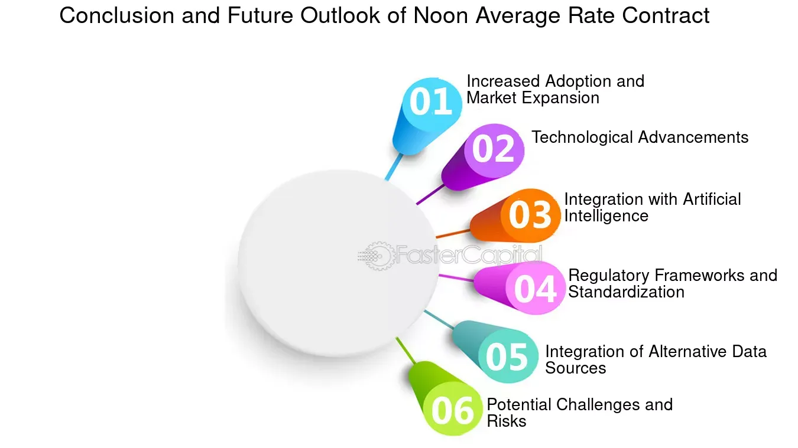

## Table of Contents

## What is a Noon Average Rate Contract?

A Noon Average Rate Contract, often called a NARC, is a type of energy contract used by businesses. It helps them buy electricity at a better price. The contract uses the average price of electricity at noon each day over a certain period, like a month or a year. This average noon price becomes the rate the business pays for their electricity.

Using a NARC can be good for businesses because noon is usually when electricity prices are lower. By locking in this lower average rate, businesses can save money on their energy bills. However, it's important for businesses to understand how these contracts work and to check if a NARC will really save them money based on their energy use and the market conditions.

## How does a Noon Average Rate Contract differ from other types of contracts?

A Noon Average Rate Contract, or NARC, is different from other types of energy contracts because it uses the average price of electricity at noon each day to set the rate. Most other contracts might use different times of the day or even the whole day's average price. For example, some contracts might use peak hours, which are usually in the evening when demand is high, to set the rate. This can lead to higher costs because electricity is more expensive during peak times. With a NARC, businesses can take advantage of lower noon prices, which can help them save money on their energy bills.

Another way a NARC differs from other contracts is in how it calculates the final rate. While some contracts might lock in a fixed rate for the entire term of the contract, a NARC calculates the rate based on a specific time each day over a set period. This means the rate can change from month to month or year to year depending on the average noon prices during that time. Other contracts might also have variable rates, but they might be based on different factors, like the overall market price or the cost of the energy source. This makes a NARC unique because it focuses specifically on noon prices, which are often lower and more stable.

## What are the key components of a Noon Average Rate Contract?

A Noon Average Rate Contract, or NARC, has a few main parts that make it work. The first key part is the time it uses to set the rate. A NARC looks at the price of electricity at noon each day. This is important because noon is often when electricity prices are lower than at other times of the day. The contract takes the average of these noon prices over a set period, like a month or a year, to decide what the business will pay for their electricity.

The second key part is the period over which the average is calculated. This could be a month, a quarter, or a year. The length of this period can affect how much the rate changes from one period to the next. A longer period might give a more stable rate, while a shorter period might show more changes in the rate. The last key part is the contract term, which is how long the business agrees to use the NARC. This can be different lengths of time, and it's important for the business to think about how long they want to be locked into this type of contract.

## Who typically uses Noon Average Rate Contracts?

Noon Average Rate Contracts, or NARCs, are often used by businesses that want to save money on their electricity bills. These businesses might be in industries where they use a lot of electricity, like manufacturing or data centers. They choose NARCs because they can take advantage of lower electricity prices at noon, which can help them pay less for their energy over time.

Some businesses might also use NARCs if they have flexible energy needs. This means they can shift some of their electricity use to noon when prices are lower. By doing this, they can make the most of the NARC and save even more money. Overall, NARCs are a good choice for businesses that want to manage their energy costs better and take advantage of lower noon prices.

## What are the benefits of using a Noon Average Rate Contract?

Using a Noon Average Rate Contract, or NARC, can help businesses save money on their electricity bills. This is because the contract uses the average price of electricity at noon each day, which is often lower than at other times. By locking in this lower rate, businesses can pay less for their energy over time. This can be especially helpful for businesses that use a lot of electricity, like factories or data centers, because even small savings per unit can add up to a lot of money.

Another benefit of a NARC is that it can help businesses with flexible energy needs. If a business can shift some of its electricity use to noon, it can take even better advantage of the lower rates. This flexibility can lead to more savings and better energy management. Overall, a NARC can be a smart choice for businesses looking to control their energy costs and make the most of lower noon prices.

## What are the potential risks associated with Noon Average Rate Contracts?

One risk of using a Noon Average Rate Contract, or NARC, is that the average noon price might not always be lower than other times of the day. If electricity prices at noon go up a lot, the business could end up paying more than they would with a different type of contract. This means the savings they were hoping for might not happen, and they could even lose money.

Another risk is that the contract term might not match the business's needs. If a business signs a long-term NARC and the market changes, they might be stuck paying a rate that's no longer good for them. This can make it hard for the business to switch to a better deal if one comes along. It's important for businesses to think carefully about how long they want to be locked into a NARC and to keep an eye on the market to make sure it's still a good choice for them.

## How is the noon rate calculated in these contracts?

The noon rate in a Noon Average Rate Contract, or NARC, is calculated by looking at the price of electricity at noon each day. The contract takes the price at noon and adds it up over a set period, like a month or a year. Then, it divides this total by the number of days in that period to find the average noon price. This average noon price becomes the rate that the business pays for their electricity.

Sometimes, the way the noon rate is calculated can be a bit different. For example, the contract might only use business days or might skip certain days like holidays. It's important for businesses to know exactly how their NARC calculates the noon rate so they can understand what they will be paying. By knowing this, they can make sure the NARC is a good choice for them and that they are getting the savings they expect.

## Can you explain the process of entering into a Noon Average Rate Contract?

When a business wants to enter into a Noon Average Rate Contract, or NARC, they first need to find an energy supplier that offers this type of contract. They can do this by talking to different energy companies or working with an energy broker who can help them find the best deal. Once they find a supplier, the business will need to look at the details of the NARC, like how long the contract lasts and how the noon rate is calculated. It's important for the business to understand all these details so they know what they are agreeing to.

After the business decides that a NARC is right for them, they will sign the contract with the energy supplier. This means they agree to buy their electricity at the average noon rate for the length of the contract. The business will then start getting their electricity at this rate, and they will need to keep an eye on their bills to make sure they are getting the savings they expected. If anything changes, like the market prices or their energy needs, the business should talk to their supplier to see if they need to make any changes to the contract.

## What are the common terms and conditions found in Noon Average Rate Contracts?

Noon Average Rate Contracts, or NARCs, usually have some common terms and conditions that businesses need to know. One important term is the contract length, which can be a few months or even a few years. The business agrees to buy electricity at the average noon rate for this whole time. Another term is how the noon rate is calculated. The contract will say if it uses all days, just business days, or if it skips holidays. It's important for the business to understand this so they know what they will be paying.

Another common condition is about early termination. If a business wants to end the contract early, they might have to pay a fee. This is to make sure the business thinks carefully before signing the contract. The contract might also have rules about how often the rate can change. For example, it might say the rate is set every month or every year based on the average noon prices during that time. By knowing these terms and conditions, businesses can make sure a NARC is a good choice for them and that they understand what they are agreeing to.

## How do market conditions affect Noon Average Rate Contracts?

Market conditions can change how much a business pays for electricity with a Noon Average Rate Contract. If the price of electricity at noon goes up a lot, the average noon rate will be higher. This means the business might pay more than they expected. On the other hand, if the noon prices stay low or go down, the business can save more money. So, it's important for businesses to keep an eye on the market to see if a NARC is still a good choice for them.

Sometimes, big changes in the market can make a NARC less helpful. For example, if there's a big increase in the cost of making electricity, the noon prices might go up a lot. If a business is locked into a long-term NARC, they might be stuck paying these higher prices. This is why it's a good idea for businesses to think about how long they want their contract to last and to be ready to change their energy plan if the market changes a lot.

## What strategies can be used to manage or hedge risks in Noon Average Rate Contracts?

One way to manage risks in Noon Average Rate Contracts is to keep an eye on the market. If a business knows what's happening with electricity prices, they can decide if a NARC is still a good choice. If they see that noon prices are going up a lot, they might want to think about switching to a different type of contract before they get locked into paying too much. Another way to manage risks is to choose a shorter contract term. This means the business won't be stuck with a NARC for too long if the market changes. They can then look for a better deal when the contract ends.

Another strategy is to use energy at the right times. If a business can move some of its electricity use to noon, they can take better advantage of the lower noon rates. This can help them save more money and make the NARC work better for them. Also, businesses can talk to their energy supplier about adding some flexibility to the contract. This might mean they can change the contract if the market changes a lot, which can help them avoid paying too much if noon prices go up.

## What are some real-world examples or case studies of Noon Average Rate Contracts in action?

A manufacturing company in the Midwest decided to use a Noon Average Rate Contract to save money on their electricity bills. They found that their energy use was high during the day, and they could shift some of it to noon when prices were lower. By signing a NARC, they locked in a lower average rate for their electricity. Over the next year, they saw their energy costs go down by about 10%. This helped them save money and invest more in their business.

Another example is a data center in California that used a NARC to manage their high electricity needs. They knew that electricity prices at noon were usually lower than at other times, so they chose a NARC to take advantage of this. The contract was for two years, and during that time, the data center was able to keep their energy costs stable even when the market prices went up. This gave them peace of mind and helped them plan their budget better.

## References & Further Reading

[1]: Tharp, V. K. (1998). ["Trade Your Way to Financial Freedom"](https://www.amazon.com/Trade-Your-Way-Financial-Freedom/dp/007147871X) McGraw-Hill Education.

[2]: Chan, Ernest P. (2013). ["Algorithmic Trading: Winning Strategies and Their Rationale"](https://github.com/ftvision/quant_trading_echan_book) Wiley.

[3]: Geman, H. (2005). ["Commodities and Commodity Derivatives: Modelling and Pricing for Agriculturals, Metals and Energy."](https://download.e-bookshelf.de/download/0000/5675/90/L-G-0000567590-0015270354.pdf) Wiley Finance.

[4]: King, M. (2010). ["The Microstructure Approach to Exchange Rates"](https://www.researchgate.net/publication/256064522_The_Market_Microstructure_Approach_to_Foreign_Exchange_Looking_Back_and_Looking_Forward) The MIT Press.

[5]: Hull, J. C. (2014). ["Options, Futures, and Other Derivatives"](https://www.amazon.com/Options-Futures-Other-Derivatives-9th/dp/0133456315) Prentice Hall.