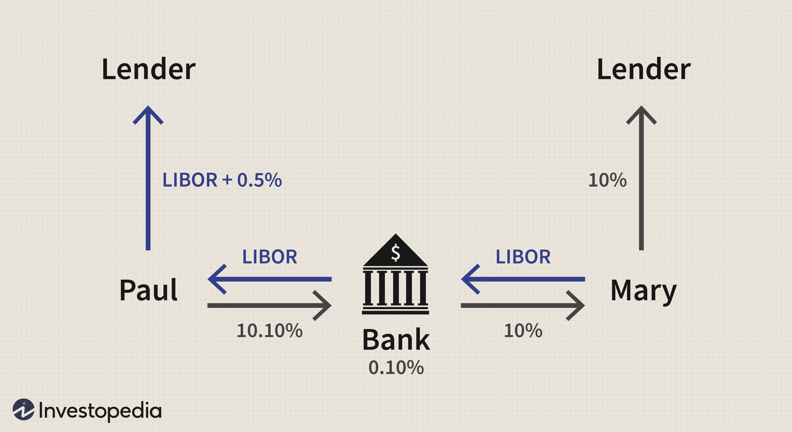

The financial world is consistently undergoing transformation, marked by the development of various instruments and contracts that cater to risk management and profit-maximization strategies. Among these tools, the Noon Average Rate Contract (NARC) played a significant role in currency markets over the years. NARC was particularly pivotal as it allowed participants to engage in currency forward contracts using a fixed reference point: the noon exchange rates, primarily between the U.S. and Canadian dollars. This fixed rate mechanism enabled businesses and traders to stabilize potential currency exchange risks.

The advent of algorithmic trading, which leverages advanced algorithms to automate trading decisions and execute them at optimal times, has further underscored the importance of understanding historical financial instruments such as NARC. These algorithms are critical in modern trading as they enhance the precision and speed of transactions while minimizing human error and emotional biases. In this context, the principles underlying contracts like NARC become increasingly relevant as they inform the development of sophisticated trading models that incorporate risk management strategies.



This article provides a detailed exploration of the Noon Average Rate Contract, examining its historical context and relevance alongside other average rate contracts. Readers will gain insights into how NARC once influenced the financial markets and how the essence of its concepts can still be applied to address contemporary challenges in trading strategies, especially in the era of algorithmic trading. Through this understanding, investors and businesses can better navigate today's financial landscape, recognizing the legacy of past financial instruments while adopting innovative approaches for future market engagements.

## Table of Contents

## Understanding Noon Average Rate Contracts (NARC)

Noon Average Rate Contracts (NARC) were financial instruments used primarily in currency markets, facilitating foreign exchange transactions involving the United States dollar (USD) and the Canadian dollar (CAD). These contracts were designed to employ the official exchange rate established at noon, thus providing a consistent and known rate for the parties involved in the transaction.

The concept of NARC emerged due to the need for mitigating foreign exchange (forex) risks that businesses and investors faced in the volatile currency market. By locking in currency exchange rates based on the noon average, the NARC provided a method to forecast and manage potential risks associated with currency fluctuations. This system was notably utilized for transactions between the USD and CAD, two currencies that frequently engage in substantial trading volumes.

The noon rates, upon which these contracts were based, were published by the Bank of Canada. These rates represented a snapshot of currency values at a specific time each day, offering a standardized reference point for settlement. The primary advantage of using noon rates was their ability to provide a fair and transparent exchange rate that both parties could agree upon ahead of any significant market changes that could occur throughout the trading day.

From the mid-1990s to 2017, businesses engaged heavily with NARCs to hedge against unexpected currency fluctuations by ensuring a fixed exchange rate was applied to their transactions. In practice, this meant that if the market exchange rate at the time of settlement differed from the rate locked in the NARC, the parties involved could calculate the difference and settle the consequent financial obligations in cash.

In 2017, the Bank of Canada shifted from using fixed noon rates to continuously updated exchange rates. This change was primarily driven by advancements in technology and the need for more up-to-date rate mechanisms that reflect real-time market conditions more accurately. The transition marked the end of NARCs, as the currency market now required tools and contracts that could operate with continuous updates, thereby increasing transparency and reducing the risks of [arbitrage](/wiki/arbitrage).

Understanding how NARC operated highlights the importance of benchmarks in currency trading. The noon average rate was essential for setting standards and reducing discrepancies between predicted and actual currency values. Although NARC is no longer active, its framework underscores critical aspects of [forex](/wiki/forex-system) risk management and offers insights into the evolving nature of financial contract design.

## Key Features of NARC

Noon Average Rate Contracts (NARC) were established as a financial tool to provide stability and predictability in currency exchange, particularly focusing on the U.S. and Canadian dollar trading. One of the primary features of a NARC was its provision of a fixed exchange rate reference, which was crucial for businesses engaged in international trade. This fixed rate originated from the official noon exchange rates published by the Bank of Canada. By using these noon rates, businesses and traders could manage foreign exchange risks more effectively by locking in rates for future transactions, irrespective of market [volatility](/wiki/volatility-trading-strategies).

Another significant feature of NARCs was their daily mark-to-market adjustment. This process involved recalculating the value of the contract at the end of each trading day based on current market rates. The adjustment allowed parties to recognize and manage the financial impact of currency fluctuations promptly. Essentially, the contract value was aligned daily with the prevailing exchange rates, ensuring that any changes in the market were immediately reflected in the contract's financial standing.

Moreover, NARCs offered substantial hedging opportunities, enabling parties to mitigate potential losses from adverse currency movements. If, at the time of settlement, the actual exchange rates differed from those specified in the contract, the parties involved could settle the discrepancies in cash. This mechanism provided a level of financial security and cash flow predictability, allowing businesses to focus more on their operational strategies without the overhang of unexpected currency expense variations.

By providing a structured approach to managing currency exchange risks, NARCs played a pivotal role in financial planning and operational security for businesses engaged in cross-border transactions between the U.S. and Canada. Their features of fixed exchange rate references, daily market alignment, and cash settlement options made them a practical tool for currency risk management during their period of use.

## Benefits and Drawbacks of NARC

Noon Average Rate Contracts (NARCs) offered several benefits to businesses engaged in foreign exchange transactions. By providing a fixed exchange rate reference at noon, these contracts enabled companies to predict and manage costs effectively. This predictability was crucial for budgeting and financial planning, particularly for businesses with cross-border operations. The use of a stable noon rate helped mitigate the effect of volatile currency market conditions, providing a degree of certainty and stability in financial transactions. This stability was particularly beneficial during periods of economic uncertainty or when market conditions were unpredictable.

However, there were notable drawbacks to NARCs. Their reliance on a specific timing—the noon rate—meant that they could overlook significant currency market movements occurring outside that predetermined window. This timing constraint posed a risk, as significant events or announcements in global markets could cause substantial fluctuations in exchange rates that the noon rate could not capture. Businesses using NARCs might have found themselves unprotected against abrupt currency value changes occurring after the noon rate was set, potentially impacting their financial outcomes.

Overall, while Noon Average Rate Contracts provided a stable framework for managing foreign exchange risks, their timing limitation required businesses to weigh the benefits of predictability against the risk of missed market movements.

## Algorithmic Trading and Average Rate Contracts

Algorithmic trading has revolutionized financial markets, leveraging computational power to analyze vast datasets and execute trades at speeds far surpassing human capabilities. Central to its efficacy is the use of average rate contracts (ARC), which provide a mechanism for smoothing volatility and managing risk over specific periods.

Average rate contracts calculate the average price of an asset over a set duration, rather than relying on the spot price at a single point. This averaging process helps mitigate the impact of short-term market fluctuations. Noon Average Rate Contracts (NARCs), though specific to a historical context involving the Bank of Canada, offer foundational insights into developing these strategic financial instruments. Understanding the characteristics of NARCs enhances the development and application of [algorithmic trading](/wiki/algorithmic-trading) strategies that aim to stabilize transaction costs in volatile markets. 

Algorithmic trading systems typically employ sophisticated algorithms that can integrate ARC principles for more accurate decision-making. These algorithms might utilize historical data to predict price trends and volatility patterns. Consider a simple moving average algorithm in Python that illustrates this concept:

```python
import numpy as np

# Function to calculate moving average
def moving_average(data, window_size):
    return np.convolve(data, np.ones(window_size), 'valid') / window_size

# Sample data (e.g., historical prices)
prices = [100, 102, 101, 103, 104, 102, 101, 100, 99, 101]

# Calculate the moving average with a window size of 3
averaged_prices = moving_average(prices, 3)
print(averaged_prices)
```

This code snippet calculates a simple moving average over a defined window (e.g., three days), which can help an algorithmic trading system identify trends or potential reversals more accurately than relying on raw price data alone.

By drawing lessons from historical instruments like NARCs, modern traders can better appreciate the significance of averaging mechanisms in dampening the effects of erratic market movements. Applying these principles within algorithmic models enhances the robustness of trading strategies, allowing for more reliable execution and reduced exposure to market noise. Ultimately, as technology and markets continue to evolve, the integration of average rate concepts will likely remain a cornerstone of innovative financial trading methodologies.

## Case Studies and Practical Applications

Noon Average Rate Contracts (NARC) provided businesses, particularly those involved in international trade, with a tool to manage currency risks effectively. These contracts were predominately used by Canadian exporters engaged in cross-border transactions with the United States, helping them stabilize and predict costs.

One notable case involved a Canadian manufacturing company that heavily relied on American raw materials and machinery, leading to significant transactions in U.S. dollars. Before using NARC, the company faced volatile exchange rates, which often led to unforeseen costs and margins. By locking in a noon average rate through NARC, the company could stabilize its cost structure by forecasting exchange expenses with greater accuracy. This allowed them to offer more competitive pricing without exposing themselves to currency fluctuations.

A study focusing on agri-food producers in Canada also demonstrated the utility of NARC. These producers often export their goods to the U.S., and fluctuations in currency exchange rates can substantially impact profit margins due to the thin operating margins inherent in agricultural markets. By utilizing NARC, these exporters managed to shield themselves from daily exchange variances, gaining a predictable and consistent exchange rate.

The review of NARC performance in past business scenarios shows the effectiveness of the contracts in preserving profit margins and achieving financial predictability. For example, during a period when the CAD/USD exchange rate was highly unstable due to economic unpredictability, companies with NARCs were able to report less variability in their earnings compared to those without such hedging tools. The practice of using a fixed noon rate offered simplicity and reliability, which was particularly advantageous during times of economic uncertainty.

Present-day applications can draw valuable lessons from NARC. With the growing adoption of algorithmic trading systems, strategies to hedge currency risk can incorporate historical insights for better prediction models. For instance, traders today might simulate scenarios using historical noon rate trends to better understand potential outcomes under similar conditions. This historical data can feed into sophisticated algorithms aiming to optimize transaction timing.

Understanding NARC usage and outcomes thus provides critical insights for companies and traders aiming to enhance their risk management strategies, particularly in today's complex financial markets characterized by rapid, technology-driven changes.

## Legal and Regulatory Considerations

Noon Average Rate Contracts (NARCs) were subject to a specific regulatory framework, primarily overseen by the Bank of Canada. The regulatory environment was designed to provide a secure and reliable mechanism for managing foreign exchange risks. As NARCs were based on the noon exchange rate established by the Bank of Canada, they exemplify how regulatory institutions can influence financial instruments. 

Over time, regulatory changes played a significant role in how NARCs were phased out and replaced. In 2017, the Bank of Canada discontinued the noon rate in favor of a continuously updated exchange rate, rendering NARCs obsolete. This change was part of a broader shift towards more real-time financial systems that offered increased transparency and efficiency. The replacement of the noon rate with an updated rate model demonstrates how regulatory evolution can significantly impact financial products.

Modern trading practices, particularly the rise of algorithmic trading, emphasize the need to understand evolving regulations. Algorithmic trading relies heavily on real-time data, and regulatory frameworks now increasingly focus on transparency, fair access to information, and market integrity. These regulations necessitate stricter compliance measures, especially as they relate to data protection, trading practices, and the handling of market algorithms.

With the emergence of algorithmic strategies, adherence to regulatory norms becomes even more critical. Trading algorithms must be designed to comply with both local and international regulations, and traders must remain informed about changes that could affect market dynamics. Additionally, regulators around the world are exploring ways to ensure that algorithmic trading does not disrupt market stability, which may include implementing checks such as circuit breakers and other risk management tools.

In conclusion, while NARCs as a financial tool are no longer active, their existence highlights the critical role of regulation in shaping financial markets. As financial instruments and trading approaches continue to evolve, staying abreast of regulatory changes remains essential for all market participants.

## Conclusion and Future Outlook

Noon Average Rate Contracts (NARCs) may no longer be a staple in the financial toolbox, yet their foundational principles continue to play a critical role in today's financial risk management strategies. The original intent of NARCs—to provide a fixed reference rate to mitigate currency exchange risk—offers valuable insights even in their absence.

The transition from fixed daily noon rates to continuously updated rate mechanisms signifies a broader evolution towards real-time, transparent trading environments. By moving to these dynamic systems, financial markets have enhanced their ability to react swiftly to fluctuations, improving [liquidity](/wiki/liquidity-risk-premium) and price discovery. This evolution in exchange rate determination is a testament to the growing demands for speed and accuracy in financial transactions.

The modern era of algorithmic trading amplifies the relevance of concepts pioneered by NARCs. With algorithms processing large datasets to execute trades with precision and speed, understanding historical financial contracts is more compelling than ever. For instance, the historical noon rate data used by NARCs can serve as a benchmark in back-testing trading algorithms, allowing traders to gauge their strategies over extended periods.

Additionally, the transition illustrates the necessity for modern traders to adapt quickly to regulatory and technological changes. As algorithmic trading systems become more prevalent, leveraging the meticulous risk assessment strategies employed by NARCs could provide robust frameworks for minimizing exposure and enhancing decision-making processes in volatile markets.

The interplay between historical data and modern technology equips traders and financial institutions with comprehensive insights for strategizing within today's markets. By maintaining an awareness of former contracts like NARCs, industry professionals can better navigate the rapidly shifting financial landscape, ensuring sound risk management and strategic foresight. This understanding helps foster a more resilient financial environment capable of meeting the challenges of increasing complexity and volatility.

## References & Further Reading

[1]: Tharp, V. K. (1998). ["Trade Your Way to Financial Freedom"](https://www.amazon.com/Trade-Your-Way-Financial-Freedom/dp/007147871X) McGraw-Hill Education.

[2]: Chan, Ernest P. (2013). ["Algorithmic Trading: Winning Strategies and Their Rationale"](https://github.com/ftvision/quant_trading_echan_book) Wiley.

[3]: Geman, H. (2005). ["Commodities and Commodity Derivatives: Modelling and Pricing for Agriculturals, Metals and Energy."](https://download.e-bookshelf.de/download/0000/5675/90/L-G-0000567590-0015270354.pdf) Wiley Finance.

[4]: King, M. (2010). ["The Microstructure Approach to Exchange Rates"](https://www.researchgate.net/publication/256064522_The_Market_Microstructure_Approach_to_Foreign_Exchange_Looking_Back_and_Looking_Forward) The MIT Press.

[5]: Hull, J. C. (2014). ["Options, Futures, and Other Derivatives"](https://www.amazon.com/Options-Futures-Other-Derivatives-9th/dp/0133456315) Prentice Hall.