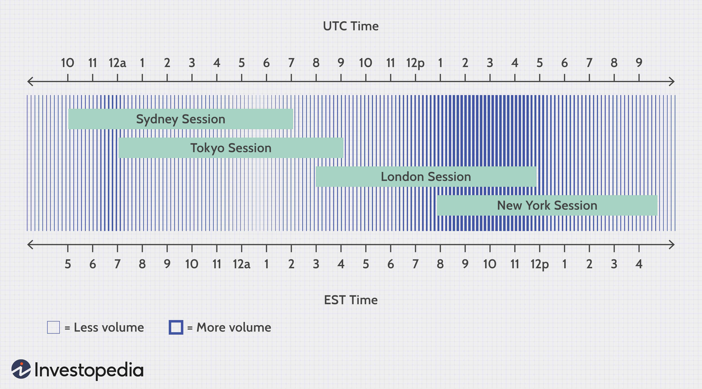

The dynamics of financial markets have experienced profound changes due to algorithmic trading, a technology that employs complex algorithms to automate trading processes. One area that notably benefits from this innovation is the foreign exchange (forex) market, renowned for its high liquidity and the vast volume of currency exchange transactions. Distinguished as the world’s largest financial market, forex has seen enhanced efficiency and speed due to algorithm-driven trades, which have ushered in a new era of trading precision and opportunity.

Algorithmic trading in forex involves the use of sophisticated software systems that execute trades based on pre-set criteria, often refining decision-making with real-time market data. At the heart of this intersection between technology and currency trading is the concept of the foreign exchange noon rate, a historical metric that served as a benchmark for currency values, notably within the USD/CAD trading pair. Although retired in favor of more comprehensive measures, the noon rate symbolized the shift towards data-driven trading strategies, paving the way for algorithms that today dominate this space.

This article elucidates the ways in which algorithmic trading interacts with forex markets, highlighting the implications for traders, institutions, and the financial ecosystem at large. It addresses the risks—such as increased volatility and market fragmentation—that accompany the rapid execution speeds and enhanced capabilities afforded by algorithms. Moreover, it discusses the opportunities these systems present, from capitalizing on arbitrage to optimizing transactional efficiency.

Additionally, the USD/CAD trading pair emerges as particularly appealing to algorithmic traders due to its liquidity and the relative stability of the Canadian and U.S. economies. The characteristics of this currency pair make it an ideal candidate for the strategic application of algorithms, offering potential for profit maximization while managing exposure to risk.

By exploring these themes, this guide aims to provide a comprehensive understanding of the transformative role algorithmic trading plays in the forex market, setting the stage for ongoing advancements in the trading landscape.

## Table of Contents

## Understanding the Forex Noon Rate

Historically, the forex noon rate was a critical benchmark in the USD/CAD currency pair, representing the average exchange rate as calculated by the Bank of Canada from trading activities until midday. This rate was instrumental in providing transparency and consistency in foreign exchange transactions, particularly during an era where real-time data visibility was limited. The noon rate enabled businesses and financial institutions to price contracts and conduct international trades with a standardized reference rate.

The adoption of the noon rate by the Bank of Canada was initially prompted by the need to establish a consistent and precise measure for currency valuation, thereby fostering trust and reliability in the [forex](/wiki/forex-system) market. At a time when real-time data streams were not as readily available or as comprehensive, the noon rate served as a tactical midpoint snapshot that market participants could rely on for decision-making processes.

However, as technology advanced and the need for more dynamic and precise data became apparent, the reliance on a static midpoint snapshot like the noon rate was reevaluated. In 2017, the noon rate was retired and replaced with a more comprehensive 'indicative rate,' which is published at 4:30 p.m. This transition marked a significant evolution in how forex data is accessed and utilized, providing a rate that reflects a broader spectrum of trading activity throughout the day.

The indicative rate is designed to offer a more holistic and nuanced view of daily trading patterns. By reflecting a weighted average of transaction prices over the [course](/wiki/best-algorithmic-trading-courses) of the whole trading day, it allows for more informed decisions in a field where [algorithmic trading](/wiki/algorithmic-trading) strategies increasingly rely on precise and comprehensive data sets. This updated rate framework facilitates enhanced decision-making for algorithmic trading systems, which can leverage the reflective nature of the indicative rate to fine-tune their trading strategies and executions.

The shift from the noon rate to the indicative rate not only underscores the evolving landscape of forex trading but also highlights the ways in which technological advancements can streamline market operations and enhance data utility. This evolution is particularly significant for algorithmic traders who depend on the availability of accurate, high-resolution datasets to outperform manual trading approaches.

## Basics of Algorithmic Trading

Algorithmic trading represents a paradigm shift in the execution of trades within financial markets. It employs predefined computerized systems to automate trading processes, enabling rapid and accurate trade execution based on specific criteria. The implementation of algorithmic trading confers several advantages, primarily through increased transaction speeds and a significant reduction in human error, leading to greater efficiency in processing large volumes of data.

The design of these algorithms can vary widely, ranging from straightforward rule-based systems to sophisticated constructs that utilize complex mathematical models and statistical analyses. A fundamental aspect involves setting criteria derived from financial theories or statistical models to inform decision-making. For example, an algorithm may buy or sell a financial instrument when its price crosses a moving average threshold. In more advanced systems, algorithms can integrate a range of strategies, including but not limited to statistical [arbitrage](/wiki/arbitrage), market-making, and hedging. 

Statistical analysis in algorithmic trading typically involves using historical data to identify patterns and trends. This can involve simple moving averages, regression models, or more advanced techniques such as [machine learning](/wiki/machine-learning) models. These methods help to define the criteria under which the algorithms operate, ensuring they can react promptly to market changes. Additionally, algorithms may utilize hedging strategies to minimize risk exposure by taking offsetting positions in related securities or derivatives.

Direct market access (DMA) is another critical component of algorithmic trading. DMA allows traders to place orders directly onto financial exchange order [books](/wiki/algo-trading-books), bypassing traditional broker-dealer networks, which can expedite the trading process and reduce associated costs. 

High-frequency trading ([HFT](/wiki/high-frequency-trading-strategies)) is a subset of algorithmic trading particularly notable for exploiting minuscule price movements across extremely short timescales—often in milliseconds. HFT relies heavily on sophisticated technology and infrastructure, such as co-location services, where trading systems are placed in close physical proximity to exchange servers to minimize latency. Despite its potential for profit, HFT poses unique risks, including the amplification of market [volatility](/wiki/volatility-trading-strategies) and the potential for causing flash crashes, as algorithmic systems may interact unpredictably under particular market conditions.

In summary, algorithmic trading systems are powerful tools that leverage computational speed and precision to facilitate rapid and efficient trading. While they provide unparalleled benefits with the ability to execute trades based on complex strategies, they also necessitate rigorous oversight to manage inherent risks effectively.

## Integration of Algorithmic Trading in Forex Markets

Algorithmic trading has significantly influenced the forex markets by automating processes traditionally handled by human traders, thereby enhancing the efficiency of trade executions and price fetching. Through sophisticated algorithms, forex transactions can now occur at unprecedented speeds, facilitating more precise and timely updates to currency pair prices. This automation minimizes the need for manual inputs, reduces the risk of human error, and ensures [liquidity](/wiki/liquidity-risk-premium) by allowing banks and traders to react swiftly to market changes.

One of the most transformative aspects of algorithmic trading in forex markets is its ability to identify arbitrage opportunities in real-time. Arbitrage involves exploiting price discrepancies of the same asset across different markets or formats, and algorithms are adept at spotting these opportunities much faster than humans. This capability has led to an increase in speculative trading as traders deploy algorithms to capitalize on even the smallest price movements. The continuous scanning of market conditions allows traders to execute high-frequency trades, seeking profits from pricing inefficiencies that might appear only momentarily.

The adoption of algorithmic trading in forex markets has been propelled by advancements in technology, which have effectively lowered transaction costs and broadened market accessibility. By parsing large datasets, algorithms optimize decision-making processes, leading to more informed and efficient trading strategies. This technological evolution has made forex markets more attractive to a wider array of participants, from large financial institutions to individual traders equipped with relevant algorithms.

Algorithms leverage high-speed data feeds and employ strategies such as direct market access and statistical analysis to execute trades at optimal levels. This not only improves the speed and accuracy of transactions but also contributes to the overall stability and liquidity of the forex market. As a result, algorithmic trading enables market participants to manage significant volumes of transactions with greater ease, precision, and efficiency.

In summary, the integration of algorithmic trading in forex markets enhances market operations by providing the tools necessary for swift and cost-effective trading. As this integration continues to mature, it is likely to drive further innovations that will continue to shape the landscape of forex trading.

## Risks and Challenges in Forex Algorithmic Trading

While algorithmic trading has enhanced efficiency in the forex market, it introduces notable risks and challenges that must be addressed to safeguard market integrity. 

One significant issue is liquidity. The increased speed and [volume](/wiki/volume-trading-strategy) of trades facilitated by algorithms can lead to illiquid markets, especially when an overwhelming number of buy or sell orders are executed simultaneously. This can exacerbate price fluctuations, destabilizing the market and leading to unfavorable trading conditions. Moreover, the presence of algorithms that exploit different exchange platforms can result in market fragmentation. This occurs when liquidity is unevenly distributed across various trading venues, making it challenging to achieve uniform price discovery and potentially widening bid-ask spreads.

The disparity in trading capabilities is another challenge. Sophisticated traders often employ complex algorithms capable of processing vast amounts of data, executing trades at speeds beyond human capability. This technological edge can lead to significant imbalances in market power, leaving less equipped traders at a disadvantage. Such disparities can undermine the fairness and competitiveness of the forex market, necessitating measures to ensure equitable access to trading technology.

Algorithmic trading systems also pose systemic risks, particularly through occurrences such as flash crashes. These are rapid, deep market declines followed by a swift recovery, driven largely by machine-initiated orders without human intervention. The 2010 Flash Crash in the U.S. equity market exemplifies the potential chaos that can ensue. Although the forex market operates differently from stock exchanges, similar risks remain. High-frequency algorithms might react to erroneous market signals, leading to periods of heightened volatility that can disrupt the market.

In light of these risks, there is an increasing call for regulation and robust risk management strategies. Regulatory bodies worldwide recognize the inherent dangers of unfettered algorithmic trading and are moving towards implementing frameworks to monitor and control these activities. These may include rules on algorithmic transparency, mandatory stress testing for trading systems, and circuit breakers to prevent cascading order executions during market anomalies.

These steps are crucial in mitigating the adverse impacts of algorithmic trading on the forex market. Ultimately, the effectiveness of regulation and risk management will determine the ability to harness the benefits of innovations while maintaining market stability and fairness.

## The Future of Forex Algorithmic Trading

As technology continues to advance at a rapid pace, the field of forex algorithmic trading is anticipated to undergo significant transformation. The integration of [artificial intelligence](/wiki/ai-artificial-intelligence) (AI) and machine learning is set to enhance algorithms, enabling them to make more precise and informed trade decisions. AI models can analyze historical and real-time data to identify complex patterns that human traders may overlook, thus improving the predictive accuracy of trading strategies.

The evolution of algorithmic trading will likely be accompanied by an increase in transparency and the implementation of regulatory measures. These efforts aim to create safer trading environments, mitigating risks associated with high-speed, automated trading. As regulators recognize the potential systemic risks posed by algorithmic trading, such as flash crashes, they are expected to develop frameworks that ensure market stability while promoting innovation. 

Beyond forex trading, the influence of algorithms is expected to extend to various areas within financial services, including asset management and risk assessment. For instance, algorithmic models can assist in portfolio optimization by dynamically adjusting asset allocations based on market conditions. In risk assessment, algorithms can identify potential vulnerabilities in financial portfolios, offering risk management strategies that were previously unattainable.

Overall, the future of forex algorithmic trading appears poised for growth, catalyzed by technological advancements and the persistent need for efficiency and accuracy in financial markets. The continued development and adaptation of algorithms will likely open new avenues for innovation, providing traders with powerful tools that enhance both operational efficiency and strategic insight. However, balancing this innovation with effective oversight and risk management remains critical to ensuring the sustainable evolution of the forex market.

## Conclusion

Algorithmic trading has fundamentally transformed the foreign exchange (forex) market by elevating trading efficiency and providing strategic advantages to participants. The automated nature of algorithmic systems allows for rapid execution of trades, minimizing human error and enabling traders to capitalize on fleeting opportunities in the market. Despite these advantages, it is crucial for traders and market participants to be cognizant of the associated risks. These include potential systemic threats, such as flash crashes or excessive market volatility, which can unbalance trading environments.

As algorithmic trading continues to develop, it is anticipated to become increasingly sophisticated, likely utilizing advancements in artificial intelligence and machine learning. These advancements hold the promise of fostering a more integrated trading ecosystem, offering even greater precision and decision-making capabilities. However, this evolution necessitates a balanced approach, where the drive for innovation is counterweighted by strategic oversight and robust risk management strategies. Establishing comprehensive risk controls and regulatory frameworks will be essential to harness the full potential of algorithmic trading in the forex market while mitigating possible adverse impacts. 

Looking forward, stakeholders must prioritize creating a safe and transparent trading environment. By balancing technological progress with effective oversight, the forex market can continue to innovate and grow, providing enduring benefits for all participants.

## References & Further Reading

[1]: Bank of Canada. (2017). [Foreign Exchange Rates, noon and closing rates.](https://www.bankofcanada.ca/rates/exchange/) Bank of Canada.

[2]: Chaboud, A. P., Chiquoine, B., Hjalmarsson, E., & Vega, C. (2014). ["Rise of the Machines: Algorithmic Trading in the Foreign Exchange Market."](https://www.jstor.org/stable/43612951) International Finance Discussion Papers.

[3]: Harris, L. (2003). ["Trading and Exchanges: Market Microstructure for Practitioners."](https://www.amazon.com/Trading-Exchanges-Market-Microstructure-Practitioners/dp/0195144708) Oxford University Press.

[4]: Treleaven, P., Galas, M., & Lalchand, V. (2013). ["Algorithmic Trading Review."](https://www.researchgate.net/publication/262239006_Algorithmic_Trading_Review) Communications of the ACM.

[5]: Aldridge, I. (2013). ["High-Frequency Trading: A Practical Guide to Algorithmic Strategies and Trading Systems."](https://www.amazon.com/High-Frequency-Trading-Practical-Algorithmic-Strategies/dp/1118343506) Wiley Trading.