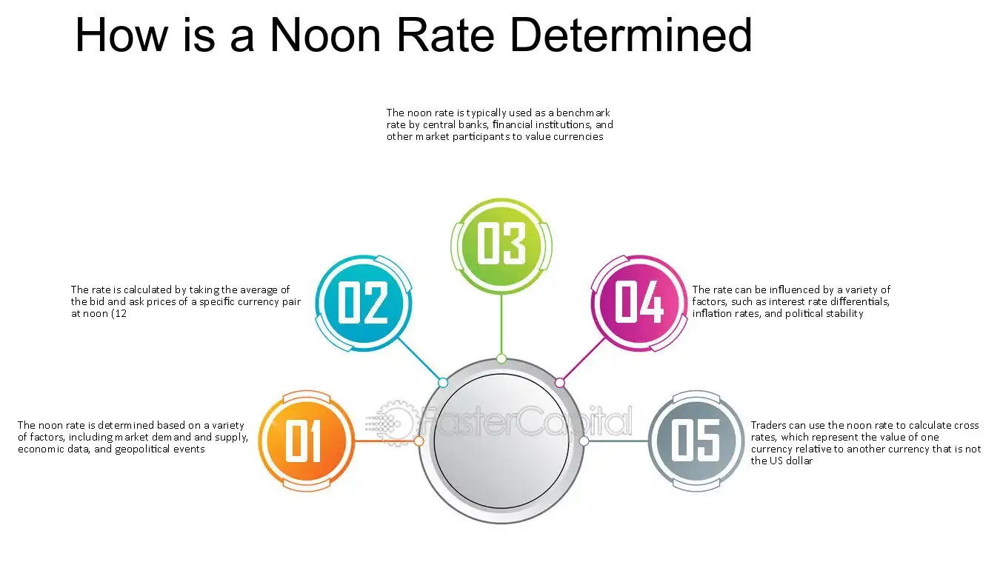

## Table of Contents

## What is the noon rate in financial markets?

The noon rate is a specific exchange rate that banks and financial institutions use at midday. It's important because it helps set a standard rate for currency transactions that happen around that time. Many businesses and traders use the noon rate to convert money from one currency to another during the middle of the day.

This rate is usually published by central banks or major financial institutions. For example, the Bank of Canada releases its noon rate every day. The noon rate can affect how much money you get when you exchange currencies, so it's useful for people who need to know the value of their money at that time. It's a snapshot of the market at noon, which can be different from rates earlier or later in the day.

## How is the noon rate determined?

The noon rate is figured out by looking at what's happening in the foreign exchange market around midday. Banks and big financial groups watch the buying and selling of different currencies. They see how much people want to buy or sell each currency and use that information to set the noon rate. It's like taking a picture of the market at that moment to see what the value of one currency is compared to another.

This rate is important because it gives everyone a common number to use for currency trades happening around noon. Central banks, like the Bank of Canada, often publish this rate so that businesses and traders know what to expect. The noon rate can change from day to day because the value of currencies goes up and down based on what's happening in the world.

## Why is the noon rate important for currency trading?

The noon rate is important for currency trading because it gives traders a clear and standard rate to use at midday. When people trade currencies, they need to know the value of one currency compared to another. The noon rate helps them do this by providing a snapshot of the market at noon. This makes it easier for traders to make decisions about buying or selling currencies at that time.

Also, many businesses use the noon rate to convert money from one currency to another. For example, if a company in Canada needs to pay a supplier in the United States, they might use the noon rate to figure out how much Canadian dollars they need to convert into U.S. dollars. This helps them plan their finances better and avoid surprises from sudden changes in currency values.

## What time is the noon rate typically published?

The noon rate is usually published at midday, around 12:00 PM local time. This time can vary a bit depending on the country and the financial institution that publishes it. For example, the Bank of Canada releases its noon rate at exactly 12:00 PM Eastern Time every business day.

It's important for the noon rate to come out at a set time because it helps everyone in the financial world know what to expect. Traders and businesses use this rate to make decisions about buying and selling currencies. If the rate was published at different times each day, it would be harder for people to plan their trades and financial transactions.

## How does the noon rate affect international business transactions?

The noon rate is important for international business transactions because it helps companies know how much money they need to convert from one currency to another. When a business in one country needs to pay a supplier or receive payment from a customer in another country, they use the noon rate to figure out the exact amount. This helps them plan their finances better and avoid surprises from sudden changes in currency values. For example, if a Canadian company needs to pay a U.S. supplier, they can use the noon rate to convert Canadian dollars into U.S. dollars and know exactly how much they need to pay.

Using the noon rate also makes international transactions more predictable and easier to manage. Since the noon rate is published at a set time every day, businesses can rely on it to make their financial plans. This is especially helpful for companies that do a lot of international trade because it gives them a standard rate to use for their transactions. By knowing the noon rate, businesses can make better decisions about when to buy or sell currencies, which can save them money and reduce the risk of losing money due to currency fluctuations.

## Can the noon rate be used as a benchmark for financial contracts?

Yes, the noon rate can be used as a benchmark for financial contracts. It gives a clear and set rate that everyone can use at midday. This helps make contracts simpler and more predictable. For example, if two companies agree to exchange money at the noon rate, they know exactly what rate they will use. This makes it easier to plan and reduces the risk of surprises from changing currency values.

Using the noon rate as a benchmark also helps avoid arguments about what rate to use. Since the noon rate is published by trusted sources like central banks, both parties in a contract can trust it. This makes international business deals smoother and more reliable. Companies can write the noon rate into their contracts to make sure everyone knows what rate will be used for their transactions.

## What are the differences between the noon rate and other exchange rates like the spot rate?

The noon rate and the spot rate are both used to figure out how much one currency is worth compared to another, but they are used at different times and for different reasons. The noon rate is a specific exchange rate that is set and published at midday, usually around 12:00 PM local time. It's like taking a picture of the market at that moment. Many businesses and traders use the noon rate because it gives them a standard rate to use for their transactions during the middle of the day. It's helpful for planning and making sure everyone knows what rate to use.

The spot rate, on the other hand, is the current exchange rate at any given time. It changes all the time based on what's happening in the market. If you want to exchange money right now, you would use the spot rate. It's more immediate and reflects the latest changes in currency values. The spot rate is used for quick trades and can be different from the noon rate because it's not tied to a specific time of day. Both rates are important, but they serve different purposes in the world of currency trading.

## How do central banks influence the noon rate?

Central banks can influence the noon rate by managing the supply and demand of their currency. They do this through different actions like setting interest rates or buying and selling their own currency in the market. When a central bank changes interest rates, it can make their currency more or less attractive to investors. If they raise interest rates, their currency might become more valuable because people want to invest in it to get higher returns. This can push the noon rate up. On the other hand, if they lower interest rates, their currency might become less valuable, which can push the noon rate down.

Central banks also use their foreign exchange reserves to buy or sell their currency. If they want to make their currency stronger, they might sell foreign currencies and buy their own, which increases demand for their currency and can raise the noon rate. If they want to make their currency weaker, they might sell their own currency and buy foreign currencies, which increases the supply of their currency and can lower the noon rate. These actions help central banks control the value of their currency and influence the noon rate, which is important for businesses and traders who use it for their transactions.

## What historical events have significantly impacted the noon rate?

Historical events like big economic changes or crises can really shake up the noon rate. For example, during the 2008 financial crisis, many countries saw their currencies lose value fast. This made the noon rate change a lot because people were scared and wanted to sell their money for safer currencies. Another event that changed the noon rate was when countries like the UK decided to leave the European Union, known as Brexit. This made the British pound drop in value, and the noon rate for the pound against other currencies went down.

Also, when central banks make big moves, it can affect the noon rate. In 2015, the Swiss National Bank suddenly stopped pegging the Swiss franc to the euro. This caused the Swiss franc to jump in value, and the noon rate for the franc against other currencies shot up. These kinds of big events show how the noon rate can change a lot based on what's happening around the world.

## How can investors use the noon rate to make informed decisions?

Investors can use the noon rate to make smart choices about when to buy or sell currencies. By looking at the noon rate every day, they can see how the value of different currencies is changing. If they notice that a currency is getting stronger at noon, they might decide to buy it because it could be worth more later. On the other hand, if a currency is getting weaker, they might sell it to avoid losing money. The noon rate gives investors a clear picture of the market at midday, which helps them plan their moves.

The noon rate can also help investors understand bigger trends in the market. If the noon rate for a certain currency keeps going up or down over time, it might mean that something important is happening in that country's economy. Investors can use this information to guess what might happen next and make their investment choices based on that. By keeping an eye on the noon rate, investors can stay on top of changes in the market and make better decisions about their money.

## What are the potential risks associated with relying on the noon rate for financial planning?

Relying on the noon rate for financial planning can be risky because it only shows the value of currencies at one specific time each day. The noon rate can change a lot from day to day because of what's happening in the world. If you make plans based on the noon rate, you might be surprised if the rate changes a lot the next day. This can mess up your plans and make it hard to know how much money you'll have after converting currencies.

Another risk is that the noon rate might not be the best rate for your needs. Sometimes, the spot rate, which changes all the time, might be better for quick trades. If you stick to the noon rate, you could miss out on better deals. Also, big events like economic crises or policy changes by central banks can make the noon rate jump around a lot. This can make it hard to predict and plan, which is important for financial planning.

## How do advanced algorithmic trading systems incorporate the noon rate into their strategies?

Advanced [algorithmic trading](/wiki/algorithmic-trading) systems use the noon rate as one piece of information to help them make decisions about buying and selling currencies. These systems look at many different rates and data points all the time, but the noon rate is special because it's a standard rate that comes out at the same time every day. By knowing the noon rate, these systems can compare it with other rates and see if there are any good opportunities to make trades. For example, if the noon rate is different from the spot rate, the system might decide to buy or sell a currency to take advantage of the difference.

The noon rate can also help these systems understand bigger trends in the market. If the noon rate for a certain currency keeps going up or down over time, the system might see this as a sign that the currency's value is changing in a certain way. This can help the system make predictions about what might happen next and adjust its trading strategies accordingly. By using the noon rate along with other data, advanced algorithmic trading systems can make smarter and more informed decisions about when to trade and how much to trade.

## References & Further Reading

[1]: Bank of Canada. (2017). [Foreign Exchange Rates, noon and closing rates.](https://www.bankofcanada.ca/rates/exchange/) Bank of Canada.

[2]: Chaboud, A. P., Chiquoine, B., Hjalmarsson, E., & Vega, C. (2014). ["Rise of the Machines: Algorithmic Trading in the Foreign Exchange Market."](https://www.jstor.org/stable/43612951) International Finance Discussion Papers.

[3]: Harris, L. (2003). ["Trading and Exchanges: Market Microstructure for Practitioners."](https://www.amazon.com/Trading-Exchanges-Market-Microstructure-Practitioners/dp/0195144708) Oxford University Press.

[4]: Treleaven, P., Galas, M., & Lalchand, V. (2013). ["Algorithmic Trading Review."](https://www.researchgate.net/publication/262239006_Algorithmic_Trading_Review) Communications of the ACM.

[5]: Aldridge, I. (2013). ["High-Frequency Trading: A Practical Guide to Algorithmic Strategies and Trading Systems."](https://www.amazon.com/High-Frequency-Trading-Practical-Algorithmic-Strategies/dp/1118343506) Wiley Trading.