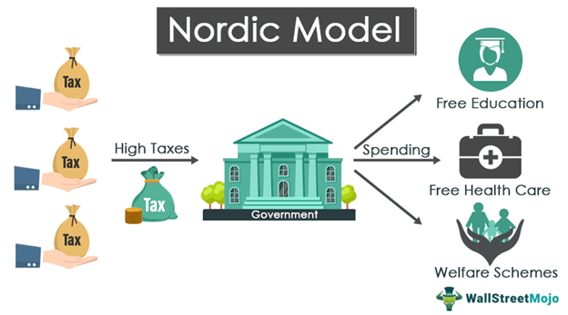

The term 'Nordic Model' refers to a distinctive socio-economic system prevalent in the Scandinavian countries of Sweden, Norway, Finland, Denmark, and Iceland. This model is renowned for its unique combination of free-market capitalism and robust welfare policies, leading to both low-income disparity and high standards of living. An essential feature of the Nordic Model is the amalgamation of economic efficiency and social equity. By blending market dynamics with comprehensive welfare mechanisms, it provides a sustainable framework for equitable wealth distribution while maintaining a competitive economy.

The Nordic Model's welfare state is extensive and is largely funded by high taxation levels, which finance a range of services such as universal healthcare, free education, and generous pension systems. These initiatives promote social mobility and form a safety net which significantly reduces poverty and inequality.

In the current globalized economy, the Nordic Model faces new challenges that include the integration of advanced financial practices such as algorithmic trading. Algorithmic trading or algo trading, employs sophisticated computer algorithms to automatically execute trades at high speeds and volumes, which can potentially enhance market efficiency and liquidity. However, its incorporation into the welfare-oriented Nordic financial systems necessitates meticulous oversight to maintain the model’s balance between economic and social objectives.

In this article, we will examine the Nordic Model within the broader contexts of welfare state dynamics, the challenges faced by Scandinavian economies, and the implications of modern trading practices such as algorithmic trading. This analysis will highlight how these countries navigate the complex interplay between maintaining their core socio-economic principles while adapting to technological and financial innovations.

## Table of Contents

## Understanding the Welfare State in the Nordic Model

The Nordic Model's welfare state is renowned for its comprehensive social securities, predominantly funded by high taxation. This system is designed to provide an extensive range of public services and benefits that are accessible to all citizens, regardless of their income levels. Central to this model are free education, universal healthcare, and generous pension systems, which are all sustained through taxpayer contributions. These services aim to promote high social mobility and ensure a robust safety net that significantly minimizes poverty and inequality within society.

Education in Nordic countries is considered a fundamental right, with emphasis placed on free and equal access for all. This commitment extends from primary education through to higher education, creating opportunities for individuals to advance academically without financial barriers. Universal healthcare is another cornerstone, providing citizens with access to medical services that are financed through public funds. This system not only ensures the health and well-being of the population but also contributes to economic productivity by maintaining a healthy workforce.

Generous pension systems further exemplify the welfare ethos of the Nordic Model, offering financial security to retirees. These pensions are typically state-funded, ensuring that older citizens can maintain a decent standard of living after retirement. The funding of these welfare benefits through high taxation reflects a collective societal agreement that favors shared welfare and development.

The historical context of the Nordic region underscores this collective mentality. The countries' experiences, shaped by a combination of cultural, social, and economic factors, have ingrained a focus on equitable welfare distribution and societal cohesion. The emphasis on welfare and social security has fostered societies where individuals are encouraged to contribute to the common good, creating a virtuous cycle of prosperity and equality.

Through this model, the Nordic countries have managed to balance individual freedom with communal responsibility, crafting a unique system that continues to attract global attention as a potential blueprint for reducing inequality and fostering inclusive growth.

## Scandinavian Economy and its Challenges

Scandinavian economies are characterized by their unique mixed economic systems, which integrate free-market practices with substantial government intervention. This combination facilitates both economic efficiency and social welfare, helping to maintain robust economies with equitable income distribution. A fundamental component of this model is the welfare state, funded predominantly through taxes, which provides extensive public services such as healthcare, education, and social security.

However, these economies face challenges, particularly regarding demographics. Aging populations are a significant concern, as they place additional strain on welfare systems. As the proportion of elderly citizens rises, there’s an increased demand for healthcare and pension benefits, which requires careful financial planning and potential policy reforms. Additionally, immigration presents its own set of challenges and opportunities, leading to increased labor supply, yet necessitating integration policies to ensure social cohesion.

The highly democratic cultures inherent in the Nordic countries facilitate political compromises, essential for sustaining equality while addressing these issues. The political landscape is marked by collaboration among various parties, typically leading to consensus-driven policy-making. This tradition of compromise and consultation plays a vital role in maintaining economic stability and ensuring that welfare benefits continue to uphold egalitarian principles. 

In summary, Scandinavian countries demonstrate a successful balancing act between maintaining strong economic growth and fostering social equality. Addressing demographic shifts through innovative policy solutions will be crucial in preserving this balance and ensuring the continued success of their economic model.

## Algorithmic Trading within the Nordic Markets

Algorithmic trading, also known as algo trading, involves the use of computer programs to execute trades on financial markets at high speeds and volumes, taking advantage of complex algorithms for decision-making. In the context of Scandinavian markets, this technological advancement holds the potential to significantly enhance market [liquidity](/wiki/liquidity-risk-premium) and efficiency. By systematically analyzing vast datasets and executing trades within fractions of a second, algo trading can reduce market [volatility](/wiki/volatility-trading-strategies) and narrow bid-ask spreads, thereby providing a more stable trading environment.

Despite these advantages, the widespread adoption of [algorithmic trading](/wiki/algorithmic-trading) in Nordic markets poses unique regulatory challenges. The integration of this technology must be carefully aligned with the region's welfare-oriented economic systems, which prioritize social equity and stability. Regulators are tasked with ensuring that algo trading does not lead to market manipulation, loss of transparency, or unfair advantages for a select few market participants, potentially undermining the egalitarian economic principles characteristic of the Nordic Model.

To achieve effective oversight, Scandinavian regulatory bodies may need to implement stringent measures, such as requiring algorithmic trading firms to submit their trading algorithms for review, setting limits on the speed and [volume](/wiki/volume-trading-strategy) of trades, or mandating real-time monitoring of trading activities. Such interventions aim to safeguard the market's integrity while fostering an environment where technological advancements like algo trading can operate within the region's socio-economic framework.

Furthermore, collaboration between financial institutions and regulatory authorities is essential to ensure that algorithmic trading complements the existing market structure without causing systemic disruptions. This might involve developing industry standards for algorithm testing and validation to prevent erroneous trades that could have cascading effects on the market.

In summary, while algorithmic trading offers significant benefits to Scandinavian markets, its deployment must be managed with a conscientious approach to regulation and oversight, ensuring that it supports rather than undermines the market's delicate balance.

## Global Influence and Criticisms of the Nordic Model

The Nordic Model garners significant global attention as a potential framework for addressing social inequality while maintaining economic prosperity. Nations around the world, particularly those struggling with high levels of inequality, often study the Nordic approach to understand its applicability within different socio-economic contexts. The model's emphasis on a well-developed welfare state, coupled with a dynamic economy, provides a distinctive blueprint for achieving balanced socio-economic growth.

One of the primary arguments favoring the Nordic Model is its ability to maintain a low level of income disparity. Countries observing this model recognize its effectiveness in providing universal benefits, such as healthcare and education, which contribute to high social mobility and reduce poverty levels. The comprehensive welfare systems in Nordic countries are seen as a pillar for achieving equitable wealth distribution, a [factor](/wiki/factor-investing) that many countries aspire to emulate.

Nevertheless, the Nordic Model is not without its criticisms. Critics argue that its inherent high taxation and extensive government intervention may hamper economic growth and limit personal consumption. Such concerns are particularly poignant among proponents of more liberated market economies, who believe that less regulation and lower taxes better stimulate individual initiative and economic expansion. They suggest that high taxes might discourage investment and innovation, potentially leading to slower growth rates compared to more laissez-faire economic systems.

Despite these criticisms, the model can still be viewed as an adherent of economic productivity infused with a strong social welfare component. The success observed in Nordic countries, characterized by high living standards, robust economic output, and substantial social safety nets, serves as a testament to the viability of integrating social welfare with economic development. The balancing act between personal freedom and collective responsibility is pivotal, suggesting that with adequate planning and execution, high taxation and welfare can coexist without stifling economic agility.

In summary, the Nordic Model continues to be scrutinized and admired on the global stage. While it presents an attractive solution for reducing inequality, countries must also weigh the potential downsides associated with its application. The model's success in maintaining robust economic productivity alongside high social welfare standards makes it an intriguing template for nations seeking to foster both growth and equity.

## The Future of the Nordic Model and Algo Trading

Emerging economic challenges such as globalization and rapid technological advances continue to test the resilience and adaptability of the Nordic Model. To maintain its core values of social equity and robust welfare systems, while successfully navigating these modern challenges, requires a nuanced approach. Algorithmic trading, characterized by the use of complex algorithms and high-frequency trading systems, presents both opportunities and challenges that must be carefully managed to align with the Nordic countries' economic and social philosophies.

Globalization has led to more interconnected financial markets, offering potential benefits such as increased liquidity and efficiency. However, for the Nordic Model, which prioritizes social welfare and equality, it is essential that the integration of innovations like algorithmic trading does not undermine these principles. The challenge lies in ensuring that such technological advancements contribute to market stability and transparency rather than exacerbating inequalities or fostering speculative bubbles.

To achieve this, policymakers and financial regulators in Nordic countries must focus on designing regulatory frameworks that monitor and guide the operation of algorithmic trading. This involves implementing safeguards to prevent market manipulation and excessive volatility, thus ensuring that algo trading practices align with the broader economic goals. Moreover, fostering an environment where technological advancements can occur alongside sustainable social policies is crucial.

Furthermore, the sustainability of the Nordic Model amidst these emerging challenges will depend on its ability to evolve without forsaking its foundational ethos of social equity and welfare. This includes investing in education and technological literacy to prepare the workforce for a digitally-driven economy. By doing so, Nordic countries aim to empower individuals to adapt to technological changes, ensuring that advancements benefit the entire society.

In conclusion, the future of the Nordic Model in the context of global and technological changes hinges on its ability to integrate new financial practices like algorithmic trading while preserving its commitment to social welfare and equality. The model's success will rely on a balanced approach that embraces innovation, adheres to democratic values, and prioritizes the well-being of all its citizens.

## Conclusion

The Nordic Model exemplifies a sophisticated fusion of capitalism and welfare principles, fostering equality and economic stability across Scandinavia. This approach successfully marries the dynamism of free markets with comprehensive welfare policies, producing high living standards and low levels of income disparity. The model's success lies in its capacity to adapt and evolve, while maintaining core societal values centered on equity and collective welfare.

Incorporating modern practices like algorithmic trading into the Nordic financial markets presents opportunities and challenges. These technologies have the potential to enhance market liquidity and efficiency, but they also require meticulous integration and oversight to align with the welfare-oriented ethos of the Nordic economic systems. Ensuring that these advancements complement rather than disrupt the existing economic balance is crucial for maintaining stability and trust within the markets.

As global economic landscapes shift under the influences of globalization and technological progress, the Nordic countries' adaptability and democratic ethos will be pivotal in navigating these changes. By remaining committed to their foundational principles of social equity and welfare, while embracing innovations that foster growth and efficiency, the Nordic Model continues to be a benchmark for balancing modern economic demands with social welfare aspirations. This model demonstrates that it is possible to harness the benefits of economic progress while ensuring that social welfare remains a cornerstone of national policy, providing a guiding framework for other nations seeking to achieve similar objectives.

## References & Further Reading

[1]: Andersen, T. M., Holmström, B., Honkapohja, S., Korkman, S., Söderström, H. T., & Vartiainen, J. (Eds.). (2007). ["The Nordic Model: Embracing globalization and sharing risks."](https://www.etla.fi/en/publications/b232-en/) The Research Institute of the Finnish Economy (ETLA).

[2]: Lindbeck, A. (1997). ["The Swedish Experiment"](https://archive.org/details/swedishexperimen0000lind). MIT Press.

[3]: Sapir, A. (2005). ["Globalization and the reform of European social models."](https://onlinelibrary.wiley.com/doi/10.1111/j.1468-5965.2006.00627.x) Journal of Common Market Studies, 44(2), 369-390.

[4]: Engblom, A., Juul, J., & Sano, S. (Eds.). (2012). ["Nordic Economic Policy Review: Wage Formation and Macroeconomic Policy in the Nordic Countries."](https://www.norden.org/en/publication/nordic-economic-policy-review-wage-formation-and-macroeconomic-policy-nordic-countries) Nordic Council of Ministers.

[5]: Bernes, T., Bryden, J., Buchan, D., Livingstone, G. (2011). ["Nordic Lessons for an Ageing Society."](https://pubmed.ncbi.nlm.nih.gov/25639942/) Nordic Centre for Welfare and Social Issues.