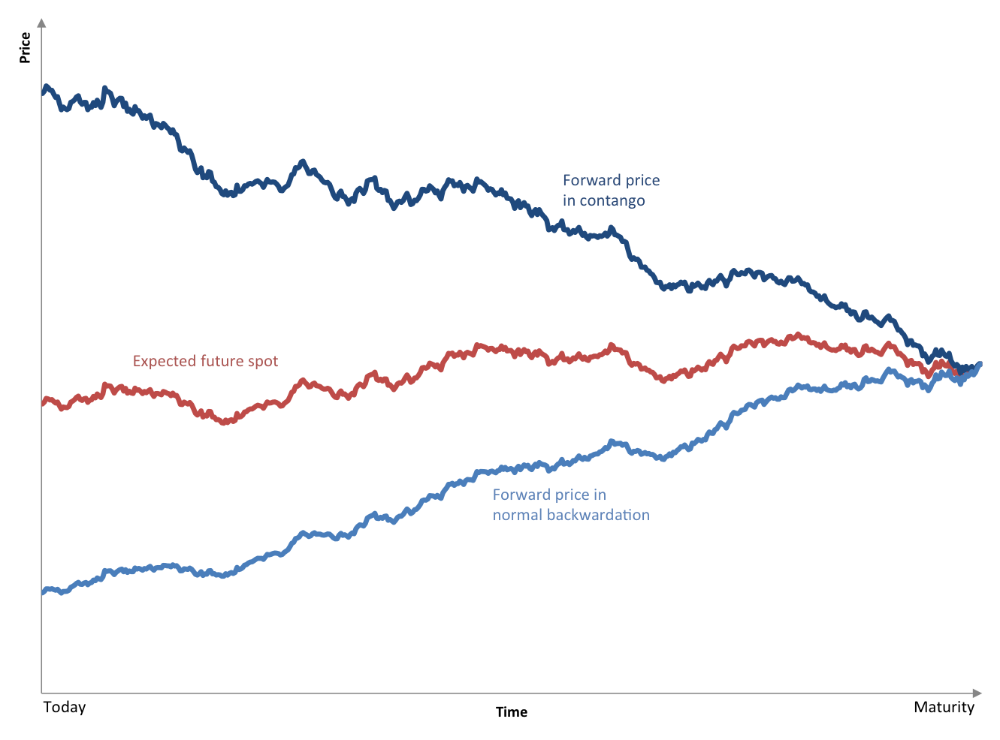

## Table of Contents

## What is normal backwardation?

Normal backwardation is a term used in the world of commodities and futures trading. It happens when the price of a futures contract is lower than the expected future spot price of the commodity. This situation suggests that people expect the commodity's price to go up over time. Traders might see this as a chance to make money by buying the futures contract now and selling it later at a higher price.

Backwardation can be caused by a few things. One reason is a shortage of the commodity in the present, which makes people think it will be more valuable in the future. Another reason could be high demand for the commodity right now, which pushes the current price up. When the market is in backwardation, it can be a sign that the commodity is in high demand or that there are concerns about future supply.

## How does normal backwardation differ from contango?

Normal backwardation and contango are two opposite situations in the futures market. In normal backwardation, the price of a futures contract is lower than what people think the commodity will be worth in the future. This means if you buy the futures contract now, you might be able to sell it later for more money. It's like the market is saying, "We think this thing will be worth more down the road."

On the other hand, contango is when the price of a futures contract is higher than the expected future price of the commodity. In this case, if you buy the futures contract now, you might have to sell it later for less money. It's like the market is saying, "We think this thing might be worth less in the future." Both situations can tell us something about what people expect will happen with the price of the commodity.

## What causes normal backwardation in commodity markets?

Normal backwardation in commodity markets happens when the price of a futures contract is lower than what people think the commodity will be worth in the future. This can happen because there's not enough of the commodity right now, so people think it will be more valuable later. It's like if there's a shortage of apples today, people might think apples will be worth more in a few months. Another reason could be that a lot of people want the commodity right now, which pushes the current price up. When this happens, it can make the futures price look low compared to what people expect the price to be later.

Sometimes, normal backwardation can also be caused by people wanting to protect themselves from future price changes. If a lot of people are worried that the price of a commodity will go up, they might buy futures contracts to lock in a lower price now. This can push the futures price down compared to what they think the commodity will be worth in the future. So, normal backwardation can tell us that there might be a shortage of the commodity or that a lot of people are worried about future prices going up.

## Can you explain the theory of normal backwardation?

The theory of normal backwardation was first talked about by economist John Maynard Keynes. He said that people who produce commodities, like farmers or miners, often want to sell their products in the future at a set price. They do this to make sure they don't lose money if the price goes down. So, they sell futures contracts. But, people who buy these futures contracts, like investors, want to make money. They think the price of the commodity will go up in the future. To get them to buy the futures, the price has to be lower than what they think the commodity will be worth later. This is what we call normal backwardation.

In simple terms, normal backwardation happens because producers want to protect themselves from price drops, and investors want to make a profit. When the futures price is lower than the expected future price, it's like a deal. The producers get to lock in a price, and the investors get a chance to buy low and sell high later. This situation can tell us that people think the commodity will be worth more in the future, maybe because there's not enough of it now or because a lot of people want it.

## How does normal backwardation affect futures prices?

Normal backwardation means that the price of a futures contract is lower than what people think the commodity will be worth in the future. When this happens, the futures price is set lower to attract investors. These investors buy the futures hoping to sell them later at a higher price. So, in normal backwardation, the futures price is lower than the expected future spot price, which can make the futures look like a good deal.

This situation can happen because there's not enough of the commodity right now, or because a lot of people want it. Producers, like farmers or miners, might sell futures contracts to lock in a price and protect themselves from future price drops. Investors, on the other hand, see the lower futures price as a chance to make money if the commodity's price goes up later. So, normal backwardation can show us that people expect the commodity to be worth more in the future.

## What are the implications of normal backwardation for investors?

Normal backwardation can be good news for investors who want to make money from buying and selling futures contracts. When the futures price is lower than what people think the commodity will be worth later, investors can buy the futures now and hope to sell them at a higher price in the future. This means they could make a profit if the price of the commodity goes up like everyone expects. So, normal backwardation can be seen as a chance for investors to get in on a good deal.

But, it's not always a sure thing. Even if the market is in normal backwardation, the price of the commodity might not go up as much as people think. If the price stays the same or goes down, investors could lose money. Also, normal backwardation can tell investors that there might be a shortage of the commodity or that a lot of people want it right now. This information can help investors decide if they want to take the risk and buy the futures, hoping the price will go up later.

## How can traders take advantage of normal backwardation?

Traders can take advantage of normal backwardation by buying futures contracts when the price is lower than what people think the commodity will be worth in the future. This means they can buy the futures now and hope to sell them later at a higher price. If the price of the commodity goes up like everyone expects, traders can make a profit. It's like getting a good deal on something that will be worth more later.

But, it's not always a sure thing. Even if the market is in normal backwardation, the price of the commodity might not go up as much as people think. If the price stays the same or goes down, traders could lose money. So, traders need to be careful and think about the risks. They should look at why the market is in backwardation, like if there's a shortage of the commodity or if a lot of people want it right now. This information can help them decide if it's a good time to buy the futures and try to make a profit.

## What are some real-world examples of normal backwardation?

One real-world example of normal backwardation happened in the oil market. In 2020, when the world was dealing with the COVID-19 pandemic, a lot of people were not traveling or using as much oil. This caused a big drop in the demand for oil right away. But, people thought that once the world got back to normal, the demand for oil would go up again. So, the price of oil futures was lower than what people expected the price of oil to be in the future. This was a case of normal backwardation because the futures price was lower than the expected future spot price.

Another example can be seen in the agricultural markets, like with corn. Sometimes, there might be a bad harvest because of weather problems, which means there's not enough corn right now. Farmers might want to sell their corn in the future at a set price to make sure they don't lose money if the price goes down. But investors might think that because there's not enough corn now, the price will go up later. So, the price of corn futures might be lower than what people think corn will be worth in the future. This is another case of normal backwardation, showing that people expect the price of corn to go up because of the current shortage.

## How does normal backwardation impact the hedging strategies of producers?

Normal backwardation can help producers with their hedging strategies. When the market is in backwardation, the price of futures contracts is lower than what people think the commodity will be worth in the future. This means producers can sell futures contracts now at a lower price to lock in a price for their commodity. This is good for them because it protects them from the risk of the price going down later. So, if there's a chance the price might drop, producers can feel safer knowing they have a set price for their product.

But, there's a downside too. If the price of the commodity goes up a lot in the future, producers might miss out on making more money. They've locked in a lower price with the futures contract, so they can't take advantage of the higher prices. Still, for many producers, the safety of knowing they have a set price is more important than the chance of making a little more money. So, normal backwardation can be a useful tool for producers to manage their risks and plan for the future.

## What are the economic theories that support or challenge the concept of normal backwardation?

One of the main economic theories that supports normal backwardation is the theory of normal backwardation itself, which was first talked about by John Maynard Keynes. He said that producers, like farmers or miners, want to sell their products in the future at a set price to protect themselves from price drops. To get investors to buy these futures contracts, the price has to be lower than what they think the commodity will be worth later. This is what we call normal backwardation. It's like a deal where producers get to lock in a price, and investors get a chance to buy low and sell high later.

Another theory that challenges the concept of normal backwardation is the theory of contango. In contango, the price of a futures contract is higher than the expected future price of the commodity. This means that if you buy the futures contract now, you might have to sell it later for less money. Some economists argue that markets should be in contango more often because it makes sense for the price to go up over time due to things like storage costs and interest rates. They say that normal backwardation is not the normal state of the market and that it only happens in special situations, like when there's a shortage of the commodity or high demand right now.

So, while the theory of normal backwardation explains why futures prices might be lower than expected future prices, the theory of contango suggests that this is not the usual situation. Both theories help us understand how futures markets work and what might be happening with the prices of commodities.

## How does normal backwardation relate to the risk premium in futures markets?

Normal backwardation is when the price of a futures contract is lower than what people think the commodity will be worth in the future. This difference between the futures price and the expected future price is called the risk premium. In normal backwardation, the risk premium is positive because investors are getting a lower price now with the hope that they can sell the commodity later at a higher price. This means they are taking on some risk, but they are also getting a chance to make a profit if the price goes up like everyone expects.

The risk premium in normal backwardation is important because it shows how much extra money investors want to take on the risk of buying the futures. Producers, like farmers or miners, are willing to pay this risk premium to lock in a price and protect themselves from future price drops. So, the risk premium in normal backwardation is like a deal where producers get some safety, and investors get a chance to make money if the price goes up.

## What advanced strategies can be employed to mitigate risks associated with normal backwardation?

To mitigate risks associated with normal backwardation, traders and investors can use a strategy called spreading. This means buying and selling different futures contracts at the same time. For example, if you think the price of a commodity will go up because of normal backwardation, you can buy a futures contract for a near-term delivery and sell a futures contract for a later delivery. This way, you can make money from the difference in prices between the two contracts, even if the overall price of the commodity doesn't go up as much as you thought.

Another strategy is to use options. Options give you the right, but not the obligation, to buy or sell a futures contract at a set price. If you're worried about the price of a commodity going down even though the market is in normal backwardation, you can buy a put option. This gives you the right to sell the futures contract at a set price, which can protect you from losing too much money if the price drops. These strategies can help you manage the risks of normal backwardation and make the most of the opportunities it offers.

## References & Further Reading

[1]: Keynes, J. M. (1930). "A Treatise on Money: The Applied Theory of Money." Macmillan & Co.

[2]: Hull, J. C. (2017). ["Options, Futures, and Other Derivatives."](https://books.google.com/books/about/Options_Futures_and_Other_Derivatives_eB.html?id=2iopDwAAQBAJ) Pearson.

[3]: Black, F. (1976). "The Pricing of Commodity Contracts." Journal of Financial Economics.

[4]: ["Advances in Financial Machine Learning"](https://www.amazon.com/Advances-Financial-Machine-Learning-Marcos/dp/1119482089) by Marcos Lopez de Prado

[5]: Geman, H. (2005). "Commodities and Commodity Derivatives: Modelling and Pricing for Agriculturals, Metals and Energy." Wiley Finance.

[6]: ["Machine Learning for Algorithmic Trading"](https://github.com/stefan-jansen/machine-learning-for-trading) by Stefan Jansen

[7]: Fama, E. F., & French, K. R. (1987). "Commodity Futures Prices: Some Evidence on Forecast Power, Premiums, and the Theory of Storage." The Journal of Business, 60(1).

[8]: ["Quantitative Trading: How to Build Your Own Algorithmic Trading Business"](https://www.amazon.com/Quantitative-Trading-Build-Algorithmic-Business/dp/0470284889) by Ernest P. Chan