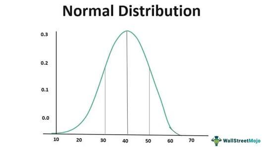

Understanding statistical concepts is fundamental in finance and trading, particularly within the domain of algorithmic trading. This article highlights the importance of normal distribution and probability distribution, essential tools that underpin the decision-making and risk assessment processes crucial to the industry. Normal and probability distributions empower traders to anticipate market movements, evaluate risks, and devise sophisticated strategies that can enhance trading outcomes.

In algorithmic trading, statistical tools allow traders to harness large datasets and gain insights into market behavior and price fluctuations efficiently. The use of normal distribution, expressed mathematically as:



$$
f(x) = \frac{1}{\sigma\sqrt{2\pi}} e^{-\frac{1}{2}\left(\frac{x-\mu}{\sigma}\right)^2}
$$

where $\mu$ is the mean and $\sigma$ is the standard deviation, provides a framework for understanding how data points are likely to be distributed around the mean, enabling informed predictions about asset prices. Similarly, various probability distributions play a critical role in assessing the likelihood of different market scenarios and outcomes.

For practitioners in the fast-paced trading environment, these statistical models offer a structured approach to managing uncertainties. By incorporating normal and probability distributions in their analytical toolkit, traders can refine their strategies, mitigate risks, and respond agilely to market shifts, ultimately enhancing their competitive edge in financial markets. These concepts form the backbone of effective trading algorithms, allowing them to not only predict but also adapt to market dynamics in real-time.

## Table of Contents

## Understanding Normal Distribution

Normal distribution, also known as Gaussian distribution, is a fundamental statistical function that describes how data points are distributed around a central value. This distribution is characterized by its bell-shaped curve, which is symmetrical and indicates that the data values are equally distributed around the mean. In finance, normal distribution is often used to model the distribution of asset returns and understand market behaviors.

The normal distribution is mathematically represented by the probability density function (PDF):

$$

f(x|\mu, \sigma^2) = \frac{1}{\sqrt{2\pi\sigma^2}} e^{-\frac{(x-\mu)^2}{2\sigma^2}} 
$$

where:
- $x$ is the variable,
- $\mu$ is the mean or average,
- $\sigma^2$ is the variance,
- $\sigma$ is the standard deviation.

In this distribution, the mean, median, and mode are all equal and located at the center of the distribution curve. The symmetry around the mean indicates that approximately 68% of data points fall within one standard deviation ($\sigma$) of the mean, about 95% fall within two standard deviations, and nearly 99.7% are within three standard deviations. This property, known as the empirical rule, is critical in assessing probabilities and making predictions.

Skewness and kurtosis are also significant characteristics of the normal distribution. Skewness measures the asymmetry of the distribution. For a normal distribution, the skewness is zero, implying a perfectly symmetrical shape. Kurtosis, on the other hand, assesses the "tailedness" of the distribution. A normal distribution has a kurtosis value of three, commonly referred to as mesokurtic. Values significantly different from three indicate a distribution with heavier or lighter tails.

In finance, the assumption of normal distribution simplifies the analysis of stock returns, risk management, and portfolio optimization. However, real-world data often exhibit fat tails and skewness, emphasizing the importance of testing assumptions and supplementing normal distribution models with other statistical methods for accurate market assessments.

## Probability Distributions in Finance

Probability distributions play a critical role in the field of finance by providing insights into the likelihood of various financial events. These tools help traders and investors understand the potential risks and returns associated with different financial assets. By leveraging probability distributions, market participants can make informed predictions, conduct thorough risk assessments, and manage their portfolios more efficiently.

One of the fundamental types of probability distributions used in finance is the normal distribution, often employed to model asset returns due to its symmetric nature and its characterization of returns clustering around a mean. However, financial markets do not always conform to a normal distribution, necessitating the use of other distribution models for more accurate predictions.

The binomial distribution is particularly useful in finance for modeling scenarios where there are two possible outcomes, such as the rise or fall of a stock price. This distribution helps in calculating the probabilities of various combinations of these outcomes, and is commonly used in options pricing strategies, particularly for call and put options. The binomial model allows for a discrete-time representation of stock price movements and can be implemented to evaluate the fair value of options through iterative calculations.

Another valuable distribution is the Poisson distribution, which models the probability of a given number of events happening in a fixed interval of time or space. In finance, it is often used to model the arrival of rare events, such as market jumps or extreme price changes. By understanding the likelihood of these events, traders can develop strategies to mitigate associated risks.

Traders also employ probability distributions in the context of value-at-risk (VaR) calculations, stress testing, and scenario analysis. VaR, for example, involves estimating the maximum potential loss over a given time frame at a certain confidence level, relying heavily on historical data distributions to predict future market conditions.

Incorporating probability distributions into trading algorithms enables the detection of patterns and the prediction of asset price movements. Such models assist in optimizing trading strategies by providing a statistical foundation for decision-making. By capturing the nuances of market behavior through various probability distributions, traders can better anticipate and respond to market dynamics, thereby enhancing their ability to manage risk and capitalize on potential opportunities.

Through the integration of binomial, Poisson, and other distribution models, traders can gain a comprehensive understanding of market trends and asset behaviors, moving beyond simple assumptions of normality to develop robust strategies that are well-aligned with the complexities of financial markets.

## The Role of Statistical Analysis in Algorithmic Trading

Algorithmic trading employs statistical models to make precise, data-driven trading decisions. Statistical analysis is fundamental in predicting market behavior and asset price movements, ensuring accuracy. By scrutinizing historical data, trading algorithms can detect patterns, optimize strategies, and execute trades with precision.

Statistical models utilize various techniques to analyze and interpret data effectively. One common approach is linear regression, which models the relationship between a dependent variable and one or more independent variables. In [algorithmic trading](/wiki/algorithmic-trading), regression analysis helps estimate future prices and trends based on historical patterns. For example, a simple linear regression model can be represented as:

$$
y = \beta_0 + \beta_1 x + \epsilon
$$

where $y$ is the dependent variable (e.g., asset price), $x$ is the independent variable (e.g., time or trading volume), $\beta_0$ is the y-intercept, $\beta_1$ is the slope, and $\epsilon$ is the error term.

Moreover, [volatility](/wiki/volatility-trading-strategies) is a crucial [factor](/wiki/factor-investing) in algorithmic trading, as it reflects the degree of variation in asset prices. Volatility measures, like standard deviation or beta coefficients, assess the risk and potential reward associated with an asset:

$$
\text{Standard Deviation} = \sqrt{\frac{1}{N-1} \sum_{i=1}^{N} (x_i - \bar{x})^2}
$$

Incorporating volatility measures enables traders to identify opportunities where price movements may yield profitable trades, while understanding risks. Normal distribution, a key statistical concept, assists in assessing price ranges and the likelihood of different movements. For instance, if an asset's returns align with a normal distribution, traders can predict that approximately 68% of movements will lie within one standard deviation from the mean, thereby providing insights for risk management and strategic planning.

Python's robust libraries, such as NumPy and Pandas, facilitate complex calculations and data manipulation required in statistical analysis. For example, calculating the simple moving average (SMA) of an asset using Python can be implemented as follows:

```python
import pandas as pd

# Assume 'data' is a pandas DataFrame with 'Price' column
data['SMA'] = data['Price'].rolling(window=20).mean()
```

This code snippet computes the 20-day SMA, helping identify price trends. Such analytical techniques enhance an algorithm's capacity to manage risk and capitalize on market opportunities. By integrating advanced statistical analyses, algorithmic trading systems become more adaptive and resilient, allowing traders to navigate the intricate and fast-paced trading environment effectively.

## Volatility and Its Impact on Trading Strategies

Volatility signifies the extent to which asset prices fluctuate, playing a critical role in shaping trading strategies. In financial markets, volatility is typically measured using the standard deviation or variance of returns. Higher volatility indicates larger price movements, which can lead to greater potential rewards but also involve increased risks. Thus, traders consider volatility when developing strategies, as it directly impacts the risk-return profile of trading activities.

Understanding volatility within the framework of normal distribution assists traders in estimating an asset's price range. Under the assumption of normally distributed returns, traders can compute confidence intervals to predict future price movements. For example, approximately 68% of price changes lie within one standard deviation from the mean, and about 95% are within two standard deviations. This insight helps traders make informed decisions by calculating expected price ranges and potential risk levels.

Volatility is also pivotal in the options market, where it plays a fundamental role in pricing through models like Black-Scholes. The Black-Scholes model evaluates the theoretical value of options by integrating several variables, with volatility being a key component. The formula is:

$$
C = S_0 \Phi(d_1) - X e^{-rT} \Phi(d_2)
$$

Where:
- $C$ is the call option price.
- $S_0$ is the current stock price.
- $X$ is the exercise price of the option.
- $r$ is the risk-free interest rate.
- $T$ is the time until expiration.
- $\Phi$ is the cumulative distribution function of the standard normal distribution.
- $d_1$ and $d_2$ are calculated as:

$$
d_1 = \frac{\ln(S_0/X) + (r + \sigma^2/2)T}{\sigma\sqrt{T}}
$$
$$
d_2 = d_1 - \sigma\sqrt{T}
$$

In this formula, $\sigma$ represents the volatility of the stock's returns. Higher volatility increases the value of the option, as it raises the probability of the option ending in-the-money. Consequently, understanding how volatility integrates into financial models like Black-Scholes is essential for assessing options premiums and developing effective trading strategies.

## Applications of Normal Distribution in Risk Management

Normal distribution plays a critical role in risk management by allowing traders to predict and evaluate asset price movements. Understanding these movements through the lens of normal distribution facilitates the anticipation of various market scenarios and the effective execution of stress testing. When asset price returns are assumed to follow a normal distribution, one can quantify the probability of returns falling within a certain range, such as within one or two standard deviations from the mean. This capability assists traders in assessing potential risks and making informed decisions regarding their exposure to various assets.

The analysis of normal distribution extends beyond just mean and variance considerations by integrating skewness and kurtosis. Skewness measures the asymmetry of the distribution, and a skewed distribution indicates that return patterns may not be symmetrically distributed around the mean. On the other hand, kurtosis measures the "tailedness" of the distribution, providing insights into the probability of extreme deviations or outlier events. Through skewness and kurtosis, traders gain a deeper understanding of market behaviors that might deviate from normal distribution assumptions, such as in cases of financial crises where extreme market conditions can occur.

Adaptive strategies that employ statistical models based on normal distribution result in better risk-adjusted performance, as these models consider the likelihood of various market outcomes and adjust trading positions accordingly. Such strategies are aligned to capture anomalies and changes in market behavior. For instance, in Python, traders can use libraries such as NumPy and SciPy to model asset returns and apply statistical tests for normality:

```python
import numpy as np
from scipy.stats import norm, skew, kurtosis

# Generating sample data for asset returns
returns = np.random.normal(loc=0, scale=1, size=1000)

# Calculating skewness and kurtosis
returns_skewness = skew(returns)
returns_kurtosis = kurtosis(returns, fisher=False)

print(f"Skewness: {returns_skewness}, Kurtosis: {returns_kurtosis}")
```

In this code snippet, a normal distribution is simulated, and skewness and kurtosis are calculated to reveal any asymmetries or heavy tails in the returns. This information empowers traders to adopt adaptive risk management strategies that are more resilient to market anomalies. Properly integrating these statistical insights into trading algorithms ensures traders maintain a competitive edge by aligning their strategies with actual market conditions, ultimately optimizing risk management practices.

## Conclusion

Leveraging statistical tools like normal and probability distributions is fundamental in refining algorithmic trading strategies. Through their application, traders can better comprehend asset price fluctuations and financial market dynamics, offering a structured framework for risk management. These distributions allow for an enhanced understanding of market behaviors, facilitating the prediction of asset price movements and enabling the formulation of well-informed trading strategies.

In the rapidly evolving financial markets, traders must remain agile. It is imperative to integrate statistical insights with real-time data analysis to maintain a competitive edge. Statistical tools support this agility by providing a quantitative framework to analyze market conditions, enabling traders to adjust strategies promptly in response to market changes. This proactive approach helps mitigate risks and capitalize on potential opportunities, ensuring that trading strategies remain robust and responsive even in volatile environments.

Statistical tools like normal and probability distributions form the foundation of successful trading strategies. By enabling robust predictions, these tools enhance market response capabilities, contributing to more informed decision-making processes. The integration of these statistical models within trading algorithms improves their predictive accuracy and efficiency, allowing traders to manage portfolios more effectively and achieve better risk-adjusted returns. As the financial landscape continues to evolve, the role of these statistical analyses in developing advanced trading strategies becomes increasingly significant, underscoring their importance in the pursuit of trading success.

## References & Further Reading

[1]: ["Quantitative Trading: How to Build Your Own Algorithmic Trading Business"](https://www.amazon.com/Quantitative-Trading-Build-Algorithmic-Business/dp/1119800064) by Ernest P. Chan

[2]: ["Advances in Financial Machine Learning"](https://www.amazon.com/Advances-Financial-Machine-Learning-Marcos/dp/1119482089) by Marcos Lopez de Prado

[3]: Bergstra, J., Bardenet, R., Bengio, Y., & Kégl, B. (2011). ["Algorithms for Hyper-Parameter Optimization."](https://proceedings.neurips.cc/paper/2011/file/86e8f7ab32cfd12577bc2619bc635690-Paper.pdf) Advances in Neural Information Processing Systems 24.

[4]: ["Evidence-Based Technical Analysis: Applying the Scientific Method and Statistical Inference to Trading Signals"](https://www.amazon.com/Evidence-Based-Technical-Analysis-Scientific-Statistical/dp/0470008741) by David Aronson

[5]: ["Machine Learning for Algorithmic Trading"](https://github.com/stefan-jansen/machine-learning-for-trading) by Stefan Jansen