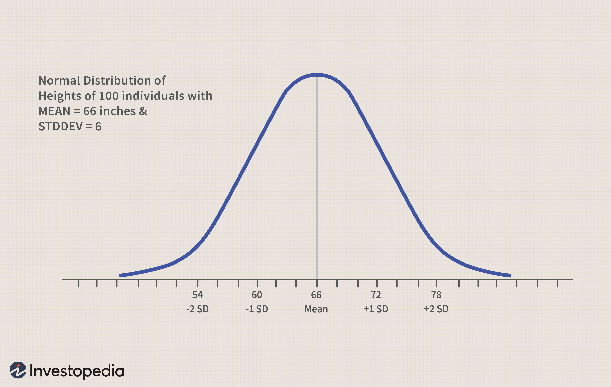

## Table of Contents

## What is the normal distribution in statistics?

The normal distribution, also known as the Gaussian distribution or bell curve, is a type of continuous probability distribution that is widely used in statistics. It is called "normal" because many natural phenomena, like heights or test scores, tend to follow this pattern. In a normal distribution, most of the data points are clustered around the mean, which is the highest point of the bell-shaped curve. The spread of the data is described by the standard deviation, which tells us how much the values vary from the mean.

The normal distribution is symmetric, meaning the left and right sides of the curve are mirror images of each other. This symmetry means that half of the data falls to the left of the mean and the other half to the right. The shape of the curve is determined by two parameters: the mean, which sets the center of the curve, and the standard deviation, which controls how wide or narrow the curve is. A smaller standard deviation results in a taller, narrower curve, while a larger standard deviation leads to a shorter, wider curve. The normal distribution is important in statistics because it helps us make predictions and understand the likelihood of different outcomes.

## How is the normal distribution represented graphically?

The normal distribution is shown as a bell-shaped curve on a graph. The curve is smooth and looks like a bell, which is why it's also called a bell curve. The highest point of the curve is right in the middle, at the mean of the data. This is where most of the data points are, and it shows that values close to the mean are the most common.

The graph has a horizontal line called the x-axis, which shows the values of the data. The vertical line, called the y-axis, shows how often those values happen. The curve is symmetrical, so if you fold the graph in half along the mean, both sides would match perfectly. The spread of the curve is controlled by something called the standard deviation. A small standard deviation makes the curve tall and skinny, while a big standard deviation makes it short and wide.

This bell-shaped curve helps us see how data is spread out. It's useful for understanding things like test scores or people's heights, where most values are around the middle, and fewer values are far away from the middle. By looking at the graph, we can quickly tell where most of the data is and how much it varies.

## What are the key characteristics of a normal distribution?

A normal distribution is a special kind of data pattern that looks like a bell when you draw it on a graph. The highest part of the bell is right in the middle, at the average value of the data, which we call the mean. This means that most of the data points are close to the mean. The curve is also symmetrical, so if you fold it in half at the mean, both sides would look the same. This shows that the data is spread out equally on both sides of the mean.

The spread of the data in a normal distribution is described by something called the standard deviation. A small standard deviation means the data is tightly packed around the mean, making the bell tall and skinny. A large standard deviation means the data is spread out more, making the bell short and wide. The normal distribution is important because it helps us predict and understand how likely different values are to happen. For example, it can tell us how common it is for someone to be much taller or shorter than average.

## What is the significance of the mean, median, and mode in a normal distribution?

In a normal distribution, the mean, median, and mode are all the same number. This number is right in the middle of the bell curve, at the highest point. The mean is the average of all the data points. The median is the middle number when you line up all the data from smallest to largest. The mode is the number that shows up the most often. Because the normal distribution is symmetrical, these three values are all the same, which makes it easy to understand where the center of the data is.

This special feature of the normal distribution helps us a lot. When the mean, median, and mode are the same, it tells us that the data is evenly spread out on both sides of the middle. This makes it easier to predict what might happen next or how likely certain outcomes are. For example, if we know the average height of a group of people follows a normal distribution, we can guess that most people will be close to that average height, and fewer people will be much taller or shorter.

## How do you calculate the standard deviation in a normal distribution?

To calculate the standard deviation in a normal distribution, you first need to find the mean, which is the average of all the data points. Once you have the mean, you go through each data point and find out how far it is from the mean. This distance is called the deviation. You then square each of these deviations to make sure all the numbers are positive. After that, you add up all the squared deviations and divide by the total number of data points. This gives you the variance. To get the standard deviation, you take the square root of the variance.

The standard deviation tells us how spread out the data is around the mean. A small standard deviation means that most of the data points are close to the mean, making the bell curve tall and skinny. A large standard deviation means the data points are more spread out, making the bell curve short and wide. This measure helps us understand how much the data varies and is very useful in a normal distribution because it helps us predict how likely it is for data points to fall within certain ranges around the mean.

## What is the empirical rule (68-95-99.7 rule) and how does it apply to normal distributions?

The empirical rule, also known as the 68-95-99.7 rule, is a handy way to understand how data is spread out in a normal distribution. It tells us that about 68% of the data falls within one standard deviation of the mean. That means if you take the mean and add or subtract one standard deviation, you'll find that about two-thirds of your data points will be in that range. Then, if you go out to two standard deviations from the mean, you'll cover about 95% of the data. And if you go out to three standard deviations, you'll cover about 99.7% of the data. This rule helps us quickly see how much of our data is close to the average and how much is farther away.

This rule is super useful because it gives us a quick way to predict where most of our data points will fall in a normal distribution. For example, if you're looking at test scores that follow a normal distribution, you can use the empirical rule to guess how many students scored close to the average, how many did much better, and how many did much worse. It helps make sense of the data without having to do a lot of complicated math. By knowing these percentages, you can better understand and work with data that follows a normal distribution.

## How can the normal distribution be used to model real-world phenomena?

The normal distribution is really helpful for understanding a lot of things in the real world. For example, if you look at the heights of a bunch of people, you'll find that most people are around the average height, and fewer people are really tall or really short. This pattern follows a normal distribution. The same goes for things like test scores, where most students get scores close to the average, and fewer students get really high or really low scores. By using the normal distribution, we can make predictions about how likely it is for someone to be a certain height or get a certain score on a test.

Another way the normal distribution helps us is in figuring out how things might change over time. For example, if a factory makes parts, the size of the parts might follow a normal distribution. This means most parts will be close to the right size, but some might be a bit bigger or smaller. By understanding this, the factory can make sure they're making good parts most of the time. The normal distribution also helps in areas like finance, where stock prices might move around the average price, or in weather forecasting, where temperatures might be close to the average for a certain time of year. By using the normal distribution, we can make better guesses about what might happen next.

## What is the difference between a normal distribution and a standard normal distribution?

A normal distribution is a bell-shaped curve that shows how data is spread out. It has a mean, which is the middle of the curve, and a standard deviation, which tells us how spread out the data is. The mean can be any number, and the standard deviation can be any positive number. This means that a normal distribution can look different depending on what the mean and standard deviation are. For example, if you're looking at the heights of people, the mean height might be different in different countries, and the standard deviation might be different depending on how varied the heights are.

A standard normal distribution is a special kind of normal distribution where the mean is always 0 and the standard deviation is always 1. This makes it easier to compare different sets of data because they're all on the same scale. To turn a normal distribution into a standard normal distribution, you use a process called standardization. This involves subtracting the mean from each data point and then dividing by the standard deviation. The result is a new set of data that follows the standard normal distribution, making it easier to use in calculations and predictions.

## How do you convert a normal distribution to a standard normal distribution?

To convert a normal distribution to a standard normal distribution, you need to do something called standardization. This means you take each number in your data and first subtract the mean of the data from it. This step moves the whole set of numbers so that their new average is zero. Then, you divide each of those new numbers by the standard deviation of the original data. This step squishes or stretches the numbers so that they fit perfectly into the standard normal distribution, which always has a mean of 0 and a standard deviation of 1.

Once you've done these steps, your data will follow the standard normal distribution. This is really useful because it lets you compare different sets of data easily. For example, if you have test scores from different classes, you can convert them all to the standard normal distribution and then see how they compare. It's like putting everything on the same scale, which makes it easier to understand and work with the data.

## What are z-scores and how are they used in relation to normal distributions?

Z-scores are a way to figure out how far away a certain number is from the average in a normal distribution. You get a z-score by taking a number, subtracting the mean of the data from it, and then dividing by the standard deviation. This tells you how many standard deviations away from the mean your number is. If a z-score is positive, it means the number is above the mean. If it's negative, it's below the mean. A z-score of 0 means the number is exactly at the mean.

Z-scores are really useful because they help us compare different sets of data that might have different means and standard deviations. For example, if you want to compare test scores from two different classes, you can turn those scores into z-scores. This way, you can see who did better compared to their classmates, even if the tests were different. Z-scores also help us use the standard normal distribution to find out how likely it is to get a certain score or value. By looking up a z-score in a standard normal distribution table, you can figure out the probability of getting a score that's that far away from the mean.

## How can you test if a dataset follows a normal distribution?

To check if a dataset follows a normal distribution, you can use a few different methods. One simple way is to make a histogram of the data. A histogram is a graph that shows how often different values happen in your data. If the histogram looks like a bell shape, with most of the data in the middle and less on the sides, it might be normally distributed. Another way is to use a Q-Q plot, which stands for quantile-quantile plot. This plot compares your data to what a perfect normal distribution would look like. If your data points line up well with the straight line on the Q-Q plot, then your data is likely normally distributed.

There are also more formal statistical tests you can use, like the Shapiro-Wilk test or the Kolmogorov-Smirnov test. These tests give you a number that tells you how likely it is that your data follows a normal distribution. If the number is low, it means your data probably isn't normally distributed. If the number is high, it's more likely that it is. These tests are good because they give you a clear answer, but they can be a bit tricky to understand and use. So, it's often a good idea to use a mix of these methods to be sure about whether your data follows a normal distribution.

## What are some common misconceptions about the normal distribution and how can they be addressed?

One common misconception about the normal distribution is that all data in the real world follows this pattern. This isn't true. While many things like heights and test scores often follow a normal distribution, there are lots of other types of data that don't. For example, income levels or the time it takes to complete a task might not be normally distributed. It's important to check the data before assuming it's normal. You can use tools like histograms or statistical tests to see if your data really fits the normal distribution.

Another misconception is that the normal distribution means everything is perfectly average. People sometimes think that if data is normally distributed, then extreme values can't happen. But that's not right. In a normal distribution, extreme values do happen, just not very often. About 68% of the data falls within one standard deviation of the mean, but that still leaves 32% outside of that range. So, while most values are close to the average, there's still room for some to be far away. Understanding this can help people see that even in a normal distribution, there's still a lot of variety in the data.

## What is Understanding Normal Distribution?

Normal distribution, also referred to as the Gaussian distribution, is a foundational concept in statistics, widely used due to its distinctive properties and applicability across various fields, including finance. The normal distribution is a continuous probability distribution represented by a bell-shaped curve that is symmetric about the mean. This symmetry indicates that data near the mean are more frequent in occurrence than data far from the mean. 

In terms of its mathematical expression, the normal distribution is defined by its probability density function (PDF):

$$
f(x | \mu, \sigma^2) = \frac{1}{\sqrt{2\pi\sigma^2}} \exp\left(-\frac{(x - \mu)^2}{2\sigma^2}\right)
$$

where $\mu$ is the mean, $\sigma^2$ is the variance, and $x$ represents the random variable.

In finance, the normal distribution is particularly significant because asset returns often display patterns that resemble a normal distribution. While financial data may not perfectly align with a normal distribution due to factors such as market events or fundamental changes, assuming normality can simplify the analysis. For instance, portfolio risk can be assessed using the standard deviation of returns, with assets displaying returns closer to a normal distribution aiding in better predictions of expected risk and return.

A remarkable property of the normal distribution is that its mean, median, and mode are identical, contributing to its symmetry. This characteristic simplifies calculations and predictions about market behavior since it implies that the distribution is evenly spread around the central value, reducing the likelihood of skewness.

Comprehending these properties allows traders and analysts to apply statistical techniques for predicting market behavior. By assuming normality, they can utilize statistical models to estimate future [volatility](/wiki/volatility-trading-strategies) and price movements, aiding in decision-making processes. However, it's important to recognize that while many market variables can be approximated using a normal distribution, real-world financial data may exhibit departures from normality due to extreme events or asymmetric information, necessitating the use of more robust statistical models in practice.

## What is the role of probability in normal distribution?

Probability is fundamentally the measure of the likelihood that a specific event will occur. Within the context of a normal distribution, probability becomes a powerful tool for evaluating potential outcomes in a given dataset. This is particularly relevant in fields such as finance, where normal distribution often models the returns of various assets.

The normal distribution, by virtue of its properties, facilitates the calculation of probabilities through tools such as the Z-score. The Z-score quantifies the number of standard deviations a data point is from the mean, making it a valuable metric for traders who intend to assess the likelihood of an asset price reaching a certain level. The Z-score is calculated as follows:

$$
Z = \frac{(X - \mu)}{\sigma}
$$

Where $X$ is the value of the dataset, $\mu$ is the mean, and $\sigma$ is the standard deviation. Traders interpret a high absolute value of the Z-score as an indication that the value is rare or unlikely under a normal distribution, thus facilitating strategic decision-making.

Another pivotal concept associated with probability within normal distributions is the empirical rule, also known as the 68-95-99.7 rule. This rule states that for a normal distribution:

- Approximately 68% of the data falls within one standard deviation of the mean.
- About 95% is within two standard deviations.
- Almost 99.7% falls within three standard deviations.

The empirical rule provides traders with a heuristic to forecast the probability of an asset's price fluctuation within a specific range. 

Furthermore, probability calculations derived from normal distribution are integral to decision-making processes under uncertainty in financial markets. By applying these calculations, traders can quantitatively assess risks and returns, optimize portfolios, and manage potential losses. As markets are inherently unpredictable, leveraging probability allows for structured evaluation and improvement of trading strategies, contributing to more informed and confident financial decisions.

## References & Further Reading

[1]: ["An Introduction to Statistical Learning"](https://www.statlearning.com/) by Gareth James, Daniela Witten, Trevor Hastie, and Robert Tibshirani

[2]: ["Quantitative Statistical Arbitrage"](https://en.wikipedia.org/wiki/Statistical_arbitrage) by Marcos Lopez de Prado

[3]: ["The Distribution of Stock Returns"](https://www.jstor.org/stable/2284641) by Eugene F. Fama, published in Financial Analysts Journal

[4]: ["Option Pricing Models and Volatility Using Excel-VBA"](https://onlinelibrary.wiley.com/doi/epdf/10.1002/9781119202097.fmatter) by Fabozzi, Jarrow, and Chincarini

[5]: ["Normality and the Calibration of Option Pricing Models"](https://arxiv.org/abs/1906.03507) by Peter Carr, Dilip Madan, and Liuren Wu

[6]: ["The Concepts and Practice of Mathematical Finance"](https://assets.cambridge.org/97805215/14088/frontmatter/9780521514088_frontmatter.pdf) by Mark S. Joshi

[7]: ["Financial Modeling"](https://corporatefinanceinstitute.com/resources/financial-modeling/what-is-financial-modeling/) by Simon Benninga

[8]: ["Financial Market Risks"](https://www.forbes.com/sites/mikepatton/2016/01/14/the-top-8-risks-of-the-financial-markets-in-2016/) by Christian S. Pedersen