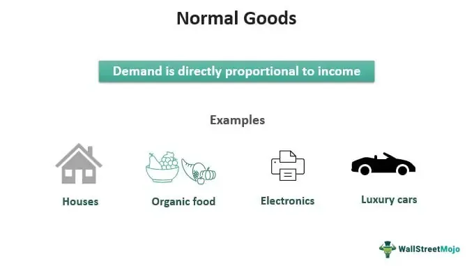

In the rapidly evolving financial landscape, understanding demand theory in economics and its implications is crucial for crafting effective trading strategies. Demand theory, a fundamental concept in economics, examines how the quantity of a good demanded by consumers changes in response to changes in price, income, and other factors. Central to this theory is the law of demand, which posits an inverse relationship between the price of a good and the quantity demanded, implying that, all else being equal, demand decreases as prices rise and increases as prices fall. This principle is foundational for analyzing consumer behavior and informing market strategies.

Normal goods play a significant role within this framework. These are goods for which demand increases as consumer income rises, characterized by a positive income elasticity of demand. Examples of normal goods include housing, automobiles, and electronics. Understanding the characteristics of normal goods helps businesses and policymakers anticipate demand shifts during periods of economic growth, allowing them to adjust production and marketing strategies accordingly.



Algorithmic trading, on the other hand, represents the application of modern technology to financial markets. By employing complex mathematical models and high-speed computing, algorithmic trading systems can execute trades with greater efficiency and accuracy than traditional methods. Strategies such as arbitrage, trend following, and statistical arbitrage are employed to exploit market inefficiencies and volatility.

These concepts—normal goods, demand theory, and algorithmic trading—are interlinked, each contributing to the dynamic operation of markets and consumer behavior. As algorithmic trading becomes more prevalent, integrating economic theories such as demand theory into trading algorithms has become essential. By understanding how consumer demand influences pricing and market conditions, traders can optimize algorithms to enhance execution and profitability.

This article explores these interconnected concepts, illuminating their significance and practical application in modern trading. By understanding how they converge, financial professionals can better navigate market complexities, optimize trading strategies, and leverage economic principles to achieve a competitive edge in today's financial markets.

## Table of Contents

## Understanding Demand Theory

Demand theory serves as a fundamental component within economic analysis, articulating the intricate relationship between consumer demand for goods and services and their respective price levels. The theory is anchored largely by the law of demand, which posits an inverse relationship between the price of a good and the quantity demanded. This principle assumes that, ceteris paribus, as the price of a good decreases, the quantity demanded by consumers increases, and vice versa. This inverse correlation is foundational to understanding consumer purchasing behavior and how price adjustments can influence market dynamics.

A critical concept within demand theory is the elasticity of demand, which measures the responsiveness or sensitivity of quantity demanded to changes in economic variables such as price and income. Elasticity can be quantified and expressed mathematically as the percentage change in quantity demanded divided by the percentage change in price, represented by the formula:

$$
E_d = \frac{\%\ \Delta Q_d}{\%\ \Delta P}
$$

where $E_d$ represents the price elasticity of demand, $\%\ \Delta Q_d$ denotes the percentage change in quantity demanded, and $\%\ \Delta P$ indicates the percentage change in price. A high elasticity suggests that demand is significantly responsive to price changes, which is characteristic of non-essential or luxury goods, whereas inelastic demand, often seen in necessities, implies that price changes have a relatively minor effect on the quantity demanded.

Furthermore, income elasticity of demand is an important metric within demand theory, describing how changes in consumer income affect the demand for various goods. It is calculated using the formula:

$$
E_i = \frac{\%\ \Delta Q_d}{\%\ \Delta I}
$$

where $E_i$ represents income elasticity of demand, and $\%\ \Delta I$ denotes the percentage change in consumer income. Goods with a positive income elasticity are considered normal goods, meaning their demand increases as consumer incomes rise.

These key concepts within demand theory are indispensable for analyzing market conditions and consumer behavior, ultimately informing pricing strategies and economic policies. Understanding the nuances of how and why consumers respond to changes in price and income is crucial for businesses seeking to optimize their offerings and for policymakers aiming to anticipate economic trends.

## Characteristics of Normal Goods

Normal goods are a fundamental concept in economics, characterized by their positive income elasticity of demand. This means that as consumer income increases, the demand for these goods also rises. Income elasticity of demand is quantified as the percentage change in quantity demanded divided by the percentage change in income:

$$
E_{income} = \frac{\text{% change in quantity demanded}}{\text{% change in income}}
$$

For normal goods, the elasticity ($E_{income}$) is positive, indicating that consumers purchase more of these goods as their income grows. Normal goods are essential for understanding consumer behavior, reflecting changes in purchasing power and preferences.

Examples of normal goods encompass a wide range of products, from basic necessities to luxury items. Essentials such as housing, food, and clothing see increased demand as individuals' economic situations improve. Similarly, luxury items like automobiles and high-end electronics also experience heightened demand, indicating consumer willingness to spend more on discretionary goods when financial resources allow.

Understanding the characteristics of normal goods is crucial for businesses and policymakers as it aids in predicting demand shifts in response to economic growth. Companies can optimize pricing and inventory decisions, while policymakers can design economic policies that account for changes in consumer purchasing patterns. By recognizing the role of normal goods, stakeholders can better anticipate market trends and align their strategies with evolving consumer demands.

## The Role of Algorithmic Trading

Algorithmic trading is an essential component of modern financial markets, utilizing sophisticated mathematical models and high-speed computing to execute trades with precision and efficiency. By automating trading strategies, [algorithmic trading](/wiki/algorithmic-trading) aims to capitalize on minute market inefficiencies that are often imperceptible to human traders.

Key strategies employed in algorithmic trading include [arbitrage](/wiki/arbitrage), [trend following](/wiki/trend-following), and [statistical arbitrage](/wiki/statistical-arbitrage). Arbitrage involves exploiting price discrepancies between different markets or financial instruments, enabling traders to buy low in one market and simultaneously sell high in another. This strategy is highly reliant on speed and accuracy, as these price differences can dissipate in seconds.

Trend following is another prevalent strategy, based on the assumption that assets which have been rising or falling in value will continue to do so. By identifying and acting on these trends, algorithms can optimize entry and [exit](/wiki/exit-strategy) points for trades. This strategy often employs moving averages and other technical indicators to make data-driven decisions.

Statistical arbitrage, or "stat arb," is a more complex strategy that relies on quantitative models to identify trading opportunities based on statistical correlations between various financial instruments. By constructing a portfolio of long and short positions, traders aim to profit from the convergence of these statistical relationships.

The capabilities of algorithmic trading have been significantly enhanced by advancements in [artificial intelligence](/wiki/ai-artificial-intelligence) (AI) and big data analytics. AI technologies, such as [machine learning](/wiki/machine-learning), enable algorithms to adapt to changing market conditions by continuously analyzing large volumes of data for patterns and anomalies. This adaptability allows for more informed decision-making and the refinement of trading strategies over time.

Additionally, the integration of big data into algorithmic trading systems provides vast amounts of information for analysis, from historical price data to real-time news feeds. This data-driven approach enhances the ability to forecast market movements and adjust trading strategies accordingly.

Python, a popular programming language in the financial industry, offers numerous libraries and tools that facilitate the development of algorithmic trading systems. For instance, the 'pandas' library is widely used for data manipulation and analysis, while 'numpy' provides support for high-level mathematical functions. Here is an example of a simple moving average crossover strategy using Python:

```python
import pandas as pd
import numpy as np
import matplotlib.pyplot as plt

# Load historical price data
data = pd.read_csv('historical_prices.csv')
data['Date'] = pd.to_datetime(data['Date'])
data.set_index('Date', inplace=True)

# Calculate moving averages
data['short_ma'] = data['Close'].rolling(window=20).mean()
data['long_ma'] = data['Close'].rolling(window=50).mean()

# Generate signals
data['signal'] = 0
data['signal'][20:] = np.where(data['short_ma'][20:] > data['long_ma'][20:], 1, 0)

# Calculate returns
data['daily_return'] = data['Close'].pct_change()
data['strategy_return'] = data['signal'].shift(1) * data['daily_return']

# Plot
plt.figure(figsize=(12, 6))
plt.plot(data['Close'], label='Price')
plt.plot(data['short_ma'], label='Short MA')
plt.plot(data['long_ma'], label='Long MA')
plt.title('Moving Average Crossover Strategy')
plt.legend()
plt.show()
```

This Python script demonstrates how to implement a simple moving average crossover strategy, which is a basic form of trend following. The strategy generates buy and sell signals based on the crossover of short-term and long-term moving averages.

As algorithmic trading continues to evolve, it remains a dominant force in the financial industry, continually shaped by ongoing innovations in technology. The integration of cutting-edge AI and big data analytics ensures that algorithmic trading will remain a pivotal tool for professionals seeking to leverage market inefficiencies and enhance trading outcomes.

## Integrating Demand Theory with Algorithmic Trading

Economic models, such as demand theory, are increasingly being incorporated into algorithmic trading systems to enhance decision-making processes. A critical aspect of this integration is demand elasticity, which measures how the quantity demanded of a good responds to changes in price or income. This measurement is pivotal for algorithmic trading as it allows automated systems to adapt pricing strategies in response to real-time market demand fluctuations.

In practical terms, demand elasticity is integrated into algorithmic trading algorithms by employing statistical and mathematical models that continuously analyze market data. For instance, a Python snippet that applies demand elasticity to adjust prices might look like this:

```python
def adjust_price_based_on_demand(initial_price, demand_elasticity, change_in_demand):
    return initial_price * (1 + demand_elasticity * change_in_demand)

# Example usage
current_price = 100  # Example current price of a stock or asset
elasticity = -0.5   # Example demand elasticity, typically negative for most goods
observed_demand_change = 0.10  # 10% increase in demand

new_price = adjust_price_based_on_demand(current_price, elasticity, observed_demand_change)
print(f"Adjusted Price: {new_price}")
```

Here, the elasticity [factor](/wiki/factor-investing) influences the price adjustment, aligning with consumer demand changes. A negative elasticity implies that an increase in demand will result in a lower incremental price adjustment due to the typical inverse relationship between price and demand.

Enhanced integration of demand theory facilitates improved trade execution and profitability by dynamically aligning trading strategies with consumer demand variations. Algorithmic platforms capable of recognizing these variations in real-time can better forecast demand trends and consequently optimize asset pricing strategies, resulting in more efficient market responses.

Furthermore, algorithms informed by demand theory can mitigate risks associated with volatile markets by adjusting trading strategies in anticipation of demand shifts. This capability is especially critical in high-frequency trading environments where split-second decisions can have significant financial implications.

Investments in advanced computing and analytics infrastructure are crucial for the successful integration of demand theory in algorithmic trading. As technology evolves, the precision and responsiveness of these systems are expected to improve, making them indispensable tools for traders aiming to capitalize on economic fluctuations efficiently.

Overall, the fusion of demand theory with algorithmic trading represents a sophisticated approach to navigating modern financial markets, offering businesses and traders enhanced insights and agility in strategy execution.

## Challenges and Considerations

Algorithmic trading systems encounter a variety of challenges that can impact trading effectiveness and market integrity. Among these, market [volatility](/wiki/volatility-trading-strategies) is a significant concern. Market fluctuations can lead to substantial variations in asset prices over short periods, posing risks to algorithmic strategies that rely on historical data for predictions. Additionally, the occurrence of flash crashes—dramatic, rapid drops in security prices within minutes—can lead to severe financial losses. These events often result from complex interactions between algorithmic trades and can destabilize markets temporarily.

Accurate demand modeling is another vital aspect. Algorithms must effectively estimate and react to consumer demand changes and market conditions. This involves sophisticated mathematical models that account for price elasticity and other economic factors to optimize trading decisions. Inaccurate models can lead to poor execution, missed opportunities, and substantial financial risk.

Ethical concerns are prominent in discussions around algorithmic trading, particularly in high-frequency trading ([HFT](/wiki/high-frequency-trading-strategies)). HFT can exploit millisecond-level differences in order execution speeds, which can disproportionately benefit technologically advanced traders. Such advantages may create an uneven playing field, raising concerns over market fairness and transparency. Policymakers and regulators examine these issues closely to ensure equitable market conditions.

Lastly, building effective algorithmic trading systems demands a multidisciplinary approach. Financial expertise must be combined with data science to design systems that are both robust and compliant. Developing these systems involves handling large datasets, applying statistical methods, and using machine learning models to update strategies in real time. This integration ensures that trading activities abide by regulatory standards while maintaining operational integrity.

To illustrate, a simple demand forecasting model in Python might use machine learning libraries such as `scikit-learn` to predict future prices based on historical data:

```python
from sklearn.model_selection import train_test_split
from sklearn.ensemble import RandomForestRegressor
import numpy as np

# Sample data: features (e.g., historical prices, volumes) and target (future price)
X = np.random.rand(100, 5)
y = np.random.rand(100)

# Split the data into train and test sets
X_train, X_test, y_train, y_test = train_test_split(X, y, test_size=0.2, random_state=42)

# Initialize and train the model
model = RandomForestRegressor(n_estimators=100, random_state=42)
model.fit(X_train, y_train)

# Make predictions
predictions = model.predict(X_test)
```

This example demonstrates algorithmic potential to model and predict market movements, although real-world applications are far more complex and data-intensive. The development of such models signifies the advanced interplay between demand theory and technological innovation in financial markets.

## The Future of Demand Theory and Algorithmic Trading

Advanced AI and machine learning technologies are significantly reshaping the application of economic theories, particularly within the sphere of algorithmic trading. The integration of these technologies facilitates the creation of predictive models that enhance the responsiveness of trading strategies to fluctuating market dynamics. By analyzing large volumes of data, machine learning algorithms can identify patterns and trends that may not be immediately evident through traditional analysis. This enables traders to deploy sophisticated demand-based strategies that anticipate changes in market conditions and consumer behavior with a high degree of accuracy.

Predictive analytics, a crucial component of this technological evolution, allows for the development of models that forecast market trends based on historical and real-time data. For example, regression analysis can be employed to predict future price movements, while time series analysis might be used to understand seasonal patterns affecting demand. Techniques such as clustering and classification help in segmenting financial data, assisting in identifying unique market conditions that might influence trading decisions.

```python
import numpy as np
from sklearn.linear_model import LinearRegression
from sklearn.model_selection import train_test_split

# Example: Simple prediction model using Linear Regression
# Assume X represents historical market data inputs, y represents price movements
X, y = np.array([[1, 2], [2, 3], [3, 4], [4, 5]]), np.array([2, 3, 4, 5])

# Splitting the dataset into training and test sets
X_train, X_test, y_train, y_test = train_test_split(X, y, test_size=0.2, random_state=42)

# Fitting the model
model = LinearRegression()
model.fit(X_train, y_train)

# Making predictions on the test set
predictions = model.predict(X_test)
```

The successful deployment of these technologies necessitates ongoing collaboration between economists, technologists, and regulators. Economists provide the foundational theories that inform model design, while technologists build and refine the algorithms that enable their practical application. Regulators play a critical role in ensuring that these advancements do not disrupt market stability or create unfair advantages. The ethical implications of advanced algorithmic trading methods, such as high-frequency trading, must be considered to prevent market manipulation and ensure fair trading conditions for all participants.

This interdisciplinary approach ensures that the integration of AI and machine learning into trading strategies is both efficient and ethically sound, supporting the continued evolution of financial markets. The future of algorithmic trading, bolstered by enhanced demand theory applications, promises to deliver increased efficiency and accuracy, benefiting stakeholders across the financial ecosystem.

## Conclusion

The synergy between demand theory and algorithmic trading holds promising potential for revolutionizing market strategies and enhancing operational efficiency. By comprehensively understanding and leveraging this relationship, traders gain the ability to adeptly navigate economic fluctuations and capitalize on emerging opportunities. Demand theory, with its focus on consumer behavior and price dynamics, provides foundational insights into market trends and shifts. When these insights are integrated into algorithmic trading systems, traders can exploit real-time data to make informed decisions, optimizing both pricing strategies and trade executions.

Algorithmic trading benefits from the precision and speed of mathematical models, which can incorporate demand elasticity and other economic indicators to adjust strategies dynamically. This adaptability is crucial in responding to volatile markets, where traditional trading methods may falter. The ability to predict and react to demand changes swiftly enables traders to maintain a competitive edge, ensuring better execution and profitability.

However, realizing the full potential of this integration requires ongoing innovation and regulatory adaptation. As technologies such as artificial intelligence and machine learning continue to evolve, they offer more advanced predictive capabilities, further enhancing the sophistication of demand-based trading strategies. Simultaneously, regulatory frameworks must evolve to ensure market fairness and mitigate risks associated with high-frequency trading practices.

The future of financial markets will be significantly shaped by this integration, necessitating collaboration between economists, technologists, and regulators. By fostering an environment of innovation and adapting to regulatory requirements, the financial industry can effectively harness the power of demand theory and algorithmic trading, ensuring a stable and efficient marketplace.

## References & Further Reading

For those interested in deepening their understanding of demand theory, normal goods, and algorithmic trading, there is a wealth of literature and resources available:

1. **Academic Papers**:
   - **"The Theory of Demand: A Historical Perspective"** by A.S. Aiyar provides an in-depth exploration of the evolution of demand theory and its foundational principles.
   - **"Income Elasticity of Demand for Various Commodities"** explores empirical studies on normal goods, offering insights into how demand varies with income changes (Journal of Economic Perspectives).
   - **"Algorithmic Trading and Information"** by B. Stoikov and M. Krellenstein, focuses on the impact of algorithmic trading on market dynamics and information dissemination (Quantitative Finance Journal).

2. **Industry Reports**:
   - **"The Future of Algorithmic Trading"** by McKinsey & Company discusses current trends in algorithmic trading, technological advancements, and regulatory impacts.
   - **"Global Market Insights on Consumer Demand"**, published by the World Economic Forum, highlights recent shifts in consumer behavior and demand influenced by economic factors.

3. **Books and Practical Guides**:
   - **"Economics: Principles, Problems, and Policies"** by Campbell McConnell, which investigates into fundamental economic principles, including demand theory.
   - **"Algorithmic Trading: Winning Strategies and Their Rationale"** by Ernest P. Chan, presents practical insights into designing and implementing algorithmic trading strategies using quantitative analysis.
   - **"Financial Modeling and Valuation: A Practical Guide to Investment Banking and Private Equity"** by Paul Pignataro offers a comprehensive look at financial modeling techniques, including demand forecasting.

4. **Online Courses and Workshops**:
   - Platforms such as Coursera and edX offer courses on demand theory, economics, and algorithmic trading. Courses like "Financial Markets" by Yale University and "Machine Learning for Trading" by Georgia Institute of Technology provide foundational knowledge and practical skills.

By engaging with these resources, individuals can gain a richer comprehension of the interplay between economic theories and modern trading practices, equipping themselves to better navigate and innovate in the financial sector.

