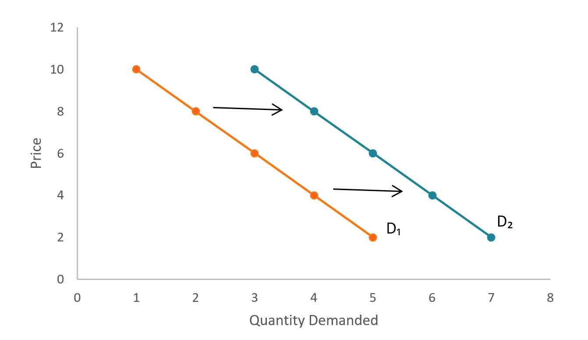

## Table of Contents

## What are normal goods?

Normal goods are products that people tend to buy more of when their income goes up. These are everyday items that become more affordable as people earn more money. For example, if someone gets a raise at work, they might start buying more fresh fruits and vegetables because they can now afford them more easily.

On the other hand, when people's income goes down, they usually buy less of these normal goods. This is because they need to save money and might switch to cheaper alternatives. For instance, if someone loses their job, they might buy fewer fresh fruits and vegetables and instead choose canned or frozen options that cost less.

## How do normal goods differ from inferior goods?

Normal goods and inferior goods are different in how people buy them when their income changes. Normal goods are things that people buy more of when they have more money. For example, if someone gets a raise, they might buy more steak because it's a normal good and they can afford it now. When their income goes down, they buy less of these normal goods because they need to save money.

Inferior goods are the opposite. These are things that people buy more of when their income goes down. For instance, if someone loses their job, they might buy more instant noodles because they're cheaper than other foods. When their income goes up, they buy less of these inferior goods because they can now afford better options.

So, the main difference is that with normal goods, people buy more when they have more money and less when they have less money. With inferior goods, people buy more when they have less money and less when they have more money.

## What are the key characteristics of normal goods?

Normal goods are things that people buy more of when they have more money. When people get a raise or their income goes up, they can afford to buy more of these goods. For example, if someone starts [earning](/wiki/earning-announcement) more, they might buy more fresh fruits and vegetables because they can now afford them easily. These goods are called "normal" because this is how most people act when they have more money to spend.

On the other hand, when people's income goes down, they usually buy less of these normal goods. This happens because they need to save money and might switch to cheaper options. For instance, if someone loses their job, they might buy fewer fresh fruits and vegetables and instead choose canned or frozen options that cost less. The key thing about normal goods is that the amount people buy changes in the same direction as their income.

## Can you provide examples of normal goods?

Normal goods are things that people buy more of when they have more money. For example, if someone gets a raise at work, they might start buying more fresh fruits and vegetables. These are normal goods because when people earn more, they can afford to buy more of them. Another example is buying more steak or other high-quality meats. When people have more money, they often choose to buy more expensive and better-quality food.

Clothing is another example of normal goods. When people's income goes up, they might buy more clothes, and they might choose nicer brands or higher-quality items. For instance, someone might switch from buying clothes at a discount store to shopping at a more expensive store. Electronics also fall into this category. If someone gets a raise, they might decide to buy a new smartphone or a better laptop because they can now afford it. These examples show how normal goods are things people buy more of when they have more money.

## How does income affect the demand for normal goods?

When people have more money, they tend to buy more normal goods. This happens because normal goods are things that people want more of when they can afford them. For example, if someone gets a raise at work, they might start buying more fresh fruits and vegetables or nicer clothes. They can afford to spend more on these items because their income has gone up. So, the demand for normal goods goes up when people's income increases.

On the other hand, when people's income goes down, they usually buy less of these normal goods. This is because they need to save money and might switch to cheaper options. For instance, if someone loses their job, they might buy fewer fresh fruits and vegetables and choose canned or frozen options instead. They might also buy fewer new clothes or electronics. So, the demand for normal goods goes down when people's income decreases.

## What is the income elasticity of demand for normal goods?

The income elasticity of demand for normal goods is a number that tells us how much the amount of a good people buy changes when their income changes. For normal goods, this number is positive. This means that when people's income goes up, they buy more of the good, and when their income goes down, they buy less of it. The bigger the number, the more sensitive the demand is to changes in income.

For example, if the income elasticity of demand for a normal good like fresh fruits is 1.5, it means that if people's income goes up by 10%, they will buy 15% more fresh fruits. On the other hand, if their income goes down by 10%, they will buy 15% less fresh fruits. This shows that normal goods are goods that people want more of when they can afford them, and the income elasticity of demand helps us understand how much their buying behavior changes with their income.

## How do normal goods respond to economic growth?

When the economy grows, people usually have more money to spend. This means they can buy more normal goods. Normal goods are things like fresh fruits and vegetables, nicer clothes, and better electronics. When people's income goes up because of economic growth, they want to buy more of these things. For example, if the economy is doing well and people are getting raises, they might start buying more steak or new smartphones because they can afford them now.

On the other hand, if the economy is not doing well and people's income goes down, they will buy less of these normal goods. They might switch to cheaper options to save money. For instance, during a recession, people might buy fewer fresh fruits and vegetables and choose canned or frozen options instead. So, normal goods are closely tied to how the economy is doing. When the economy grows, people buy more normal goods, and when it shrinks, they buy less.

## What is the relationship between normal goods and consumer preferences?

Normal goods are things that people want more of when they have more money. This means that as people's income goes up, they often choose to buy more of these goods because they can now afford them. For example, if someone gets a raise, they might buy more fresh fruits and vegetables or nicer clothes. These choices show that people's preferences for normal goods can change based on how much money they have. When they feel they can spend more, they often go for higher-quality or more expensive items.

Consumer preferences for normal goods also depend on what people value and enjoy. For instance, someone might really like fresh fruits and choose to buy more of them when they can afford it. Or, they might prefer nicer clothes and decide to spend more on fashion when their income increases. These preferences show that normal goods are not just about having more money, but also about what people want to spend their money on. So, as people's income changes, their ability to follow their preferences for normal goods also changes.

## How do price changes influence the demand for normal goods?

When the price of a normal good goes up, people usually buy less of it. This is because normal goods are things that people want more of when they have more money, but when the price goes up, it's like their money can buy less. For example, if the price of fresh fruits goes up, people might decide to buy fewer fruits because they cost more now. They might switch to cheaper options like canned fruits or other foods to save money. So, when prices go up, the demand for normal goods goes down.

On the other hand, when the price of a normal good goes down, people usually buy more of it. This happens because the good becomes more affordable, and people feel like they can spend their money on more of it. For instance, if the price of nice clothes goes down, people might buy more clothes because they can get more for their money. This shows that when prices go down, the demand for normal goods goes up. People's buying behavior changes based on how much they have to pay for these goods.

## What role do normal goods play in economic theory?

Normal goods are important in economic theory because they help explain how people's buying habits change when their income goes up or down. Economists use normal goods to understand how much people will buy of certain things when they have more money. For example, if people get a raise at work, they might buy more fresh fruits and vegetables or nicer clothes. These are normal goods because people want more of them when they can afford them. By studying normal goods, economists can predict how the demand for different products will change as the economy grows or shrinks.

Normal goods also help economists understand the concept of income elasticity of demand. This is a measure of how sensitive the demand for a good is to changes in income. For normal goods, this number is positive, meaning that when people's income goes up, they buy more of the good, and when their income goes down, they buy less. This helps economists make better models of the economy and predict how people will spend their money. Understanding normal goods is key to figuring out how economic growth affects what people buy and how they live.

## How can businesses use the concept of normal goods in their marketing strategies?

Businesses can use the concept of normal goods to make their marketing strategies better. They can focus on showing how their products are things that people want more of when they have more money. For example, a company selling fresh fruits and vegetables might advertise how their products are healthy and tasty, which can attract people who are earning more and want to spend on better food. By understanding that their product is a normal good, businesses can target their ads to people who are likely to have more money to spend, like those who just got a raise or live in areas with a growing economy.

Another way businesses can use the idea of normal goods is by adjusting their prices and promotions based on economic changes. When the economy is doing well and people have more money, businesses might raise their prices a bit because people are willing to pay more for normal goods. On the other hand, during tough economic times, they might offer discounts or special deals to keep people buying their products even when money is tight. By knowing how people's buying habits change with their income, businesses can make smarter decisions about when to change their prices and how to market their products to keep customers interested and buying.

## What are some advanced economic models that incorporate normal goods?

One advanced economic model that includes normal goods is the consumer choice theory. This model helps economists understand how people make decisions about what to buy based on their income and the prices of goods. In this model, normal goods are important because they show how people will buy more of certain things when they have more money. For example, if someone gets a raise, they might choose to buy more fresh fruits and vegetables, which are normal goods. By studying how people's choices change with their income, economists can predict how demand for different products will shift as the economy grows or shrinks.

Another model that uses normal goods is the income elasticity of demand model. This model looks at how sensitive the demand for a good is to changes in income. For normal goods, the income elasticity of demand is positive, meaning that when people's income goes up, they buy more of the good. Economists use this model to understand how economic growth affects what people buy. For instance, if the economy is doing well and people are earning more money, they might buy more electronics or nicer clothes, which are normal goods. This helps businesses and policymakers predict how changes in the economy will impact the demand for different products.

## What is Understanding Demand Theory?

Demand theory serves as a fundamental component within economic analysis, articulating the intricate relationship between consumer demand for goods and services and their respective price levels. The theory is anchored largely by the law of demand, which posits an inverse relationship between the price of a good and the quantity demanded. This principle assumes that, ceteris paribus, as the price of a good decreases, the quantity demanded by consumers increases, and vice versa. This inverse correlation is foundational to understanding consumer purchasing behavior and how price adjustments can influence market dynamics.

A critical concept within demand theory is the elasticity of demand, which measures the responsiveness or sensitivity of quantity demanded to changes in economic variables such as price and income. Elasticity can be quantified and expressed mathematically as the percentage change in quantity demanded divided by the percentage change in price, represented by the formula:

$$
E_d = \frac{\%\ \Delta Q_d}{\%\ \Delta P}
$$

where $E_d$ represents the price elasticity of demand, $\%\ \Delta Q_d$ denotes the percentage change in quantity demanded, and $\%\ \Delta P$ indicates the percentage change in price. A high elasticity suggests that demand is significantly responsive to price changes, which is characteristic of non-essential or luxury goods, whereas inelastic demand, often seen in necessities, implies that price changes have a relatively minor effect on the quantity demanded.

Furthermore, income elasticity of demand is an important metric within demand theory, describing how changes in consumer income affect the demand for various goods. It is calculated using the formula:

$$
E_i = \frac{\%\ \Delta Q_d}{\%\ \Delta I}
$$

where $E_i$ represents income elasticity of demand, and $\%\ \Delta I$ denotes the percentage change in consumer income. Goods with a positive income elasticity are considered normal goods, meaning their demand increases as consumer incomes rise.

These key concepts within demand theory are indispensable for analyzing market conditions and consumer behavior, ultimately informing pricing strategies and economic policies. Understanding the nuances of how and why consumers respond to changes in price and income is crucial for businesses seeking to optimize their offerings and for policymakers aiming to anticipate economic trends.

## What are the characteristics of normal goods?

Normal goods are a fundamental concept in economics, characterized by their positive income elasticity of demand. This means that as consumer income increases, the demand for these goods also rises. Income elasticity of demand is quantified as the percentage change in quantity demanded divided by the percentage change in income:

$$
E_{income} = \frac{\text{% change in quantity demanded}}{\text{% change in income}}
$$

For normal goods, the elasticity ($E_{income}$) is positive, indicating that consumers purchase more of these goods as their income grows. Normal goods are essential for understanding consumer behavior, reflecting changes in purchasing power and preferences.

Examples of normal goods encompass a wide range of products, from basic necessities to luxury items. Essentials such as housing, food, and clothing see increased demand as individuals' economic situations improve. Similarly, luxury items like automobiles and high-end electronics also experience heightened demand, indicating consumer willingness to spend more on discretionary goods when financial resources allow.

Understanding the characteristics of normal goods is crucial for businesses and policymakers as it aids in predicting demand shifts in response to economic growth. Companies can optimize pricing and inventory decisions, while policymakers can design economic policies that account for changes in consumer purchasing patterns. By recognizing the role of normal goods, stakeholders can better anticipate market trends and align their strategies with evolving consumer demands.

## References & Further Reading

For those interested in deepening their understanding of demand theory, normal goods, and [algorithmic trading](/wiki/algorithmic-trading), there is a wealth of literature and resources available:

1. **Academic Papers**:
   - **"The Theory of Demand: A Historical Perspective"** by A.S. Aiyar provides an in-depth exploration of the evolution of demand theory and its foundational principles.
   - **"Income Elasticity of Demand for Various Commodities"** explores empirical studies on normal goods, offering insights into how demand varies with income changes (Journal of Economic Perspectives).
   - **"Algorithmic Trading and Information"** by B. Stoikov and M. Krellenstein, focuses on the impact of algorithmic trading on market dynamics and information dissemination (Quantitative Finance Journal).

2. **Industry Reports**:
   - **"The Future of Algorithmic Trading"** by McKinsey & Company discusses current trends in algorithmic trading, technological advancements, and regulatory impacts.
   - **"Global Market Insights on Consumer Demand"**, published by the World Economic Forum, highlights recent shifts in consumer behavior and demand influenced by economic factors.

3. **Books and Practical Guides**:
   - **"Economics: Principles, Problems, and Policies"** by Campbell McConnell, which investigates into fundamental economic principles, including demand theory.
   - **"Algorithmic Trading: Winning Strategies and Their Rationale"** by Ernest P. Chan, presents practical insights into designing and implementing algorithmic trading strategies using quantitative analysis.
   - **"Financial Modeling and Valuation: A Practical Guide to Investment Banking and Private Equity"** by Paul Pignataro offers a comprehensive look at financial modeling techniques, including demand forecasting.

4. **Online Courses and Workshops**:
   - Platforms such as Coursera and edX offer courses on demand theory, economics, and algorithmic trading. Courses like "Financial Markets" by Yale University and "Machine Learning for Trading" by Georgia Institute of Technology provide foundational knowledge and practical skills.

By engaging with these resources, individuals can gain a richer comprehension of the interplay between economic theories and modern trading practices, equipping themselves to better navigate and innovate in the financial sector.

