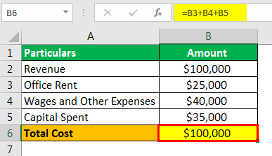

Profit calculation is a cornerstone concept in both traditional and algorithmic trading, offering a comprehensive framework for understanding financial outcomes and decision-making. In any trading environment, evaluating profitability is not merely about identifying gains and losses but involves a deeper analysis of various profit types that influence strategic financial decisions. The primary profit categories, including accounting profit, economic profit, and normal profit, serve distinct purposes in assessing a business's financial health and viability.

Accounting profit, the most straightforward concept, refers to the net income a business earns when total expenses are subtracted from total revenues. It provides a snapshot of a company's financial performance over a specific period and is the basis for tax calculations and financial reporting. Economic profit, however, extends beyond mere revenues and expenses to include opportunity costs—the value of the next best alternative foregone. This type of profit evaluation helps businesses understand the true profitability of their operations relative to other potential investments or ventures. Normal profit, on the other hand, arises when total revenue matches total costs, including both explicit and implicit costs, indicating a break-even point that reflects the minimum earnings required to sustain business operations in a competitive market.



In the context of algorithmic trading, precise profit calculation becomes indispensable due to the complexity and speed of modern financial markets. Algorithmic trading exploits computer algorithms to execute trades at speeds and frequencies that are impossible for a human trader. This technological approach necessitates sophisticated methodologies to assess and enhance trading strategies in real time. Traders rely on various metrics such as profit-to-loss ratios and the Sharpe Ratio to evaluate performance and manage risks effectively. These tools allow traders to refine their strategies, optimize returns, and minimize potential losses by offering insights into both short-term gains and long-term strategic outcomes.

Overall, a thorough understanding of these profit concepts and their applications in algorithmic trading assists traders in evaluating performance, managing risk, and enhancing trading strategies. By incorporating both traditional accounting principles and advanced algorithmic techniques, traders gain a competitive edge, enabling them to achieve sustained financial success in increasingly complex and competitive markets.

## Table of Contents

## What is Normal Profit?

Normal profit is a key concept in economics, representing the level of profit a business achieves when its total revenue equals its total costs—explicit and implicit. Explicit costs refer to direct, out-of-pocket expenses such as wages, rent, and materials. In contrast, implicit costs are the opportunity costs of employing resources in their next best alternative. Thus, normal profit implies a breakeven point where a firm makes just enough revenue to cover its total costs, without any surplus profit.

The quantification of normal profit is critical for businesses seeking to evaluate their operational efficiency. In a perfectly competitive market, firms tend to earn normal profit in the long run as they adjust output to match the industry's prevailing conditions. Firms making less than normal profit may eventually exit the market, while those consistently achieving or exceeding normal profit demonstrate both resilience and adaptability.

Mathematically, normal profit can be defined as:
$$
\text{Normal Profit} = \text{Total Revenue} - (\text{Explicit Costs} + \text{Implicit Costs}) = 0
$$

This calculation provides insight into the sustainability of a business's operations over time. By covering all incurred costs, normal profit indicates that the firm's resources are being utilized efficiently, ensuring economic equilibrium. A firm making normal profit can be seen as maintaining its market presence, while firms achieving higher levels of profit might attract new entrants due to evident profitability margins. Understanding these dynamics is essential for stakeholders assessing long-term business viability in competitive environments.

## Economic and Normal Profit

Economic profit is a crucial metric in financial analysis, offering insights beyond those garnered from accounting profit. While accounting profit is straightforward, calculated as the difference between total revenue and explicit costs, economic profit provides a more comprehensive view by incorporating both explicit and implicit (opportunity) costs. Opportunity costs, representing the potential returns from the next best alternative foregone, are vital for understanding the true profitability of a business venture.

Mathematically, economic profit can be expressed as:

$$
\text{Economic Profit} = \text{Total Revenue} - (\text{Explicit Costs} + \text{Implicit Costs})
$$

Normal profit, a subset of economic profit, is achieved when total revenue precisely covers all explicit and implicit costs, resulting in an economic profit of zero. At this point, a firm is covering its opportunity costs, indicating optimal utilization of its resources. This concept is integral in determining whether a firm should persist with its current operations or seek alternative uses for its resources.

The occurrence of normal profit signifies a state of economic equilibrium in perfectly competitive markets, where businesses earn just enough to keep their resources employed in the current activity. It neither results in excess profit nor losses, implying that the firm's venture is economically viable, and it is not incentivized to shift resources elsewhere.

Understanding economic and normal profits is essential for firms to gauge performance and strategic direction accurately. Analyzing these profit types helps not only in assessing current operations but also in making informed decisions about potential shifts in market strategy or reallocation of resources. Firms with consistent economic profits exceeding zero are well-positioned to consider expansion, innovation, or other avenues for growth, whereas those at or below normal profit may evaluate efficiency improvements or market [exit](/wiki/exit-strategy) strategies.

## Profit Calculation: A Practical Approach

Profit calculation is a crucial component for understanding the financial health of any business. It is computed by subtracting total costs from total revenues, offering a clear picture of profitability. In mathematical terms, profit $P$ can be defined as:

$$
P = \text{Total Revenue} - \text{Total Costs}
$$

Within this formula, total costs encompass both explicit and implicit costs. Explicit costs refer to direct, out-of-pocket expenses such as wages, rent, and materials. Implicit costs, on the other hand, represent the opportunity costs of utilizing resources that could have been deployed elsewhere. Although these costs do not appear on financial statements, they are critical for a comprehensive understanding of profitability.

In both traditional finance and [algorithmic trading](/wiki/algorithmic-trading), precise profit measurement is crucial for gauging success. Accurate profit calculations guide businesses and traders in evaluating performance and making informed strategic decisions.

Practitioners employ several strategies to refine the profit calculation process. For one, segregating costs into fixed and variable categories can aid in understanding how different expense types affect overall profitability. Fixed costs remain constant irrespective of production levels, while variable costs fluctuate with the level of output or trading activity.

In algorithmic trading, precise profit measurement necessitates consideration of various performance metrics and associated costs like transaction fees and slippage. Algorithmic traders often aim for a high profit-to-loss ratio, striving for more profitable trades than losses over time. Furthermore, metrics such as the Sharpe Ratio can provide insight into the risk-adjusted returns of trading strategies.

From a practical standpoint, Python scripts are often employed to automate profit calculations, ensuring accuracy and efficiency. Here is an example Python script that calculates profit, incorporating explicit and implicit costs:

```python
def calculate_profit(total_revenue, explicit_costs, implicit_costs):
    total_costs = explicit_costs + implicit_costs
    profit = total_revenue - total_costs
    return profit

# Example values
total_revenue = 150000
explicit_costs = 70000
implicit_costs = 20000

profit = calculate_profit(total_revenue, explicit_costs, implicit_costs)
print(f"Profit: ${profit}")
```

This script exemplifies how businesses, including algorithmic traders, can systematically calculate profit, taking all relevant costs into account. In conclusion, understanding the nuances of implicit and explicit costs in profit calculations allows practitioners to make informed decisions, tailoring strategies for enhanced performance.

## Algorithmic Trading and Profit Measurement

Algorithmic trading leverages sophisticated algorithms to automate the trading process in financial markets, aiming for efficiency and speed beyond human capability. Accurate profit measurement is pivotal in this arena since it determines the effectiveness of trading strategies and influences risk management decisions. 

The gross profit in algorithmic trading is a key metric. It is calculated by subtracting total trading costs from the total revenue generated by executed trades. These costs include transaction fees, slippage, and other associated expenses. Transaction fees cover the cost of executing trades on exchanges, [liquidity](/wiki/liquidity-risk-premium) providers, or brokers. Slippage refers to the discrepancy between the expected price of a trade and the actual price at which it is executed, often occurring during periods of high market [volatility](/wiki/volatility-trading-strategies) or low liquidity.

Traders utilize various tools and techniques to assess profitability and risk. The profit-to-loss ratio is a straightforward metric that compares the total amount of profit generated to the total losses incurred. A higher ratio suggests a more effective trading strategy. 

Another critical tool is the Sharpe Ratio, which measures the risk-adjusted return of a trading strategy. It is defined as:

$$
\text{Sharpe Ratio} = \frac{E[R] - R_f}{\sigma_R}
$$

Where:
- $E[R]$ is the expected return of the trading strategy.
- $R_f$ is the risk-free rate of return.
- $\sigma_R$ is the standard deviation of the strategy's excess return.

This ratio helps traders understand the balance between the risk they are taking and the returns they expect to achieve, providing a quantitative basis for evaluating and ranking trading strategies. 

Incorporating these metrics into a trading algorithm requires not only statistical analysis but also integration with trading platforms that can handle large volumes of data in real-time. This enables the constant evaluation and adjustment of trading strategies to maintain or enhance profitability. These considerations are crucial for traders seeking sustained success in the competitive landscape of algorithmic trading.

## Examples of Profit/Loss Ratios in Algo Trading

Profit factors in algorithmic trading are critical metrics used to assess the efficacy of trading strategies. In essence, the profit [factor](/wiki/factor-investing) is the ratio of gross profits to gross losses. A profit factor greater than one indicates that the strategy is profitable, while a profit factor less than one suggests losses. 

Mathematically, the profit factor (PF) can be expressed as:

$$
PF = \frac{\text{Total Gross Profit}}{\text{Total Gross Loss}}
$$

In practice, traders and analysts utilize profit factors to scrutinize and refine their strategies. By leveraging historical trading data, it is possible to identify patterns and inefficiencies within a given strategy. A higher profit factor implies a more efficient and potentially lucrative strategy.

### Case Studies and Mathematical Representation

Consider a case study where a trading algorithm is tested over a period of time, and the following outcomes are observed:

- Total gross profits amount to $120,000
- Total gross losses are $80,000 

Using the formula:

$$
PF = \frac{120,000}{80,000} = 1.5
$$

This profit factor of 1.5 demonstrates that for every dollar lost, the strategy gains 1.5 dollars, indicating the strategy is effective yet may still have room for improvement.

### Python Implementation

Python, with its rich set of libraries and ease of use, is often employed to automate these calculations. Here's a simple Python script to calculate the profit factor from a set of trades:

```python
def calculate_profit_factor(profits, losses):
    total_gross_profit = sum(profits)
    total_gross_loss = sum(losses)
    return total_gross_profit / total_gross_loss if total_gross_loss != 0 else float('inf')

# Example transaction data
profits = [5000, 7000, 4000, 3000, 10000]
losses = [3000, 4000, 2000, 1000]

profit_factor = calculate_profit_factor(profits, losses)
print(f"Profit Factor: {profit_factor:.2f}")
```

By implementing such scripts, traders can efficiently assess the performance of their strategies in real time, making necessary adjustments to maximize profitability. In addition to evaluating current strategies, profit factors also allow iteration over multiple strategies to explore various avenues for optimization.

Overall, understanding and effectively applying profit factor calculations empower traders to evaluate and refine their algorithmic strategies, leading to enhanced trading outcomes.

## Challenges in Automated Profit Calculation

In algorithmic trading, precise profit calculation is contingent on the reliability of data and the timeliness of updates. High-frequency trading systems demand real-time data to evaluate market conditions swiftly and to make trading decisions based on the most current information available. Any delay or inaccuracy in data can significantly affect profit calculations, leading to incorrect assessments of a trading strategy's performance.

Incorporating qualitative factors, such as news sentiment and geopolitical events, adds a layer of complexity to automated profit calculations. While traditional quantitative data is structured and numerical, qualitative data often requires advanced natural language processing (NLP) techniques to be effectively integrated into trading models. For instance, extracting sentiment scores from financial news articles allows traders to gauge market mood, which can influence price movements significantly. Developing algorithms that interpret sentiment accurately remains a challenge, given the nuances and context dependency of human language.

Furthermore, diversification is a key risk management strategy in algorithmic trading. By spreading investments across various assets or strategies, traders can mitigate potential risks inherent in market volatility or unforeseen events. Real-time assessment tools, such as Value at Risk (VaR) and stress testing models, are crucial in evaluating the impact of different trading scenarios. These tools enable traders to anticipate losses under extreme market conditions and adapt their strategies accordingly.

Python remains a popular choice for implementing these complex systems due to its rich ecosystem of libraries such as pandas for data manipulation, nltk for natural language processing, and numpy for numerical computations. By leveraging these tools, algorithmic traders can enhance their profit calculations, making them both accurate and adaptable to changing market conditions. 

```python
import pandas as pd
import numpy as np

# Example of calculating simple moving average (SMA) for a given dataset
def calculate_sma(data, window=20):
    return data.rolling(window=window).mean()

# Example dataset: closing prices
data = pd.Series([100, 102, 101, 105, 107, 111, 110, 115, 120, 125])

# Calculate 3-day SMA
sma = calculate_sma(data, window=3)
print("3-day SMA:")
print(sma)
```

The utilization of such methods underscores the importance of integrating advanced computational tools in the evolving landscape of automated trading. Addressing the challenges in profit calculation not only involves refining algorithms for data accuracy and timeliness but also necessitates a keen understanding of how qualitative factors and robust risk management can enhance trading strategy evaluations.

## Conclusion

Mastering the concepts of normal, economic, and accounting profits is essential for effective financial decision-making. These concepts provide a framework for understanding the financial health of businesses and are critical in developing strategies that ensure sustainability and growth. Normal profit, which occurs when total revenue equals total costs including opportunity costs, serves as a baseline to determine whether a company's resources are being optimally utilized. Recognizing the point at which economic profit becomes zero allows firms to evaluate their competitive position and consider strategic adjustments if needed.

In algorithmic trading, the precision and speed with which profit calculations are executed are paramount to evaluating trading strategies effectively. The complex nature of algorithmic trading, with its reliance on high-frequency data and automated execution, necessitates meticulous profit and loss assessments. Traders must employ reliable metrics such as the profit-to-loss ratio and the Sharpe Ratio to ensure their trading algorithms perform as expected. This rigorous analysis helps in not only assessing past performance but also in predicting future outcomes, thus aiding in fine-tuning trading strategies for enhanced performance.

By integrating accounting principles with algorithmic trading strategies, traders gain a competitive advantage that promotes sustained financial success. Accounting insights provide a solid foundation for understanding cash flow, revenue recognition, and cost management, while algorithmic techniques offer speed and accuracy in executing trades. Combining these approaches enables traders to construct robust strategies that effectively manage risk and capitalize on market opportunities, thereby achieving long-term profitability. The synergy of these methodologies aligns traditional financial insights with cutting-edge technological advancements, setting the stage for traders to excel in increasingly dynamic financial markets.

## References & Further Reading

- **Advances in Financial Machine Learning by Marcos Lopez de Prado**: This book focuses on the integration of machine learning techniques into financial markets analysis. It provides comprehensive tools and methods for algorithmic trading practitioners to improve the accuracy and performance of financial models. Key topics include financial data structure, advanced algorithmic strategies, and overfitting remedies in the context of backtesting results.

- **Evidence-Based Technical Analysis: Applying the Scientific Method and Statistical Inference to Trading Signals by David Aronson**: Aronson's work underscores the importance of rigorous scientific and statistical methodologies in evaluating trading strategies. The book critiques conventional technical analysis approaches by promoting a hypothesis-driven framework supported by empirical evidence, ensuring enhanced reliability in trading decision-making processes.

- **Machine Learning for Algorithmic Trading by Stefan Jansen**: Jansen offers a practical guide to deploying machine learning in the algorithmic trading domain. Covering various aspects from data acquisition and processing to model development and strategy implementation, the book emphasizes the role of predictive analytics and the use of Python for crafting robust trading solutions.

- **Quantitative Trading: How to Build Your Own Algorithmic Trading Business by Ernest P. Chan**: This book provides insights into setting up an algorithmic trading business, focusing on strategy development, risk management, and essential operational practices. Chan discusses the integration of quantitative models with practical trading aspects, offering guidance on strategy testing and adaptation to market conditions.

