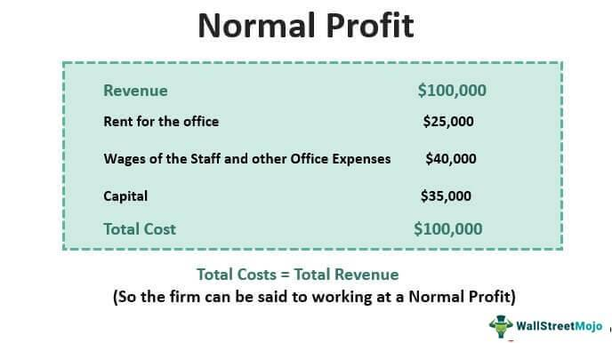

## Table of Contents

## What is normal profit?

Normal profit is a term used in economics to describe the minimum amount of profit a business needs to make to keep operating. It's not about making a lot of money, but just enough to cover all the costs, including the opportunity costs. Opportunity costs are what the business owner could have earned if they had used their resources in a different way, like investing in another business or working a different job.

If a business makes normal profit, it means it's doing just well enough to stay in business, but not well enough to grow or expand. It's like breaking even, but considering all the costs, including what the owner could have made elsewhere. If a business makes more than normal profit, that extra amount is called economic profit. If it makes less, it might eventually have to close down because it's not covering all its costs.

## How does normal profit differ from economic profit?

Normal profit and economic profit are two different ways to look at how well a business is doing. Normal profit is the minimum amount of money a business needs to make to keep going. It covers all the costs, including what the owner could have earned if they did something else with their time and money. If a business makes normal profit, it's just breaking even when you consider all these costs. It's not losing money, but it's not making enough to grow or expand either.

Economic profit, on the other hand, is any money a business makes over and above normal profit. If a business makes more money than it needs to just stay in business, that extra money is called economic profit. This is the profit that can be used to grow the business, pay bonuses, or save for the future. So, while normal profit means a business is just getting by, economic profit means it's doing better than just getting by.

## Why is normal profit important for a business?

Normal profit is important for a business because it shows if the business is doing well enough to keep going. If a business makes normal profit, it means it's covering all its costs, including what the owner could have made if they did something else with their time and money. This is important because it tells the owner that the business is at least breaking even, and they're not losing money by running it.

Knowing about normal profit also helps business owners make decisions. If they're not making normal profit, they might need to change something, like lowering costs or raising prices. If they are making normal profit, they know they're on the right track, but they might want to find ways to make more than just normal profit so they can grow the business. So, normal profit is a key number that helps keep the business healthy and guides the owner in making smart choices.

## What are the components needed to calculate normal profit?

To calculate normal profit, you need to know the total revenue of the business, which is all the money it makes from selling its products or services. You also need to know the explicit costs, which are the direct costs like rent, wages, and materials. These are easy to see because they show up as bills and payments.

Next, you need to consider the implicit costs, which are harder to see but just as important. Implicit costs are the opportunities the business owner gives up by running the business. This includes the money they could have made if they worked somewhere else or invested their money in something else. To find normal profit, you subtract both the explicit and implicit costs from the total revenue. If the result is zero, the business is making normal profit, which means it's just covering all its costs, including what the owner could have made elsewhere.

## How do you calculate normal profit?

To calculate normal profit, you start by figuring out the total revenue of your business. This is all the money you make from selling your products or services. Then, you need to subtract the explicit costs, which are the direct costs like rent, wages, and the cost of materials. These are the bills and payments you see every day.

Next, you have to consider the implicit costs. These are the costs that are not as easy to see, but they are very important. Implicit costs are what you could have earned if you used your time and money in a different way, like working another job or investing in something else. To find normal profit, you subtract both the explicit and implicit costs from your total revenue. If what's left is zero, that means you're making normal profit. This means your business is just covering all its costs, including what you could have made if you did something else with your time and money.

## Can you provide a simple example of normal profit calculation for a small business?

Imagine you own a small bakery. Last month, you made $10,000 from selling your delicious cakes and cookies. That's your total revenue. Now, let's look at your costs. You paid $4,000 for ingredients, rent, and your employee's wages. These are your explicit costs. But there's more to consider. Before you started the bakery, you had a job that paid you $3,000 a month. By running the bakery, you gave up that job, so that $3,000 is your implicit cost.

To find out if you made normal profit, you add up your explicit and implicit costs. In this case, that's $4,000 plus $3,000, which equals $7,000. Now, subtract this total cost from your total revenue. So, $10,000 minus $7,000 leaves you with $3,000. Since this number is not zero, you made more than normal profit last month. If it had been zero, that would mean you made normal profit, just enough to cover all your costs, including what you could have earned at your old job.

## What role does opportunity cost play in determining normal profit?

Opportunity cost is a big part of figuring out normal profit. It's the money you could have made if you did something else with your time and money instead of running your business. For example, if you used to have a job that paid you $3,000 a month before you started your business, that $3,000 is your opportunity cost. You gave up that job to run your business, so you need to count that money as a cost.

When you calculate normal profit, you subtract both your direct costs, like rent and supplies, and your opportunity cost from your total revenue. If what's left is zero, you're making normal profit. This means your business is just covering all its costs, including what you could have made at your old job. If you make more than zero, you're doing better than just breaking even. If you make less, you might need to rethink your business because it's not covering all your costs, including what you could have earned elsewhere.

## How does normal profit relate to the concept of break-even point?

Normal profit and the break-even point are related but not exactly the same. The break-even point is when a business makes just enough money to cover its direct costs, like rent, wages, and supplies. At the break-even point, the business isn't losing money, but it's also not making any profit. It's just breaking even.

Normal profit goes a step further. It includes not only the direct costs but also the opportunity costs, which is the money the business owner could have made if they did something else with their time and money. So, normal profit is the amount of money a business needs to make to cover all its costs, including what the owner could have earned elsewhere. If a business makes normal profit, it's at a kind of break-even point that considers all costs, not just the direct ones.

## In what scenarios might a business operate with normal profit?

A business might operate with normal profit in a very competitive market where there are lots of other businesses selling the same thing. In this situation, the business can't charge more for its products because customers can just go to another business that sells the same thing for less. So, the business makes just enough money to cover all its costs, including what the owner could have earned doing something else. This is normal profit.

Another scenario is when a business is new and still trying to find its place in the market. The owner might be okay with making normal profit at first because they're focused on building a customer base and getting their name out there. Once they have a solid foundation, they can start looking for ways to make more than normal profit and grow the business.

## How can understanding normal profit help in making business decisions?

Understanding normal profit helps business owners make smart choices about their business. If a business is making normal profit, it means it's just covering all its costs, including what the owner could have made doing something else. This tells the owner that the business is doing okay but not great. They might decide to keep things the same if they're happy with just breaking even, or they might look for ways to cut costs or raise prices to make more money.

If a business is making less than normal profit, it's a sign that something needs to change. The owner might need to find cheaper ways to run the business or think about selling different products that can make more money. On the other hand, if the business is making more than normal profit, the owner knows they're doing well and can think about growing the business, like opening a new location or hiring more people. Knowing about normal profit helps the owner see where the business stands and what steps to take next.

## What are the implications of not achieving normal profit in the long term?

If a business doesn't make normal profit over a long time, it can be in big trouble. Normal profit means the business is covering all its costs, including what the owner could have made doing something else. If it's not making normal profit, it's not even breaking even when you think about all the costs. This means the business is losing money, and if it keeps losing money, it might have to close down. The owner might need to use their own savings or borrow money to keep the business going, but that's not a good plan for the long term.

Not achieving normal profit can also make the owner feel frustrated and tired. Running a business is hard work, and if it's not making enough money to cover all the costs, the owner might start thinking about doing something else. They might decide to go back to a regular job or start a different business that could make more money. So, not making normal profit over a long time can lead to the business failing and the owner giving up on their dream.

## How do different market structures affect the likelihood of achieving normal profit?

Different market structures can make it easier or harder for a business to make normal profit. In a perfectly competitive market, where lots of businesses sell the same thing and customers can easily switch between them, it's tough to make more than normal profit. Businesses have to keep their prices low to stay in the game, so they usually just make enough to cover all their costs, including what the owner could have made doing something else. That's normal profit. If a business tries to charge more, customers will go to another business, so normal profit is the best a business can hope for in the long run.

In other market structures, like monopolies or oligopolies, it's different. A monopoly is when one business controls the whole market and can set prices however they want. An oligopoly is when a few big businesses control the market and work together to keep prices high. In these situations, businesses can make a lot more than normal profit because they face less competition. They can charge more for their products and keep making money over and above what they need just to stay in business. So, the type of market a business is in can really change how likely it is to make normal profit or even more than that.

## What is the difference between Economic Profit and Normal Profit?

Economic profit is a crucial metric in financial analysis, offering insights beyond those garnered from accounting profit. While accounting profit is straightforward, calculated as the difference between total revenue and explicit costs, economic profit provides a more comprehensive view by incorporating both explicit and implicit (opportunity) costs. Opportunity costs, representing the potential returns from the next best alternative foregone, are vital for understanding the true profitability of a business venture.

Mathematically, economic profit can be expressed as:

$$
\text{Economic Profit} = \text{Total Revenue} - (\text{Explicit Costs} + \text{Implicit Costs})
$$

Normal profit, a subset of economic profit, is achieved when total revenue precisely covers all explicit and implicit costs, resulting in an economic profit of zero. At this point, a firm is covering its opportunity costs, indicating optimal utilization of its resources. This concept is integral in determining whether a firm should persist with its current operations or seek alternative uses for its resources.

The occurrence of normal profit signifies a state of economic equilibrium in perfectly competitive markets, where businesses earn just enough to keep their resources employed in the current activity. It neither results in excess profit nor losses, implying that the firm's venture is economically viable, and it is not incentivized to shift resources elsewhere.

Understanding economic and normal profits is essential for firms to gauge performance and strategic direction accurately. Analyzing these profit types helps not only in assessing current operations but also in making informed decisions about potential shifts in market strategy or reallocation of resources. Firms with consistent economic profits exceeding zero are well-positioned to consider expansion, innovation, or other avenues for growth, whereas those at or below normal profit may evaluate efficiency improvements or market [exit](/wiki/exit-strategy) strategies.

## How can we approach profit calculation practically?

Profit calculation is a crucial component for understanding the financial health of any business. It is computed by subtracting total costs from total revenues, offering a clear picture of profitability. In mathematical terms, profit $P$ can be defined as:

$$
P = \text{Total Revenue} - \text{Total Costs}
$$

Within this formula, total costs encompass both explicit and implicit costs. Explicit costs refer to direct, out-of-pocket expenses such as wages, rent, and materials. Implicit costs, on the other hand, represent the opportunity costs of utilizing resources that could have been deployed elsewhere. Although these costs do not appear on financial statements, they are critical for a comprehensive understanding of profitability.

In both traditional finance and [algorithmic trading](/wiki/algorithmic-trading), precise profit measurement is crucial for gauging success. Accurate profit calculations guide businesses and traders in evaluating performance and making informed strategic decisions.

Practitioners employ several strategies to refine the profit calculation process. For one, segregating costs into fixed and variable categories can aid in understanding how different expense types affect overall profitability. Fixed costs remain constant irrespective of production levels, while variable costs fluctuate with the level of output or trading activity.

In algorithmic trading, precise profit measurement necessitates consideration of various performance metrics and associated costs like transaction fees and slippage. Algorithmic traders often aim for a high profit-to-loss ratio, striving for more profitable trades than losses over time. Furthermore, metrics such as the Sharpe Ratio can provide insight into the risk-adjusted returns of trading strategies.

From a practical standpoint, Python scripts are often employed to automate profit calculations, ensuring accuracy and efficiency. Here is an example Python script that calculates profit, incorporating explicit and implicit costs:

```python
def calculate_profit(total_revenue, explicit_costs, implicit_costs):
    total_costs = explicit_costs + implicit_costs
    profit = total_revenue - total_costs
    return profit

# Example values
total_revenue = 150000
explicit_costs = 70000
implicit_costs = 20000

profit = calculate_profit(total_revenue, explicit_costs, implicit_costs)
print(f"Profit: ${profit}")
```

This script exemplifies how businesses, including algorithmic traders, can systematically calculate profit, taking all relevant costs into account. In conclusion, understanding the nuances of implicit and explicit costs in profit calculations allows practitioners to make informed decisions, tailoring strategies for enhanced performance.

## What is Algorithmic Trading and how is Profit Measured in it?

Algorithmic trading leverages sophisticated algorithms to automate the trading process in financial markets, aiming for efficiency and speed beyond human capability. Accurate profit measurement is pivotal in this arena since it determines the effectiveness of trading strategies and influences risk management decisions. 

The gross profit in algorithmic trading is a key metric. It is calculated by subtracting total trading costs from the total revenue generated by executed trades. These costs include transaction fees, slippage, and other associated expenses. Transaction fees cover the cost of executing trades on exchanges, [liquidity](/wiki/liquidity-risk-premium) providers, or brokers. Slippage refers to the discrepancy between the expected price of a trade and the actual price at which it is executed, often occurring during periods of high market [volatility](/wiki/volatility-trading-strategies) or low liquidity.

Traders utilize various tools and techniques to assess profitability and risk. The profit-to-loss ratio is a straightforward metric that compares the total amount of profit generated to the total losses incurred. A higher ratio suggests a more effective trading strategy. 

Another critical tool is the Sharpe Ratio, which measures the risk-adjusted return of a trading strategy. It is defined as:

$$
\text{Sharpe Ratio} = \frac{E[R] - R_f}{\sigma_R}
$$

Where:
- $E[R]$ is the expected return of the trading strategy.
- $R_f$ is the risk-free rate of return.
- $\sigma_R$ is the standard deviation of the strategy's excess return.

This ratio helps traders understand the balance between the risk they are taking and the returns they expect to achieve, providing a quantitative basis for evaluating and ranking trading strategies. 

Incorporating these metrics into a trading algorithm requires not only statistical analysis but also integration with trading platforms that can handle large volumes of data in real-time. This enables the constant evaluation and adjustment of trading strategies to maintain or enhance profitability. These considerations are crucial for traders seeking sustained success in the competitive landscape of algorithmic trading.

## What are some examples of profit/loss ratios in algo trading?

Profit factors in algorithmic trading are critical metrics used to assess the efficacy of trading strategies. In essence, the profit [factor](/wiki/factor-investing) is the ratio of gross profits to gross losses. A profit factor greater than one indicates that the strategy is profitable, while a profit factor less than one suggests losses. 

Mathematically, the profit factor (PF) can be expressed as:

$$
PF = \frac{\text{Total Gross Profit}}{\text{Total Gross Loss}}
$$

In practice, traders and analysts utilize profit factors to scrutinize and refine their strategies. By leveraging historical trading data, it is possible to identify patterns and inefficiencies within a given strategy. A higher profit factor implies a more efficient and potentially lucrative strategy.

### Case Studies and Mathematical Representation

Consider a case study where a trading algorithm is tested over a period of time, and the following outcomes are observed:

- Total gross profits amount to $120,000
- Total gross losses are $80,000 

Using the formula:

$$
PF = \frac{120,000}{80,000} = 1.5
$$

This profit factor of 1.5 demonstrates that for every dollar lost, the strategy gains 1.5 dollars, indicating the strategy is effective yet may still have room for improvement.

### Python Implementation

Python, with its rich set of libraries and ease of use, is often employed to automate these calculations. Here's a simple Python script to calculate the profit factor from a set of trades:

```python
def calculate_profit_factor(profits, losses):
    total_gross_profit = sum(profits)
    total_gross_loss = sum(losses)
    return total_gross_profit / total_gross_loss if total_gross_loss != 0 else float('inf')

# Example transaction data
profits = [5000, 7000, 4000, 3000, 10000]
losses = [3000, 4000, 2000, 1000]

profit_factor = calculate_profit_factor(profits, losses)
print(f"Profit Factor: {profit_factor:.2f}")
```

By implementing such scripts, traders can efficiently assess the performance of their strategies in real time, making necessary adjustments to maximize profitability. In addition to evaluating current strategies, profit factors also allow iteration over multiple strategies to explore various avenues for optimization.

Overall, understanding and effectively applying profit factor calculations empower traders to evaluate and refine their algorithmic strategies, leading to enhanced trading outcomes.

## References & Further Reading

- **Advances in Financial Machine Learning by Marcos Lopez de Prado**: This book focuses on the integration of machine learning techniques into financial markets analysis. It provides comprehensive tools and methods for algorithmic trading practitioners to improve the accuracy and performance of financial models. Key topics include financial data structure, advanced algorithmic strategies, and overfitting remedies in the context of backtesting results.

- **Evidence-Based Technical Analysis: Applying the Scientific Method and Statistical Inference to Trading Signals by David Aronson**: Aronson's work underscores the importance of rigorous scientific and statistical methodologies in evaluating trading strategies. The book critiques conventional technical analysis approaches by promoting a hypothesis-driven framework supported by empirical evidence, ensuring enhanced reliability in trading decision-making processes.

- **Machine Learning for Algorithmic Trading by Stefan Jansen**: Jansen offers a practical guide to deploying machine learning in the algorithmic trading domain. Covering various aspects from data acquisition and processing to model development and strategy implementation, the book emphasizes the role of predictive analytics and the use of Python for crafting robust trading solutions.

- **Quantitative Trading: How to Build Your Own Algorithmic Trading Business by Ernest P. Chan**: This book provides insights into setting up an algorithmic trading business, focusing on strategy development, risk management, and essential operational practices. Chan discusses the integration of quantitative models with practical trading aspects, offering guidance on strategy testing and adaptation to market conditions.

