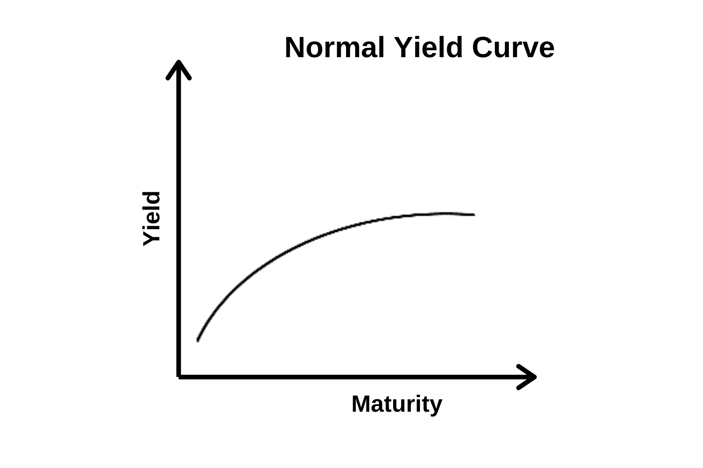

## Table of Contents

## What is a yield curve?

A yield curve is a graph that shows the interest rates on bonds of different lengths of time, usually from three months to thirty years. It helps people see how much they can earn from investing in bonds over different periods. The shape of the yield curve can tell us a lot about what investors think will happen to the economy in the future. 

When the yield curve is going up, it means that longer-term bonds have higher interest rates than shorter-term bonds. This is called a normal yield curve and it usually happens when people think the economy will grow. But if the yield curve is flat or even going down, it might mean that people are worried about the economy. A downward sloping yield curve, where short-term rates are higher than long-term rates, is called an inverted yield curve and it can be a sign that a recession might be coming.

## What is meant by a 'normal' yield curve?

A 'normal' yield curve means that the interest rates on bonds go up as the time until the bond matures gets longer. So, if you look at a graph of the yield curve, it slopes upward. This happens because investors usually want more money to lend it for a longer time. They think there's more risk in waiting longer to get their money back, so they want a higher interest rate.

When people see a normal yield curve, it usually means they think the economy will keep growing. They expect things to stay stable or get better, so they're okay with lending money for a long time at higher rates. A normal yield curve is what you see most of the time when the economy is doing well.

## How does a normal yield curve differ from other types of yield curves?

A normal yield curve shows that longer-term bonds have higher interest rates than shorter-term bonds. This makes the curve slope upward on a graph. It's called normal because it's what you usually see when the economy is doing well. People think the economy will keep growing, so they are happy to lend money for a longer time if they get a higher interest rate.

But there are other types of yield curves too. A flat yield curve happens when the interest rates for short-term and long-term bonds are almost the same. This can mean that people are not sure about what will happen to the economy. An inverted yield curve is when short-term rates are higher than long-term rates, making the curve slope downward. This is a big warning sign because it often means that people think a recession is coming soon.

So, the main difference between a normal yield curve and other types is the shape of the curve and what it says about people's feelings about the economy. A normal curve shows confidence and growth, while a flat or inverted curve shows uncertainty or worry about the future.

## What are the key components that influence a normal yield curve?

The key components that influence a normal yield curve are interest rates and the time until a bond matures. Interest rates are what you get paid for lending money. When you buy a bond, you're lending money to the person or group that issued the bond. The longer you agree to lend that money, the more interest you usually want. That's why, in a normal yield curve, longer-term bonds have higher interest rates than shorter-term bonds. It's because people think there's more risk in waiting longer to get their money back.

Another big thing that influences a normal yield curve is what people think will happen to the economy in the future. If people feel good about the economy and think it will keep growing, they'll be okay with lending money for a long time. They'll want a bit more interest for the longer wait, but they're not too worried. This feeling of confidence helps make the yield curve slope upward, showing that longer-term bonds have higher interest rates. So, it's really about the balance between how long you're willing to wait for your money and how confident you feel about the economy's future.

## How is a normal yield curve typically shaped?

A normal yield curve is shaped like a hill that goes up from left to right. It starts low on the left side with the interest rates for short-term bonds, and then it climbs higher as it moves to the right, showing the interest rates for longer-term bonds. This upward slope means that if you lend your money for a longer time, you get paid more interest.

This shape happens because people usually want more money to lend it for a longer time. They think there's more risk in waiting longer to get their money back, so they want a higher interest rate. When people see this normal yield curve, it tells them that others think the economy will keep growing and things will be okay or even better in the future.

## What economic conditions are associated with a normal yield curve?

A normal yield curve shows that people think the economy will keep growing. When the curve goes up, it means that if you lend your money for a longer time, you get paid more interest. This happens because people feel good about the future and are okay with waiting longer to get their money back. They want a bit more interest for the longer wait, but they're not too worried. This confidence in the economy makes the yield curve slope upward.

When you see a normal yield curve, it usually means that things are going well. Businesses are growing, people are spending money, and there aren't big worries about the future. This kind of yield curve is what you see most of the time when the economy is doing okay or getting better. It's a sign that people are happy to lend money for a long time because they think the economy will stay strong.

## How do interest rates affect the shape of a normal yield curve?

Interest rates are really important for the shape of a normal yield curve. When you see a normal yield curve, it means that the interest rates for longer-term bonds are higher than for shorter-term bonds. This makes the curve go up from left to right. People want more interest if they have to wait longer to get their money back. So, if a bond takes 10 years to pay back, you'll get more interest than if it only takes 2 years. That's why the curve slopes up.

This upward slope of the normal yield curve shows that people feel good about the economy. They think it will keep growing, so they're okay with lending money for a long time if they get more interest. If interest rates for long-term bonds go up a lot more than short-term bonds, it makes the curve steeper. But if the difference isn't that big, the curve will still go up, but it won't be as steep. So, how interest rates change for different lengths of time can make the normal yield curve look different, but it will always go up when people are confident about the future.

## What role does inflation expectation play in shaping a normal yield curve?

Inflation expectation is a big part of what makes a normal yield curve look the way it does. When people think prices will go up in the future, they want to be paid more for lending their money. This is because the money they get back later won't buy as much as it does now. So, if people expect more inflation, they'll want higher interest rates on longer-term bonds. This makes the normal yield curve go up more steeply because the interest rates for long-term bonds are higher than for short-term bonds.

When people think inflation will stay low, the normal yield curve might not go up as much. They don't need as much extra interest to make up for rising prices, so the difference between short-term and long-term bond rates isn't as big. This means the curve will still go up, but it won't be as steep. So, what people think about future inflation helps decide how steep the normal yield curve will be, showing how much more interest they want for waiting longer to get their money back.

## How can investors use a normal yield curve to make investment decisions?

Investors can use a normal yield curve to help them decide where to put their money. When they see a normal yield curve, it means that longer-term bonds are paying more interest than shorter-term bonds. This tells investors that the economy is expected to keep growing. So, if they want to earn more interest, they might choose to buy longer-term bonds. They know they'll have to wait longer to get their money back, but they'll get paid more for it.

But investors also need to think about how much risk they're okay with. A normal yield curve shows that people are feeling good about the economy, but things can change. If investors think the economy might not stay strong, they might not want to lock their money into long-term bonds. They could choose shorter-term bonds instead, even if they pay less interest, because they can get their money back sooner and maybe invest it somewhere else if things change. So, by looking at the normal yield curve, investors can make choices that match how they feel about the economy and how much risk they're willing to take.

## What historical data supports the occurrence of a normal yield curve?

Historical data shows that normal yield curves have been common during times when economies are doing well. For example, in the United States, you can look at the yield curve from the 1990s. During this time, the economy was growing steadily, and the yield curve was mostly normal, with long-term bond rates higher than short-term rates. People felt good about the future, so they were happy to lend money for longer periods if they got more interest. This confidence in the economy made the yield curve slope upward, showing that things were going well.

Another good example is from the early 2000s. After the dot-com bubble burst and the economy recovered, the yield curve returned to a normal shape. From about 2003 to 2006, the U.S. economy was growing, and the yield curve showed that people expected this growth to continue. They were willing to invest in longer-term bonds for higher returns, which kept the yield curve sloping upward. These historical periods show that a normal yield curve often goes hand-in-hand with a strong and growing economy.

## How do central bank policies impact the formation of a normal yield curve?

Central bank policies have a big impact on the shape of the yield curve, including whether it becomes a normal yield curve. When a central bank, like the Federal Reserve in the U.S., wants to help the economy grow, it might lower short-term interest rates. This makes borrowing cheaper, and people and businesses are more likely to spend and invest. When short-term rates are low, but people expect the economy to keep growing, they want higher interest rates for lending their money for a longer time. This difference in rates between short and long-term bonds helps create a normal yield curve that slopes upward.

On the other hand, if the central bank thinks the economy is growing too fast and might cause inflation, it might raise short-term rates to slow things down. But if people still think the economy will be strong in the future, long-term rates might not go up as much. This can still lead to a normal yield curve because long-term rates are higher than short-term rates. So, what the central bank does with short-term rates, and how people react to those changes, can help shape the yield curve into its normal upward-sloping form.

## What advanced metrics or models can be used to analyze and predict shifts in a normal yield curve?

One way to analyze and predict changes in a normal yield curve is by using the term structure of interest rates. This model looks at how interest rates for different times are connected. It helps us see how short-term and long-term rates might change based on what's happening in the economy. A popular model within this is the expectations theory, which says that long-term rates are just the average of what people think short-term rates will be in the future. If people expect the economy to keep growing, they'll want higher long-term rates, keeping the yield curve normal.

Another useful tool is the Cox, Ingersoll, and Ross (CIR) model. This model looks at how interest rates change over time and how they might go up or down based on different economic factors. It's good for predicting how the yield curve might shift because it takes into account things like inflation and the central bank's actions. By using this model, investors can get a better idea of whether the yield curve will stay normal or start to change shape, helping them make smarter investment choices.

## What is the understanding of bond market interest rates?

Interest rates are a fundamental component of the bond market, significantly affecting both the cost of borrowing and the returns on investment. These rates are primarily categorized into short-term and long-term interest rates, each responding differently to market dynamics. Short-term interest rates tend to react swiftly to changes in monetary policy. Central banks play a pivotal role in shaping these rates, using tools like the discount rate and open market operations to maintain macroeconomic stability and influence market expectations.

Conversely, long-term interest rates are more reflective of the broader economic outlook, incorporating expectations about future inflation, economic growth, and fiscal policy. The relationship between bond prices and interest rates is inversely proportional, meaning when interest rates rise, bond prices typically fall, and vice versa. This inverse relationship can be mathematically represented as follows:

$$
P = \frac{C}{(1 + r)^n} + \frac{F}{(1 + r)^n}
$$

Where:
- $P$ is the current price of the bond,
- $C$ is the annual coupon payment,
- $r$ is the interest rate,
- $F$ is the face value of the bond,
- $n$ is the number of years until maturity.

This formula highlights how an increase in $r$ ([interest rate](/wiki/interest-rate-trading-strategies)) leads to a decrease in $P$ (bond price).

Central banks, through mechanisms like the federal funds rate in the United States, establish benchmark interest rates that serve as a baseline for other interest rates in the economy. These benchmark rates are critical for monetary policy, helping control inflation and maintain economic growth by steering public and investor expectations.

The [volatility](/wiki/volatility-trading-strategies) of interest rates presents both opportunities and risks in bond trading. Volatile rates can lead to significant price fluctuations, offering traders the chance to capitalize on these movements. However, they also pose risks, especially for those who do not adequately hedge against potential interest rate changes. Consequently, traders and investors utilize sophisticated analytical tools and prediction models to navigate this volatility. These models often incorporate a range of variables, from macroeconomic indicators to market sentiment, allowing for more informed decision-making. 

Python, for instance, is frequently used to model interest rate scenarios and bond pricing. The following code snippet illustrates a basic simulation of bond prices based on varying interest rates:

```python
import numpy as np

# Define bond parameters
face_value = 1000
coupon_rate = 0.05
years = 10

# Interest rate scenarios
interest_rates = np.arange(0.01, 0.1, 0.01)

# Calculate bond prices for different interest rates
bond_prices = [np.pv(rate, years, face_value*coupon_rate, face_value) for rate in interest_rates]

# Output bond prices
print("Interest Rate | Bond Price")
for rate, price in zip(interest_rates, bond_prices):
    print(f"{rate*100:.2f}%          | ${-price:.2f}")
```

In this simulation, the present value function (`np.pv`) calculates the price of a bond based on different interest rate scenarios. Market participants rely on such analyses to adapt strategies that manage risk and optimize returns, underscoring the significance of understanding interest rates in the bond market.

## References & Further Reading

[1]: ["The Handbook of Fixed Income Securities"](https://www.amazon.com/Handbook-Fixed-Income-Securities-Ninth/dp/1260473899) by Frank J. Fabozzi

[2]: Campbell, J. Y., & Shiller, R. J. (1991). ["Yield Spreads and Interest Rate Movements: A Bird's Eye View."](https://www.nber.org/papers/w3153) The Review of Economic Studies, 58(3), 495-514.

[3]: Jorion, P. (1997). ["Value at Risk: The New Benchmark for Managing Financial Risk."](https://archive.org/details/valueatrisknewbe0000jori)

[4]: ["Interest Rate Models – Theory and Practice: With Smile, Inflation and Credit"](https://www.amazon.com/Interest-Rate-Models-Practice-Inflation/dp/3540221492) by Damiano Brigo and Fabio Mercurio

[5]: Aït-Sahalia, Y., & Lo, A. W. (2000). ["Nonparametric Risk Management and Implied Risk Aversion."](https://www.nber.org/papers/w6130) Journal of Econometrics, 94(1-2), 9-51.

[6]: Natenberg, S. (1994). ["Option Volatility and Pricing: Advanced Trading Strategies and Techniques."](https://www.amazon.com/Option-Volatility-Pricing-Strategies-Techniques/dp/0071818774)

[7]: ["Algorithmic Trading: Winning Strategies and Their Rationale"](https://books.google.com/books/about/Algorithmic_Trading.html?id=WAlFDwAAQBAJ) by Ernie Chan

[8]: Fabozzi, F. J., Shiller, R. J., & Tunaru, R. S. (2011). ["Hedging with Treasury Yield Curve Strategies."](http://aida.econ.yale.edu/~shiller/pubs/property-derivatives2010.pdf) Journal of Portfolio Management, 37(3), 87-93.