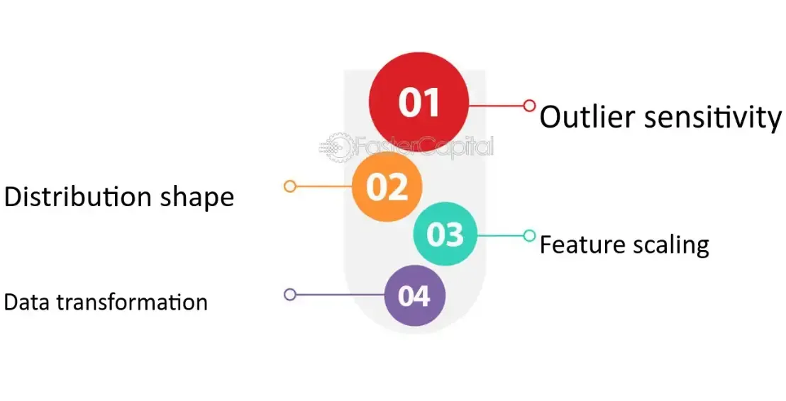

## Table of Contents

## What is normalization in the context of machine learning?

Normalization in machine learning is a process that changes the values of numeric columns in the data to a common scale, without distorting differences in the ranges of values. Imagine you're comparing the heights of people in centimeters and their weights in kilograms. If you don't normalize these values, the algorithms might think height is more important just because the numbers are bigger. Normalization helps prevent this by making sure each feature contributes equally to the result.

One common way to normalize data is to use a method called min-max normalization. This method scales the data so that it fits within a specific range, usually between 0 and 1. The formula for min-max normalization is $$X_{norm} = \frac{X - X_{min}}{X_{max} - X_{min}}$$. Here, $$X$$ is the original value, $$X_{min}$$ is the minimum value in the dataset, and $$X_{max}$$ is the maximum value. This transformation makes it easier for machine learning models to learn from the data because all features are on the same scale.

Another popular technique is called Z-score normalization, or standardization. This method transforms the data to have a mean of 0 and a standard deviation of 1. The formula for this is $$X_{std} = \frac{X - \mu}{\sigma}$$, where $$X$$ is the original value, $$\mu$$ is the mean of the feature, and $$\sigma$$ is the standard deviation. Standardization is particularly useful when your data follows a Gaussian distribution, as it helps many machine learning algorithms to perform better and converge faster.

## Why is normalization important for machine learning algorithms?

Normalization is important for machine learning algorithms because it helps them work better and faster. When you have data with different scales, like heights in centimeters and weights in kilograms, algorithms might get confused. They might think height is more important just because the numbers are bigger. Normalization fixes this by making all the data fit into the same range, usually between 0 and 1. This way, every piece of information gets an equal chance to influence the model's decisions.

Another reason normalization is crucial is that it can speed up the training process. Many [machine learning](/wiki/machine-learning) algorithms, especially those that use gradient descent like neural networks, work better when the data is normalized. Without normalization, the algorithm might take a long time to find the best solution, or it might not find it at all. By using normalization, like the min-max method $$X_{norm} = \frac{X - X_{min}}{X_{max} - X_{min}}$$ or the Z-score method $$X_{std} = \frac{X - \mu}{\sigma}$$, the algorithm can move towards the best solution more quickly and efficiently.

## What are the common techniques used for normalization?

There are two main techniques used for normalization: min-max normalization and Z-score normalization. Min-max normalization scales the data to fit within a range, usually between 0 and 1. This is done using the formula $$X_{norm} = \frac{X - X_{min}}{X_{max} - X_{min}}$$. Here, X is the original value, X_min is the smallest value in the dataset, and X_max is the largest value. This method is simple and works well when you need the data to be within a specific range.

Z-score normalization, also known as standardization, adjusts the data to have a mean of 0 and a standard deviation of 1. The formula for this is $$X_{std} = \frac{X - \mu}{\sigma}$$, where X is the original value, μ is the mean of the dataset, and σ is the standard deviation. This technique is particularly useful when your data follows a normal distribution, as it makes the data easier for many machine learning algorithms to work with.

Both techniques are widely used in machine learning, but the choice between them depends on the specific needs of your project. Min-max normalization is great when you need data within a specific range, while Z-score normalization is better when you want to understand how far each value is from the mean in terms of standard deviations.

## How does normalization affect the performance of a machine learning model?

Normalization helps machine learning models work better and faster. When data has different scales, like heights in centimeters and weights in kilograms, the model might think height is more important just because the numbers are bigger. Normalization fixes this by making all the data fit into the same range, usually between 0 and 1. This way, every piece of information gets an equal chance to influence the model's decisions. For example, if you use min-max normalization with the formula $$X_{norm} = \frac{X - X_{min}}{X_{max} - X_{min}}$$, all your data will be between 0 and 1, making it easier for the model to learn.

Another way normalization helps is by speeding up the training process. Many machine learning algorithms, especially those that use gradient descent like neural networks, work better when the data is normalized. Without normalization, the algorithm might take a long time to find the best solution, or it might not find it at all. By using normalization, like the Z-score method with the formula $$X_{std} = \frac{X - \mu}{\sigma}$$, the algorithm can move towards the best solution more quickly and efficiently. This means your model can learn faster and perform better on new data.

## Can you explain the difference between normalization and standardization?

Normalization and standardization are both ways to change the numbers in your data to make them easier for machine learning models to work with. Normalization usually means making all your numbers fit between 0 and 1. You do this using a formula called min-max normalization, which is $$X_{norm} = \frac{X - X_{min}}{X_{max} - X_{min}}$$. Here, X is the number you start with, X_min is the smallest number in your data, and X_max is the biggest number. This way, all your numbers are on the same scale, so the machine learning model doesn't get confused by big numbers.

Standardization, on the other hand, changes your numbers so that they have an average of 0 and a spread of 1. You do this using a formula called Z-score normalization, which is $$X_{std} = \frac{X - \mu}{\sigma}$$. In this formula, X is your original number, μ is the average of all your numbers, and σ is how spread out your numbers are. This method is good when your data follows a bell-shaped curve, because it helps the machine learning model understand how far each number is from the average. Both methods help your model work better, but they do it in slightly different ways.

## What are the steps to normalize a dataset?

To normalize a dataset, you first need to choose the right method. The most common method is min-max normalization, which scales your data to fit between 0 and 1. You do this by subtracting the smallest number in your dataset from each value and then dividing by the difference between the biggest and smallest numbers. The formula for this is $$X_{norm} = \frac{X - X_{min}}{X_{max} - X_{min}}$$. Here, X is your original number, X_min is the smallest number in your dataset, and X_max is the biggest number. This way, all your numbers will be on the same scale, making it easier for machine learning models to learn from them.

Once you've chosen your method, you apply it to your whole dataset. If you're using a programming language like Python, you can use libraries like scikit-learn to help you. Here's an example of how you might do it:

```python
from sklearn.preprocessing import MinMaxScaler
import numpy as np

# Sample dataset
data = np.array([[10, 20], [30, 40], [50, 60]])

# Create the scaler
scaler = MinMaxScaler()

# Fit and transform the data
normalized_data = scaler.fit_transform(data)

print(normalized_data)
```

This code will take your original data and turn it into numbers between 0 and 1. After you've normalized your data, you can use it to train your machine learning model, which will now be able to learn from all your features more easily and effectively.

## How do you choose the right normalization technique for a specific dataset?

Choosing the right normalization technique depends on what you want to do with your data and what kind of machine learning model you're using. If you need your data to be in a specific range, like between 0 and 1, you should use min-max normalization. The formula for this is $$X_{norm} = \frac{X - X_{min}}{X_{max} - X_{min}}$$. This method is good when you want all your data to be on the same scale, making it easier for models like neural networks to learn. If your data follows a bell-shaped curve, or you're using models that assume your data is normally distributed, like some types of regression, then Z-score normalization might be better. This method uses the formula $$X_{std} = \frac{X - \mu}{\sigma}$$ to make your data have an average of 0 and a spread of 1.

Another thing to think about is what you're trying to achieve with your model. If you're more interested in how far each data point is from the average, Z-score normalization is the way to go. But if you want to make sure all your features are treated equally, min-max normalization is usually the better choice. Sometimes, you might even try both methods and see which one works better for your specific problem. In the end, the best normalization technique is the one that helps your model perform the best on your data.

## What are the potential pitfalls of normalization in machine learning?

One potential pitfall of normalization in machine learning is that it can sometimes hide important information about the data. For example, if you use min-max normalization with the formula $$X_{norm} = \frac{X - X_{min}}{X_{max} - X_{min}}$$, all your numbers will be between 0 and 1. This can make it hard to see the original range of your data, which might be important for understanding your results. Another problem is that normalization can make it difficult to interpret the results of your model. When you change the numbers, it can be tricky to explain what those numbers mean in the real world.

Another issue is that normalization might not work well for all types of data. If your dataset has outliers, or numbers that are much bigger or smaller than the rest, using a method like Z-score normalization with the formula $$X_{std} = \frac{X - \mu}{\sigma}$$ can make those outliers even more extreme. This can affect how your model learns from the data. Also, if you're working with time series data, where the order of the numbers matters, normalizing the data can mess up the patterns that your model needs to see. So, it's important to think carefully about whether normalization is right for your specific dataset and what kind of model you're using.

## How does normalization impact different types of machine learning algorithms, such as neural networks and decision trees?

Normalization can have a big impact on how well neural networks work. These models use something called gradient descent to learn from data, and they work best when all the numbers are on the same scale. If you use min-max normalization with the formula $$X_{norm} = \frac{X - X_{min}}{X_{max} - X_{min}}$$ or Z-score normalization with the formula $$X_{std} = \frac{X - \mu}{\sigma}$$, the [neural network](/wiki/neural-network) can learn faster and find the best solution more easily. Without normalization, the model might get confused by big numbers and take longer to learn, or it might not learn the right thing at all. So, for neural networks, normalization is usually a good idea.

On the other hand, decision trees don't usually need normalization to work well. These models make decisions by splitting the data into groups based on the numbers, and they don't care as much about the scale of the numbers. Whether you use big numbers or small numbers, a decision tree will still be able to find the best way to split the data. But, if you're using a decision tree as part of a bigger model, like a random forest, normalization might still help the whole model work better. So, while decision trees don't need normalization as much as neural networks, it can still be useful in some cases.

## What are some advanced normalization techniques used in deep learning?

In [deep learning](/wiki/deep-learning), one advanced normalization technique is called Batch Normalization. It helps neural networks learn better and faster by making the data going into each layer have the same average and spread. During training, Batch Normalization calculates the average and spread of the data in each mini-batch and adjusts the data to have an average of 0 and a spread of 1. This helps the neural network learn more smoothly because the numbers going into each layer are always on the same scale. The formula for Batch Normalization is $$y = \frac{x - \mu_B}{\sqrt{\sigma_B^2 + \epsilon}} \cdot \gamma + \beta$$, where $$x$$ is the input, $$\mu_B$$ and $$\sigma_B^2$$ are the mean and variance of the mini-batch, $$\epsilon$$ is a small constant to avoid division by zero, and $$\gamma$$ and $$\beta$$ are learnable parameters.

Another advanced technique is Layer Normalization, which is similar to Batch Normalization but works across all the features in a single data point instead of across a batch of data points. This makes Layer Normalization useful when you're working with different batch sizes or when the data in each batch changes a lot. The formula for Layer Normalization is $$y = \frac{x - \mu_L}{\sqrt{\sigma_L^2 + \epsilon}} \cdot \gamma + \beta$$, where $$x$$ is the input, $$\mu_L$$ and $$\sigma_L^2$$ are the mean and variance calculated across all features of a single data point, $$\epsilon$$ is a small constant, and $$\gamma$$ and $$\beta$$ are learnable parameters. Both Batch Normalization and Layer Normalization help deep learning models learn faster and perform better by keeping the data on the same scale throughout the network.

## How can normalization be applied in real-time data processing scenarios?

In real-time data processing, normalization helps make sure the data coming in is always on the same scale, which is important for machine learning models to work well. One way to do this is to use a running average and standard deviation to keep track of the data as it comes in. For example, if you're using Z-score normalization with the formula $$X_{std} = \frac{X - \mu}{\sigma}$$, you can update the average $$\mu$$ and standard deviation $$\sigma$$ every time you get new data. This way, the model can keep learning from new data without needing to see all the data at once.

Another approach is to use a technique like Batch Normalization, which is often used in deep learning. In real-time scenarios, you can apply Batch Normalization to each batch of data as it comes in. The formula for Batch Normalization is $$y = \frac{x - \mu_B}{\sqrt{\sigma_B^2 + \epsilon}} \cdot \gamma + \beta$$, where $$x$$ is the input, $$\mu_B$$ and $$\sigma_B^2$$ are the mean and variance of the mini-batch, $$\epsilon$$ is a small constant, and $$\gamma$$ and $$\beta$$ are learnable parameters. By doing this, the model can adjust to new data quickly and keep performing well even as the data changes over time.

## What are the current research trends and future directions in normalization techniques for machine learning?

Current research in normalization techniques for machine learning is focusing on making models work better and faster, especially in deep learning. One big trend is looking into new ways to normalize data that can help with specific problems, like dealing with data that changes a lot over time. For example, researchers are working on adaptive normalization methods that can adjust to new data as it comes in. This is important for things like real-time data processing, where the data is always changing. Another trend is exploring how normalization can help with different types of data, like images or sound, where traditional methods like $$X_{norm} = \frac{X - X_{min}}{X_{max} - X_{min}}$$ or $$X_{std} = \frac{X - \mu}{\sigma}$$ might not work as well. Techniques like Instance Normalization and Group Normalization are being studied to see if they can improve how models learn from these types of data.

Looking to the future, normalization techniques are likely to become even more important as machine learning models get bigger and more complex. Researchers are trying to find ways to make normalization work better with these big models, like figuring out how to normalize data across different layers of a neural network in a way that helps the whole model learn faster. There's also interest in developing normalization methods that can handle data with different distributions, which is important for making sure models work well in real-world situations where data might not follow a nice, neat pattern. As machine learning continues to grow, the focus will be on creating normalization techniques that are flexible, adaptive, and can help models perform at their best, no matter what kind of data they're working with.

## References & Further Reading

[1]: Han, J., Pei, J., & Kamber, M. (2011). ["Data Mining: Concepts and Techniques,"](https://www.sciencedirect.com/book/9780123814791/data-mining-concepts-and-techniques) 3rd Edition. Morgan Kaufmann.

[2]: Ioffe, S., & Szegedy, C. (2015). ["Batch Normalization: Accelerating Deep Network Training by Reducing Internal Covariate Shift."](https://arxiv.org/abs/1502.03167) arXiv:1502.03167.

[3]: Goodfellow, I., Bengio, Y., & Courville, A. (2016). ["Deep Learning."](https://www.deeplearningbook.org/) MIT Press.

[4]: Scikit-learn library: ["User Guide."](https://scikit-learn.org/stable/user_guide.html) Scikit-learn: Machine Learning in Python. 

[5]: Hinton, G. E., Srivastava, N., & Swersky, K. (2012). ["Neural Networks for Machine Learning."](https://arxiv.org/abs/1207.0580) Coursera Lecture Slides.