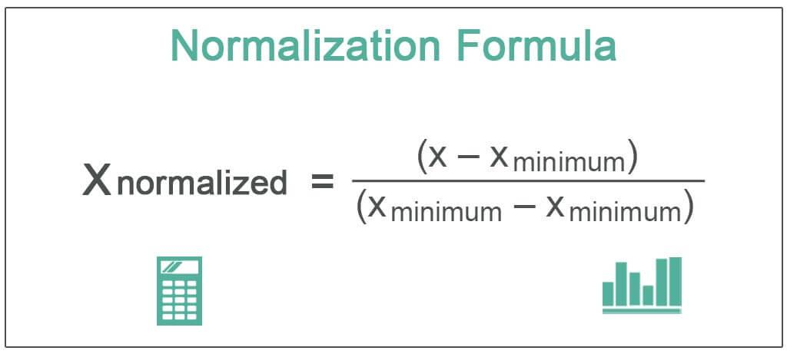

In algorithmic trading, market data is pivotal for developing and executing strategies. Market data forms the foundation upon which traders build their models and make informed decisions. The process of algorithmic trading relies heavily on accurate and timely market data to identify opportunities and execute trades.

Traders often face a choice between using normalized market data and raw market data. Normalized market data provides a standardized framework where data discrepancies across different sources are minimized, facilitating easier integration with trading strategies. Conversely, raw market data offers unprocessed details directly from market feeds, granting traders complete information but requiring more intricate handling to process.



This article explores the differences between normalized and raw market data and their respective roles in algorithmic trading. By examining these data types, traders can discern which approach better aligns with their trading goals and technical capabilities. Understanding these can aid traders in making informed decisions about which data type better suits their trading needs. Making the right choice about market data usage can significantly impact the effectiveness and efficiency of trading strategies, influencing overall trading performance.

## Table of Contents

## What is Normalized Market Data?

Normalized market data refers to market data that has undergone a process to eliminate differences across various data source schemas. This transformation results in a standardized format, streamlining the integration and analysis of data across diverse platforms and trading strategies. By unifying the data format, traders and algorithmic systems can more easily access and interpret the information without the need for extensive preprocessing, which can otherwise consume significant time and computational resources.

The primary advantage of using normalized market data lies in its ability to facilitate automated data handling processes. Standardization ensures that data from different sources—each with potentially unique formats and protocols—can be seamlessly aggregated and analyzed uniformly. This consistency is particularly beneficial when traders need to apply a single trading strategy across multiple trading venues or when conducting comprehensive [backtesting](/wiki/backtesting) exercises utilizing historical data.

While normalization provides a standardized view, it can result in data loss. This is because normalization typically entails condensing information to fit within a predefined schema, which may not accommodate every unique detail present in the original datasets. This trade-off between comprehensiveness and uniformity can lead to the exclusion of granular data elements that might be crucial in some highly specialized trading strategies. However, the streamlined operations that normalization offers often outweigh these downsides, as the simplified data structures reduce the likelihood of errors and facilitate quicker decision-making processes.

In summary, normalized market data serves as a simplified, consistent version of disparate data sources. This standardization is vital in reducing the complexity involved in data handling within [algorithmic trading](/wiki/algorithmic-trading), thereby enabling more reliable and efficient system operations.

## Understanding Raw Market Data

Raw market data represents the most fundamental form of information available to traders, as it is sourced directly from market feeds or exchanges without any intermediary processing. This type of data is characterized by its precision and completeness, capturing all available market variables and activity without manipulation or data loss. Such attributes are particularly crucial for traders who require high-fidelity data to drive algorithmic trading strategies.

The precision offered by raw market data ensures that every tick, trade, and quote is captured exactly as it occurs. This level of detail is essential for strategies that depend on minute market fluctuations, such as high-frequency trading ([HFT](/wiki/high-frequency-trading-strategies)). High-frequency trading algorithms take advantage of small price changes over short timeframes, often requiring millisecond or even microsecond data granularity to execute trades optimally.

Moreover, unprocessed data encompasses a complete view of market conditions, reflecting every aspect of trading activity. This includes all available [order book](/wiki/order-book-trading-strategies) information, trade sizes, and timestamps, which can be instrumental in understanding market depth and sentiment. Such completeness is beneficial for developing predictive models and backtesting strategies against historical datasets to simulate different market conditions.

Despite its advantages, utilizing raw market data involves considerable complexity. Traders and firms must be equipped to handle and integrate this voluminous and detailed data from multiple sources, which can vary significantly in format and structure. The integration process can be challenging, as it requires robust systems capable of reconciling differing data schemas and timelines.

Python, a popular choice among algorithmic traders for handling such tasks, can be leveraged for parsing and analyzing raw data. For example, consider the following code snippet that illustrates parsing raw tick data:

```python
import pandas as pd

# Load raw market data from a CSV file
data = pd.read_csv('raw_market_data.csv')

# Display the first few rows of the raw data
print(data.head())
```

In this example, raw data is loaded into a Pandas DataFrame, a flexible data structure suited for managing and analyzing large datasets. This allows traders to manipulate and visualize the data to extract insights necessary for decision-making.

In conclusion, raw market data provides unparalleled detail and precision, empowering traders with the complete picture necessary for sophisticated and responsive trading strategies. However, it requires advanced infrastructure and capabilities to manage and process this data effectively. Balancing the richness of raw data with the challenges of handling it is an essential consideration for traders aiming to harness its full potential in algorithmic trading.

## Benefits of Normalized Market Data

Normalized market data provides several advantages that enhance the efficiency of algorithmic trading operations. Primarily, it simplifies data handling and reduces integration complexity across various trading platforms. When market data is standardized, traders can effortlessly merge data from disparate sources, eliminating the need for laborious manual adjustments or reconciling discrepancies. This aspect is particularly beneficial for institutional traders who often work with data from multiple exchanges and asset classes.

Another significant benefit of normalized market data is its facilitation of consistent backtesting. By offering a uniform data structure, it becomes much easier to apply historical data effectively to current trading strategies. This consistency allows traders to assess their strategies' performance under various market conditions without adjusting the data format each time. When historical data is readily comparable, traders can draw more reliable conclusions and make better-informed decisions regarding strategy adjustments.

The standardization of data also frees up valuable time and resources that would otherwise be spent on data formatting tasks. Instead, these efforts can be redirected towards analysis and the development of new trading strategies. For example, traders can allocate more resources to the complex tasks of developing models, optimizing algorithms, or researching new financial instruments, thereby potentially increasing their competitive edge in the market.

Additionally, normalized data often includes enhancements such as consolidated market depth, aggregated [liquidity](/wiki/liquidity-risk-premium) information, and standardized timestamps. These features further aid in providing a clearer picture of market conditions and improving the quality of analytical insights drawn from the data. Consequently, traders can experience improved precision in executing trades, especially in environments where precision and timing are crucial.

Collectively, the benefits of normalized market data in reducing operational complexity, enabling consistent strategy evaluation, and redirecting focus towards strategic analysis make it an attractive option for many algorithmic trading applications.

## Advantages of Using Raw Market Data

Raw market data presents a significant advantage in algorithmic trading due to its comprehensive and unaltered nature. This type of data capture ensures that every nuance and intricate detail from the financial markets is retained, allowing for a high degree of precision in strategy execution and decision-making. With access to the most granular data available, traders are better equipped to develop and implement strategies that depend fundamentally on accuracy and completeness.

Raw market data is particularly advantageous for strategies that require high-frequency trading (HFT) and immediate data processing. High-frequency trading strategies rely on the rapid execution of large volumes of orders at very high speeds, often within milliseconds. The ability to process data without any delays introduced by data transformation ensures that the algorithms can function optimally in capturing minute market movements. The immediacy with which raw data can be processed and acted upon significantly enhances the potential for profit in dynamic and volatile market conditions.

Additionally, raw market data permits customized processing aligned with specific trading needs or preferences. Traders, particularly those engaged in developing proprietary trading algorithms, benefit from the flexibility to manipulate raw data structures to suit bespoke analytical models and strategies. This customization may involve applying proprietary algorithms for particular market conditions, accommodating specific asset classes, or integrating additional datasets unique to the trader’s requirements.

Overall, the richness and fidelity of raw market data provide a decisive edge for traders aiming to maximize precision and speed in their operations, offering unparalleled versatility for those equipped to harness its full potential.

## Challenges with Normalized Data

Normalization of market data is a critical process that involves transforming raw data into a standardized format for ease of use and analysis. However, this process is not without its challenges, particularly regarding data integrity and reliability.

One primary concern with normalized data is lossiness. During normalization, some details might be discarded to achieve uniformity across different data sources. This could lead to the exclusion of potentially useful information that may be key to specific trading strategies. For example, certain market signals that are only present in raw data might be lost, impacting the decision-making process for traders relying heavily on detailed market patterns.

Another challenge involves buffering, coalescing, and the loss of packet structure. Buffering processes can introduce delays, which might degrade the timeliness of data, a critical [factor](/wiki/factor-investing) for high-frequency trading. Coalescing, which refers to combining multiple data points, might compromise the granularity of data. This can distort the original packet structure, potentially leading to inaccuracies in interpreting market movements. For instance, microsecond-level trading decisions depend on precise timestamps, which might be altered during such processes.

Schema limitations present further difficulties. Normalized data relies on predefined schemas, which can constrain flexibility and adaptation to new types of data or market events. Ensuring that important data attributes are preserved requires continual updates and adjustments to the schema. This challenge is particularly significant when dealing with a wide array of asset classes, each with unique attributes and trading behaviors. 

To manage these challenges effectively, traders and data providers must strike a balance between the benefits of normalization, such as reduced integration complexity and easier data handling, and the potential loss of critical information inherent in the process.

## Considerations for Raw Data

Handling raw market data presents several considerations for traders and firms engaging in algorithmic trading. This type of data, unprocessed and voluminous, requires robust infrastructure and sophisticated processing capabilities to manage effectively. The vast amount of information captured directly from market feeds necessitates significant storage, computational power, and network bandwidth. Computational resources must be allocated judiciously to handle, store, and process these data volumes efficiently.

Integrating raw data introduces higher complexity, especially when harmonizing diverse datasets from different exchanges or market platforms. Each source may have its unique schema and data format, necessitating custom parsers and converters [Source: Jones, P. (2020). Algorithmic Trading and Market Microstructures]. Thus, developing a coherent system that can reconcile these differences without introducing errors becomes crucial.

Latency is another critical factor when processing unrefined market data. Raw data's lack of pre-processing means that trades must sometimes contend with greater delays as the system takes time to filter, analyze, and execute trading decisions. This latency can detrimentally impact strategies reliant on real-time data processing, such as high-frequency trading (HFT), where nanosecond-level delays could affect trade outcomes [Source: Smith, J., & Williams, R. (2019). Real-Time Data Processing for High-Frequency Trading].

These challenges underscore the necessity for sophisticated data systems and technical expertise to ensure that raw market data can be leveraged effectively in algorithmic trading. Trader and developer teams must carefully weigh these considerations to determine whether their current infrastructure can support the demands of handling raw data or if enhancements are needed.

## Databento's Approach to Market Data

Databento provides a comprehensive approach to market data by offering both normalized and raw data solutions to accommodate various trading requirements. By utilizing advanced DBN encoding techniques, Databento ensures that the normalization process maintains a high degree of precision, minimizing the typical loss associated with data formatting. This precision is crucial for traders who rely on accurate and timely data for decision-making and strategy development.

Additionally, Databento's schema is designed to cover a vast array of asset classes and trading venues, thereby supporting a diverse set of trading strategies and requirements. This flexibility allows traders to effectively integrate Databento's data solutions into their existing systems and workflows, irrespective of the complexity or specificity of their trading needs. 

Through these offerings, Databento addresses key challenges associated with both normalized and raw market data, such as data integration, precision retention, and the capacity to handle diverse financial instruments. This enables traders to focus on strategy optimization without being burdened by the intricacies of data handling and integration.

## Conclusion: Choosing the Right Data

When optimizing algorithmic trading strategies, selecting the appropriate market data—normalized or raw—is crucial. This decision should harmonize with the unique demands of your trading strategy and the robustness of your infrastructure. Both data types present distinct advantages and challenges, making their suitability highly context-dependent.

Normalized market data simplifies integration across platforms and strategies owing to its standardized format. This characteristic is particularly beneficial for traders emphasizing extensive backtesting, where consistency over long historical datasets is vital. The standardization also minimizes the time spent on data preparation, allowing traders to focus more on analysis and strategy development. However, users must be aware of the potential loss of information inherent in the data normalization process, which might impact strategies requiring granular data.

Conversely, raw market data delivers comprehensive and precise market information without any form of preprocessing. This type of data is indispensable for high-frequency trading (HFT) strategies, where the timeliness and precision of data are critical. However, the complexity and [volume](/wiki/volume-trading-strategy) of raw data demand significant infrastructure capabilities and sophisticated processing techniques. The intricate task of integrating diverse datasets from multiple sources might also lead to increased latency, posing a challenge for strategies reliant on real-time data.

Ultimately, the choice hinges on a careful assessment of each strategy's requirements. Consideration of factors such as the need for high-frequency access, the depth of historical data analysis, data handling capabilities, and latency tolerance can guide the selection process. Balancing these elements, alongside evaluating the trade-off between data complexity and ease of use, is vital for achieving efficient and successful algorithmic trading outcomes.

## References & Further Reading

[1]: Chan, E. P. (2008). ["Quantitative Trading: How to Build Your Own Algorithmic Trading Business."](https://github.com/ftvision/quant_trading_echan_book) Wiley.

[2]: Jansen, S. (2018). ["Machine Learning for Algorithmic Trading."](https://github.com/stefan-jansen/machine-learning-for-trading) Packt Publishing.

[3]: Aronson, D. R. (2006). ["Evidence-Based Technical Analysis: Applying the Scientific Method and Statistical Inference to Trading Signals."](https://www.amazon.com/Evidence-Based-Technical-Analysis-Scientific-Statistical/dp/0470008741) Wiley.

[4]: Lopez de Prado, M. (2018). ["Advances in Financial Machine Learning."](https://www.amazon.com/Advances-Financial-Machine-Learning-Marcos/dp/1119482089) Wiley.

[5]: Bergstra, J., Bardenet, R., Bengio, Y., & Kégl, B. (2011). ["Algorithms for Hyper-Parameter Optimization."](https://dl.acm.org/doi/10.5555/2986459.2986743) Advances in Neural Information Processing Systems 24.