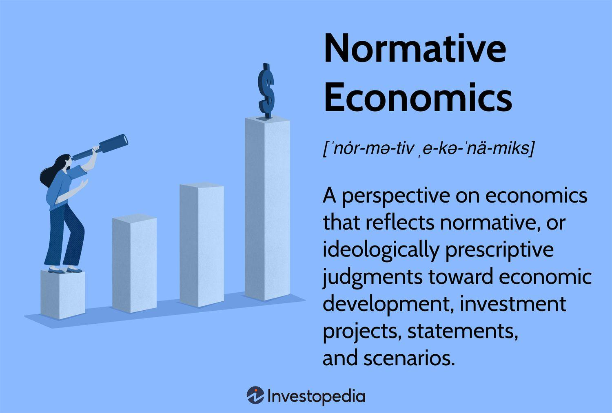

The world of economics is vast, encompassing a wide range of concepts that govern the formulation of economic policy and the development of trading strategies. Among the topics of particular interest are normative economics, economic theories, and the emergence of algorithmic trading. Each of these areas is interconnected, playing a pivotal role in the decision-making processes within financial systems and the shaping of public policy.

Normative economics and economic theories form the bedrock of policy discussions and financial analysis. Normative economics focuses on the value judgments and ethical considerations that influence economic decisions, providing a framework for understanding how we believe economies should function. In contrast, positive economics is concerned with objective analysis and factual data on how economies operate in reality. The interplay between these perspectives informs the creation of policies that aim to balance economic efficiency with societal values.

Economic theories, such as those proposed by Keynesian economists or monetarists, have long influenced our understanding of how markets operate. These theories offer diverse perspectives on the best approaches to managing economies and addressing issues like inflation, unemployment, and growth. They provide the models and assumptions necessary for policymakers and analysts to make informed decisions.

In recent years, algorithmic trading has emerged as a dynamic field that merges principles from economic theory with cutting-edge technology. This approach utilizes advanced algorithms to execute trades at speeds and volumes beyond human capability, relying on economic models to interpret vast datasets and ascertain market trends. As a result, algorithmic trading has become a driving force in financial markets, illustrating the practical application of economic theory through technological innovation.

Understanding the connections between normative economics, economic theories, and algorithmic trading is essential for anyone looking to grapple with the complexities of financial ecosystems. These concepts not only shape economic outcomes but also drive the advancement of technologies that redefine how markets function. By appreciating these intertwined fields, one gains valuable insights into the forces at play within both policy formulation and market dynamics, equipping individuals to better anticipate and respond to economic challenges.

## Table of Contents

## Understanding Normative Economics

Normative economics is centered around the articulation of value-laden judgments and opinions about economic policies and objectives. Unlike positive economics, which is concerned with describing and forecasting economic phenomena, normative economics is preoccupied with prescribing actions based on societal values and ethics—essentially what ought to be. This dimension of economics aims to provide a framework for deciding on the most favorable economic outcomes, largely influenced by overriding ethical considerations and societal welfare.

Key aspects of normative economics involve crafting economic policies that take into account variables such as equity, fairness, and moral principles. For example, normative economic analysis might focus on determining the ideal levels of taxation or appropriate wage standards to achieve a more equitable distribution of wealth. Such decisions are intrinsically subjective because they reflect the value systems of the individuals or groups advocating for them.

This branch of economics is indispensably linked to economic policy-making. It influences key economic decisions that affect the broader population, from social welfare policies to environmental regulations. Since economic policies often entail trade-offs—for instance, between efficiency and equity—normative economics serves a crucial role in guiding these policies towards desirable social outcomes.

Despite its inherent subjectivity, normative economics is vital in the discourse of economic policy. It provides a platform through which different societal groups can articulate their ideals and argue for economic policies that reflect their vision of a just and prosperous society. By incorporating diverse perspectives, normative economics contributes to a richer and more comprehensive framework for economic policy discussions, thereby enhancing the role of ethics in the formulation of economic strategies.

## Economic Theories and Their Impact

Economic theories serve as foundational frameworks for both normative and positive economics, shaping our understanding of how financial systems operate and evolve. These theories offer structured insights into the behavior of economies, guiding the formulation and analysis of economic policies and strategies.

Among the prominent economic theories are Keynesian economics and monetarism, each providing distinct perspectives on market behavior and policy-making. Keynesian economics, developed by John Maynard Keynes, emphasizes the role of government intervention during economic downturns. It suggests that active fiscal policy, through increased government spending and tax adjustments, can stimulate demand and mitigate the impacts of recessions. In contrast, monetarism, associated with Milton Friedman, stresses the importance of controlling the money supply to regulate economic stability. This theory posits that managing inflation and promoting steady growth can be best achieved through monetary policy rather than fiscal intervention.

Economic theories are crucial in developing economic models, which in turn influence both policy decisions and business strategies. For instance, policymakers utilize these models to simulate potential economic outcomes, helping to forecast the impacts of various policy choices. Businesses, on the other hand, rely on these models to strategize investments, pricing, and market entry.

Normative economic theories often integrate ethical considerations, such as equity and fairness, into economic analysis. These ethical dimensions shape evaluations of economic policies, particularly in terms of how benefits and burdens are distributed across different societal groups. For example, a normative evaluation might consider the fairness of tax policies or the equity implications of international trade agreements.

The relevance of economic theories extends into contemporary economic discussions, influencing critical areas such as fiscal policy, monetary policy, and international trade regulations. Fiscal policies are often guided by Keynesian principles, particularly during periods of economic distress, while monetarist ideas continue to shape central banking practices globally. Moreover, trade policies and negotiations frequently draw upon economic theory to balance competitive advantages and ethical trade practices.

The enduring influence of economic theories in both academic and practical settings underscores their role as vital tools for interpreting financial systems and crafting informed economic policies. By offering diverse analytical frameworks, these theories enable policymakers and business leaders to navigate complexities within modern economies, promoting informed decision-making that aims to foster sustainable economic development.

## Algorithmic Trading: Bridging Economics and Technology

Algorithmic trading is a sophisticated trading strategy that integrates economic principles with technological advancements to enhance trading effectiveness through automation. By automating trading decisions, [algorithmic trading](/wiki/algorithmic-trading) minimizes human errors, optimizes speed, and achieves higher efficiency in processing large volumes of transactions. This strategy is underpinned by rigorous data analysis and economic modeling, which are rooted in both positive and normative economics.

Positive economics plays a pivotal role in algorithmic trading, offering empirical insights into market conditions and dynamics. This involves parsing vast datasets to establish patterns and trends that inform trading algorithms. The reliance on historical data and statistical models enables traders to make evidence-based forecasts about future market movements. For instance, statistical techniques like regression analysis and time-series forecasting are extensively employed to model price behaviors and identify potential trading opportunities.

Normative economics, although primarily value-driven, also contributes to algorithmic trading by addressing ethical considerations and societal impacts. It influences the design and deployment of trading algorithms, ensuring that they adhere to ethical standards and regulatory requirements. For example, in high-frequency trading ([HFT](/wiki/high-frequency-trading-strategies)), algorithms are designed to execute trades with minimal market impact, aligning with the broader economic goal of market [liquidity](/wiki/liquidity-risk-premium) without causing undue [volatility](/wiki/volatility-trading-strategies).

Algorithmic trading leverages economic theories to predict and respond to market behavior effectively. The Efficient Market Hypothesis (EMH) and Modern Portfolio Theory (MPT) are two economic concepts that heavily influence algorithm development. EMH, which posits that financial markets are “informationally efficient,” guides traders in assuming that all available information is reflected in asset prices, thereby informing the creation of predictive models. Alternatively, MPT is used to optimize portfolios by balancing risk and return, a task efficiently handled through algorithmic strategies.

As algorithmic trading matures, it continually reshapes financial markets by enhancing transaction speed and accuracy. The rapid processing of information and execution of trades provide competitive advantages, particularly in markets where milliseconds can dictate profitability. Furthermore, advancements in [machine learning](/wiki/machine-learning) and [artificial intelligence](/wiki/ai-artificial-intelligence) are expanding the capabilities of trading algorithms, allowing them to learn and adapt to new market conditions autonomously.

The ongoing evolution of algorithmic trading underscores the necessity for a robust understanding of economic principles. This understanding ensures that traders can develop and implement strategies that are reflective of real-world market dynamics while maintaining ethical trading practices. In conclusion, the intersection of economics and technology within algorithmic trading demonstrates its transformative impact on financial markets, enhancing our collective ability to execute informed and ethical financial strategies.

## The Role of Economics in Policy Making and Trading

Economics plays a critical role in policy-making by providing a structured framework for understanding the intricate dynamics of national and global markets. The discipline is bifurcated into positive economics, which supplies an empirical foundation by examining the current state of affairs and predicting potential policy ramifications, and normative economics, which integrates ethical and societal values into decision-making processes.

Positive economics is grounded in observable data and measurable outcomes, offering an objective lens through which policymakers can analyze economic phenomena. It answers questions of "what is" by using empirical evidence to forecast trend lines, assess market dynamics, and understand the impact of various policy interventions. This empirical approach is essential for crafting policies that respond effectively to current economic conditions. For example, the analysis of supply and demand curves, GDP growth rate, and unemployment [statistics](/wiki/bayesian-statistics) can guide fiscal and monetary policies. Positive economics allows stakeholders to derive insights from statistical models and economic indicators, ensuring policies are evidence-based and aligned with the factual economic climate.

Normative economics, on the other hand, introduces a subjective framework by considering what "ought to be." This perspective emphasizes aligning economic policies with broader societal objectives such as economic equality, sustainability, and social welfare. Through normative analysis, policymakers ensure that economic strategies do not merely satisfy numerical targets but also adhere to ethical standards and public interest. For instance, decisions about tax policy or social welfare programs invariably require normative judgments about fairness, distribution of resources, and social justice. This dimension of economics is vital for guiding policy in a direction that upholds public values and ethical considerations.

Algorithmic trading exemplifies the intersection of these economic perspectives, leveraging economic insights to enhance decision-making in the finance sector. By harnessing algorithms that incorporate both quantitative data (positive economics) and market trends influenced by human behavior and ethical considerations (normative economics), traders can optimize strategies for buying and selling assets. Algorithmic models analyze vast amounts of financial data, automate trading decisions based on predefined criteria, and adjust swiftly to market shifts. These models rely on economic theories to predict market movements and manage risks effectively, showcasing the practical application of economic principles in technology-driven financial environments.

The collaborative influence of positive and normative economics, combined with advancements in algorithmic trading, enriches our ability to formulate policies and strategies that are not only efficient but also ethically conscientious. This synthesis empowers decision-makers to address contemporary economic challenges with a comprehensive understanding of both empirical realities and normative goals, ensuring sustainable and equitable economic growth. As markets continue to evolve and technological innovations expand, maintaining this balance is paramount for fostering a resilient and just economic ecosystem.

## Conclusion: The Interconnectedness of Economics, Policy, and Trading

The interplay between normative economics, economic theories, and algorithmic trading has profound implications for financial ecosystems. This interconnectedness shapes how economies develop policies and strategies that address both empirical and ethical considerations. Positive economics provides a factual basis for understanding the current economic environment, enabling data-driven assessment of policy options and market conditions. Normative economics complements this by introducing moral and ethical dimensions to policy-making, ensuring that economic strategies align with societal values and goals. Together, they form a comprehensive framework for economic decision-making.

Algorithmic trading serves as a practical embodiment of these principles, transforming theoretical insights into market actions. By employing sophisticated models and leveraging vast datasets, algorithmic trading systems optimize transactions and enhance market efficiency. These systems often incorporate elements from both positive and normative economics, using quantitative methods to predict market behavior while adhering to ethical trading practices. The computational power of algorithms allows for rapid analysis and execution, setting the foundations for strategies that are both economically sound and ethically responsible.

As technological advancements continue, the integration of economics and technology is anticipated to deepen further. Emerging technologies like artificial intelligence and machine learning provide new tools for economic analysis and trading strategies, which can be vital in the pursuit of sustainable and equitable growth. Policymakers and traders must, therefore, be equipped with a solid understanding of both economic theories and technological capabilities to effectively address future challenges.

A balanced approach to these disciplines ensures that financial and economic systems are not only efficient but also resilient and fair, capable of adapting to changes in market dynamics and societal demands. This equilibrium is vital for nurturing a robust economic environment that fosters innovation and inclusivity, promoting growth that benefits all stakeholders in the global economy.

## References & Further Reading

[1]: Keynes, J. M. (1936). ["The General Theory of Employment, Interest, and Money"](https://link.springer.com/book/10.1007/978-3-319-70344-2). Palgrave Macmillan.

[2]: Friedman, M. (1968). ["The Role of Monetary Policy."](https://www.aeaweb.org/aer/top20/58.1.1-17.pdf) American Economic Review, 58(1), 1-17.

[3]: [Lopez de Prado, M. (2018). "Advances in Financial Machine Learning."](https://www.amazon.com/Advances-Financial-Machine-Learning-Marcos/dp/1119482089) Wiley.

[4]: Jansen, S. (2020). ["Machine Learning for Algorithmic Trading: Predictive models to extract signals from market and alternative data for systematic trading strategies with Python"](https://github.com/stefan-jansen/machine-learning-for-trading). Packt Publishing.

[5]: Aronson, D. R. (2006). ["Evidence-Based Technical Analysis: Applying the Scientific Method and Statistical Inference to Trading Signals"](https://www.amazon.com/Evidence-Based-Technical-Analysis-Scientific-Statistical/dp/0470008741). Wiley.

[6]: Chan, E. (2008). ["Quantitative Trading: How to Build Your Own Algorithmic Trading Business"](https://github.com/ftvision/quant_trading_echan_book). Wiley.

[7]: Fama, E. F. (1970). ["Efficient Capital Markets: A Review of Theory and Empirical Work."](https://www.jstor.org/stable/2325486) The Journal of Finance, 25(2), 383-417.

[8]: Markowitz, H. (1952). ["Portfolio Selection."](https://onlinelibrary.wiley.com/doi/abs/10.1111/j.1540-6261.1952.tb01525.x) The Journal of Finance, 7(1), 77-91.

[9]: Hull, J. C. (2012). ["Options, Futures, and Other Derivatives"](https://www.semanticscholar.org/paper/Options%2C-Futures%2C-and-Other-Derivatives-Hull/89bdee500c8623864fc9eb7a471546aa713acc44). Pearson.