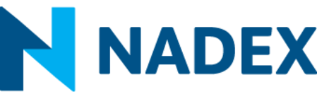

## Table of Contents

## What is the North American Derivatives Exchange (NADEX)?

The North American Derivatives Exchange, or NADEX, is a regulated online marketplace where people can trade different types of financial contracts. These contracts are called derivatives, and they allow traders to bet on the future price movements of things like stocks, commodities, and currencies. NADEX is unique because it is one of the few places where individual traders can access these kinds of financial instruments in the United States.

NADEX was founded in 2004 and is overseen by the Commodity Futures Trading Commission (CFTC). This means that it has to follow strict rules to protect traders and make sure everything is fair. On NADEX, you can trade binary options and spreads, which are types of contracts that have a fixed payout. This can make trading simpler because you know exactly what you could win or lose before you start.

## How does NADEX differ from traditional stock exchanges?

NADEX is different from traditional stock exchanges because it focuses on trading derivatives, not stocks. On a traditional stock exchange, you buy and sell shares of companies. The price of these shares can go up or down based on how well the company is doing. On NADEX, you trade contracts that are based on the future price of things like stocks, commodities, or currencies. These contracts, called derivatives, let you bet on whether the price will go up or down without actually owning the thing itself.

Another big difference is how the trading works. On a traditional stock exchange, you can lose more money than you put in if the price moves against you. This is called leverage. On NADEX, the risk is limited. When you trade binary options or spreads, you know the most you can lose before you start. This makes it easier to manage your risk. Also, NADEX is regulated by the CFTC, which means it has to follow strict rules to protect traders, while traditional stock exchanges are overseen by the SEC.

## What types of financial instruments are traded on NADEX?

On NADEX, you can trade two main types of financial instruments: binary options and spreads. Binary options are simple contracts where you bet on whether something, like a stock or commodity, will go up or down in price by a certain time. If you guess right, you get a fixed payout. If you guess wrong, you lose what you paid for the contract. It's like betting on a coin flip, but with financial markets.

Spreads are another type of contract on NADEX. With spreads, you bet on how much the price of something will move within a range. You buy one contract and sell another at the same time. The difference between the two prices is the spread. If the price moves in your favor, you make money. If it doesn't, you lose what you paid for the spread. Both binary options and spreads have a set risk, so you know the most you can lose before you start trading.

## How can someone start trading on NADEX?

To start trading on NADEX, you first need to open an account on their website. It's easy to do - just go to the NADEX website, click on "Open an Account," and fill out the form with your personal information. You'll need to provide things like your name, address, and social security number. Once you submit the form, NADEX will check your information to make sure you're eligible to trade. After that, you'll need to fund your account with money. You can do this by linking a bank account or using a credit card.

Once your account is set up and funded, you can start trading. On the NADEX platform, you'll see different types of contracts like binary options and spreads. These are based on things like stocks, commodities, and currencies. To trade, you just pick a contract you think will go up or down in price, decide how much you want to bet, and then buy or sell the contract. Remember, trading on NADEX has a set risk, so you know the most you can lose before you start. It's a good idea to learn about the different contracts and practice with a demo account before you start trading with real money.

## What are the basic trading strategies for beginners on NADEX?

For beginners on NADEX, one simple strategy is to start with binary options. Binary options are easy to understand because you just bet on whether the price of something will go up or down by a certain time. For example, if you think the price of gold will go up in the next hour, you can buy a binary option that pays out if it does. If you're right, you get a fixed amount of money. If you're wrong, you lose what you paid for the option. It's like betting on a coin flip, but with financial markets. This strategy is good for beginners because it's easy to see how much you can win or lose before you start.

Another basic strategy is to use spreads. With spreads, you bet on how much the price of something will move within a range. You buy one contract and sell another at the same time. The difference between the two prices is the spread. If the price moves in your favor, you make money. If it doesn't, you lose what you paid for the spread. This strategy can be a bit more complex than binary options, but it's still good for beginners because it has a set risk. You know the most you can lose before you start, which helps you manage your money better. Both strategies are good ways for beginners to start trading on NADEX without taking too much risk.

## What are the risks associated with trading on NADEX?

Trading on NADEX can be risky, just like any kind of trading. Even though NADEX has rules that limit how much you can lose, you can still lose all the money you put in. It's important to know that when you trade binary options or spreads, you're betting on what might happen in the future. If you guess wrong, you lose the money you used to buy the contract. So, it's a good idea to only use money you can afford to lose and to think carefully before you start trading.

Another risk is that the markets can be unpredictable. Prices can go up and down quickly because of things like news events or changes in the economy. This can make it hard to guess what will happen next. Even if you do a lot of research, there's no way to be sure you'll make money. That's why it's smart to start small and learn as you go. Using a demo account to practice can help you understand the risks better before you start trading with real money.

## How is NADEX regulated and what protections are in place for traders?

NADEX is regulated by the Commodity Futures Trading Commission (CFTC). This means that NADEX has to follow strict rules to make sure trading is fair and safe for everyone. The CFTC checks that NADEX is doing things the right way and that it's not cheating or letting others cheat. This helps keep the trading platform honest and trustworthy.

NADEX also has rules to protect traders. One big rule is that you can't lose more money than you put in. This is different from some other places where you might lose more than you started with. On NADEX, if you buy a binary option or a spread, you know the most you can lose before you start. This helps you manage your money better and not take too much risk. Plus, NADEX has to keep your money safe and separate from their own money, so you know your funds are protected.

## What advanced trading tools does NADEX offer to experienced traders?

NADEX offers some advanced tools for experienced traders to help them make better decisions. One tool is called the "Economic Calendar." This shows when important news events are happening that might affect the markets. Experienced traders can use this to plan their trades around these events. Another tool is the "Market Scanner," which helps traders quickly see which contracts are moving a lot. This can help them find good trading opportunities faster.

Another useful tool is the "Charting and Technical Analysis" feature. This lets traders look at price charts and use different tools to study how prices are moving. They can draw lines, add indicators, and see patterns that might help them predict what will happen next. Experienced traders often use these charts to make more informed trading decisions. These tools can make trading on NADEX easier and more effective for those who know how to use them well.

## How does NADEX handle market volatility and what measures are in place?

NADEX handles market [volatility](/wiki/volatility-trading-strategies) by making sure that trading stays fair and safe even when prices move a lot. They do this by setting clear rules for how trading works. For example, NADEX uses a system called "price limits" to keep things under control. If prices start moving too fast, these limits can stop trading for a bit until things calm down. This helps make sure that everyone has a fair chance to trade, no matter how wild the market gets.

Another way NADEX deals with volatility is by offering contracts that have a set risk. When you trade binary options or spreads on NADEX, you know the most you can lose before you start. This is really helpful during times when the market is moving a lot because it stops you from losing more money than you planned. NADEX also gives traders tools like the Economic Calendar and Market Scanner, which can help them see when big price changes might happen and plan their trades better.

## Can you explain the settlement process for trades on NADEX?

When you trade on NADEX, the settlement process is how you find out if you made or lost money on your trade. It happens at the end of the contract's time. For binary options, if you guessed right about whether the price would go up or down, you get a fixed amount of money. If you guessed wrong, you lose the money you used to buy the option. It's like a bet where you know the prize or the cost before you start. The money is added to or taken from your account right away.

For spreads, the settlement works a bit differently. You're betting on how much the price will move within a range. At the end of the contract's time, NADEX looks at the final price and figures out if you made or lost money based on the difference between the two prices you traded. If the price moved in your favor, you make money. If it didn't, you lose what you paid for the spread. The money is settled in your account at the end of the contract, just like with binary options.

## What are the tax implications of trading on NADEX?

When you trade on NADEX, you need to think about taxes. The money you make from trading binary options and spreads is usually seen as regular income by the IRS. This means you have to pay taxes on it like you would on your salary. You'll need to report your earnings on your tax return and pay the right amount of tax based on your income level. It's a good idea to keep good records of all your trades so you can figure out how much you made or lost.

If you lose money trading on NADEX, you might be able to use those losses to lower your taxes. You can take your losses and subtract them from your gains, which can help reduce the amount of tax you owe. But there are rules about how much you can deduct, so it's smart to talk to a tax professional to make sure you're doing it right. They can help you understand all the tax rules and make sure you're following them correctly.

## How does NADEX's technology infrastructure support high-frequency trading?

NADEX's technology is built to handle lots of trades quickly, which is important for high-frequency trading. High-frequency trading means making many trades in a very short time, and NADEX's system can keep up with that. It uses fast servers and strong internet connections to make sure trades happen without delays. This helps traders who want to buy and sell contracts quickly to take advantage of small changes in prices.

The platform also has tools that help high-frequency traders. For example, the Market Scanner shows which contracts are moving a lot, so traders can find good opportunities fast. NADEX's system is designed to handle many traders at the same time without slowing down, which is key for high-frequency trading. This way, traders can make their moves quickly and not miss out on chances to make money.

## References & Further Reading

[1]: ["The Use of Algorithmic Trading in the Securities Market"](https://www.investopedia.com/terms/a/algorithmictrading.asp) by the U.S. Securities and Exchange Commission

[2]: Grant, K. (2020). ["Binary Options Pricing: Theory, Analysis, and Future Research."](https://www.sciencedirect.com/science/article/abs/pii/S0378437124007143) Journal of Derivatives

[3]: ["Automated Trading with R: Quantitative Research and Platform Development"](https://link.springer.com/book/10.1007/978-1-4842-2178-5) by Chris Conlan

[4]: ["Understanding the CFTC's Role in Derivatives Markets."](https://www.investopedia.com/terms/c/cftc.asp) Commodity Futures Trading Commission (CFTC)

[5]: Pardo, R. (2008). ["The Evaluation and Optimization of Trading Strategies."](https://onlinelibrary.wiley.com/doi/book/10.1002/9781119196969) John Wiley & Sons

[6]: Aldridge, I. (2013). ["High-Frequency Trading: A Practical Guide to Algorithmic Strategies and Trading Systems."](https://onlinelibrary.wiley.com/doi/pdf/10.1002/9781119203803.fmatter) Wiley Trading Series