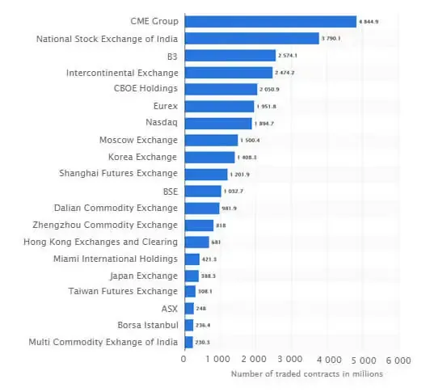

Nadex, or the North American Derivatives Exchange, serves as a prominent fixture within the North American financial landscape, offering traders a reliable and innovative platform for engaging in derivatives trading. Established in 2004 and headquartered in Chicago, Nadex has carved out a niche by providing secure trading solutions under stringent regulation by the Commodity Futures Trading Commission (CFTC). This regulatory framework ensures that Nadex adheres to high standards of transparency and security, bolstering trader confidence in its offerings.

The platform features a diverse array of financial products, including binary options and bull spreads. Binary options are particularly popular due to their straightforward nature, allowing traders to speculate on the price movement of various markets with defined risk. Bull spreads provide a mechanism for traders to speculate on market movements within predetermined limits, offering an additional layer of risk management through capped potential losses. This array of products ensures that Nadex caters to a wide range of trading strategies and risk preferences, appealing to both novice and seasoned investors alike.



As the financial industry evolves, technology plays an increasingly integral role. Algorithmic trading, which uses computer algorithms to automate trading strategies, has become a pivotal development, enhancing efficiency and speed in trade execution. Within this context, Nadex supports algorithmic trading, offering a comprehensive trading environment designed for the development and execution of such strategies. The platform provides extensive resources to facilitate algorithmic trading, including a robust API that allows traders to develop custom trading bots tailored to their market conditions and personal strategies.

The rise of algorithmic trading signifies a shift towards more data-driven and automated trading practices, allowing for the handling of large data sets, complex pattern recognition, and the execution of high-frequency trading strategies. This article aims to provide a thorough understanding of how Nadex is positioned to support these advancements, enabling traders to maximize their potential in the fast-paced markets of derivatives trading.

## Table of Contents

## History and Overview of Nadex

The North American Derivatives Exchange, commonly known as Nadex, has an intriguing history that underscores its development as a prominent platform for trading derivatives. Initially launched as HedgeStreet Exchange in San Mateo, California, Nadex commenced operations focusing on the retail trading segment. The innovative platform aimed to democratize access to hedge trading for retail investors, enabling participation in markets traditionally dominated by institutional players.

However, by 2007, HedgeStreet encountered operational challenges, compelling it to shut down its activities. Recognizing the potential of the platform, IG Group Holdings plc, a prominent UK-based financial services provider, acquired HedgeStreet. The acquisition marked the beginning of a strategic transformation. IG Group's intervention was pivotal; they restructured the platform's operations, enhanced its technological infrastructure, and broadened its market offerings to revitalize and position it for growth.

In 2009, a significant rebranding initiative led to the establishment of Nadex, a name reflecting its renewed focus and strategies. Since then, Nadex has operated under this identity, catering comprehensively to retail investors seeking diverse trading opportunities. The platform's metamorphosis was not only about a name change but also about fortifying its regulatory compliance and operational integrity.

As a regulated entity under the Commodity Futures Trading Commission (CFTC), Nadex prioritizes transparency and security. This regulatory oversight ensures that the exchange operates within stringent guidelines designed to protect market participants and maintain fair trading conditions. Such adherence to regulatory standards fosters trust among traders, who are assured of the platform's commitment to reliability and fairness.

Today, Nadex presents a broad spectrum of trading opportunities across various asset classes. It offers an extensive range of market indices, allowing traders to engage with global financial markets. Forex pairs, commodities, and economic events are also integral to Nadex's offerings, providing traders with numerous avenues for executing trading strategies. This wide array of products underscores Nadex's ambition to cater to a diverse clientele with varying interests and expertise levels, from novice traders to experienced market participants.

Overall, the evolution of Nadex from HedgeStreet Exchange exemplifies strategic adaptability and a commitment to providing a robust trading environment for retail investors. Through its regulated framework and comprehensive market offerings, Nadex continues to play a significant role in the derivatives exchange landscape within North America.

## Core Products and Market Offerings

Nadex is renowned for offering two main types of trading contracts: Binary Options and Bull Spreads, each designed to cater to different trading styles and risk management strategies.

Binary Options are structured to allow traders to speculate on the direction of market movements in a straightforward manner. These options function on a simple yes-or-no proposition about whether an asset will be above a certain price at a specific time. This format enables traders to know their maximum potential loss and gain before entering a transaction, encapsulating the risk and reward profile in a transparent manner. For instance, if a trader bets on an equity index to close above a defined value by the end of the trading day, they can accurately anticipate the loss to be the amount paid to enter the position if the prediction is incorrect.

Bull Spreads, by contrast, provide a more nuanced approach for traders who prefer to speculate within predetermined price boundaries, incorporating a mechanism to limit exposure to losses. With bull spreads, traders select a floor and ceiling price range within which they believe the market will move. This allows them to profit from gradual changes in the market while protecting against severe market swings. The price of the bull spread will fluctuate within these boundaries, providing opportunities for profit as long as the market stays within the designated range.

Nadex's platform extends beyond these products to provide trading opportunities across an expanse of financial instruments. These include equity indices that cover major global markets, various foreign exchange ([forex](/wiki/forex-system)) pairs, and commodities such as [crude oil](/wiki/crude-oil) and gold. Additionally, economic events are open for speculation, allowing traders to position themselves in anticipation of market-moving news or reports, such as employment figures or [interest rate](/wiki/interest-rate-trading-strategies) announcements.

The diversity of products available through Nadex is strategically designed to attract both novice and experienced traders. This broad selection accommodates various trading strategies and risk appetites, from those preferring short-term directional bets to traders that favor managed risk scenarios. Consequently, Nadex ensures that its offerings provide both structure and flexibility, allowing participants to strategically navigate the markets according to their individual goals and strategies.

## Algorithmic Trading on Nadex

Algorithmic trading, often referred to as algo trading, deploys computer algorithms to automate trading strategies, significantly enhancing efficiency and speed in trade execution. Nadex's platform is designed with robust support for such strategies, offering a comprehensive API and a sturdy trading infrastructure. This facilitates traders in developing custom trading bots capable of executing trades on their behalf. These bots can be fine-tuned to optimize trades based on prevailing market conditions and specific personal strategies.

The flexibility of Nadex's platform extends to its seamless integration with third-party tools, which significantly enhances the platform's compatibility for executing [algorithmic trading](/wiki/algorithmic-trading) functions. This interoperability allows traders to leverage external analytical tools and software, thus improving their trading performance and strategy execution. Such an environment is conducive for handling large datasets, where pattern recognition and high-frequency trading strategies can be executed with precision.

Algorithmic trading on Nadex is particularly advantageous in managing large volumes of data, which are often cumbersome and complex to analyze manually. Through algorithms, traders can identify and exploit market inefficiencies or patterns that might not be readily apparent through traditional analysis. These algorithms are adept at performing repetitive tasks with high accuracy, which is crucial for executing successful high-frequency trading strategies.

For instance, a typical algorithmic trading scenario might involve writing a Python script that uses Nadex's API to access market data, analyze trends, and automatically place trades based on pre-defined criteria. Here is a simplified example of how such a script might look:

```python
import requests

# Set up your API credentials
api_key = 'YOUR_API_KEY'
base_url = 'https://api.nadex.com/v2/'

def get_market_data():
    response = requests.get(f'{base_url}markets', headers={'Authorization': f'Bearer {api_key}'})
    market_data = response.json()
    return market_data

def analyze_data(data):
    # Placeholder for data analysis logic
    trends = {"market": "example"}  # Simplified example
    return trends

def place_trade(market_id, position):
    trade_details = {
        'market_id': market_id,
        'position': position,
        'amount': 1  # Amount in contracts
    }
    response = requests.post(f'{base_url}trade', json=trade_details, headers={'Authorization': f'Bearer {api_key}'})
    return response.json()

market_data = get_market_data()
trading_opportunities = analyze_data(market_data)

for market_id, position in trading_opportunities.items():
    trade_result = place_trade(market_id, position)
    print(f'Trade placed: {trade_result}')
```

This basic script is a foundational example that can be expanded with complex algorithms for analyzing market trends and executing trades strategically. Nadex's environment allows traders to automate these processes, thus freeing them from the constraints of manual trading and enabling them to engage in more sophisticated trading strategies.

## Benefits of Trading with Nadex

Traders benefit significantly from Nadex due to its commitment to transparency, as it offers clearly defined information about fees, risks, and payouts before trade execution. This level of transparency ensures that traders can make informed decisions without hidden costs, enhancing trust in the platform.

The platform's security and regulatory compliance further contribute to a trustworthy trading environment. As a regulated exchange by the Commodity Futures Trading Commission (CFTC), Nadex provides assurances that traders' funds are safeguarded. This regulation leads to a secure trading experience, offering peace of mind to participants in the derivatives market.

Nadex also distinguishes itself through its extensive educational resources, which include webinars and demo accounts. These resources are invaluable for traders looking to practice and refine their strategies. By offering a risk-free environment through demo accounts, users can familiarize themselves with market dynamics and test their approaches before engaging in actual trading.

The platform's interface is designed to be intuitive and user-friendly, facilitating an easy onboarding process for new traders and minimizing the learning curve associated with trading activities. This ease of use is pivotal for novice traders, allowing them to navigate the complexities of the market and execute trades with confidence.

Additionally, Nadex offers competitive trading fees, which ensures that traders can retain more of their profits. By keeping costs manageable, the platform allows traders to maximize their profitability. Whether through its transparent fee structures or low transaction costs, Nadex ensures that financial barriers to entry and participation are as minimal as possible, making it accessible to a broad range of investors.

## Conclusion

The North American Derivatives Exchange (Nadex) is recognized as a significant entity in the derivatives market, characterized by an extensive range of products and a conducive environment for algorithmic trading. Nadex's regulatory framework, being overseen by the Commodity Futures Trading Commission (CFTC), ensures a transparent and secure trading platform. This regulation is a cornerstone of Nadex's appeal, providing traders with confidence in the integrity and safety of their trading activities.

With the increasing popularity of algorithmic trading, Nadex is strategically positioned to equip traders with necessary tools and resources to thrive in dynamic market conditions. The platform's offerings, including binary options and bull spreads, are designed to cater to varying risk profiles and trading strategies. These products feature defined risks and outcomes, which are critical for traders focused on risk management and strategy optimization.

Nadex's infrastructure supports both seasoned investors and beginners, offering a comprehensive suite of educational resources and an intuitive interface. This facilitates a smooth onboarding process, allowing a diverse range of traders to exploit the platform's capabilities effectively. Moreover, the competitive trading fees structure enhances profitability by ensuring costs remain reasonable, thereby maximizing traders' potential returns.

For those interested in derivative markets with manageable risks, Nadex presents an invaluable platform for refining trading skills and applying algorithmic strategies. The integration of technology and robust market offerings solidifies Nadex's standing as a versatile and dependable option for traders seeking to engage actively and securely in financial markets.

## References & Further Reading

[1]: ["The Use of Algorithmic Trading in the Securities Market"](https://www.investopedia.com/terms/a/algorithmictrading.asp) by the U.S. Securities and Exchange Commission

[2]: Grant, K. (2020). ["Binary Options Pricing: Theory, Analysis, and Future Research."](https://www.sciencedirect.com/science/article/abs/pii/S0378437124007143) Journal of Derivatives

[3]: ["Automated Trading with R: Quantitative Research and Platform Development"](https://link.springer.com/book/10.1007/978-1-4842-2178-5) by Chris Conlan

[4]: ["Understanding the CFTC's Role in Derivatives Markets."](https://www.investopedia.com/terms/c/cftc.asp) Commodity Futures Trading Commission (CFTC)

[5]: Pardo, R. (2008). ["The Evaluation and Optimization of Trading Strategies."](https://onlinelibrary.wiley.com/doi/book/10.1002/9781119196969) John Wiley & Sons

[6]: Aldridge, I. (2013). ["High-Frequency Trading: A Practical Guide to Algorithmic Strategies and Trading Systems."](https://onlinelibrary.wiley.com/doi/pdf/10.1002/9781119203803.fmatter) Wiley Trading Series