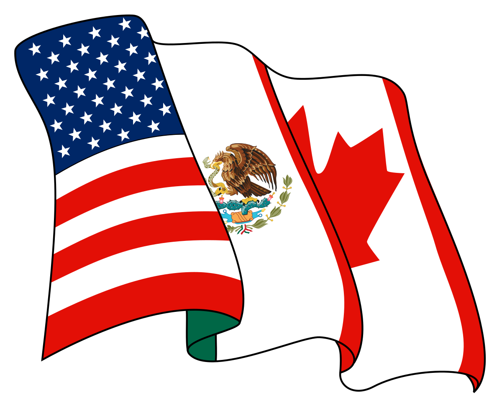

## Table of Contents

## What is the North American Free Trade Agreement (NAFTA)?

The North American Free Trade Agreement, or NAFTA, is a deal between the United States, Canada, and Mexico. It started in 1994 and its main goal is to make it easier for these countries to trade goods and services with each other. By removing tariffs, which are taxes on imports, and other trade barriers, NAFTA helps businesses in these countries sell their products more easily across borders.

NAFTA has had a big impact on the economies of the three countries. It has helped increase trade and investment among them. Many businesses have grown because they can now sell to a larger market. However, it has also caused some challenges. Some people worry that jobs have moved to countries where labor is cheaper, and that can hurt workers in the other countries.

Overall, NAFTA is seen as an important agreement that has changed how the United States, Canada, and Mexico work together economically. It shows how countries can work together to grow their economies, but it also reminds us that big changes like this can have both good and bad effects.

## Which countries are part of NAFTA?

The countries that are part of NAFTA are the United States, Canada, and Mexico. These three countries came together to make trade easier between them.

NAFTA started in 1994. It helps businesses in these countries sell their products to each other without paying big taxes on imports. This has made trade grow a lot between the United States, Canada, and Mexico.

## When was NAFTA established?

NAFTA, which stands for the North American Free Trade Agreement, was established on January 1, 1994. This agreement was made between the United States, Canada, and Mexico. The main goal of NAFTA was to make it easier for these countries to trade with each other by removing taxes on imports, called tariffs, and other trade barriers.

Since it started, NAFTA has helped increase trade and investment among the three countries. Businesses have been able to sell their products more easily across borders, which has helped them grow. However, NAFTA has also caused some challenges. Some people worry that jobs have moved to countries where labor is cheaper, which can hurt workers in the other countries.

## What are the main objectives of NAFTA?

The main goal of NAFTA, which stands for the North American Free Trade Agreement, is to make it easier for the United States, Canada, and Mexico to trade with each other. NAFTA does this by getting rid of tariffs, which are taxes on imports, and other barriers to trade. This means businesses in these countries can sell their products to each other more easily and at lower costs. By making trade easier, NAFTA helps the economies of these three countries grow.

Another important goal of NAFTA is to increase investment between the United States, Canada, and Mexico. When businesses find it easier to trade, they are more likely to invest in new projects or expand their operations in these countries. This can lead to more jobs and economic growth. However, NAFTA also aims to make sure that this growth is fair and helps all three countries. It includes rules to protect workers' rights and the environment, so that the benefits of trade are shared more evenly.

## How does NAFTA affect trade between member countries?

NAFTA makes trade between the United States, Canada, and Mexico easier. It does this by getting rid of tariffs, which are taxes on things that are imported from another country. When tariffs are gone, businesses can sell their products to people in other countries without making them more expensive. This means more trade happens because it's cheaper and easier for businesses to sell their stuff across borders. Since NAFTA started, trade between these three countries has grown a lot.

NAFTA also helps businesses invest in each other's countries. When it's easier to trade, companies are more likely to start new projects or grow their businesses in the United States, Canada, or Mexico. This can lead to more jobs and help the economies of these countries grow. But, NAFTA also tries to make sure that this growth is fair. It has rules to protect workers and the environment, so that everyone can benefit from the increased trade.

## What are the economic benefits of NAFTA for the participating countries?

NAFTA has brought many economic benefits to the United States, Canada, and Mexico. One big benefit is that it has made trade easier between these countries. By getting rid of tariffs, which are taxes on imports, businesses can sell their products to people in other countries without making them more expensive. This has led to a lot more trade. Since NAFTA started, the amount of goods and services moving between these three countries has grown a lot. This has helped businesses grow and create more jobs, which is good for the economies of the United States, Canada, and Mexico.

Another benefit of NAFTA is that it has encouraged investment between the three countries. When it's easier to trade, companies are more likely to start new projects or expand their businesses in the United States, Canada, or Mexico. This means more money is being put into these economies, which can lead to more jobs and help the economies grow even more. NAFTA also tries to make sure that this growth is fair by including rules to protect workers' rights and the environment. This way, the benefits of increased trade and investment can be shared more evenly among the three countries.

## What criticisms have been made about NAFTA?

Some people don't like NAFTA because they think it has caused job losses. They say that businesses moved their factories to Mexico where labor is cheaper. This means workers in the United States and Canada lost their jobs. These critics worry that NAFTA makes it easier for companies to find cheaper labor, which can hurt workers in the other countries. They also think that NAFTA has not helped everyone equally. Some people believe that big businesses have benefited more than small businesses or workers.

Another criticism of NAFTA is that it might hurt the environment. Some people think that when businesses move to Mexico, they might not follow strict environmental rules. This could lead to more pollution and damage to the environment. Critics also say that NAFTA doesn't do enough to protect the environment. They want stronger rules to make sure that trade doesn't harm the planet. Overall, while NAFTA has helped increase trade and investment, these criticisms show that it has also caused some big problems that need to be addressed.

## How has NAFTA impacted labor markets in North America?

NAFTA has had a big impact on labor markets in North America. Some people worry that it has caused job losses in the United States and Canada. They say that businesses moved their factories to Mexico where it's cheaper to pay workers. This means that workers in the United States and Canada lost their jobs. It's harder for them to find new work because companies are looking for cheaper labor in Mexico. This has made some people unhappy with NAFTA because they feel it hurts workers in their countries.

On the other hand, NAFTA has also created new jobs in all three countries. Because trade has increased, businesses have grown and needed more workers. In Mexico, more jobs have been created in factories that make things to sell to the United States and Canada. In the United States and Canada, jobs have been created in industries that export goods to Mexico. So, while some workers lost their jobs, others found new ones because of NAFTA. It's a mixed impact on labor markets, with both challenges and opportunities for workers in North America.

## What environmental concerns are associated with NAFTA?

Some people worry that NAFTA has hurt the environment. They think that when businesses move their factories to Mexico, they might not follow strict rules about pollution. This could lead to more damage to the environment because the factories might pollute more than they would in the United States or Canada. Critics say that NAFTA does not have strong enough rules to protect the environment, and they want the agreement to do more to make sure that trade doesn't harm the planet.

However, NAFTA does include some rules to try to protect the environment. It has a special part called the North American Agreement on Environmental Cooperation (NAAEC) that aims to make sure trade doesn't hurt the environment. This agreement encourages the three countries to work together to protect the environment and to make sure businesses follow environmental laws. But some people still think that these rules are not strong enough and that more needs to be done to make sure that the environment is protected as trade grows between the United States, Canada, and Mexico.

## How has NAFTA been modified since its inception?

Since NAFTA started in 1994, it has been changed a few times to make it better. One big change happened in 2018 when the United States, Canada, and Mexico agreed to update NAFTA. They called the new agreement the United States-Mexico-Canada Agreement (USMCA). The USMCA kept many of the same ideas as NAFTA but added new rules to help workers and protect the environment more. It also made some changes to how cars are traded and added new rules about digital trade, which is trading things online.

The changes in the USMCA were meant to fix some of the problems people had with NAFTA. For example, the new agreement has stronger rules to protect workers' rights and make sure businesses follow labor laws. It also has better rules to protect the environment, trying to stop businesses from polluting too much. These changes show that the three countries wanted to keep the benefits of free trade but also make sure that trade is fair and doesn't hurt workers or the environment.

## What is the United States-Mexico-Canada Agreement (USMCA) and how does it relate to NAFTA?

The United States-Mexico-Canada Agreement (USMCA) is a new trade deal that replaced the North American Free Trade Agreement (NAFTA). It started in 2020 after the three countries agreed to update NAFTA. The main goal of the USMCA is to keep the benefits of free trade between the United States, Canada, and Mexico, but also to fix some problems people had with NAFTA. The USMCA keeps many of the same ideas as NAFTA, like making it easier to trade goods and services between the three countries by getting rid of tariffs, which are taxes on imports.

One big difference between the USMCA and NAFTA is that the USMCA has stronger rules to protect workers and the environment. It includes new rules to make sure businesses follow labor laws and pay workers fairly. It also has better rules to stop businesses from polluting too much. The USMCA also added new rules about trading things online, which is called digital trade. These changes show that the three countries wanted to keep the benefits of free trade but also make sure that trade is fair and doesn't hurt workers or the environment.

## What are the future prospects for trade agreements similar to NAFTA in other regions?

Trade agreements like NAFTA are becoming more popular around the world. Countries in different regions are trying to make their own deals to help their businesses grow and sell more stuff to other countries. For example, in Europe, the European Union has trade deals with many countries to make it easier to trade. In Asia, countries like Japan, China, and South Korea are working on agreements to help their businesses trade more with each other. These agreements can help economies grow by making it cheaper and easier to sell products across borders.

However, these trade agreements also face challenges. Some people worry that they might cause job losses in certain countries, just like some people felt about NAFTA. They think businesses might move to countries where labor is cheaper, which can hurt workers in other places. Also, there are concerns about protecting the environment. People want to make sure that businesses follow rules to not pollute too much. So, while trade agreements can bring many benefits, countries need to work together to make sure they are fair and help everyone, not just big businesses.

## References & Further Reading

[1]: Lustig, N., & Lederman, D. (2008). ["NAFTA and the Mexican Economy: Analytical Issues and Lessons for the FTAA."](https://publications.iadb.org/en/publication/nafta-and-mexican-economy-analytical-issues-and-lessons-ftaa) National Bureau of Economic Research.

[2]: López-Córdova, J. E. (2003). ["NAFTA and Mexico's Manufacturing Productivity: An Empirical Investigation Using Micro-level Data."](https://www.semanticscholar.org/paper/NAFTA-and-Mexico%27s-Manufacturing-Productivity%3A-An-L%C3%B3pez-C%C3%B3rdova/5230b5ffa1ab062a5e99c72213eb8ec3dab51ff2) World Bank Policy Research Working Paper.

[3]: Coughlin, C. C., & Wall, H. J. (2003). ["NAFTA and the Changing Pattern of State Exports."](https://link.springer.com/article/10.1007/s10110-003-0122-x) Review of International Economics.

[4]: Lopez de Prado, M. (2018). ["Advances in Financial Machine Learning."](https://www.amazon.com/Advances-Financial-Machine-Learning-Marcos/dp/1119482089) Wiley.

[5]: Aronson, D. R. (2006). ["Evidence-Based Technical Analysis: Applying the Scientific Method and Statistical Inference to Trading Signals."](https://www.amazon.com/Evidence-Based-Technical-Analysis-Scientific-Statistical/dp/0470008741) Wiley.

[6]: Chan, E. P. (2009). ["Quantitative Trading: How to Build Your Own Algorithmic Trading Business."](https://github.com/ftvision/quant_trading_echan_book) John Wiley & Sons.