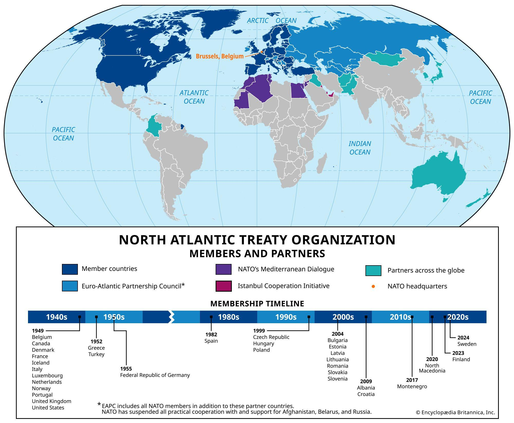

## Table of Contents

## What is the North Atlantic Treaty Organization (NATO)?

The North Atlantic Treaty Organization, or NATO, is a group of countries that work together to keep peace and protect each other. It started in 1949 when twelve countries, including the United States and several European nations, signed a treaty. The main idea of NATO is that if one country in the group is attacked, all the other countries will help defend it. This is called collective defense.

NATO does more than just military stuff. It also helps countries work together on things like stopping terrorism, fighting cyber attacks, and dealing with problems like climate change. Over the years, more countries have joined NATO, and now there are 31 members. They meet regularly to talk about how to keep their countries safe and how to help each other out.

## When was NATO founded and why?

NATO was founded on April 4, 1949. This happened right after World War II ended. The main reason for starting NATO was to stop the spread of communism from the Soviet Union. The countries that started NATO wanted to work together to stay safe and keep peace in Europe.

At that time, the world was divided into two big groups: the West, led by the United States, and the East, led by the Soviet Union. The West was worried that the Soviet Union might try to take over more countries. So, they decided to form NATO to protect each other. If one country in NATO was attacked, all the others would help defend it. This made everyone feel safer and helped keep the peace during the Cold War.

## What are the main goals of NATO?

The main goal of NATO is to keep its member countries safe. This is done through something called collective defense, which means that if one country in NATO is attacked, all the other countries will help defend it. This makes everyone feel safer because they know they have support from their allies. NATO also works to prevent conflicts and keep peace around the world. They do this by talking with other countries and trying to solve problems before they turn into fights.

Another important goal of NATO is to work together on other big issues, not just military ones. For example, NATO helps its members fight terrorism, deal with cyber attacks, and even tackle problems like climate change. By working together, the countries in NATO can do a better job at keeping their people safe and making the world a better place. So, NATO is not just about defense; it's also about cooperation and helping each other out in many different ways.

## How does NATO function as an organization?

NATO functions as an organization by bringing its member countries together to make decisions and plan actions. The main decision-making body is the North Atlantic Council, where all member countries have a seat. They meet regularly to talk about important issues and decide what NATO should do. Each country has an equal say, so decisions are made together. If there's a big problem or a crisis, NATO can also hold special meetings to figure out what to do quickly.

Besides meetings, NATO has a military side that helps keep its members safe. This includes having forces ready to act if there's an attack on a member country. NATO also runs training exercises and works on military plans to make sure everyone knows what to do in an emergency. They share information and technology to make their defenses stronger. NATO also works with other countries and organizations to solve problems like terrorism and cyber attacks, showing that it's not just about military action but also about working together on many different issues.

## Who are the current members of NATO?

NATO has 31 member countries. These countries are spread across North America and Europe. The members are Albania, Belgium, Bulgaria, Canada, Croatia, Czech Republic, Denmark, Estonia, Finland, France, Germany, Greece, Hungary, Iceland, Italy, Latvia, Lithuania, Luxembourg, Montenegro, Netherlands, Norway, Poland, Portugal, Romania, Slovakia, Slovenia, Spain, Sweden, Turkey, United Kingdom, and the United States.

All these countries work together to keep peace and protect each other. They joined NATO at different times, with the first 12 countries signing the treaty in 1949. Since then, more countries have joined over the years. Each country has a say in what NATO does, and they all help each other out if there's a problem.

## How can a country become a member of NATO?

A country that wants to join NATO has to go through a few steps. First, they need to talk to the countries that are already in NATO and say they want to join. Then, NATO will look at the country to see if it's ready to be a member. They check things like if the country has a good government, if it respects human rights, and if it can help keep peace. If NATO thinks the country is ready, they will start talking about how to make it a member.

Once NATO agrees that a country can join, all the countries in NATO have to agree to let the new country in. This means every single member has to say yes. If everyone agrees, the country can sign the North Atlantic Treaty and officially become part of NATO. After that, the new member can join meetings and help make decisions with the other countries.

## What is the process for a country to join NATO?

When a country wants to join NATO, it starts by telling the countries already in NATO that it wants to be a member. Then, NATO looks at the country to see if it's ready. They check if the country has a good government, if it respects human rights, and if it can help keep peace. If NATO thinks the country is ready, they will start talking about how to make it a member.

Once NATO agrees that a country can join, all the countries in NATO have to agree to let the new country in. This means every single member has to say yes. If everyone agrees, the country can sign the North Atlantic Treaty and officially become part of NATO. After that, the new member can join meetings and help make decisions with the other countries.

## What are the benefits of NATO membership for countries?

Being a part of NATO helps countries feel safe because they know that if they are attacked, all the other NATO countries will help defend them. This is called collective defense. It's like having a big group of friends who will stand up for you if someone tries to hurt you. This makes countries feel more secure and less worried about being attacked by other countries.

NATO also helps countries work together on other big problems, not just military ones. For example, they can work together to fight terrorism, stop cyber attacks, and even deal with issues like climate change. By being part of NATO, countries can share information and technology, which makes them stronger and better at solving problems. It's like being part of a team where everyone helps each other out.

## What military and security commitments do NATO members have?

NATO members promise to help defend each other if one of them is attacked. This is called collective defense. It means that if a country in NATO is attacked, all the other countries will come to its help. This makes everyone feel safer because they know they have support from their friends in NATO. Each country has to be ready to send soldiers, ships, or planes to help if there's an attack.

Besides defending each other, NATO members also work together to keep peace and stop problems before they start. They share information and plan together to make sure they can respond quickly if there's a crisis. NATO members also agree to spend money on their military to make sure they are strong and ready. This helps them work together better and keep their countries safe.

## How does NATO collaborate with non-member countries and international organizations?

NATO works with countries that are not members and other groups around the world to keep peace and solve big problems. They talk with these countries and organizations to share ideas and plans. This helps everyone work together better. For example, NATO might work with a country that is not a member to fight terrorism or help with a disaster. They also have special programs to help countries get ready to join NATO if they want to.

NATO also works with big groups like the United Nations and the European Union. They do this to make sure they are all working toward the same goals. For example, NATO might help the United Nations with peacekeeping missions. They also work with the European Union on things like fighting cyber attacks and dealing with climate change. By working together, NATO can help make the world a safer place for everyone.

## What are some major operations and missions that NATO has been involved in?

NATO has been involved in many big operations and missions to keep peace and help countries. One important mission was in Afghanistan. It started in 2003 and was called the International Security Assistance Force (ISAF). NATO helped the Afghan government and worked to stop terrorism. They trained Afghan soldiers and police to keep their country safe. The mission lasted until 2014, but NATO still helps Afghanistan today.

Another big operation was in the Balkans. In the 1990s, there were a lot of fights in places like Bosnia and Kosovo. NATO stepped in to stop the fighting and help keep peace. They used soldiers and planes to make sure people were safe. NATO still has some troops in the Balkans to help keep things calm. These missions show how NATO works to help countries and stop conflicts.

NATO has also been involved in other places like Libya and Iraq. In Libya, NATO helped stop violence in 2011 by using planes to protect people. In Iraq, NATO helps train soldiers to fight terrorism. These missions show that NATO not only defends its members but also works to make the world a safer place by helping other countries.

## What are the current challenges and future prospects for NATO?

NATO faces some big challenges right now. One big challenge is dealing with Russia. Russia has been causing problems, especially with its actions in Ukraine. NATO needs to stay strong and work together to keep its members safe. Another challenge is fighting terrorism. Terrorist groups are a big problem, and NATO needs to keep working with other countries to stop them. Also, cyber attacks are a growing problem. NATO has to find ways to protect its members from attacks on the internet. These challenges are tough, but NATO is trying hard to handle them.

Looking to the future, NATO has some good prospects. One important thing is working on new technology. NATO can use things like drones and [artificial intelligence](/wiki/ai-artificial-intelligence) to stay ahead of threats. Another good thing is working with more countries. By talking and working with countries that are not members, NATO can make the world a safer place. Also, NATO can help with problems like climate change. By working together on these issues, NATO can keep its members safe and help the world. So, while there are challenges, NATO has a lot of potential to do good things in the future.

## References & Further Reading

[1]: ["Advances in Financial Machine Learning"](https://www.amazon.com/Advances-Financial-Machine-Learning-Marcos/dp/1119482089) by Marcos Lopez de Prado

[2]: ["Evidence-Based Technical Analysis: Applying the Scientific Method and Statistical Inference to Trading Signals"](https://www.amazon.com/Evidence-Based-Technical-Analysis-Scientific-Statistical/dp/0470008741) by David Aronson

[3]: ["Machine Learning for Algorithmic Trading"](https://github.com/stefan-jansen/machine-learning-for-trading) by Stefan Jansen

[4]: ["Quantitative Trading: How to Build Your Own Algorithmic Trading Business"](https://www.amazon.com/Quantitative-Trading-Build-Algorithmic-Business/dp/1119800064) by Ernest P. Chan

[5]: NATO. (2020). ["NATO 2030: United for a New Era"](https://www.nato.int/nato_static_fl2014/assets/pdf/2020/12/pdf/201201-Reflection-Group-Final-Report-Uni.pdf)

[6]: Aldridge, I. (2009). ["High-Frequency Trading: A Practical Guide to Algorithmic Strategies and Trading Systems"](https://www.ahmetbeyefendi.com/wp-content/uploads/2020/07/High-Frequency-Trading-Irene-Aldridge.pdf)