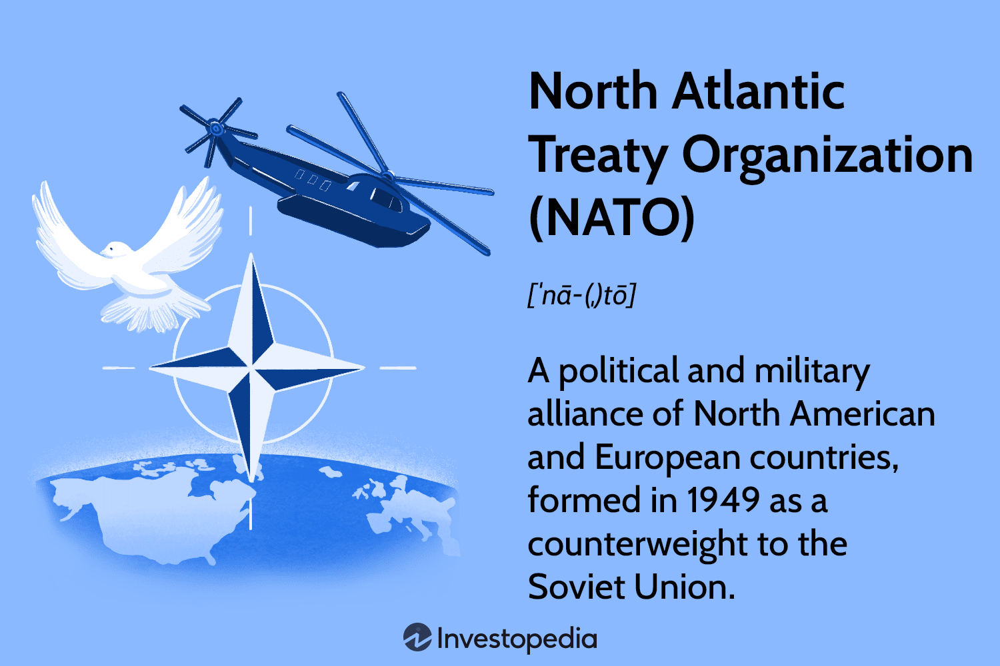

The North Atlantic Treaty Organization (NATO) stands as a poignant example of international cooperation, boasting 32 member states across North America and Europe. This alliance has long been recognized for its foundational role in collective defense, designed to protect member nations from external aggression through strategic military deterrence. However, NATO's impact extends beyond military engagements, significantly influencing economic and technological advancements among its member states. This dual focus bolsters both regional security and economic development, fostering a unique environment for innovation.

In recent years, the growing role of algorithmic trading—a breakthrough technology revolutionizing financial markets—has intersected notably with NATO's strategic framework. Algorithmic trading utilizes sophisticated algorithms and high-speed computational power to execute financial market transactions autonomously, offering unparalleled precision and speed. Its impact on global finance is profound, reshaping trading practices and generating new avenues for economic growth.



The relationship between NATO's strategic objectives and the evolution of algorithmic trading illustrates how military alliances can inform and support advancements in digital and financial technologies. NATO member states, leveraging their cooperative security architecture, have the potential to influence global financial systems by adopting cutting-edge technologies initially developed for defense purposes. This article explores the interconnectedness between NATO and algorithmic trading, emphasizing the broader implications for international finance and technological cooperation.

## Table of Contents

## Understanding NATO

The North Atlantic Treaty Organization (NATO) was founded in 1949 as a collective defense mechanism aimed at safeguarding Western nations from possible threats, predominantly from the Soviet Union during the early stages of the Cold War. This multilateral alliance originally comprised 12 member countries: Belgium, Canada, Denmark, France, Iceland, Italy, Luxembourg, the Netherlands, Norway, Portugal, the United Kingdom, and the United States. Over the decades, NATO's membership has expanded to include 32 states, a reflection of its evolving geopolitical significance and adaptability in addressing contemporary security challenges.

At the heart of NATO's mission lies the commitment to uphold democratic principles and facilitate peaceful conflict resolution. This is primarily pursued through diplomatic engagement but extends to military actions when necessary, as defined in Article 5 of the North Atlantic Treaty, which states that an attack on one member is considered an attack on all, allowing for collective defense measures.

Beyond its military scope, NATO members engage in extensive collaboration across economic and technological domains. This encompasses a focus on reducing economic disparities and preventing conflicts that could arise from economic tensions, as articulated in Articles 2 and 3 of the treaty. The alliance increasingly addresses contemporary challenges through partnerships in digital and financial technologies, areas of considerable importance in the modern interconnected global landscape.

The cooperation among member states has led to significant advancements in digital technologies, cybersecurity measures, and financial systems, fostering a community that not only strives for security but also for innovative economic solutions and technological development. Through shared goals and resources, NATO continues to adapt its strategies and operations, maintaining its relevance in the dynamic international arena.

## NATO Members and Economic Collaboration

Articles 2 and 3 of the North Atlantic Treaty lay the foundation for reducing economic conflicts among member nations and maintaining collective resistance against armed attacks. These articles underline the importance of fostering economic collaboration, which goes beyond defense procurement. The North Atlantic Treaty Organization (NATO) facilitates technological innovations in various sectors, including financial markets, where [algorithmic trading](/wiki/algorithmic-trading) plays a pivotal role.

Algorithmic trading represents a significant advancement in the financial sector, wherein countries can collaborate to maintain a competitive edge in global markets. By employing sophisticated algorithms, financial transactions are automated and executed at high speeds with remarkable precision. This technological evolution in trading not only improves efficiency but also opens avenues for economic stability and growth.

NATO's member countries increasingly recognize the potential benefits of integrating technological innovations in financial systems. The alliance encourages member nations to share knowledge and technologies, fostering an environment where advancements in algorithmic trading are supported. This cooperation is crucial as it allows member states to adapt to rapidly changing global financial markets, ensuring they remain at the forefront of technological progress.

Moreover, the economic collaboration facilitated by NATO extends to cybersecurity measures that protect financial systems from threats, ensuring the integrity and resilience of algorithmic trading operations. By collectively addressing these challenges, member nations enhance their financial sector competitiveness while also strengthening their economic defenses.

Overall, the economic collaboration among NATO members, emphasizing technological innovations such as algorithmic trading, demonstrates the alliance's commitment to achieving economic security and stability. Through shared expertise and technological integration, NATO members can effectively navigate the complexities of modern financial markets.

## What is Algorithmic Trading?

Algorithmic trading is a sophisticated approach to financial trading that utilizes pre-programmed instructions and algorithms to conduct transactions. This technology fundamentally changes how trading is conducted by leveraging high-speed computation, complex mathematical models, and extensive data analysis to make decisions at velocities and accuracies that are impossible for human traders to achieve.

At the core of algorithmic trading are algorithms, precise sets of rules or instructions an automated trading system follows. These instructions are based on various factors, including timing, price, quantity, or any mathematical model. For instance, a simple Python snippet demonstrating an algorithm executing a buy order when a stock's moving average over 50 days exceeds its moving average over 200 days might look like this:

```python
if moving_average_50 > moving_average_200:
    execute_buy_order(stock)
```

The implications of algorithmic trading are significant for financial markets. For asset managers, this technology allows for the implementation of complex investment strategies, reducing the need for manual oversight and minimizing the risks of human error. Algorithmic trading also enables brokerage services to offer enhanced execution services, providing [liquidity](/wiki/liquidity-risk-premium) and efficiency for their clients' transactions.

Moreover, the development and proliferation of algorithmic trading have necessitated the evolution of regulatory frameworks. Regulators must address the unique challenges posed by automated trading, such as ensuring market stability and preventing market manipulation by rogue algorithms.

The shift towards algorithmic trading is not merely a trend but a transformation of trading practices, impacting various market participants and driving further technological advancements in financial markets. This evolution underscores the importance of algorithmic proficiency in maintaining competitiveness in the dynamic landscape of global finance.

## The Role of NATO Members in Algorithmic Trading

Many NATO member countries have become frontrunners in algorithmic trading due to their adoption and development of financial technologies. This is particularly evident in nations such as the United States, the United Kingdom, Germany, and France, which are recognized globally for their leadership in high-frequency and algorithmic trading practices.

The United States has established itself as a pioneer in algorithmic trading, primarily due to its robust financial infrastructure and large equities market. The New York Stock Exchange (NYSE) and Nasdaq are among the largest trading platforms worldwide, serving as hubs for significant algorithmic trading activities. American firms have been at the forefront of developing complex algorithms that leverage advanced data analytics, [machine learning](/wiki/machine-learning), and [artificial intelligence](/wiki/ai-artificial-intelligence) to optimize trading strategies and improve market efficiencies.

Similarly, the United Kingdom has carved a niche in the financial sector through the London Stock Exchange, serving as a pivotal gateway for European and international markets. London's financial ecosystem encourages innovation in trading technology, supported by a fusion of expertise and regulatory frameworks that favor the adoption of algorithmic trading methods. The UK's commitment to maintaining its competitive edge in financial services ensures continuous investment in technology that enhances trading capabilities.

Germany's financial markets are also noteworthy for their integration of technology in trading, particularly through the Frankfurt Stock Exchange. Germany balances regulatory oversight with innovation, allowing algorithmic trading to flourish while ensuring market integrity. Firms in Germany utilize algorithmic models to manage large trading volumes, taking advantage of the country's technological acumen and engineering precision.

France contributes to this competitive landscape with its financial institutions leading advancements in trading algorithms across European markets. Paris, as a financial center, provides a supportive environment for developing and implementing cutting-edge trading technologies. French regulatory bodies are actively adapting to technological changes, fostering a market where algorithmic trading is both encouraged and carefully monitored.

NATO's framework provides the perfect backdrop for these innovations to translate into tangible benefits for member nations. With a collective commitment to sharing technological advancements and expertise, NATO members can leverage each other's strengths to enhance their own algorithmic trading platforms. This collaboration encourages the exchange of knowledge and best practices, facilitating improvements in speed, accuracy, and security in trading activities across member nations. In doing so, NATO members not only bolster their financial market competitiveness but also fortify economic ties that contribute to the alliance's stability and mutual prosperity.

## Interplay Between Defense and Financial Technologies

NATO's strategic focus on security and technological progression offers pronounced synergy opportunities between defense expenditures and financial innovation endeavors. The convergence of advanced data analytics and cybersecurity protocols, both central to defense, with the requirements for secure and efficient trading algorithms, underscores this integration. 

In defense, data analytics has become indispensable for threat detection and decision-making processes. Applying these analytics in finance involves using similar methods to process large datasets to predict market trends and optimize trading strategies. Algorithms powered by artificial intelligence (AI) and machine learning (ML) can analyze historical market data to identify patterns and make real-time trading decisions, ultimately enhancing trade execution and risk management.

Cybersecurity, a backbone of defense strategies, ensures secure communication and the protection of sensitive data. In financial markets, the same level of cybersecurity is crucial to protect trading systems from cyber threats and unauthorized access. This shared need for robust cybersecurity infrastructure fosters the development of secure trading platforms that can withstand cyber-attacks.

Furthermore, many technologies developed for military use prove to be dual-use, meaning they can also be applied in commercial sectors. For instance, encryption algorithms initially designed for secure military communications are now vital in ensuring secure online transactions in financial services. Similarly, technological advancements in secure communication networks can enhance data integrity and privacy in financial transactions, thereby supporting algorithmic trading frameworks.

Military investments often involve substantial research and development (R&D) expenditures that inadvertently benefit civilian sectors. The innovation that occurs due to defense R&D can stimulate technological advancements in algorithmic trading platforms. For instance, advancements in parallel processing and high-performance computing, essential for modern defense systems, directly benefit algorithmic trading platforms that require high-speed data processing capabilities.

In summary, NATO's emphasis on enhancing its members' technological capabilities not only strengthens military operations but also empowers financial technologies such as algorithmic trading. This interconnected growth can contribute to more resilient economic infrastructures while maintaining national security interests.

## Challenges and Opportunities

While NATO provides a robust framework for collaboration, its member states encounter significant challenges due to differing economic policies and financial regulations. These divergences can impede the harmonization of algorithmic trading technologies. Each NATO member operates under a unique set of regulations, reflecting their individual economic strategies and priorities. For instance, the United States and the European Union have distinct regulatory bodies and frameworks governing financial markets, such as the Securities and Exchange Commission (SEC) and the European Securities and Markets Authority (ESMA), respectively. This regulatory heterogeneity can limit cross-border trading activities and complicate standardization efforts within the alliance.

Despite these challenges, the collective expertise among NATO members presents opportunities for developing uniform standards and protocols. By fostering collaboration and sharing knowledge and best practices, NATO countries can work towards standardizing technological and regulatory practices. Standardization could facilitate more seamless integration of algorithmic trading systems across borders, enhancing efficiency and competitiveness in global markets.

Moreover, the rapid advancement of algorithmic trading technologies introduces potential disruptors, such as rogue algorithms. These algorithms can act unpredictably, causing market disturbances or manipulation, which pose significant cybersecurity threats. The decentralized nature of financial markets makes them vulnerable targets for malicious actors seeking to exploit algorithmic weaknesses. Consequently, NATO members must prioritize cybersecurity measures, leveraging collective resources and expertise to develop robust defenses against such threats. Collaborative efforts could include establishing joint cybersecurity task forces, developing early warning systems, and conducting regular simulations and drills to test resilience against cyber-attacks.

By addressing these challenges through coordinated efforts, NATO can effectively harness algorithmic trading's potential while safeguarding against risks, contributing to both financial stability and the security of its member countries.

## Conclusion

NATO's influence transcends its traditional military alliances, extending into substantial economic and technological domains. A key area where this is vividly illustrated is algorithmic trading. This modern financial technology represents a significant opportunity for NATO members to integrate advanced financial practices. With its emphasis on speed, precision, and the usage of complex algorithms, algorithmic trading facilitates significant opportunities for efficiency and competitiveness in global financial markets.

By leveraging common defense technologies, NATO countries can enhance their capabilities in algorithmic trading. Shared defense technology skills, particularly in data analytics and cybersecurity, overlap with the needs of financial markets. For instance, the sophisticated data processing and security measures used in defense can lead to the development of more secure and efficient trading systems. The dual-benefit nature of these technologies underscores the value of NATO's collaborative environment, where military investments can simultaneously support advancements in economic sectors.

Furthermore, unified economic strategies among NATO members help streamline technological innovations, leading to stronger cohesion in financial applications such as algorithmic trading. This harmonization is beneficial not only for reinforcing the stability of financial markets but also for strengthening the collective defense posture of NATO nations. By embracing economic and technological integration, NATO states can ensure both the robustness of their financial systems and the security of their collective defense.

## References & Further Reading

[1]: ["Advances in Financial Machine Learning"](https://www.amazon.com/Advances-Financial-Machine-Learning-Marcos/dp/1119482089) by Marcos Lopez de Prado

[2]: ["Evidence-Based Technical Analysis: Applying the Scientific Method and Statistical Inference to Trading Signals"](https://www.amazon.com/Evidence-Based-Technical-Analysis-Scientific-Statistical/dp/0470008741) by David Aronson

[3]: ["Machine Learning for Algorithmic Trading"](https://github.com/stefan-jansen/machine-learning-for-trading) by Stefan Jansen

[4]: ["Quantitative Trading: How to Build Your Own Algorithmic Trading Business"](https://www.amazon.com/Quantitative-Trading-Build-Algorithmic-Business/dp/1119800064) by Ernest P. Chan

[5]: NATO. (2020). ["NATO 2030: United for a New Era"](https://www.nato.int/nato_static_fl2014/assets/pdf/2020/12/pdf/201201-Reflection-Group-Final-Report-Uni.pdf)

[6]: Aldridge, I. (2009). ["High-Frequency Trading: A Practical Guide to Algorithmic Strategies and Trading Systems"](https://www.ahmetbeyefendi.com/wp-content/uploads/2020/07/High-Frequency-Trading-Irene-Aldridge.pdf)