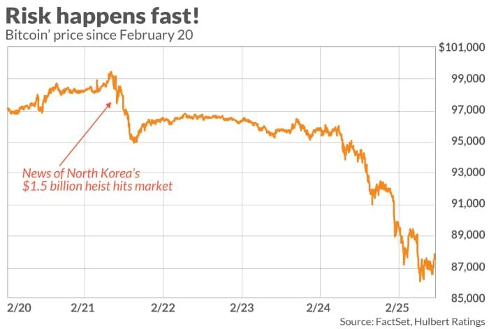

## Table of Contents

## What is North Korea and why is it relevant to global economics?

North Korea, officially known as the Democratic People's Republic of Korea, is a country in East Asia. It is on the northern part of the Korean Peninsula. North Korea is known for its strict government and isolation from the rest of the world. The country has a communist system and is led by Kim Jong-un. North Korea has a lot of military power and has been working on nuclear weapons, which makes other countries worried.

North Korea is relevant to global economics because of its actions and policies. Even though North Korea is not a big player in the world economy, its actions can affect global trade and security. For example, when North Korea does nuclear tests or launches missiles, other countries might put sanctions on it. Sanctions are rules that limit trade with North Korea. These sanctions can affect businesses and economies around the world. Also, because North Korea is close to big economies like South Korea, China, and Japan, any conflict involving North Korea could have a big impact on these countries and the global economy.

## What is Bitcoin and how does its price fluctuate?

Bitcoin is a type of digital money that people can use to buy things online. It was created in 2009 by someone using the name Satoshi Nakamoto. Unlike regular money, Bitcoin is not controlled by any government or bank. Instead, it uses a technology called blockchain, which is like a public record of all Bitcoin transactions. People store their Bitcoins in digital wallets and can send them to others over the internet.

The price of Bitcoin can change a lot and very quickly. Many things can affect its price. For example, if more people want to buy Bitcoin, its price goes up. If people are scared or unsure about Bitcoin, they might sell it, and the price goes down. News about new laws or rules about cryptocurrencies can also make the price change. Sometimes, big investors or companies buying or selling a lot of Bitcoin can cause big price swings. Because Bitcoin is new and not everyone understands it, its price can be very unpredictable.

## How does North Korea interact with cryptocurrencies like Bitcoin?

North Korea has been using cryptocurrencies like Bitcoin to get around international sanctions. The country is not allowed to trade with many other countries because of its nuclear weapons program. So, North Korea uses Bitcoin to buy things it needs without other countries knowing. They often use hacking to steal cryptocurrencies from other people and businesses. This way, they can get money without using regular banks or official trade.

The use of cryptocurrencies by North Korea affects global economics because it makes it harder for other countries to control North Korea's actions. When North Korea uses Bitcoin, it can keep buying things it needs, like technology and weapons, even when other countries try to stop it. This can make tensions higher and affect the stability of the region. It also shows how cryptocurrencies can be used for illegal activities, which is something that many countries are worried about.

## What are the reported instances of North Korea using Bitcoin for funding?

North Korea has been using Bitcoin to get money for its programs. They do this by hacking into computer systems and stealing cryptocurrencies. One big example is the 2014 hack of the Mt. Gox exchange, where hackers stole a lot of Bitcoins. People think North Korea was behind this because of how the hackers worked and where the money went. Another example is the 2016 hack of the Bangladesh Central Bank, where hackers tried to steal a lot of money but only got away with some. They used Bitcoin to move the money around.

These hacks help North Korea get money even though other countries have put sanctions on them. Sanctions are rules that stop North Korea from trading with other countries. By using Bitcoin, North Korea can buy things they need, like technology and weapons, without other countries knowing. This makes it harder for other countries to control North Korea's actions and can make tensions in the region worse. It also shows that cryptocurrencies can be used for illegal activities, which worries many people around the world.

## How might North Korea's actions affect Bitcoin's market perception?

North Korea's use of Bitcoin to get around sanctions can make people worried about Bitcoin. When people hear that a country like North Korea is using Bitcoin for illegal things, they might think Bitcoin is not safe or good. This can make fewer people want to use or invest in Bitcoin. If people are scared, they might sell their Bitcoins, and the price can go down.

Even though North Korea's actions might not change Bitcoin's price right away, they can make the market more unsure. When the market is unsure, the price of Bitcoin can go up and down a lot. This can make it harder for people to trust Bitcoin and use it for regular buying and selling. Over time, if people keep hearing about North Korea using Bitcoin for bad things, it might make it harder for Bitcoin to be accepted by more people and businesses.

## What are the geopolitical factors that could link North Korea's activities to Bitcoin price movements?

Geopolitical factors can link North Korea's activities to Bitcoin price movements because when North Korea uses Bitcoin to get around sanctions, it can make people worried. When people hear about a country like North Korea using Bitcoin for illegal things, they might think Bitcoin is not safe. This can make fewer people want to buy or invest in Bitcoin. If a lot of people start selling their Bitcoins because they are scared, the price can go down. Also, if other countries find out about North Korea using Bitcoin and decide to make new rules or laws about cryptocurrencies, this can make the market even more unsure and cause big price changes.

Another factor is that North Korea's actions can affect how other big countries see Bitcoin. For example, if North Korea uses Bitcoin to buy weapons or technology, it might make countries like the United States, China, or South Korea more worried about cryptocurrencies. These big countries might then try to control or limit the use of Bitcoin more strictly. This can make the whole market for Bitcoin more unstable and cause the price to go up and down a lot. In the end, North Korea's use of Bitcoin can make the cryptocurrency market less predictable and more risky for everyone involved.

## Can North Korea's cyber activities directly influence Bitcoin prices?

North Korea's cyber activities can directly affect Bitcoin prices. When North Korea hacks into computer systems and steals Bitcoin, it can make people worried about the safety of Bitcoin. If people hear about these hacks, they might think Bitcoin is not safe to use. This can make them sell their Bitcoins, which can make the price go down. Also, when North Korea uses Bitcoin to buy things it needs, it can make other countries want to make new rules about cryptocurrencies. These new rules can make the market unsure and cause the price of Bitcoin to change a lot.

Another way North Korea's cyber activities can influence Bitcoin prices is through the market's reaction to news about their actions. If there is news about North Korea using Bitcoin to get around sanctions, it can make people nervous. When people are nervous, they might not want to buy Bitcoin, or they might sell what they have. This can lead to big price swings. Because North Korea's actions can make the market more unsure, it can make Bitcoin prices go up and down a lot.

## What role do international sanctions play in North Korea's use of Bitcoin?

International sanctions stop North Korea from trading with many countries because of its nuclear weapons program. These sanctions make it hard for North Korea to get money and buy things they need. But, North Korea can use Bitcoin to get around these sanctions. Bitcoin is not controlled by any country, so North Korea can use it to buy things without other countries knowing. They often hack into computer systems to steal Bitcoin, which they then use to get money and buy what they need.

When North Korea uses Bitcoin to get around sanctions, it can make other countries worried. These countries might want to make new rules about cryptocurrencies to stop North Korea. This can make the Bitcoin market unsure and cause the price to go up and down a lot. Also, when people hear about North Korea using Bitcoin for bad things, they might think Bitcoin is not safe. This can make fewer people want to use or invest in Bitcoin, which can make the price go down.

## How do global financial markets react to news related to North Korea and Bitcoin?

When news comes out about North Korea using Bitcoin, it can make the global financial markets worried. People might think Bitcoin is not safe if a country like North Korea is using it to get around sanctions and do illegal things. This can make fewer people want to buy or invest in Bitcoin. When people start selling their Bitcoins because they are scared, the price can go down. Big investors and companies might also sell their Bitcoins, which can make the price drop even more.

The news can also make other countries think about making new rules about cryptocurrencies. If countries start to control or limit Bitcoin more, it can make the whole market unsure. This can cause the price of Bitcoin to go up and down a lot. Because North Korea's actions can make the market more unpredictable, it can make Bitcoin a riskier investment. In the end, news about North Korea and Bitcoin can make the global financial markets more unstable and affect how people see and use Bitcoin.

## What are the expert analyses on the correlation between North Korea's actions and Bitcoin volatility?

Experts think that North Korea's use of Bitcoin can make the price of Bitcoin go up and down a lot. When North Korea hacks into computer systems and steals Bitcoin, it makes people worried about how safe Bitcoin is. If people hear about these hacks, they might not want to buy Bitcoin anymore. They might even sell the Bitcoin they have, which can make the price go down. Also, when North Korea uses Bitcoin to buy things it needs, other countries might make new rules about cryptocurrencies. These new rules can make the market unsure and cause the price of Bitcoin to change a lot.

Another way North Korea's actions can affect Bitcoin's price is through the news. When there is news about North Korea using Bitcoin to get around sanctions, it can make people nervous. When people are nervous, they might not want to buy Bitcoin, or they might sell what they have. This can lead to big price swings. Because North Korea's actions can make the market more unsure, it can make Bitcoin prices go up and down a lot. In the end, experts see a clear link between North Korea's use of Bitcoin and the volatility of Bitcoin's price.

## How can investors and traders use insights about North Korea to predict Bitcoin price trends?

Investors and traders can use news about North Korea to help predict Bitcoin price trends. When there is news about North Korea using Bitcoin to get around sanctions or stealing Bitcoin through hacks, it can make people worried. If people are scared, they might sell their Bitcoins, which can make the price go down. By keeping an eye on news about North Korea's activities, investors can guess when the market might get nervous and the price might drop. They can then decide to sell their Bitcoins before the price goes down or wait for a good time to buy when the price is low.

Another way investors and traders can use insights about North Korea is by watching how other countries react to North Korea's use of Bitcoin. If countries start to make new rules about cryptocurrencies because of North Korea, it can make the market more unsure. This can cause the price of Bitcoin to go up and down a lot. By understanding how these new rules might affect the market, investors can predict when the price might be more volatile. They can then make smart choices about when to buy or sell Bitcoin based on these predictions.

## What are the future implications of North Korea's involvement with Bitcoin on the global cryptocurrency market?

North Korea's use of Bitcoin could make the global cryptocurrency market more risky in the future. When people hear about North Korea using Bitcoin to get around sanctions and do illegal things, they might think Bitcoin is not safe. This can make fewer people want to use or invest in Bitcoin. If a lot of people start selling their Bitcoins because they are scared, the price can go down a lot. Also, if other countries make new rules about cryptocurrencies because of North Korea, it can make the market even more unsure. This can cause big price swings and make it harder for people to trust Bitcoin.

In the long run, North Korea's actions might make it harder for Bitcoin to be accepted by more people and businesses. If people keep hearing about North Korea using Bitcoin for bad things, they might not want to use it for regular buying and selling. This can slow down the growth of the cryptocurrency market. But, it can also make countries and companies work harder to make cryptocurrencies safer and more regulated. This could help the market in the long run by making it more stable and trusted.

## What is the impact on cryptocurrency prices?

North Korean activities in the cryptocurrency market have sparked considerable discussion about their potential impact on cryptocurrency prices. The country's involvement, primarily through hacking and mining, can influence market dynamics and contribute to speculation and [volatility](/wiki/volatility-trading-strategies) that characterize digital currency markets.

Cryptocurrencies, by nature, possess high volatility, often influenced by external socio-political factors. Reports of North Korean hacking, such as those by the Lazarus Group, known for targeting cryptocurrency exchanges and wallets, heighten uncertainty. When these actions come to light, they can instigate fear, leading to increased sell-offs or, conversely, speculative buying, with investors attempting to capitalize on anticipated market movements. This behavior subsequently exacerbates price volatility, making prices react sharply to real or perceived threats.

A specific illustration occurred in 2017, during a surge in reported North Korean cyber activities targeting cryptocurrencies. During this period, Bitcoin experienced significant price fluctuations, though attributing these solely to North Korea proves challenging due to the multitude of other factors affecting prices during the same time, such as regulatory news and broader market trends.

Experts' opinions regarding the impact of North Korean activities on cryptocurrency prices vary. Some analysts argue that their influence is limited and often overestimated due to the smaller scale of individual cyber incidents relative to the entire market's size, which operates globally and with daily volumes in the billions. For instance, a report from the Center for a New American Security suggests that while North Korean hacking efforts are notable, they account for a fraction of the total market transactions.

Research findings underscore the complexity of attributing direct causality between these activities and long-term price impacts. A study from the Rand Corporation noted that while North Korean breaches might temporarily affect market sentiment, established investors often view these incidents as part of the larger tapestry of cryptocurrency risks, thereby discounting their weight in long-term pricing models.

This sentiment aligns with models depicting price impact as a multi-variable function:

$$
P_t = \alpha + \beta_1 N_t + \beta_2 R_t + \beta_3 G_t + \epsilon_t
$$

Where:
- $P_t$ denotes the cryptocurrency price at time t,
- $N_t$ reflects North Korean activity levels,
- $R_t$ represents regulatory developments,
- $G_t$ encompasses broader global economic indicators,
- $\epsilon_t$ is an error term.

In this equation, $\beta_1$, the coefficient representing North Korean activities, usually shows statistical significance only during peak periods of those activities, indicating a temporary influence on price volatility rather than a sustained impact. Overall, while North Korean activities occasionally contribute to cryptocurrency price volatility, they are part of a wider array of factors influencing the dynamic cryptocurrency market.

## References & Further Reading

[1]: Chainalysis Team. ["2021 Crypto Crime Report."](https://go.chainalysis.com/2021-Crypto-Crime-Report.html) Chainalysis.

[2]: United Nations Security Council. ["Sanctions Resolution on North Korea."](https://www.armscontrol.org/factsheets/un-security-council-resolutions-north-korea) United Nations.

[3]: Bryant, K., & Fletcher, C. (2020). ["Cyber Attacks on Cryptocurrency Exchanges."](https://www.cesifo.org/DocDL/cesifo1_wp8124_2.pdf) RAND Corporation.

[4]: Mccarroll, J. (2022). ["Cryptocurrency and National Security Implications of the Blockchain."](https://www.tandfonline.com/doi/full/10.1080/01495933.2020.1718983) Center for a New American Security.

[5]: Kaplan, B. (2021). ["North Korea's Cryptocurrency Activities."](https://www.belfercenter.org/publication/north-korean-cryptocurrency-operations-alternative-revenue-stream) Council on Foreign Relations.