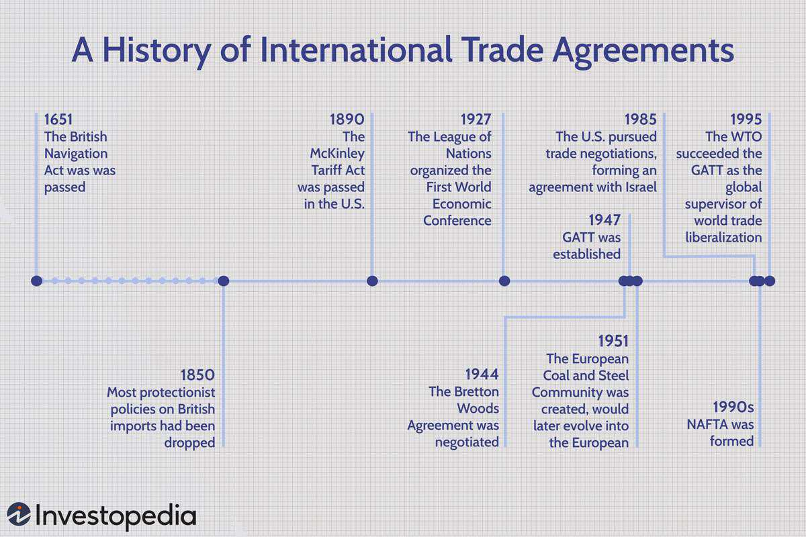

## Table of Contents

## What is the current status of North Korea–United States relations?

North Korea and the United States have had tense relations for a long time. The main issue is North Korea's nuclear weapons program. The U.S. wants North Korea to stop making nuclear weapons, but North Korea wants the U.S. to recognize it as a nuclear power. This disagreement has led to many problems, including harsh words and military threats.

In recent years, there have been some attempts to improve relations. Leaders from both countries have met to talk about peace and denuclearization. However, progress has been slow. North Korea still has its nuclear weapons, and the U.S. continues to put sanctions on North Korea. The situation remains very tense and uncertain.

## How did North Korea and the United States first establish diplomatic relations?

North Korea and the United States did not have formal diplomatic relations until after the Korean War. The Korean War started in 1950 when North Korea invaded South Korea. The United States, along with other countries, helped South Korea fight against North Korea. The war ended in 1953 with an armistice, but not a peace treaty. This means that technically, North and South Korea are still at war. After the war, there was no direct diplomatic relationship between North Korea and the United States.

Over the years, the two countries have had some contact, but they have never had full diplomatic relations. The U.S. has an office in North Korea's neighbor, South Korea, to handle issues related to North Korea. North Korea and the U.S. have talked about nuclear weapons and other problems through meetings and negotiations. However, they do not have embassies in each other's countries, and their relationship remains tense and complicated.

## What are the key historical events that have shaped North Korea–United States relations?

The history of North Korea and the United States has been shaped by many important events. One key event was the Korean War, which started in 1950 when North Korea invaded South Korea. The United States helped South Korea fight back, and the war ended in 1953 with an armistice, not a peace treaty. This war created a lot of tension between North Korea and the United States. After the war, the two countries did not have formal diplomatic relations, and their relationship remained strained.

Another important event was North Korea's development of nuclear weapons. In the 1990s, North Korea started working on nuclear weapons, which worried the United States and other countries. In 2006, North Korea tested its first nuclear weapon, which made the tension with the United States even worse. The U.S. put sanctions on North Korea to try to stop its nuclear program, but North Korea kept making nuclear weapons. In recent years, leaders from both countries have met to talk about peace and denuclearization, but they have not made much progress. The relationship between North Korea and the United States remains very tense and uncertain.

## What are the main issues causing tension between North Korea and the United States?

The main issue causing tension between North Korea and the United States is North Korea's nuclear weapons program. The United States wants North Korea to stop making nuclear weapons and to get rid of the ones it already has. North Korea, on the other hand, wants the United States to recognize it as a nuclear power and to lift the sanctions that the U.S. has put on North Korea. This disagreement has led to a lot of tension and harsh words between the two countries.

Another issue is the lack of formal diplomatic relations. Since the Korean War ended in 1953 with an armistice and not a peace treaty, North Korea and the United States have never had full diplomatic relations. They do not have embassies in each other's countries, and they communicate through third parties or at special meetings. This makes it hard for them to solve their problems and build trust. The situation remains very tense and uncertain because of these issues.

## How have different U.S. administrations approached North Korea?

Different U.S. administrations have tried different ways to deal with North Korea. Some presidents, like Bill Clinton, tried to make deals with North Korea to stop its nuclear program. In the 1990s, Clinton's administration made an agreement called the Agreed Framework, where North Korea promised to freeze its nuclear program in exchange for help with energy. But the deal did not last, and North Korea kept working on nuclear weapons. George W. Bush's administration took a tougher approach. Bush called North Korea part of an "axis of evil" and put more sanctions on the country. His administration also tried to get other countries to work together to pressure North Korea, but this did not stop North Korea from testing nuclear weapons in 2006.

More recent U.S. presidents have tried a mix of tough and friendly approaches. Barack Obama's administration used a policy called "strategic patience," which meant waiting for North Korea to change its behavior while keeping sanctions in place. This did not work well, and North Korea kept testing nuclear weapons. Donald Trump's administration tried a different way. Trump met with North Korean leader Kim Jong-un several times to talk about peace and denuclearization. They made some agreements, but North Korea did not give up its nuclear weapons. Joe Biden's administration has continued to put pressure on North Korea with sanctions and has tried to work with other countries to solve the problem. The situation remains very tense and uncertain.

## What is the significance of North Korea's nuclear program in its relations with the United States?

North Korea's nuclear program is the biggest reason for tension between North Korea and the United States. The U.S. wants North Korea to stop making nuclear weapons and to get rid of the ones it already has. But North Korea wants the U.S. to recognize it as a nuclear power and to lift the sanctions that the U.S. has put on North Korea. This disagreement has caused a lot of problems and harsh words between the two countries.

Because of North Korea's nuclear program, the U.S. has put many sanctions on North Korea to try to stop it from making more nuclear weapons. These sanctions have made life hard for people in North Korea and have made the country even more angry at the U.S. Leaders from both countries have met to talk about peace and getting rid of nuclear weapons, but they have not made much progress. The nuclear program is still the main thing keeping North Korea and the United States from having a better relationship.

## How have international sanctions affected North Korea–United States relations?

International sanctions have made the relationship between North Korea and the United States even worse. The United States has put many sanctions on North Korea to try to stop it from making nuclear weapons. These sanctions have made life hard for people in North Korea. They have trouble getting food, medicine, and other things they need. This has made North Korea very angry at the United States. North Korea says the sanctions are unfair and that they hurt innocent people.

Because of the sanctions, North Korea and the United States have a hard time talking to each other. The sanctions make North Korea feel like it is being punished and not respected. This makes it hard for the two countries to trust each other and work together. Even though leaders from both countries have met to talk about peace and getting rid of nuclear weapons, the sanctions are still a big problem. They keep the tension high and make it hard for North Korea and the United States to have a better relationship.

## What role have summits and negotiations played in North Korea–United States relations?

Summits and negotiations have been important in trying to improve the relationship between North Korea and the United States. Leaders from both countries have met to talk about peace and getting rid of nuclear weapons. These meetings have given them a chance to talk face-to-face and try to understand each other better. For example, former U.S. President Donald Trump met with North Korean leader Kim Jong-un several times. They talked about making a deal where North Korea would stop making nuclear weapons and the U.S. would lift some sanctions. These summits have shown that both countries want to find a way to solve their problems.

However, the summits and negotiations have not solved the main issues between North Korea and the United States. North Korea still has its nuclear weapons, and the U.S. still has sanctions on North Korea. The talks have been hard because both countries want different things. North Korea wants the U.S. to recognize it as a nuclear power and to lift the sanctions. The U.S. wants North Korea to stop making nuclear weapons and to get rid of the ones it already has. Because of these disagreements, the summits and negotiations have not made much progress. The relationship between North Korea and the United States remains very tense and uncertain.

## How do North Korea's relations with South Korea and China influence its interactions with the United States?

North Korea's relations with South Korea and China have a big impact on its interactions with the United States. North Korea and South Korea are still technically at war because they never signed a peace treaty after the Korean War. The U.S. helps South Korea and wants to stop North Korea from making nuclear weapons. When North Korea and South Korea talk to each other or make agreements, it can change how the U.S. deals with North Korea. For example, if North Korea and South Korea are getting along better, the U.S. might be more willing to talk to North Korea about peace and nuclear weapons.

China is also very important because it is North Korea's closest ally and helps it a lot. China gives North Korea food, money, and other things it needs. The U.S. knows that China has a lot of influence over North Korea. When the U.S. tries to put more sanctions on North Korea, it has to think about how China will react. If China helps North Korea too much, the sanctions might not work. But if China agrees to put more pressure on North Korea, it might help the U.S. get what it wants. So, North Korea's relationships with South Korea and China are very important in how it deals with the United States.

## What are the human rights concerns that impact North Korea–United States relations?

Human rights concerns are a big problem in the relationship between North Korea and the United States. The U.S. says that North Korea treats its people very badly. People in North Korea do not have freedom of speech, and they cannot say what they think without getting in trouble. There are also stories about people being put in prison camps and treated very harshly. The U.S. does not like this and has said that North Korea needs to treat its people better. This makes it hard for the two countries to trust each other and work together.

Because of these human rights problems, the U.S. has put more pressure on North Korea. The U.S. has talked about these issues at the United Nations and has tried to get other countries to help. North Korea does not like this and says that the U.S. is trying to make it look bad. This disagreement about human rights makes the tension between North Korea and the United States even worse. It is another reason why the two countries have a hard time getting along.

## How do cyber activities and espionage factor into North Korea–United States relations?

Cyber activities and espionage have become big issues in the relationship between North Korea and the United States. North Korea has been accused of hacking into U.S. companies and stealing money and information. One famous case was when North Korea hackers attacked Sony Pictures in 2014 because of a movie that made fun of their leader. The U.S. says these cyber attacks are a way for North Korea to hurt the U.S. and get money for its nuclear program. This makes the U.S. very angry and adds to the tension between the two countries.

Espionage is also a problem. Both countries try to spy on each other to learn about each other's plans and secrets. The U.S. wants to know more about North Korea's nuclear weapons and what it might do next. North Korea wants to know what the U.S. is planning to do about its nuclear program. When one country catches the other spying, it makes them even more suspicious and angry. This spying and cyber activity makes it hard for North Korea and the United States to trust each other and work together.

## What are the potential future scenarios for North Korea–United States relations?

One possible future for North Korea and the United States is that they could keep fighting and not solve their problems. North Korea might keep making nuclear weapons, and the U.S. might keep putting more sanctions on North Korea. This could make life even harder for people in North Korea and make the tension between the two countries even worse. They might keep talking at meetings and summits, but they might not be able to agree on anything important. This would mean that the relationship between North Korea and the United States stays very tense and uncertain.

Another possible future is that North Korea and the United States could find a way to work together and solve their problems. North Korea might agree to stop making nuclear weapons and get rid of the ones it already has. In return, the U.S. might lift some of the sanctions and help North Korea with food and medicine. This would make life better for people in North Korea and help the two countries trust each other more. They might start having more meetings and talks to work out the details. This would mean that the relationship between North Korea and the United States gets better and becomes more peaceful.

## References & Further Reading

[1]: Bermudez, Joseph (2018). ["A History of North Korean Missile Technology Development."](https://nonproliferation.org/wp-content/uploads/2016/09/op2.pdf) 38 North.

[2]: Chan, Ernest P. (2009). ["Quantitative Trading: How to Build Your Own Algorithmic Trading Business,"](https://github.com/ftvision/quant_trading_echan_book) John Wiley & Sons.

[3]: Chestnut, Sheena (2007). ["Illicit Activity and Proliferation: North Korean Smuggling Networks."](https://direct.mit.edu/isec/article/32/1/80/11900/Illicit-Activity-and-Proliferation-North-Korean) International Security.

[4]: Cha, Victor. (2018). ["The Impossible State: North Korea, Past and Future."](https://www.amazon.com/Impossible-State-North-Korea-Future/dp/0061998516) Ecco.

[5]: Lopez de Prado, Marcos (2018). ["Advances in Financial Machine Learning,"](https://www.amazon.com/Advances-Financial-Machine-Learning-Marcos/dp/1119482089) Wiley.

[6]: Sigal, Leon V. (1998). ["Disarming Strangers: Nuclear Diplomacy with North Korea."](https://www.jstor.org/stable/j.ctt7smb0) Princeton University Press.

[7]: Sigal, Leon V. (2017). ["The North Korean Nuclear Crisis: Peace With North Korea?"](https://www.tandfonline.com/doi/full/10.1080/25751654.2020.1751549) The Washington Quarterly, 40(4), 35-53.