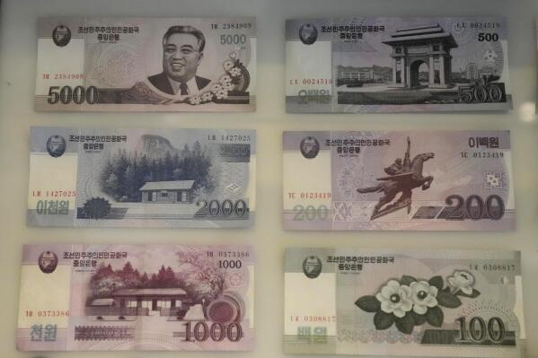

The North Korean Won, abbreviated as KPW, serves as the official currency of the Democratic People's Republic of Korea (DPRK). Characterized by its isolation from global financial markets, the KPW is emblematic of the broader economic mechanisms governing North Korea. The nature of the country's economic system, coupled with international sanctions, means that the KPW is one of the world's least convertible currencies. This lack of convertibility is a significant hurdle, as it restricts the currency's ability to function in the international forex market and limits the economic integration of North Korea with the global economy.

This article examines the intricate relationship between the North Korean Won and the broader economic challenges the country faces. It provides a comprehensive analysis of the historical context of the KPW, the monetary policies that shape its use, and the economic limitations posed by North Korea's political and economic isolation. Additionally, the article explores the potential implications of technological advancements in algorithmic trading and how, even in a tightly controlled environment like North Korea, such innovations could hypothetically impact currency stability.

Algorithmic trading, defined as the use of computer algorithms to execute trades, offers theoretical possibilities for enhancing the efficiency and stability of currency markets. By employing complex algorithms, trading can be automated and adjusted rapidly in response to market fluctuations. Although North Korea's closed economy presents substantial barriers to the implementation of such systems, considering these technologies highlights the potential for future economic management strategies that leverage technological innovation. The insights gained from understanding the KPW thus reflect the intricate dynamics of international finance under conditions of extreme isolation.

## Table of Contents

## Understanding the North Korean Won (KPW)

The North Korean Won (KPW) serves as the official currency of the Democratic People's Republic of Korea and exhibits various denominations ranging from ₩5 to ₩5,000. It is further subdivided into 100 chon. However, the KPW's status as a non-convertible and blocked currency underscores significant economic and financial challenges. Due to its classification, the Won is not actively traded on global foreign exchange markets. This restriction arises partly because of international sanctions and the limited engagement of North Korea with other economies.

North Korea has established a particular system for foreign visitors, utilizing a version of the won that is considered more convertible than the standard KPW. This special currency aims to create a controlled and limited avenue for foreign exchange. Despite these efforts, exchanges of the convertible won remain strictly regulated.

The isolation of North Korea has profound implications for the KPW, resulting in severe undervaluation on domestic black markets. On these parallel markets, the exchange rates of the won differ significantly from the official rates set by the state. This disparity is driven by the scarcity of foreign currencies and continued sanctions that limit legitimate trade possibilities, causing fluctuations and unpredictability in the won's value within local and informal forums. This discrepancy often compels residents to rely on black markets for foreign currency, which may ease certain trade restrictions but also contributes to economic instability.

In conclusion, understanding the North Korean Won requires recognizing its unique characteristics as a currency held within a strictly controlled economy. The non-convertible nature of the KPW, coupled with its undervaluation in informal markets, highlights the complex socio-economic barriers faced by North Korea and challenges present-day efforts for monetary improvement and engagement on a global scale.

## Historical Context and Economic Challenges

The North Korean Won (KPW) has a storied past, reflective of North Korea's broader historical and economic journey. Introduced in 1947, the KPW replaced the Korean yen following Korea's liberation from Japanese colonial rule. This marked a pivotal moment as the newly established currency symbolized sovereignty and autonomy for the nascent Democratic People's Republic of Korea.

Throughout its history, the KPW has experienced multiple redenominations aimed at controlling inflation and stabilizing the economy. One of the most significant redenominations occurred in 2009. This action reduced the face value of the KPW by a [factor](/wiki/factor-investing) of 100, wherein 100 old won were exchanged for one new won. The policy, however, led to widespread economic instability and public distress. The abrupt nature of the redenomination and inadequate advance warning caused significant financial loss for citizens who held their savings in won, leading to severe public backlash and allegations of mismanagement.

The economic framework of North Korea remains highly centralized and mirrors a command economy, which is characteristic of traditional communist states. This centralization extends to tight controls over production, distribution, and consumption of goods and services, with the state taking a predominant role in economic decision-making.

International sanctions, imposed as a response to North Korea's nuclear ambitions and geopolitical maneuvers, further strain the country's economy. These sanctions, alongside limited international trade due to North Korea's self-imposed isolation, compound the economic difficulties faced by the nation. As a result, the official exchange rate of the KPW often diverges significantly from its value on the domestic black market, where the currency is regularly undervalued. This discrepancy arises due to speculative activities and the scarcity of foreign currency reserves, leading to frequent fluctuations in the market value of the KPW.

Understanding these economic challenges provides insight into the persistent issues faced by North Korea in stabilizing its currency, highlighting a complex interplay between domestic policies and international pressures.

## Monetary Policy and Its Impact

North Korea's central bank plays a pivotal role in managing the North Korean Won (KPW), overseeing currency issuance alongside other financial operations. The bank exercises stringent control over monetary policy, a necessity given the currency's non-convertibility and the country's restricted economic environment.

Historically, the North Korean government has engaged in multiple revaluation efforts in an attempt to supplant the black market's influence on the KPW’s value. One of the notable instances occurred in 2009 when the currency underwent a redenomination that slashed two zeros from its face value. This drastic measure aimed at curbing inflation and reasserting monetary authority, yet it yielded adverse effects, sparking public discontent and exacerbating economic woes.

Monetary policy in North Korea is distinguished by somewhat unconventional approaches. For instance, there have been occasions where specific exchange rates are adjusted or entirely removed, particularly those tied to significant national dates or events. This practice underscores the regime's strategic manipulation of monetary tools to align national policy objectives with economic outcomes.

Such policy maneuvers underscore the challenges of exercising effective monetary control in an economically insulated nation. Despite these efforts, the persistent disparity between official and black market exchange rates highlights the limited success of these interventions in stabilizing the currency. This ongoing struggle portrays a fundamental aspect of economic management under the prevailing conditions in North Korea.

## Algorithmic Trading: Potential and Limitations

Algorithmic trading leverages sophisticated computer algorithms to automate and optimize trading decisions, potentially enhancing market stability and efficiency. The core advantage of [algorithmic trading](/wiki/algorithmic-trading) lies in its ability to rapidly process vast amounts of financial data and execute trades based on pre-defined criteria, thereby minimizing human error and emotional decision-making. This approach is particularly potent in volatile markets, where swift responses to price fluctuations can yield significant advantages.

In the case of the North Korean Won (KPW), algorithmic trading could theoretically aid in stabilizing its value by adjusting to market shifts in real-time. Such systems could be programmed to monitor various economic indicators, geopolitical developments, and even international reactions to North Korean policies. By responding instantaneously to these inputs, the algorithms could help mitigate some of the [volatility](/wiki/volatility-trading-strategies) associated with the KPW, especially in black market exchanges where the currency's value often deviates significantly from official rates.

However, several substantial barriers complicate the implementation of algorithmic trading in North Korea. The country's economy is notably closed, characterized by a lack of transparency and minimal access to reliable financial data. This opacity hinders the effective functioning of algorithms, which rely heavily on data to make informed trading decisions. Moreover, the absence of a robust financial infrastructure and the isolation from international financial systems present additional challenges. Even if algorithmic trading were technically feasible, the restrictive economic environment and persistent sanctions would limit its practical applicability.

Furthermore, North Korea's centralized control over its economy and currency further constrains the utility of algorithmic trading. The government's tight regulation and unpredictable monetary policies make it difficult to design algorithms that can adapt to sudden policy shifts or non-market-based interventions. These factors collectively limit the potential benefits that algorithmic trading might offer in more open and data-rich economies.

Despite these significant limitations, exploring algorithmic trading underscores the broader potential of technological advances to influence even the most isolated economies. While the current state of North Korea's financial system poses considerable obstacles, future developments in technology and changes in international relations might create new opportunities for integrating such systems. The concept serves as a reminder of the transformative power of technology in finance, highlighting the possibility of innovative solutions to long-standing economic challenges.

## Conclusion

The North Korean Won (KPW) encapsulates the economic challenges confronting the Democratic People's Republic of Korea. Characterized by limited trade opportunities and severe inflation, the currency struggles under the weight of international sanctions and a highly controlled economy. The absence of convertible status and the dominance of a black market for foreign currencies exacerbate these issues, leading to a currency that is undervalued and subject to volatility.

Algorithmic trading, a technological innovation used in global financial markets to automate trading strategies and manage currency stability, remains largely theoretical in the context of North Korea. The idea proposes a shift towards computational procedures that could potentially address market fluctuations efficiently. Yet, the implementation of such systems demands a degree of transparency and market freedom that North Korea does not currently possess. As a result, while the principles of algorithmic trading could offer insights into more stable currency management, their practical application within the North Korean economic framework is severely limited.

Examining the role of the North Korean Won in the global economy sheds light on the complexities of international finance under extreme isolation. Understanding the interaction between currency management strategies, like algorithmic trading, and a closed economy highlights the limitations and challenges that arise when conventional economic tools meet unorthodox political and economic landscapes. Consequently, the KPW serves as a case study in international finance, illustrating how isolation and economic policy shape the financial realities of a nation.

## References & Further Reading

[1]: Frank, R. (2016). ["Kim Jong Un’s Office Behind Counterfeiting | Investigative Documentary - The Secret State of North Korea."](https://en.wikipedia.org/wiki/CIA_headquarters_shooting) CNBC.

[2]: Haggard, S., & Noland, M. (2017). ["Hard Target: Sanctions, Inducements, and the Case of North Korea."](https://www.jstor.org/stable/26912711) Cornell University Press.

[3]: Chan, E. P. (2013). ["Algorithmic Trading: Winning Strategies and Their Rationale."](https://github.com/ftvision/quant_trading_echan_book) John Wiley & Sons.

[4]: Smith, H. S. (2015). ["North Korea: Markets and Military Rule."](https://archive.org/details/northkoreamarket0000smit) Cambridge University Press.

[5]: Lee, H. Y., & Lee, H. W. (2014). ["North Korean Economic Reform and Sino-Korean Economic Cooperation."](https://www.sciencedirect.com/science/article/pii/S2667111522000275) Korea Institute for International Economic Policy.