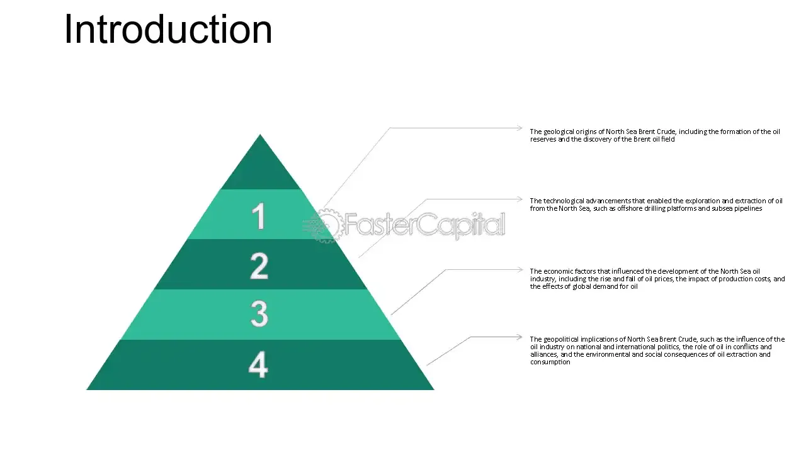

## Table of Contents

## What is North Sea Brent Crude?

North Sea Brent Crude is a type of oil that comes from the North Sea, which is between the United Kingdom and Norway. It is called "Brent" because it is a mix of oil from different fields, but the main one is called the Brent field. This oil is very important because it is used as a standard to set the price of other oils around the world. When people talk about oil prices, they often mention the price of Brent Crude.

Brent Crude is light and sweet, which means it is easy to turn into gasoline and other products. Because it is easy to use, many countries want to buy it. The price of Brent Crude can change a lot because of things like how much oil is being produced, how much people want to buy, and what is happening in the world. When the price of Brent Crude goes up or down, it can affect the price of gas at the pump and the cost of many things we buy every day.

## Where is North Sea Brent Crude extracted?

North Sea Brent Crude is extracted from the North Sea, which is a large body of water between the United Kingdom and Norway. The oil comes from several fields in this area, but the most important one is called the Brent field. This field is located off the coast of Scotland and was discovered in the 1970s.

The Brent field, along with other nearby fields like Forties, Oseberg, Ekofisk, and Ninian, contribute to what is known as Brent Crude. These fields are all in the North Sea, and the oil from them is mixed together to make Brent Crude. The extraction process involves drilling into the seabed to reach the oil reserves deep below the ocean floor.

## Why is Brent Crude considered a benchmark for oil prices?

Brent Crude is considered a benchmark for oil prices because it is a type of oil that many people around the world use and trade. It comes from the North Sea, which is a busy area for oil production. Because Brent Crude is easy to turn into things like gasoline, many countries want to buy it. This makes it a good way to measure the price of oil. When people talk about how much oil costs, they often use the price of Brent Crude as a starting point.

Another reason Brent Crude is a benchmark is that it is traded a lot on the world market. This means that the price of Brent Crude can change quickly based on what is happening around the world. If there is a problem in one country that makes it hard to get oil, the price of Brent Crude might go up. Because so many people pay attention to Brent Crude, changes in its price can affect the price of other types of oil too. This is why it is such an important benchmark for the oil industry.

## How does the pricing of Brent Crude affect global oil markets?

The pricing of Brent Crude has a big impact on global oil markets because it is used as a benchmark. When the price of Brent Crude goes up or down, it can change the price of other types of oil around the world. This is because many countries and companies use Brent Crude as a guide to set their own oil prices. If Brent Crude becomes more expensive, other oils might also become more expensive. This can affect how much people pay for gas at the pump and how much it costs to make things that use oil, like plastics and chemicals.

Changes in Brent Crude prices can also affect the economy in different countries. If the price goes up a lot, it can make things more expensive for people and businesses. This might slow down the economy because people have less money to spend. On the other hand, if the price of Brent Crude goes down, it can make things cheaper and help the economy grow. Because Brent Crude is traded all over the world, its price can be influenced by many things, like wars, natural disasters, and changes in how much oil countries produce. This makes the global oil market very connected and sensitive to what happens with Brent Crude.

## What are the historical price trends of Brent Crude?

Over the years, the price of Brent Crude has gone up and down a lot. In the early 2000s, the price was around $20 to $30 per barrel. But then, it started to go up quickly. By 2008, the price reached almost $150 per barrel. This was because more people around the world wanted oil, and there were worries about not having enough. But then, the price fell sharply because of the global financial crisis. It dropped to around $40 per barrel by the end of 2008.

From 2009 to 2014, the price of Brent Crude slowly went up again, staying mostly between $100 and $120 per barrel. This was a time when the world economy was getting better, and more people were using oil. But in 2014, the price started to fall again. It went down to around $30 per barrel by early 2016. This happened because more oil was being produced, especially from the United States, and there were worries about the world economy slowing down. Since then, the price has been up and down, but it has mostly stayed between $40 and $80 per barrel, affected by things like the COVID-19 pandemic and decisions by oil-producing countries.

## What factors influence the price of Brent Crude?

The price of Brent Crude can change because of many things. One big reason is how much oil is being made and how much people want to buy. If more oil is being made than people want to buy, the price goes down. But if there is not enough oil to meet everyone's needs, the price goes up. Another important thing is what is happening in the world. If there is a war or a big storm that makes it hard to get oil, the price can go up because people worry about not having enough.

Also, the strength of the world's economy can affect the price of Brent Crude. When the economy is doing well, more people are using oil for things like driving cars and making products, so the price goes up. But if the economy is not doing well, people use less oil, and the price can go down. Decisions made by oil-producing countries, like those in the OPEC group, can also change the price. If these countries decide to make less oil, the price can go up because there is less to go around.

## How can one invest in Brent Crude?

You can invest in Brent Crude by buying futures contracts. These are agreements to buy or sell oil at a set price on a future date. You can trade these contracts on big markets like the Intercontinental Exchange (ICE). When you buy a futures contract, you are betting that the price of oil will go up. If it does, you can sell the contract for more than you paid for it and make money. But if the price goes down, you could lose money. Trading futures can be risky, so it's important to understand the market well before you start.

Another way to invest in Brent Crude is by buying shares in oil companies or oil-focused exchange-traded funds (ETFs). Oil companies like BP or Shell produce and sell oil, so their stock prices can go up when the price of Brent Crude goes up. ETFs are like baskets of stocks that focus on oil. When you buy shares in an [ETF](/wiki/etf-trading-strategies), you are investing in a group of oil companies at once. This can be a less risky way to invest in oil because your money is spread out among many companies. But remember, the price of these stocks and ETFs can still go up and down based on what happens with Brent Crude and the oil market.

## What are the risks associated with investing in Brent Crude?

Investing in Brent Crude can be risky because the price of oil can change a lot. Things like wars, natural disasters, and decisions by oil-producing countries can make the price go up and down quickly. If you buy a futures contract and the price of oil goes down, you could lose money. Futures trading can also be complicated, and if you don't understand it well, you might make bad choices and lose money.

Another risk is that the world economy can affect the price of oil. If the economy slows down, people use less oil, and the price can drop. This can hurt the value of your investment. Also, if you invest in oil companies or ETFs, their stock prices can go down if the price of Brent Crude falls. Even though investing in a group of companies through an ETF can be less risky than trading futures, there is still a chance you could lose money if the oil market does not do well.

## How does Brent Crude compare to other types of crude oil like WTI?

Brent Crude and West Texas Intermediate (WTI) are both important types of oil, but they come from different places and have some differences. Brent Crude comes from the North Sea, between the UK and Norway, while WTI comes from the United States, mainly from Texas. Brent Crude is a mix of oil from several fields, like Brent, Forties, Oseberg, Ekofisk, and Ninian. WTI, on the other hand, is mostly from one place, the Permian Basin. Because Brent Crude is easier to turn into things like gasoline, it is often a bit more expensive than WTI.

Both Brent Crude and WTI are used as benchmarks to set the price of other oils around the world. Brent Crude is more important for the global market because it is used more in Europe, Africa, and the Middle East. WTI is more important in the United States and sometimes in Canada. The price of Brent Crude and WTI can be different because of things like how much oil is being made, how much people want to buy, and what is happening in the world. But usually, when the price of one goes up or down, the other one does too, because they are both affected by the same big things happening in the oil market.

## What are the geopolitical factors that impact Brent Crude?

Geopolitical factors can have a big impact on the price of Brent Crude. One important [factor](/wiki/factor-investing) is what oil-producing countries decide to do. Countries in the OPEC group, like Saudi Arabia and Iran, can choose to make more or less oil. If they decide to make less, the price of Brent Crude can go up because there is less oil to go around. Also, if there is a war or fighting in a country that makes a lot of oil, like in the Middle East, it can be hard to get oil out of that country. This can make the price of Brent Crude go up because people worry about not having enough oil.

Another factor is what happens with big countries that use a lot of oil, like the United States and China. If these countries have problems with each other, it can affect the price of oil. For example, if the U.S. puts rules on buying oil from certain countries, it can change how much oil is being traded and affect the price of Brent Crude. Also, if there are big changes in the world, like new laws about using less oil to help the environment, it can make the price of Brent Crude go down because people might start using less oil.

## How have environmental regulations affected the production of Brent Crude?

Environmental regulations have made it harder and more expensive to produce Brent Crude. Governments in places like the UK and Norway, where the North Sea is, have made rules to protect the environment. These rules mean oil companies have to spend more money to make sure they don't harm the sea and the air when they drill for oil. They have to use special equipment and follow strict guidelines, which can slow down how fast they can produce oil and make it cost more.

These regulations can also make oil companies think twice about starting new projects in the North Sea. If the rules are too strict or the costs are too high, companies might decide to look for oil in other places where the rules are not as tough. This can affect how much Brent Crude is produced. Even though these rules are good for the environment, they can make the price of Brent Crude go up because there might be less oil to go around.

## What future trends are expected in the Brent Crude market?

In the future, the Brent Crude market might see some big changes. One thing that could happen is that more people might start using electric cars and other things that don't need oil. This could make the demand for Brent Crude go down. Also, countries might keep making more rules to protect the environment, which could make it harder and more expensive to produce oil. If this happens, the price of Brent Crude might go up because there could be less oil to go around.

Another thing to think about is what oil-producing countries will do. If countries like those in OPEC decide to make more or less oil, it can change the price of Brent Crude a lot. Also, if there are new ways to find and get oil, like new technology, it could make it easier to produce Brent Crude. But if there are big problems in the world, like wars or natural disasters, it could make the price of Brent Crude go up because people might worry about not having enough oil.

## References & Further Reading

[1]: ["The Economics of Oil: Brent Crude, WTI, and Other Benchmark Oils"](https://tradingeconomics.com/commodity/brent-crude-oil) by Roger Bridgeman

[2]: Burger, M., Graeber, B., & Schindlmayr, G. (2007). ["Managing Energy Risk: An Integrated View on Power and Other Energy Markets"](https://onlinelibrary.wiley.com/doi/book/10.1002/9781118618509). Wiley Finance.

[3]: ["Algorithmic and High-Frequency Trading"](https://www.amazon.com/Algorithmic-High-Frequency-Trading-Mathematics-Finance/dp/1107091144) by Álvaro Cartea, Sebastian Jaimungal, and José Penalva

[4]: "OPEC and the World's Energy Future." (2019) [BP Statistical Review of World Energy](https://www.bp.com/content/dam/bp/business-sites/en/global/corporate/pdfs/energy-economics/statistical-review/bp-stats-review-2019-full-report.pdf)

[5]: Sandford, R. (2010). ["Global Oil Benchmarking: The Role of Price Reporting Agencies"](https://www.iosco.org/library/pubdocs/pdf/IOSCOPD448.pdf). Oxford Institute for Energy Studies.