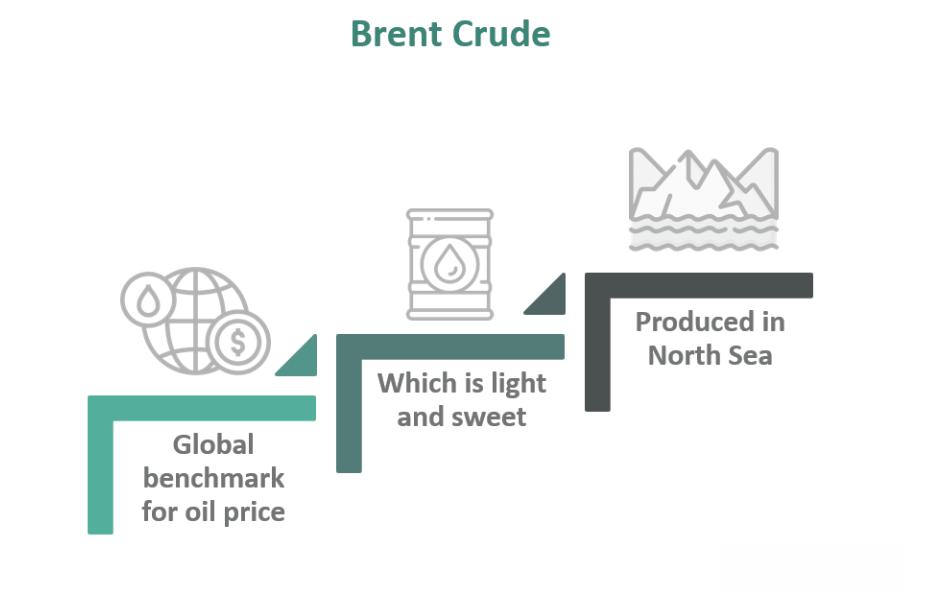

The world of investments is a multifaceted domain, encompassing numerous commodities, stocks, and sectors. Among these, Brent Crude oil from the North Sea emerges as a significant entity within the oil sector. Known for its pivotal role, Brent Crude oil acts as a benchmark for global oil prices, influencing economic activities far beyond its geographical confines. This benchmarking status makes it a fundamental component in energy trading and financial markets worldwide.

The evolution of technology, particularly with the rise of algorithmic trading, has significantly transformed how investments in Brent Crude oil are approached. Algorithmic trading leverages advanced computational techniques to execute trades at a speed and frequency that is impossible for human traders. This development in trading strategies presents new opportunities for investors, enabling them to exploit market inefficiencies and improve decision-making processes in the Brent Crude oil market.



This article will explore the dynamics of North Sea Brent Crude oil and its investment potential. Additionally, it will examine the impact of algorithmic trading as it reshapes strategies and outcomes in Brent Crude investments. Through understanding these aspects, investors can better navigate the complexities and harness the opportunities presented within this vital sector of the global economy.

## Table of Contents

## Understanding North Sea Brent Crude Oil

North Sea Brent Crude is a prominent type of crude oil extracted from the North Sea. It is distinguished by its light and sweet characteristics, attributed to its low density and sulfur content. This type of crude oil is classified as 'light' due to its low density and 'sweet' because it contains less than 0.5% sulfur, making it easier and less costly to refine compared to heavier and sourer crudes.

The importance of Brent Crude stems largely from its role as a global oil price benchmark. It serves as a reference point for buyers and sellers, setting the price for over two-thirds of the world's internationally traded crude oil supplies. The benchmark status of Brent Crude is primarily due to its consistent production and its position in the London market, which is one of the world’s most accessible and transparent financial centers.

Brent Crude's composition allows it to be refined easily into high-demand products such as gasoline and diesel. This versatility often leads to higher market prices, as refiners can more efficiently convert it to products with substantial demand in global markets. In contrast, heavier and sourer crude oils require more intensive processing, making them less economically attractive.

Moreover, the light and sweet nature of Brent Crude results in fewer modifications needed during the refining process, further adding to its desirability and price competitiveness. These qualities highlight why Brent Crude continues to play a pivotal role in global energy economics, influencing decisions that reverberate throughout the oil trading markets and beyond.

## Investment Strategies for Brent Crude Oil

Brent Crude oil primarily trades on the futures market, providing several avenues for investment, including the Intercontinental Exchange (ICE) and the New York Mercantile Exchange (NYMEX). These platforms allow investors to engage in Brent contracts both as a hedge and on a speculative basis.

Hedging strategies in Brent Crude oil investments serve to mitigate risk by reducing exposure to adverse price movements. One common approach used by traders is the crack spread strategy. This involves taking a position in [crude oil](/wiki/crude-oil) futures while simultaneously taking an opposing position in refined products such as gasoline or heating oil. The aim is to capitalize on the price differential between crude oil and its refined products. This strategy aligns with the refining margin, which is a critical profit metric for refineries.

For illustration, consider a simplified example where an investor anticipates an increase in the refining margin due to rising refined product prices or declining crude prices. The investor could buy gasoline futures while selling Brent Crude futures. If the refined product prices increase more significantly than the crude oil prices or if the crude prices fall, the investor profits from the spread.

In speculative trading, investors focus on capitalizing on price fluctuations without the intention of taking physical delivery of the oil. This approach can be advantageous during periods of high [volatility](/wiki/volatility-trading-strategies) when Brent Crude prices are subject to rapid changes due to factors such as geopolitical events or economic announcements.

Options trading is another way to invest in Brent Crude, providing flexibility and defined risk. By using options, investors can limit their downside risk while maintaining upside potential, making it an attractive strategy for those looking to engage in volatile markets.

The complexity and dynamism of the Brent Crude oil market necessitate a keen understanding of its trading instruments and strategies. Investors can employ a variety of methods depending on their risk tolerance and market outlook, ranging from futures and options trading to intricate hedging techniques like crack spreads.

## The Role of Algorithmic Trading in Oil Investments

Algorithmic trading has significantly reshaped the commodity trading sector, including Brent Crude oil. By automating trading strategies, investors can efficiently respond to market movements without being swayed by emotional biases often inherent in manual trading. This automation is particularly beneficial in the highly volatile oil markets where rapid changes in price can occur due to geopolitical events, supply and demand fluctuations, and global economic trends.

Automated trading strategies can execute trades at speeds and frequencies that are impossible for a human trader. This rapid execution can lead to cost savings and increased trading efficiency by accessing market opportunities almost instantaneously. Algorithmic systems work by following a set of predefined instructions or algorithms, which can incorporate market data, technical indicators, or even statistical models to execute trades systematically.

A significant advantage of [algorithmic trading](/wiki/algorithmic-trading) is the increased accuracy in predicting market movements. By employing complex algorithms and [machine learning](/wiki/machine-learning) models, traders can analyze large datasets in real time, identifying patterns and trends that might be imperceptible to human traders. Machine learning, particularly, has advanced the capabilities of predictive modeling in trading. For example, models like neural networks can learn from historical data to recognize patterns and improve their predictive capabilities over time. Python, with its extensive libraries such as Pandas for data manipulation, Scikit-learn for machine learning, and TensorFlow for [deep learning](/wiki/deep-learning), is often used to build and train these models.

```python
import pandas as pd
from sklearn.model_selection import train_test_split
from sklearn.ensemble import RandomForestClassifier

# Sample pseudocode for algorithmic prediction
# Load historical oil market data
data = pd.read_csv('brent_crude_prices.csv')

# Feature selection - example features could include past prices, volume, etc.
features = data[['past_price', 'volume', 'open_interest']]
target = data['future_price_direction']

# Train/test split
X_train, X_test, y_train, y_test = train_test_split(features, target, test_size=0.3, random_state=42)

# Train a Random Forest model
model = RandomForestClassifier()
model.fit(X_train, y_train)

# Predict future price direction
predictions = model.predict(X_test)
```

The above pseudocode illustrates how predictive analytics can be applied to Brent Crude oil investment. Such models help traders anticipate price movements with higher confidence, thus optimizing their trading strategies.

In conclusion, algorithmic trading has revolutionized how investors approach the Brent Crude oil market by offering tools that enhance market responsiveness and predictive clarity. As these technologies continue to evolve, they promise to further refine trading strategies and elevate the precision of investment decisions in this critical commodity sector.

## Recent Trends in the North Sea Oil Market

The North Sea crude market continues to be a critical area of interest due to its significant role in determining Brent Crude oil prices. In recent times, this market has seen heightened trading activity, leading to notable fluctuations in Brent Crude prices. Such volatility can be attributed to several factors, including decisions made by major oil producers and geopolitical events.

Oil production strategies by OPEC+, a group comprising the Organization of the Petroleum Exporting Countries and other key oil producers, have a profound effect on Brent Crude prices. When OPEC+ decides to cut production, a common strategy to stabilize or increase oil prices, it directly impacts the supply-demand balance, often leading to price hikes. Conversely, increases in production can lead to a surplus, potentially driving prices down. For instance, the recent agreements on production cuts by OPEC+ members in response to global economic uncertainties have been a significant [factor](/wiki/factor-investing) in Brent Crude's price movements.

Beyond production decisions, geopolitical events also influence the North Sea oil market. Tensions in major oil-producing regions, economic sanctions, and conflicts can lead to supply disruptions, thereby affecting Brent prices. The geopolitical landscape's unpredictability often results in speculative trading, further contributing to price volatility.

Global economic factors are another key determinant of Brent Crude prices. Economic growth rates in major economies impact oil demand. During periods of economic expansion, increased industrial activity typically leads to higher oil consumption, supporting price increases. Conversely, economic downturns can reduce demand, putting downward pressure on prices. The interplay between economic indicators, such as GDP growth rates and industrial output, and oil consumption patterns underscores this dynamic.

In conclusion, the North Sea crude market is influenced by a complex interplay of production strategies, geopolitical tensions, and global economic conditions, all of which are crucial in understanding recent trends in Brent Crude oil prices.

## Conclusion

Investing in Brent Crude oil offers a wealth of opportunities, largely due to its role as a primary benchmark in the global oil market. This status grants it significant influence over international oil pricing, affecting trading, hedging, and speculative activities worldwide. As a global price setter, Brent Crude provides investors with substantial [liquidity](/wiki/liquidity-risk-premium) and market depth, enabling easier entry and [exit](/wiki/exit-strategy) from trades.

The integration of algorithmic trading strategies further enhances investment prospects by enabling automated, data-driven decisions in trading Brent Crude. Algorithmic trading employs advanced computational techniques and machine learning algorithms to analyze market patterns, predict price movements, and execute trades at optimal times. This reduced latency in trading ensures that investors can capitalize on short-term market fluctuations with minimal emotional interference.

Staying informed about ongoing market trends and geopolitical dynamics remains crucial for investors aiming to enhance their returns within the Brent Crude oil sector. Key factors such as decisions by major oil-producing nations, geopolitical tensions, and macroeconomic indicators play pivotal roles in influencing price trends. Understanding their potential impact enables investors to make informed decisions, effectively manage risks, and seize emerging opportunities.

To maximize investment outcomes, investors should also consider diversifying their strategies, combining algorithmic trading with traditional methods. By maintaining awareness of both technological advancements and international developments, participants in the Brent Crude market can navigate its complexities and harness its full potential for profitable investment.

## References & Further Reading

[1]: ["The Economics of Oil: Brent Crude, WTI, and Other Benchmark Oils"](https://tradingeconomics.com/commodity/brent-crude-oil) by Roger Bridgeman

[2]: Burger, M., Graeber, B., & Schindlmayr, G. (2007). ["Managing Energy Risk: An Integrated View on Power and Other Energy Markets"](https://onlinelibrary.wiley.com/doi/book/10.1002/9781118618509). Wiley Finance.

[3]: ["Algorithmic and High-Frequency Trading"](https://www.amazon.com/Algorithmic-High-Frequency-Trading-Mathematics-Finance/dp/1107091144) by Álvaro Cartea, Sebastian Jaimungal, and José Penalva

[4]: "OPEC and the World's Energy Future." (2019) [BP Statistical Review of World Energy](https://www.bp.com/content/dam/bp/business-sites/en/global/corporate/pdfs/energy-economics/statistical-review/bp-stats-review-2019-full-report.pdf)

[5]: Sandford, R. (2010). ["Global Oil Benchmarking: The Role of Price Reporting Agencies"](https://www.iosco.org/library/pubdocs/pdf/IOSCOPD448.pdf). Oxford Institute for Energy Studies.