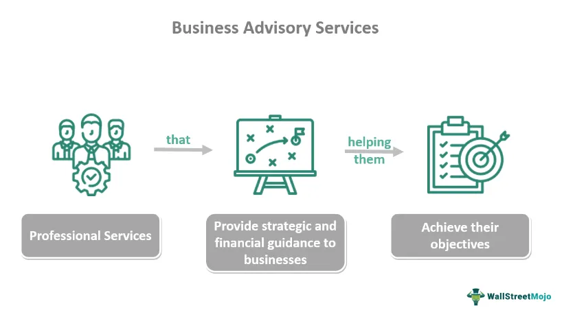

In the rapidly evolving world of finance, algorithmic trading has become synonymous with speed and efficiency. As technology continues to advance, the need for sophisticated tools and insights is more critical than ever. One company that is at the forefront of this technological evolution is Northfield Information Services. Founded in 1985, Northfield has established itself as a leader in providing cutting-edge tools and analytics that significantly enhance the performance and reliability of trading strategies. By leveraging state-of-the-art risk management systems and forming strategic partnerships, Northfield Information Services plays a crucial role in supporting the capabilities of investors on a global scale.

Throughout their history, Northfield has been committed to innovation. This commitment manifests in their development of advanced analytical models and solutions tailored to the needs of the financial industry. These tools help traders and financial analysts transform vast amounts of raw data into actionable strategies, thereby optimizing their algorithmic trading processes. The company's signature product, "Risk Systems That Read®," is renowned for its ability to provide stability and adapt to the ever-changing market conditions, which effectively supports risk management and trading decisions.

In this article, an examination of how Northfield Information Services supports algorithmic trading will be conducted. We will explore Northfield's unique risk management systems and explain how their strategic partnerships expand their reach and enhance the quality of service offered. This exploration will demonstrate why Northfield is a crucial contributor to the modern financial landscape and why traders and financial analysts look to Northfield for reliable tools and insights.

Northfield's efforts extend beyond just providing technical solutions. They are deeply invested in the education and continuous learning opportunities for professionals in the finance industry. Through webinars, online courses, and collaborative educational initiatives, Northfield ensures that market participants remain well-equipped to meet the challenges posed by the complex world of quantitative finance.

As the landscape of algorithmic trading continues to shift, Northfield Information Services remains a pivotal player in navigating these complexities. Their advanced solutions, focus on strategic collaborations, and dedication to education empower investors, ensuring they remain at the cutting edge of trading innovation. For industry professionals seeking to refine their strategies and improve their trading outcomes, Northfield presents a wealth of valuable resources and tools designed to foster growth and efficiency.

## Table of Contents

## Understanding Northfield's Role in Algorithmic Trading

Northfield Information Services plays a pivotal role in [algorithmic trading](/wiki/algorithmic-trading) by offering robust analytical insights and risk management solutions tailored specifically for the financial industry. By utilizing advanced technological solutions, Northfield bridges the gap between the overwhelming influx of raw data and actionable, strategic insights necessary for effective algorithmic trading.

One of Northfield's flagship offerings is the "Risk Systems That Read®" platform. This system is designed to offer traders and financial analysts unparalleled stability and adaptability concerning market changes. The platform achieves this through a combination of comprehensive data analysis and real-time market responsiveness. For instance, by integrating various market signals and real-time data streams, the system allows users to quickly adjust their strategies in response to evolving market conditions.

Moreover, Northfield's models are engineered to provide sophisticated risk assessments. By using advanced statistical models, these tools help traders and financial analysts gain a profound understanding of the various risks they face in the market. The system evaluates a multitude of risk factors, providing insights into [volatility](/wiki/volatility-trading-strategies), [liquidity](/wiki/liquidity-risk-premium), and market sentiments, enabling users to make informed decisions.

A crucial aspect of Northfield's success in algorithmic trading is its emphasis on precision and reliability. The company's algorithms are built using established quantitative finance methodologies, ensuring that predictions and insights are not only accurate but also actionable. This reliability allows financial professionals to trust the models in driving their trading strategies, knowing that they are supported by data-driven, quantifiable insights.

Northfield's commitment to innovation does not stop at risk assessment. The company continually enhances its platforms to incorporate the latest in [machine learning](/wiki/machine-learning) and [artificial intelligence](/wiki/ai-artificial-intelligence). This commitment ensures that users have access to cutting-edge technologies, empowering them to remain competitive in the fast-paced world of finance.

In conclusion, Northfield Information Services exemplifies leadership in algorithmic trading through its commitment to delivering advanced, customizable risk management solutions and analytical insights. Their systems empower financial professionals by converting complex data into clear, actionable trading strategies, thus driving efficiency and effectiveness in the financial markets.

## Key Features of Northfield's Offerings

Northfield Information Services has established itself as a frontrunner in the field of financial risk management and algorithmic trading by offering innovative solutions designed to enhance traders' ability to manage risk and optimize performance. Central to its offerings is the 'Risk Systems That Read®', a state-of-the-art tool that revolutionizes the comprehension and management of financial risk. This system is known for delivering long-term model forecasts that are remarkably adaptive to the fluctuating dynamics of real-time markets. This adaptability is critical for traders who need to respond rapidly to market changes and ensure the robustness of their trading strategies.

A significant addition to Northfield's suite of services is Nexus, a platform providing cloud-based access and application programming interfaces (APIs) that facilitate seamless integration with existing trading systems. By leveraging cloud technology, Nexus not only simplifies access to essential tools but also enhances the scalability and efficiency of trading operations. The APIs allow traders and financial institutions to incorporate Northfield’s advanced analytics directly into their proprietary systems, ensuring that decision-making processes are underpinned by cutting-edge analytical insights.

Furthermore, Northfield's platform is equipped with multi-[factor](/wiki/factor-investing) risk and performance attribution analytics. These analytics empower traders by offering comprehensive insights into the various factors affecting portfolio performance and risk. Multi-factor models are crucial because they accommodate a variety of risk factors—such as market, sector, and idiosyncratic risks—thus providing a more nuanced analysis of investment strategies. This level of analysis affords traders a competitive advantage, as they can better understand and attribute performance outcomes to specific risk factors.

In summary, Northfield's offerings, including the 'Risk Systems That Read®', Nexus, and multi-factor analytics, collectively provide traders and analysts with powerful tools to navigate the complexities of modern financial markets. These features enhance the precision and efficacy of risk management frameworks, allowing financial professionals to maintain a competitive edge in the rapidly changing landscape of algorithmic trading.

## Partnerships and Collaborations

Northfield Information Services has strategically partnered with Confluence to enhance its multi-factor risk and performance attribution analytics. This partnership significantly broadens Northfield's service capabilities, allowing it to offer improved analytics solutions to its clients. The collaboration leverages Confluence's expertise in data management, enabling Northfield to deliver comprehensive, multi-dimensional insights that are crucial for developing robust algorithmic trading strategies. 

Through these collaborations, Northfield is able to implement advanced analytical frameworks that integrate seamlessly with clients' existing systems. This integration provides investors with a holistic view of their portfolios, empowering them to make informed decisions driven by precise data insights. The enhanced analytics capabilities not only improve the quality of service but also enable clients to navigate the complexities of financial markets with greater confidence.

These partnerships are a testament to Northfield's commitment to providing innovative solutions that meet the evolving needs of the financial industry. By combining resources with leading firms like Confluence, Northfield ensures its clients benefit from cutting-edge technologies and methodologies. As a result, investors are equipped with tools that enhance their ability to manage risk effectively and craft more sophisticated trading strategies.

## Educational Resources and Learning Opportunities

Northfield Information Services, a pioneer in risk management and analytics, is dedicated to providing educational resources that enhance the skill set of professionals in the financial industry. One standout initiative is the Northfield/CQF video [course](/wiki/best-algorithmic-trading-courses) on investment risk, which offers a comprehensive learning experience for individuals aiming to deepen their understanding of risk management principles.

Through a series of webinars and online courses, Northfield offers continuous learning opportunities in quantitative finance and risk management. These educational resources are instrumental for finance professionals who wish to maintain a competitive edge in a rapidly changing market environment. The courses are designed to be accessible to both beginners and advanced practitioners, ensuring a wide audience can benefit from the insights shared by Northfield's experts.

Northfield doesn't just rest on static offerings; it regularly updates its educational materials to reflect the latest industry trends and technological advancements. Such updates are crucial for professionals looking to incorporate new tools and methods into their trading strategies. The content typically covers a wide range of topics, from the basics of risk assessment to the application of advanced statistical methods in finance.

Additionally, Northfield is involved in a variety of industry events that provide further learning opportunities. Notably, events like the ARPM Quant Marathon offer participants advanced learning in data science and quantitative finance. These events include lectures, workshops, and interactive sessions with industry leaders, presenting an excellent opportunity for networking and gaining insights into cutting-edge research and practices.

Overall, through its rich array of educational resources, Northfield Information Services empowers finance professionals to enhance their capabilities, stay informed of industry developments, and implement sophisticated, data-driven strategies in their work. This commitment to education not only bolsters the individual career advancement of participants but also contributes to the overall robustness and effectiveness of the financial markets.

## Conclusion

Northfield Information Services stands as a pivotal contributor to algorithmic trading, offering solutions that prioritize innovation and reliability. The company's extensive suite of advanced risk systems equips traders and financial analysts with comprehensive tools to assess and manage financial risks. These systems are designed to adapt to dynamic market conditions, ensuring they remain a valuable asset within the swiftly changing financial environment.

Strategic partnerships have been key to Northfield's success, enhancing its capabilities and extending its influence. Collaborations with industry leaders such as Confluence have fortified Northfield's offerings in multi-factor risk and performance attribution analytics, thereby empowering investors to craft more effective trading strategies.

Northfield's commitment to education further solidifies its role as a leader in the industry. Through initiatives such as the Northfield/CQF video course and various webinars, the company provides insights and learning opportunities that are indispensable for professionals in quantitative finance and risk management. These resources ensure that traders and analysts are well-prepared to tackle the complexities of modern finance.

For those seeking to refine their trading strategies, Northfield offers a wealth of tools and resources tailored to enhance understanding and application of algorithmic trading techniques. As the finance landscape continues to evolve, Northfield remains a dependable partner, supporting the growth and efficiency of algorithmic trading across the globe.

## References & Further Reading

[1]: Bergstra, J., Bardenet, R., Bengio, Y., & Kégl, B. (2011). ["Algorithms for Hyper-Parameter Optimization."](https://papers.nips.cc/paper/4443-algorithms-for-hyper-parameter-optimization) Advances in Neural Information Processing Systems 24.

[2]: ["Advances in Financial Machine Learning"](https://books.google.com/books/about/Advances_in_Financial_Machine_Learning.html?id=oU9KDwAAQBAJ) by Marcos Lopez de Prado

[3]: ["Evidence-Based Technical Analysis: Applying the Scientific Method and Statistical Inference to Trading Signals"](https://www.amazon.com/Evidence-Based-Technical-Analysis-Scientific-Statistical/dp/0470008741) by David Aronson

[4]: ["Machine Learning for Algorithmic Trading"](https://github.com/PacktPublishing/Machine-Learning-for-Algorithmic-Trading-Second-Edition) by Stefan Jansen

[5]: ["Quantitative Trading: How to Build Your Own Algorithmic Trading Business"](https://books.google.com/books/about/Quantitative_Trading.html?id=j70yEAAAQBAJ) by Ernest P. Chan