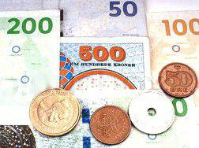

The Norwegian Krone (NOK) is a notable currency within international markets, recognized as the official monetary unit of Norway. Its significance is not just limited to the functioning of Norway's domestic economy but also extends to its influence on global financial transactions. Introduced in the late 19th century, the NOK has experienced substantial shifts, mirroring the broader trends in the global financial landscape. From its origins as part of the Scandinavian Monetary Union to its current status as a floating currency, the Krone's evolution reflects Norway's adaptive economic strategies.

This article provides a comprehensive examination of the NOK's journey, exploring its historical roots and significant milestones over the years. We will analyze the impact of Norway's oil-dependent economy, which plays a pivotal role in the Krone's valuation, and how factors such as energy production, maritime history, and economic policies continue to shape its trajectory. Furthermore, the advent of technology in financial markets is rapidly transforming the way currencies, including the NOK, are traded. The influence of algorithmic trading cannot be understated as it modifies trading dynamics, enhancing market efficiency but also introducing risks associated with rapid trading methodologies.

For investors and financial analysts, understanding these interconnected aspects is essential to navigating the complexities of the foreign exchange (forex) market. Staying informed about technological advancements and economic trends provides a strategic advantage in managing assets and capitalizing on potential opportunities within the currency landscape. Through this exploration, we aim to impart insights into Norway's distinct economic influence and offer valuable perspectives for stakeholders engaged in global commerce.

## Table of Contents

## Understanding the Norwegian Krone

The Norwegian Krone, abbreviated as NOK, is the official currency of Norway and is central to its economic transactions. Its unique valuation is largely influenced by Norway's economy, which is notably driven by oil exports. As a major oil producer, fluctuations in global oil prices directly impact the NOK's strength. This connection to oil has historically contributed both to its robustness and volatility in the foreign exchange market.

The Norwegian Krone exists in various denominations, with coins colloquially referred to as 'ømme'. These metallic forms are vital for daily transactions in the country, complementing banknotes in facilitating cash operations. The currency's physical and nominal attributes cater to the practical needs of the Norwegian market, ensuring its functionality in diverse financial contexts.

The Krone's value is also shaped by Norway's maritime history. Historically, Norway's strategic location and extensive coastline have made maritime trade a significant economic activity. This aspect of its economic development contributed to the early establishment and sustained relevance of the Krone as a reliable currency in trade, especially within the Nordic and European regions.

Another crucial [factor](/wiki/factor-investing) is Norway's rich energy production, primarily from hydropower, which further strengthens its economic profile. The country's commitment to sustainable energy sources not only preserves its economic stability but also positively influences the Krone's valuation. Norway's energy policies have positioned it as a leader in renewable energy, fostering economic resilience which, in turn, supports the Krone.

Norwegian economic policies continue to play a decisive role in the currency's valuation. The nation has adopted prudent fiscal strategies and maintains a sovereign wealth fund that invests the surplus revenues from the petroleum sector. This fund, known as the Government Pension Fund Global, provides a buffer against economic shocks, thereby contributing to the Krone's stability. Additionally, Norway's transparent policy framework and stable political environment further enhance investor confidence in the NOK, making it a preferred choice for [forex](/wiki/forex-system) traders seeking exposure to the Scandinavian economies.

In summary, the Norwegian Krone's valuation reflects a confluence of factors including oil exports, maritime traditions, energy production, and strategic economic policies. Such dynamics make the NOK an intriguing subject for those interested in currency markets and highlight the complexities of understanding its fluctuations in response to both domestic and global influences.

## Historical Evolution of the Norwegian Krone

The Norwegian Krone (NOK) was first introduced in 1875, when Norway became a member of the Scandinavian Monetary Union, which also included Sweden and Denmark. This marked the replacement of the Speciedaler, which was previously used as the official currency of Norway. The introduction of the Krone was part of a broader effort to standardize currency across the Scandinavian countries, aligning with similar values in the Swedish and Danish currencies to facilitate easier trade and economic policies among these nations.

Over the years, the Krone has witnessed significant transformations shaped by both domestic policy decisions and international economic conditions. Initially pegged to gold, the Krone was part of the gold standard system, a common monetary practice that provided monetary stability by linking currency values to a specific amount of gold. However, the economic turmoil of the 20th century led to Norway's departure from the gold backing, which was an inevitable outcome for many nations as they sought to gain greater control over their monetary policies during uncertain times.

A significant turning point in the Krone's history occurred in 1992 when it transitioned to a floating exchange rate system. This move allowed the currency's value to be determined by the foreign exchange market, influenced by factors such as trade balances, inflation, and global economic trends, rather than being pegged to another currency or commodity. Such a shift provided Norway with greater flexibility in responding to economic crises and fluctuations, allowing the country to stabilize its economy through more autonomous monetary policy decisions.

World War II had a profound impact on the Norwegian Krone's value and its affiliations with other major currencies. During the German occupation of Norway, the Krone was linked to the Reichsmark, the currency of Nazi Germany, which subjected Norway's economy to external control and limitations. After the war, Norway aimed to regain its monetary independence and stability, re-establishing connections to more stable global currencies.

Post-war, the Norwegian Krone was pegged to the US Dollar (USD) as part of a broader effort among Western nations to stabilize and modernize their economies in the face of shifting geopolitical landscapes. This connection helped stabilize the Norwegian economy but was gradually moved towards an autonomous and flexible exchange rate policy as global monetary systems evolved.

Thus, the historical evolution of the Norwegian Krone reflects Norway's economic adaptability and resilience in navigating both domestic and international challenges. Through strategic decisions and timely adaptations, Norway has ensured that its currency remains competitive and reflective of its robust economic foundations.

## The Economic Impact on the NOK's Value

The value of the Norwegian Krone (NOK) is intricately linked to the economic health of Norway, with oil prices being a pivotal determinant. As one of the world's leading oil exporters, fluctuations in [crude oil](/wiki/crude-oil) prices directly impact Norway's income from exports. When oil prices rise, the NOK typically appreciates due to increased foreign exchange inflows from oil revenues. Conversely, a decline in oil prices can lead to a depreciation of the NOK, reflecting reduced export earnings.

During periods of global economic [volatility](/wiki/volatility-trading-strategies), the perception of the NOK can shift. It can be seen as a safe-haven currency due to Norway's stable political environment and substantial sovereign wealth fund, or as a risky asset due to its dependency on the oil sector. This duality makes the NOK particularly sensitive to global economic trends and investor sentiment towards oil price projections.

Norway's economy is diversified beyond oil, with significant contributions from shipping, hydropower, and fisheries. Shipping, historically a crucial part of Norway's economy, remains integral due to the country's strategic geographical position and extensive maritime resources. Hydropower, capitalizing on Norway's abundant water resources, plays a vital role in the domestic energy supply, reducing dependency on imported energy and stabilizing domestic economic conditions. The fisheries sector, benefitting from rich marine biodiversity, is another robust component of the Norwegian economy, contributing significantly to exports. Collectively, these sectors enhance the resilience of the NOK by providing alternative income sources, buffering against fluctuations in oil prices.

State ownership in key industries further influences Norway's GDP and currency stability. The Norwegian government maintains significant ownership stakes in strategic companies, particularly in the oil and gas sector, which allows for substantial control over vital industry operations and strategic decisions. This control supports economic stability, which is reflected in the currency's performance. Additionally, the Government Pension Fund Global (commonly known as the Oil Fund) acts as an economic buffer, helping to stabilize the NOK during periods of economic uncertainty. The fund invests revenue from the petroleum sector globally, and its size provides a substantial cushion against both national and international economic fluctuations, ensuring long-term financial stability.

In conclusion, while the NOK's value is heavily influenced by oil prices, the comprehensive and varied nature of Norway's economy, coupled with strategic state ownership and the formidable oil fund, provides a robust framework that supports the nation's economic fortitude and the currency's value in global markets.

## Algorithmic Trading and the NOK

Algorithmic trading, facilitated by advanced computational technologies, is significantly altering the trading landscape for the Norwegian Krone (NOK). This approach employs algorithms — essentially pre-programmed instructions — to execute trades at speeds and frequencies impossible for human traders. These algorithms utilize large datasets, statistical analysis, and real-time market data to make informed trading decisions.

Automation in forex trading comes with notable benefits and challenges that influence market efficiency and [liquidity](/wiki/liquidity-risk-premium). One clear advantage is the ability to process vast amounts of information rapidly, allowing traders to capitalize on market opportunities that would otherwise be missed. Automated systems can operate 24/7 without fatigue, ensuring that trading opportunities are continuously assessed and exploited.

However, these advantages are counterbalanced by certain challenges. The speed and [volume](/wiki/volume-trading-strategy) of trades inherent in [algorithmic trading](/wiki/algorithmic-trading) can lead to market volatility, particularly during periods of low liquidity. Algorithms may react to market indicators in ways that amplify price movements, leading to temporary distortions in asset pricing. Furthermore, the reliance on historical data means that algorithms may struggle to adapt to unexpected market events.

High-frequency trading ([HFT](/wiki/high-frequency-trading-strategies)), a subset of algorithmic trading, has a pronounced impact on the NOK's volatility. HFT strategies execute trades in fractions of a second, often involving large volumes and small price differences. While HFT can enhance market liquidity by narrowing bid-ask spreads, it also poses risks. Sudden market shifts can trigger a cascade of algorithmic responses, increasing short-term volatility. Investors can mitigate these risks by employing technical strategies such as the implementation of circuit breakers, which temporarily halt trading during extreme volatility, and the development of more robust algorithms that consider a wider range of market scenarios.

Looking towards future trends, algorithmic trading is expected to continue evolving, becoming more sophisticated and integral to forex markets. Machine learning and [artificial intelligence](/wiki/ai-artificial-intelligence) are playing roles in developing adaptive algorithms capable of learning from new market data and self-adjusting trading strategies. Such advancements could further refine how NOK is traded, offering greater precision and potentially stabilizing markets through predictive analysis.

As the trading framework becomes increasingly reliant on technology, the implications for the NOK and global forex markets are significant. While algorithmic trading offers promising refinements in trading processes and efficiencies, it also necessitates stringent regulatory oversight to manage associated risks. Market participants must be well-informed and conversant with evolving technologies to capitalize on the benefits while safeguarding against potential disruptions. This ongoing transformation underscores the dynamic nature of currency trading and its critical influence on the global financial ecosystem.

## Conclusion

The Norwegian Krone (NOK) has witnessed a profound transformation since its inception, evolving from a currency securely tied to the gold standard to an adaptive floating exchange system. This shift mirrors Norway's broader economic adaptability, allowing it to navigate the complexities of international markets. As the nation embraced the floating exchange rate system in 1992, it underscored the flexibility required to manage economic fluctuations and the unique challenges posed by global market forces.

Looking to the future, the advent of algorithmic trading introduces both promising opportunities and potential challenges for NOK traders. Automation and high-frequency trading are poised to enhance market efficiency and liquidity, yet they also bring volatility and the need for cautious risk management strategies. Traders must be adept at leveraging advanced computational tools while assessing market conditions that could impact NOK's performance.

Technological and economic environments are constantly shifting, positioning the NOK as a significant player in international trade. Its performance is intrinsically linked to Norway's robust economic sectors, including energy, shipping, and fisheries. Thus, understanding these sectors' dynamics is imperative for stakeholders.

Investors in the NOK market should maintain vigilance against a backdrop of complex global trends. The currency's value is susceptible to various factors, including oil prices, geopolitical events, and economic policies within Norway and abroad. Therefore, being informed about these influences is crucial for making sound investment decisions.

Ultimately, a comprehensive understanding of the Norwegian Krone—its historical transformations, current market standing, and future prospects—equips traders, analysts, and investors with the knowledge required to effectively navigate competitive markets and capitalize on emerging opportunities. Insights into the NOK's journey and potential will remain invaluable in formulating strategies that address both immediate market conditions and long-term economic forecasts.

## References & Further Reading

[1]: ["Exchange Rate Volatility and Oil Price Shocks: The Case of an Oil-Exporting Country"](https://www.cfr.org/report/oil-price-volatility-causes-effects-and-policy-implications) by Akram, Q. F. Energy Economics, Volume 34, 2012, Pages 1175-1187.

[2]: ["The Impact of Macroeconomic Announcements on Real Time Foreign Exchange Rates in Norway"](https://papers.ssrn.com/sol3/papers.cfm?abstract_id=1434412) by Nilsen, Ø. A., Bårdsen, G., Jansen, E. S. Oxford Bulletin of Economics and Statistics, Volume 70, Issue 3, 2008, Pages 331-358.

[3]: ["Algorithmic Trading: Winning Strategies and Their Rationale"](https://www.amazon.com/Algorithmic-Trading-Winning-Strategies-Rationale-ebook/dp/B00CY5HC0U) by Ernest P. Chan

[4]: ["Norwegian Petroleum Directorate"](https://www.sodir.no/en/) - Provides comprehensive data on Norway's oil and gas activities, which are critical for understanding NOK's economic context.

[5]: ["Financial Market Volatility and Liquidity"](https://www.bankofengland.co.uk/-/media/boe/files/speech/2015/financial-market-volatility-and-liquidity-a-cautionary-note.pdf) by K. Mitra, A. Rangarajan, S. Hafer, Princeton University Press.