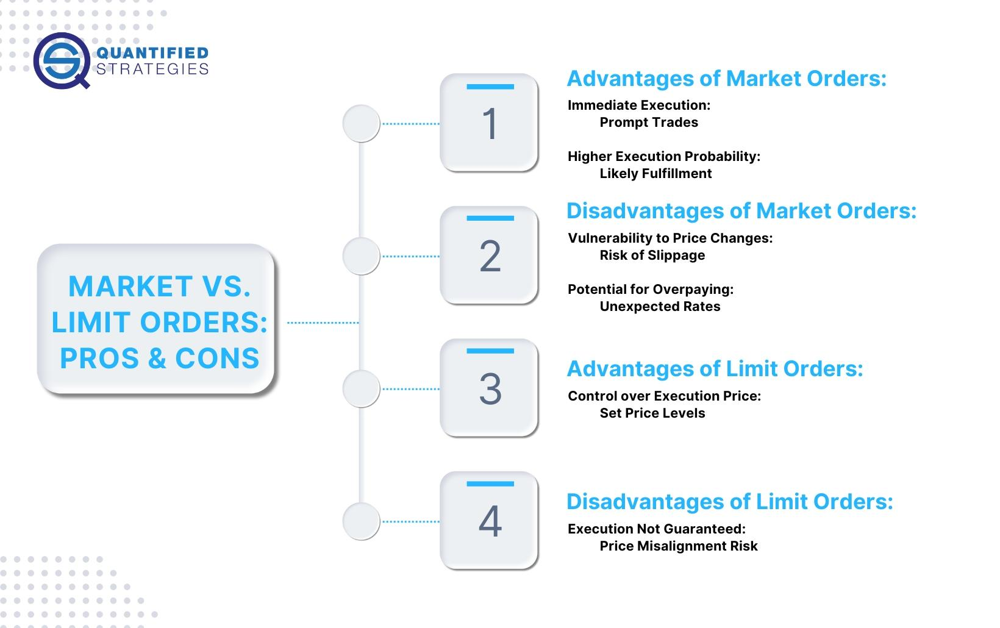

Financial markets play a crucial role in the global economy by facilitating capital formation, liquidity, and risk management. They enable corporations to raise funds for expansion, governments to finance public projects, and individuals to save and invest for the future. The efficient functioning of these markets is integral to economic growth and stability. Different financial instruments, including equities, bonds, currencies, derivatives, and commodities, are traded within these markets, providing a broad spectrum of opportunities for various types of investors and institutions (Mankiw, 2011).

Trading strategies are essential components that contribute to the efficiency and liquidity of financial markets. These strategies allow traders to make informed decisions on the buying and selling of financial instruments, thereby promoting price discovery and market stability. By employing various trading strategies, market participants can optimize their entry and exit points, manage risks, and achieve their financial objectives (Sharpe, 1966).

Algorithmic trading, commonly known as algo trading, has revolutionized traditional trading methods by leveraging the speed and precision of computers to execute orders. Its evolution over the past few decades has been marked by significant advancements in technology and data analytics, allowing traders to automate processes that were traditionally manual. Algorithmic trading strategies can vary widely, including approaches like market making, arbitrage, and trend following, each utilizing advanced computational techniques to exploit market inefficiencies (Aldridge, 2013).

A critical element in the successful execution of trading strategies is the understanding and application of different order types. Not-held orders represent one such order type that offers traders and brokers discretion over the timing and price of execution. In contrast with held orders, where brokers are obligated to execute immediately at the best available price, not-held orders permit flexibility, enabling brokers to seek a favorable price execution based on market conditions (O'Hara, 1995).

This article aims to explore not-held orders and their strategic application within algorithmic trading. By analyzing the integration of not-held orders in algo trading strategies, we will understand their potential advantages, examine conditions under which they are beneficial, and consider the broader implications for market efficiency.

## Table of Contents

## Understanding Not-Held Orders

Not-held orders are a specific type of trading order that grants brokers discretion over the timing and price of the execution, allowing them flexibility to use their judgment to achieve the best possible outcome for the client. This feature distinguishes not-held orders from held orders, where brokers are obligated to execute the order immediately at the current market price or as close to it as possible.

In the case of held orders, the primary benefit is the certainty of execution, as the broker must act immediately without delay. However, this can result in trades executed at less favorable prices, especially in fast-moving markets. Conversely, not-held orders provide brokers the opportunity to seek better prices or capitalize on intraday price movements. They can decide when and at what price to execute the order, thereby potentially enhancing trade performance through strategic timing and price improvement efforts.

The use of not-held orders offers several advantages. For traders, it provides the chance to capture better-than-market prices, as brokers can employ their expertise and market insight to optimize execution. For brokers, not-held orders can help in [liquidity](/wiki/liquidity-risk-premium) management and reducing market impact, as they can strategically time their trades to avoid moving the market unfavorably against the client’s position. Additionally, the discretion allowed by not-held orders can be particularly advantageous during volatile or illiquid market conditions.

Despite these advantages, there are inherent risks and limitations. The discretionary nature of not-held orders means that execution is not guaranteed, and there is a risk that the intended price target may never be met, resulting in missed trading opportunities. Furthermore, reliance on the skill and judgment of the broker can introduce a degree of uncertainty and variability in trade outcomes. Traders must also consider the potential for conflicts of interest, as brokers may prioritize other trades or proprietary interests over the client's not-held order.

Not-held orders can be beneficial in several scenarios. For example, in a volatile market, a broker can take advantage of price swings to execute orders at more favorable prices. Similarly, during periods of low liquidity, a broker can wait for optimal conditions to execute a trade, avoiding unnecessary market impact. Additionally, traders seeking to minimize market impact during large trades may use not-held orders to break up the order into smaller parts, executing each as market conditions permit rather than impacting the market with a single, large order. 

Overall, not-held orders offer a strategic tool for sophisticated traders and brokers, blending the art and science of trade execution to potentially enhance order performance in today's complex financial markets.

## Algorithmic Trading: A Brief Overview

Algorithmic trading, often referred to as algo trading, involves using computer algorithms to execute trades at optimal conditions, based on pre-defined instructions. These algorithms evaluate multiple market variables including price, timing, and [volume](/wiki/volume-trading-strategy), to make trades that maximize profits while minimizing risks. In modern financial markets, [algorithmic trading](/wiki/algorithmic-trading) has become crucial due to its ability to process massive amounts of data at high speed, offering market participants the ability to execute trades with unparalleled efficiency.

### Key Components of Algorithmic Trading

Algorithmic trading thrives on three main elements: speed, automation, and efficiency. 

1. **Speed**: Algorithms can react to market changes in milliseconds or even microseconds. This speed is essential, especially in high-frequency trading (HFT), where the distinction between success and failure can be determined in fractions of a second.

2. **Automation**: By automating the trading process, trading algorithms decrease the need for human intervention, thus reducing the risk of manual errors. Automation ensures consistent execution of trading strategies, even in volatile market conditions.

3. **Efficiency**: Algorithms are designed to be efficient both in terms of execution and order processing. This efficiency allows traders to capitalize on fleeting opportunities that may not be apparent or accessible through manual trading methods.

### Types of Algorithmic Trading Strategies

There are several types of algorithmic trading strategies employed by traders and firms, each suited to different market conditions:

- **Market Making**: This strategy involves simultaneously buying and selling the same security to provide liquidity to the market. Algorithms constantly adjust bid and ask prices to take advantage of the spread between them.

- **Trend Following**: These algorithms are designed to recognize price trends and exploit them until signs of reversal appear. They rely on technical indicators like moving averages and momentum studies.

- **Statistical Arbitrage**: This strategy employs complex mathematical models to identify mispricing and execute pairs trading, where simultaneous long and short positions are executed on correlated securities to profit from their expected convergence.

### Role of Technology

The technological advancement has significantly propelled the capabilities of algorithmic trading. High-speed internet connectivity and powerful computing resources allow traders to process vast amounts of data instantaneously. Machine learning and [artificial intelligence](/wiki/ai-artificial-intelligence) are increasingly being integrated to enhance decision-making processes, enabling algorithms to learn and adapt over time, thus increasing their predictive accuracy and effectiveness.

### Challenges and Regulatory Concerns

Despite its benefits, algorithmic trading also presents various challenges:

- **Market Volatility**: The rapid pace of algo trading can lead to heightened market volatility, as demonstrated during the Flash Crash of 2010, where markets plunged dramatically within minutes due to cascading automated sell orders.

- **Opacity**: The complexity and proprietary nature of many algorithms lead to concerns about market transparency and fairness, with critics arguing that these can create an uneven playing field favoring technologically advanced firms.

- **Regulatory Scrutiny**: Regulatory bodies globally are focused on ensuring that algorithms do not manipulate markets unfairly. There are ongoing discussions about the need for stricter controls and more transparent disclosures related to algo trading practices. 

In summary, algorithmic trading represents a sophisticated approach to trading in today's fast-paced financial markets. While it offers significant advantages in terms of speed, efficiency, and automation, it comes with inherent challenges and concerns that need careful consideration and oversight.

## Integrating Not-Held Orders in Algo Trading Strategies

Not-held orders are distinguished by their flexibility, allowing brokers more discretion in timing and pricing when executing trades. This adaptability makes them particularly advantageous when integrated into algorithmic trading strategies, which increasingly dominate financial markets due to their speed and efficiency.

### Integration into Algorithmic Trading Strategies

Algorithmic trading strategies leverage the discretion offered by not-held orders to optimize execution. Unlike held orders, which require immediate execution at the market's prevailing conditions, not-held orders permit the trader to wait and seek optimal execution as market conditions fluctuate. This flexibility can be used to develop more sophisticated trading algorithms that aim to minimize market impact and capitalize on transient opportunities.

### Benefits

The use of not-held orders in algorithmic trading presents several benefits:
- **Increased Flexibility**: Algorithms can dynamically adjust execution strategies based on real-time data without the pressure of immediate execution. This is particularly beneficial for strategies like statistical arbitrage, where timing is crucial.
- **Reduced Market Impact**: By allowing trading algorithms to optimize the timing and sizing of orders, not-held orders can help in reducing the market footprint, minimizing the risk of adverse price movements due to large order placements.

### Popular Algorithms Incorporating Not-Held Orders

Several algorithmic trading strategies incorporate not-held orders to improve performance:
- **VWAP (Volume-Weighted Average Price)**: This strategy aims to execute orders in line with historical trading volume patterns, and the discretionary nature of not-held orders allows for more precise timing adjustments.
- **TWAP (Time-Weighted Average Price)**: Utilizes time-based slicing of orders, benefiting from the flexibility of not-held orders to adjust execution in response to real-time market conditions.
- **Liquidity Seeker Algorithms**: Designed to capture liquidity across fragmented markets, these algorithms use not-held orders to optimize execution across multiple venues.

### Case Studies

There are numerous case studies highlighting the successful application of not-held orders in algorithmic trading. For instance, a trading firm using a combination of TWAP and VWAP algorithms reported a significant reduction in slippage as a result of the increased discretion afforded by not-held orders, leading to better overall performance and improved profitability.

### Considerations for Algorithm Development

When developing algorithms to utilize not-held orders effectively, several considerations should be taken into account:
- **Market Conditions**: Algorithms must be tuned to recognize and adapt to varying market conditions, as the discretion allowed can lead to different execution strategies depending on volatility and liquidity.
- **Regulatory Compliance**: Ensure that the discretionary power used in not-held orders adheres to regulatory standards, avoiding any potential compliance issues.
- **Backtesting and Optimization**: Use historical data to backtest algorithmic performance, ensuring that strategies employing not-held orders are optimized for a range of market scenarios.

In summary, not-held orders can significantly enhance the adaptability and efficiency of algorithmic trading strategies, offering both increased flexibility and a reduced market impact, thus making them an invaluable tool in a trader's strategy arsenal.

## Implementing Effective Not-Held Order Strategies

To create effective not-held order strategies, traders must consider several key factors. Understanding the nuances of market dynamics, trading objectives, and execution environments is essential in tailoring strategies that maximize benefits while minimizing risks.

**Key Factors in Creating Not-Held Order Strategies**

1. **Market Conditions**: Recognizing the existing market conditions is vital. This includes understanding liquidity, volatility, and overall market sentiment, which can significantly influence the outcomes of not-held orders. Highly volatile markets may benefit from not-held orders due to their inherent flexibility and adaptability to rapid price changes.

2. **Order Execution Goals**: Establishing clear execution goals is critical. These could range from achieving the best possible price, minimizing market impact, or optimizing speed of execution. Not-held orders allow brokers discretion over timing and price, giving them flexibility to achieve these objectives under different market scenarios.

3. **Broker Expertise**: The proficiency of the broker executing not-held orders is paramount. Brokers must possess deep market understanding and advanced trading tools to execute these orders effectively. Trust in the broker's capability to adapt strategies to real-time market conditions is key to achieving desired outcomes.

**Tools and Technologies for Efficient Execution**

1. **Advanced Trading Platforms**: Utilizing sophisticated trading platforms that offer real-time data analytics and execution options is crucial. Platforms that integrate artificial intelligence and machine learning can provide insights into optimal trading times and conditions for not-held orders.

2. **Algorithmic Tools**: Algorithms that can dynamically adjust strategies based on market conditions are invaluable. For example, algorithms that integrate historical and real-time data to predict market movements can help refine the execution of not-held orders.

3. **Data Analytics**: Leveraging big data and analytics tools helps in processing vast amounts of market data. These tools aid in recognizing patterns and predicting market behavior, thus informing more precise execution of not-held orders.

**Risk Management Practices**

1. **Diversification of Strategies**: Diversifying trading strategies to include a mix of order types can reduce reliance on not-held orders alone and mitigate potential losses.

2. **Stop-Loss Mechanisms**: Employing stop-loss limits can protect against adverse price movements. This ensures losses are contained if the market moves unfavorably against the position taken by the not-held order.

3. **Continuous Monitoring**: Implementing continuous monitoring systems to observe order performance and market conditions enables traders to adjust strategies promptly, minimizing exposure to risk.

**Evaluating Performance with KPIs**

Key performance indicators (KPIs) such as execution price versus benchmark, order fill rates, and slippage levels are essential in evaluating the success of not-held order strategies. Regular assessment against these KPIs helps in refining strategies for better outcomes.

**Future Trends and Impact on Trading Strategies**

1. **Increased Automation**: The trend toward increased automation and the use of AI in trading is likely to enhance the efficacy of not-held orders by providing faster and more accurate market analysis.

2. **Enhanced Predictive Models**: Improvements in predictive modeling, driven by advancements in machine learning, offer potential for more accurate forecasts of market movements, thus enabling more informed execution of not-held orders.

3. **Regulatory Developments**: Ongoing changes in financial regulation may impact the structure and use of not-held orders. Traders must stay informed about regulatory trends and adapt strategies accordingly to maintain compliance and optimize execution.

## Conclusion

Not-held orders play a pivotal role in financial markets by offering traders and investors the discretion to optimize trade execution based on market conditions. These orders provide brokers with the flexibility to choose the opportune moment, price, and method for executing trades, which can lead to improved execution outcomes and reduced market impact. The significance of not-held orders lies in their ability to enhance decision-making in rapidly changing market environments, contributing to overall market efficiency.

Algorithmic trading, marked by speed, automation, and precision, benefits considerably from the integration of not-held orders. This integration allows for a more nuanced trading strategy, where the algorithms can utilize the flexible nature of not-held orders to better align with real-time market dynamics. By employing not-held orders, algorithms are equipped to manage large order volumes while minimizing price slippage and market disturbance. This synergy enhances the competitiveness and effectiveness of algorithmic strategies, enabling traders to achieve better pricing and execution quality.

Looking ahead, trading strategies involving not-held orders are poised to evolve further with advancements in technology and data analytics. The future of these strategies is likely to see increased sophistication as [machine learning](/wiki/machine-learning) and artificial intelligence tools further refine the decision-making processes underlying the execution of not-held orders. Such advancements could lead to more adaptive and intelligent trading systems that are capable of navigating complex market structures with agility.

As financial markets continue to evolve, there is a continuous need for research and exploration of innovative trading methods that leverage not-held orders. This ongoing examination will be crucial in identifying new opportunities for optimization and efficiency in trade execution. Researchers and practitioners are encouraged to explore ways to further harness the potential of not-held orders, as the understanding and applications of these order types expand.

In conclusion, traders and investors are urged to consider the strategic adoption of not-held order mechanisms within their trading frameworks. The adoption of these strategies may offer a competitive edge in today's fast-paced markets by providing greater control over trade execution and superior alignment with market conditions. As the trading landscape transforms, embracing the flexibility and potential of not-held orders could prove invaluable in achieving trading success.

## References & Further Reading

[1]: Aldridge, I. (2013). ["High-Frequency Trading: A Practical Guide to Algorithmic Strategies and Trading Systems."](https://www.ahmetbeyefendi.com/wp-content/uploads/2020/07/High-Frequency-Trading-Irene-Aldridge.pdf) Wiley.

[2]: Mankiw, N.G. (2011). ["Principles of Economics."](https://faculty.cengage.com/titles/9780357038314) South-Western College Pub.

[3]: Sharpe, W.F. (1966). ["Mutual Fund Performance."](https://www.jstor.org/stable/2351741) Journal of Business, 39(1), 119-138.

[4]: O'Hara, M. (1995). ["Market Microstructure Theory."](https://www.wiley.com/en-us/Market+Microstructure+Theory-p-9780631207610) Wiley-Blackwell.

[5]: Lopez de Prado, M. (2018). ["Advances in Financial Machine Learning."](https://www.amazon.com/Advances-Financial-Machine-Learning-Marcos/dp/1119482089) Wiley.