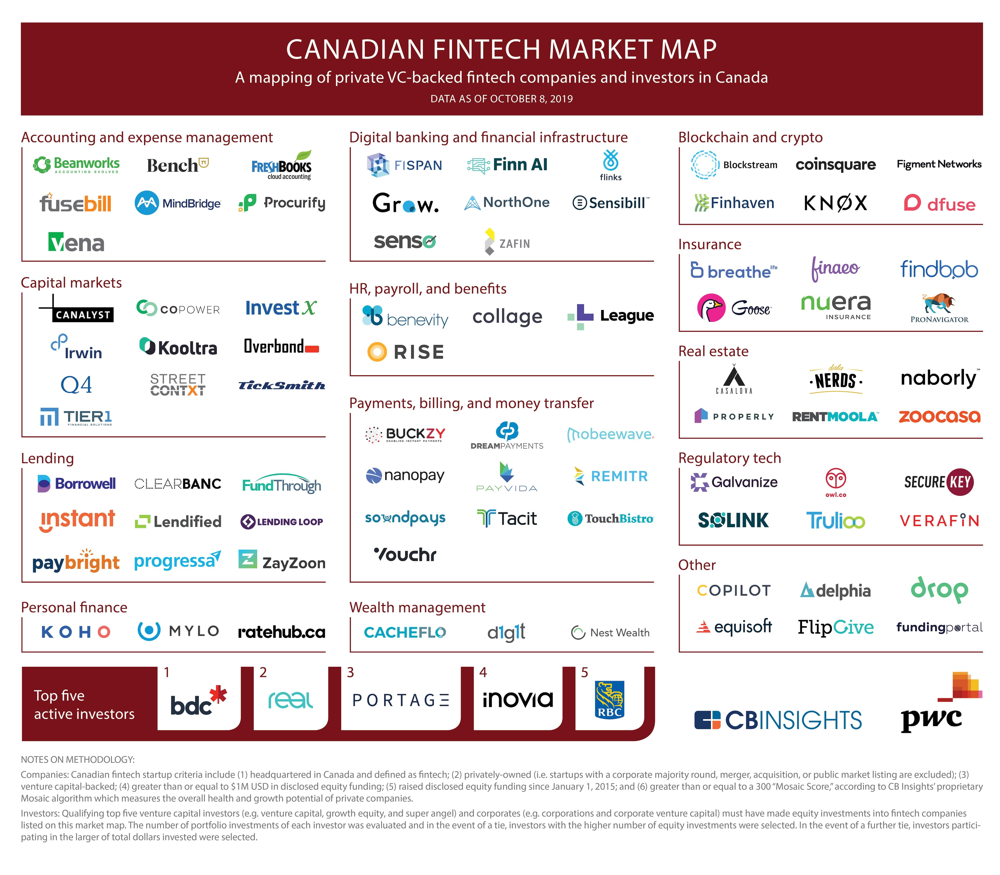

## Table of Contents

## What is fintech and why is it important in Canada?

Fintech, short for financial technology, is the use of technology to make financial services easier and more accessible. It includes things like online banking, mobile payment apps, and tools that help people invest or manage their money. In Canada, fintech is important because it helps people do their banking and manage their money more easily, without having to go to a bank in person. This is especially helpful for people who live in rural areas or have busy lives.

Fintech also helps make financial services cheaper and more inclusive. Traditional banks can be expensive and may not serve everyone equally. Fintech companies often offer lower fees and can reach people who might not have easy access to traditional banking. This is important in Canada because it helps more people take control of their finances and participate in the economy. By using fintech, Canadians can save money, invest, and plan for their future more effectively.

## Can you name some of the most well-known Canadian fintech companies?

Some of the most well-known Canadian fintech companies are Wealthsimple, Koho, and Borrowell. Wealthsimple helps people invest their money easily. They offer different investment options and make it simple for anyone to start investing, even if they don't have a lot of money. Koho is a company that offers a spending and savings account through a mobile app. It helps people manage their money better and save on fees that traditional banks might charge. Borrowell focuses on helping people get loans and improve their credit scores. They use technology to make the loan process faster and easier.

These companies are changing the way Canadians handle their money. They make financial services more accessible and affordable. For example, Wealthsimple has made investing less scary and more approachable for people who are new to it. Koho's app helps people keep track of their spending and save money without the high fees of traditional banks. Borrowell's services help people who might have trouble getting loans from regular banks. Overall, these fintech companies are making a big difference in how Canadians manage their finances.

## What services do these Canadian fintech companies provide?

Wealthsimple helps people invest their money easily. They offer different ways to invest, like in stocks or in funds that are managed for you. You can start investing with just a little bit of money, and Wealthsimple makes it simple to understand where your money is going. They also have tools to help you plan for the future, like saving for retirement or buying a house. Wealthsimple's goal is to make investing less scary and more accessible for everyone, even if you're new to it.

Koho offers a spending and savings account through a mobile app. With Koho, you can manage your money better and save on fees that traditional banks might charge. The app helps you keep track of your spending and set goals for saving money. Koho also gives you a prepaid card that you can use to make purchases or withdraw money from ATMs. Their services are designed to be easy to use and help you take control of your finances without the high costs of traditional banking.

Borrowell focuses on helping people get loans and improve their credit scores. They use technology to make the loan process faster and easier. You can apply for a loan online and get a decision quickly. Borrowell also offers tools to help you understand and improve your credit score. This can be really helpful for people who might have trouble getting loans from regular banks. Borrowell's services aim to make borrowing money more straightforward and accessible.

## How do these fintech companies impact the traditional banking sector in Canada?

Fintech companies like Wealthsimple, Koho, and Borrowell are changing the way people in Canada use banks. They offer services that are easier to use and often cheaper than what traditional banks provide. For example, Wealthsimple makes investing simple and affordable, which can draw people away from traditional investment services at banks. Koho's app helps people manage their money without the high fees that banks might charge. This means more people might choose fintech over traditional banks for their everyday banking needs.

Traditional banks in Canada are feeling the pressure from these fintech companies. To keep their customers, banks are starting to offer their own digital services and lower their fees. They are trying to make their services more like what fintech companies offer. This competition is good for customers because it means they have more choices and can find better deals. Overall, fintech companies are pushing traditional banks to improve and adapt to what people want today.

## What are the key factors that contribute to the success of Canadian fintech companies?

One key [factor](/wiki/factor-investing) that helps Canadian fintech companies succeed is their focus on making things easy for customers. They use technology to make financial services simple and quick. For example, Wealthsimple makes investing easy for everyone, even if you don't know much about it. Koho's app helps people manage their money without the hassle of going to a bank. By making their services user-friendly, these companies attract a lot of customers who want a simpler way to handle their finances.

Another important factor is that fintech companies often charge less than traditional banks. This makes their services more appealing to people who want to save money. For instance, Koho offers low fees for banking, and Borrowell makes loans easier and cheaper to get. By offering affordable services, fintech companies can draw customers away from traditional banks, which can be expensive. This focus on affordability helps them grow and succeed in the Canadian market.

Lastly, Canadian fintech companies are good at using technology to reach more people. They offer services online and through apps, which means they can serve customers all over the country, even in rural areas. This wide reach helps them grow their customer base. By using technology to make their services available to everyone, these companies can expand quickly and meet the needs of more Canadians.

## How do Canadian fintech companies ensure the security and privacy of their users?

Canadian fintech companies take the security and privacy of their users very seriously. They use strong encryption to protect the information that people share with them. Encryption is like a secret code that keeps data safe from hackers. These companies also follow strict rules set by the government to make sure they handle data the right way. For example, they have to tell users how their information will be used and get permission before sharing it with anyone else.

To keep things even safer, fintech companies use special tools to watch for anything unusual. If they see something strange, like someone trying to log in from a different country, they can stop it before it becomes a problem. They also make sure that their apps and websites are always up to date with the latest security fixes. By doing all these things, Canadian fintech companies help keep their users' money and personal information safe and private.

## What role do government regulations play in the growth of fintech in Canada?

Government regulations are important for the growth of fintech in Canada. They help make sure that fintech companies are safe and fair for everyone. The government sets rules that fintech companies have to follow to protect people's money and privacy. For example, the Financial Consumer Agency of Canada makes sure that fintech companies treat customers fairly and tell them about any fees or risks. These rules help people trust fintech companies more, which can help the companies grow.

At the same time, some rules can make it harder for fintech companies to start or grow. It can take a lot of time and money to follow all the regulations. This can slow down fintech companies, especially new ones. But the government is trying to help by making some rules easier to follow. For example, they have programs to help fintech companies work with traditional banks, which can help them grow faster. Overall, government regulations are a big part of how fintech companies in Canada can succeed.

## How are Canadian fintech companies integrating AI and blockchain technologies?

Canadian fintech companies are using AI to make their services better and easier to use. AI helps them understand what people want and need. For example, Wealthsimple uses AI to give people advice on how to invest their money. The AI looks at a person's money habits and suggests the best ways to invest. This makes investing simpler for everyone. AI also helps fintech companies keep their services safe. It can spot strange activities, like someone trying to use your account from a different country, and stop it before it causes problems.

Blockchain technology is also important for Canadian fintech companies. It helps make transactions safe and clear. For example, Borrowell uses blockchain to make sure that loan information is safe and can't be changed. This makes people trust the company more. Blockchain also helps with things like sending money to other countries quickly and cheaply. Some fintech companies are even using blockchain to create new kinds of money, called cryptocurrencies. By using blockchain, these companies can offer new services that traditional banks can't.

## What are the major challenges faced by fintech companies in Canada?

Fintech companies in Canada face a lot of challenges. One big challenge is following all the rules set by the government. These rules are there to keep people's money safe, but they can be hard to follow. It can take a lot of time and money for fintech companies to make sure they are doing everything right. This can slow them down and make it harder for new companies to start up.

Another challenge is competing with big traditional banks. These banks have been around for a long time and have a lot of customers. Fintech companies have to work hard to show people that their services are better or cheaper. It can be tough to get people to switch from the banks they know and trust. Plus, traditional banks are starting to offer their own digital services, which makes it even harder for fintech companies to stand out.

## How do Canadian fintech companies compare to their global counterparts?

Canadian fintech companies are doing well but they face some challenges compared to their global counterparts. In places like the United States and Europe, fintech companies often have more money to spend on growing their businesses. They can also reach more people because they have bigger markets. In Canada, the market is smaller, so fintech companies have to work harder to get customers. But Canadian fintech companies are good at making their services easy to use and affordable, which helps them compete.

On the other hand, Canadian fintech companies are often seen as trustworthy and safe. They follow strict rules set by the government, which makes people feel more comfortable using their services. This focus on security and privacy can be a big advantage when compared to some global fintech companies, especially in places where rules might not be as strict. Overall, while Canadian fintech companies might not have as much money or as big a market as some global players, they make up for it by offering user-friendly, secure, and affordable services.

## What are the future trends and predictions for the Canadian fintech industry?

The future of the Canadian fintech industry looks bright. More people are using fintech services, and this trend is likely to keep growing. One big trend will be the use of [artificial intelligence](/wiki/ai-artificial-intelligence) (AI) to make services even better. AI can help give people personalized advice on how to save and invest their money. It can also make things safer by spotting and stopping fraud quickly. Another trend will be the use of blockchain technology. This can help make transactions safer and easier, especially for things like sending money to other countries. As more people get used to using fintech, these technologies will become even more important.

There are also predictions that fintech companies will work more with traditional banks. This can help fintech companies grow faster because they can use the banks' resources and reach more customers. At the same time, traditional banks will keep trying to offer their own digital services to compete with fintech companies. This competition is good for customers because it means more choices and better services. Overall, the Canadian fintech industry is expected to keep growing and changing, making financial services easier and more accessible for everyone.

## Can you discuss any case studies of successful fintech innovations in Canada?

One successful fintech innovation in Canada is Wealthsimple. They started in 2014 and made investing easy for everyone. Before Wealthsimple, many people thought investing was too hard or too expensive. But Wealthsimple changed that by using technology to help people invest with just a little bit of money. They also use AI to give people advice on how to invest. This has made a lot of people interested in investing, even if they are new to it. Wealthsimple has grown a lot and now helps people not just invest, but also save for things like retirement or buying a house.

Another example is Koho, which began in 2014 too. Koho offers a spending and savings account through a mobile app. This is different from traditional banks because it's easier to use and often cheaper. People can manage their money, set saving goals, and even get a prepaid card to use for buying things. Koho's focus on making banking simple and affordable has attracted a lot of customers. They keep adding new features to their app, like ways to save money automatically or get cash back on purchases. Koho shows how fintech can make everyday banking better for everyone.

## References & Further Reading

[1]: Canadian Venture Capital and Private Equity Association (CVCA). ["2021 Venture Capital Canadian Market Overview."](https://cvca.ca/files/reports/h1-2021-vc-pe-canadian-market-overview/H1-2021-Venture-Capital-Canadian-Market-Overview.pdf)

[2]: Lopez de Prado, Marcos. ["Advances in Financial Machine Learning."](https://www.amazon.com/Advances-Financial-Machine-Learning-Marcos/dp/1119482089) Wiley, 2018.

[3]: Chan, Ernest P. ["Quantitative Trading: How to Build Your Own Algorithmic Trading Business."](https://github.com/ftvision/quant_trading_echan_book) Wiley, 2008.

[4]: Aronson, David. ["Evidence-Based Technical Analysis: Applying the Scientific Method and Statistical Inference to Trading Signals."](https://www.amazon.com/Evidence-Based-Technical-Analysis-Scientific-Statistical/dp/0470008741) Wiley, 2006.

[5]: Jansen, Stefan. ["Machine Learning for Algorithmic Trading."](https://github.com/stefan-jansen/machine-learning-for-trading) Packt Publishing, 2020.