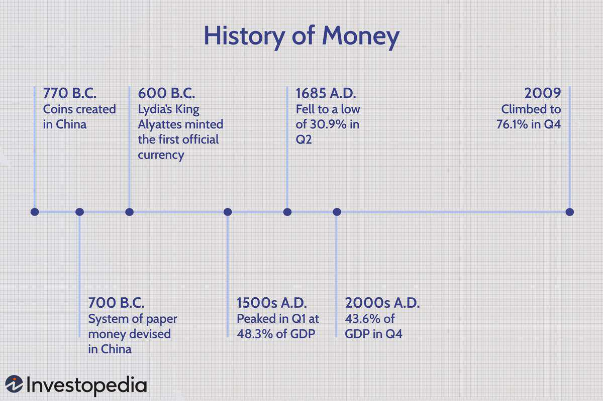

Currency trading, commonly referred to as forex trading, stands as a crucial component of the global financial ecosystem, facilitating the exchange of different national currencies. With daily transactions exceeding $6 trillion, the forex market is the largest of its kind worldwide, far surpassing equity and bond markets in terms of daily volume. This massive scale is driven by a diverse array of participants, including central banks, financial institutions, corporations, and retail traders, each with distinct purposes ranging from hedging to speculation and investment.

A pivotal development in this sector has been the rise of algorithmic trading, which employs pre-defined algorithms to execute trades. This mode of trading has transformed the forex market by significantly enhancing transaction speed, precision, and overall market efficiency. By automating trading processes, algorithmic trading minimizes human error and allows trades to capitalize on fleeting market opportunities that might be missed in manual trading scenarios.



This article intends to explore the financial history of currency trading and examine the profound impact that algorithmic trading has had on the forex market. By understanding these developments, one can better appreciate the complexities and dynamics involved in modern currency trading.

## Table of Contents

## The Evolution of Currency Trading

Currency trading, a fundamental component of the global financial system, has undergone remarkable transformation since its inception. In its earliest forms, currency exchange was facilitated through barter systems and the use of precious metals, such as gold and silver, as currency standards. As international trade expanded, the need for a standardized system became evident, leading to the adoption of the Bretton Woods system in 1944, which pegged major world currencies to the U.S. dollar, itself convertible to gold. This established a framework for relatively stable exchange rates and facilitated international trade and investment post-World War II.

The dismantling of the Bretton Woods system in 1971 marked a significant turning point in currency trading history, as it ushered in an era of floating exchange rates, where currency values are determined by market forces rather than fixed values. This shift catalyzed the development of the modern foreign exchange (forex) market, characterized by increased volatility and trading opportunities.

Technological advancements in the late 20th century revolutionized currency trading, transitioning from traditional face-to-face and telegraph-based systems to electronic trading platforms. This evolution was spurred by the adoption of the SWIFT (Society for Worldwide Interbank Financial Telecommunication) system in the 1970s, which standardized bank transactions globally and facilitated quicker, more efficient currency trades. The introduction of personal computers and internet technology in the 1980s and 1990s enabled the exponential growth of electronic trading platforms, allowing traders to execute transactions across the globe instantaneously.

The [forex](/wiki/forex-system) market's historical context reflects the profound influence of globalization and economic policies on currency values. The liberalization of capital flows in the 1990s, alongside the rise of emerging markets, contributed to an unprecedented increase in forex trading volumes. Exchange rates began to reflect a complex interplay of macroeconomic factors, including interest rates, inflation, geopolitical stability, and trade balances.

With these technological and policy-driven changes, the forex market today is the largest financial market globally, with daily trading volumes exceeding $6 trillion. It operates as a decentralized network of financial institutions, corporations, governments, and individual traders, each engaging in currency transactions for various purposes, ranging from speculative profits to hedging against currency risks.

Overall, the evolution of currency trading highlights a trajectory of innovation and adaptation, responding to the growing complexity and interconnectedness of the global economy. Understanding this historical progression is crucial for comprehending current trends and making informed decisions in the forex market.

## The Rise of Algorithmic Trading

Algorithmic trading became a transformative force in financial markets with the advent of sophisticated computer technology in the late 20th century. This new trading approach leveraged complex mathematical models to automate the execution of trades, significantly enhancing both speed and efficiency. Initially, [algorithmic trading](/wiki/algorithmic-trading) was a tool exclusive to large institutional investors given the high technological and capital requirements. However, as computational power became more accessible and costs reduced, its adoption spread across various market participants, including those in forex.

A pivotal moment in the development of algorithmic trading was the introduction of program trading in the 1980s. Program trading allowed the execution of large [volume](/wiki/volume-trading-strategy) trades based on pre-defined criteria, typically applied to baskets of stocks. The ability to automate the trading process reduced the impact of human error and allowed traders to capitalize on market opportunities almost instantaneously. Despite controversies and debates on its influence on market [volatility](/wiki/volatility-trading-strategies), program trading laid the foundation for more advanced forms of algorithmic strategies.

The evolution of high-frequency trading ([HFT](/wiki/high-frequency-trading-strategies)) marked another significant milestone in the algorithmic trading journey. Using highly sophisticated algorithms, HFT exploits minute price disparities across markets to execute trades at extremely high speeds, often within microseconds. This strategy relies extensively on advanced computational infrastructure and low-latency data transmission, allowing traders to make rapid decisions before market conditions change. The rise of HFT has contributed to increased [liquidity](/wiki/liquidity-risk-premium) and tighter bid-ask spreads, although it has also raised concerns regarding market fairness and stability.

Algorithmic trading models are underpinned by mathematical finance principles, with many employing quantitative strategies such as statistical [arbitrage](/wiki/arbitrage), [trend following](/wiki/trend-following), and pattern recognition. These algorithms analyze massive datasets to identify optimal trade opportunities, deploying Python and other programming languages for model implementation and execution. For instance, a basic algorithm to track price trends might use moving averages calculated as follows:

```python
def moving_average(prices, window):
    return [sum(prices[i:i+window])/window for i in range(len(prices)-window+1)]
```

In summary, the rise of algorithmic trading reflects a broader trend of technological integration within financial markets. It offers efficiency and precision in trade execution while remaining central to ongoing discussions around regulation and market dynamics.

## How Forex Algorithmic Trading Works

Forex algorithmic trading relies on automated systems to execute trades based on pre-defined criteria. These algorithms are designed to process and analyze large volumes of market data efficiently, allowing traders to identify favorable trading opportunities with precision and speed. At its core, forex algorithmic trading involves a series of steps aimed at optimizing trading outcomes through systematic and rule-based approaches.

Firstly, these systems collect real-time market data from various sources, including price feeds, economic indicators, and news events. The data is then processed using sophisticated techniques such as time-series analysis and quantitative models, which help determine potential trade directions. The algorithm's decision-making process often considers multiple factors such as price movement patterns, volume fluctuations, and historical trends.

Based on the analyzed data, the algorithm generates buy or sell signals that act as triggers for executing trades. The timing of these trades is crucial, and algorithms are designed to identify the optimal moments to enter or [exit](/wiki/exit-strategy) positions, thereby maximizing the potential for profit while minimizing risk.

Several popular strategies are employed in forex algorithmic trading:

1. **Statistical Arbitrage**: This strategy involves identifying and exploiting price inefficiencies between correlated currency pairs. By analyzing historical price relationships, the algorithm aims to profit from temporary divergences in price movements. For example, if two currency pairs typically move together but deviate due to market anomalies, the algorithm might suggest buying the undervalued pair while shorting the overvalued one.

2. **Trend Following**: This approach seeks to capitalize on established market trends. Algorithms using this strategy analyze long-term price patterns to generate trading signals. For instance, if an algorithm detects an upward trend in a currency pair, it may initiate a buy order with the expectation that the trend will continue.

3. **Momentum-Based Trading**: This strategy focuses on the strength and persistence of price movements. Algorithms designed for momentum trading look for currencies gaining traction and enter trades in the same direction as the observed momentum. The premise is that strong movements in one direction are likely to continue in the short term.

Python is a popular language for developing algorithmic trading systems due to its rich set of libraries and ease of use. For example, the `pandas` library can be used for data manipulation and analysis, while `numpy` provides support for numerical operations. A simple example of a [momentum](/wiki/momentum)-based trading strategy could be implemented as follows:

```python
import pandas as pd
import numpy as np

# Sample function to calculate momentum
def momentum_strategy(data, window=14):
    data['Momentum'] = data['Close'] - data['Close'].shift(window)
    data['Signal'] = np.where(data['Momentum'] > 0, 1, 0)
    return data

# Example usage with a dataframe containing forex price data
# Where 'Close' is the closing price column
price_data = pd.read_csv("forex_data.csv")
strategy_data = momentum_strategy(price_data)

# Trading decision
strategy_data['Position'] = strategy_data['Signal'].shift(1)  # Account for execution lag
buy_signals = strategy_data[strategy_data['Signal'] == 1]
```

This example calculates the momentum of a currency price over a specified window and generates a buy signal if the momentum is positive. This simplistic approach highlights the basic implementation of algorithmic trading principles. In practice, more complex models are employed to account for various market conditions and risk factors.

## Advantages and Challenges of Forex Algorithmic Trading

Algorithmic trading in the forex market provides several advantages that enhance the trading process for institutional and retail traders alike. One of the primary benefits is the increased transaction speed. Algorithms can execute trades in milliseconds, far faster than any human trader. This speed advantage is crucial in the forex market, where prices can fluctuate rapidly, allowing traders to capitalize on even the smallest market movements.

Another significant advantage of algorithmic trading is the reduction of human error. By automating the execution of trades, algorithms eliminate the psychological and emotional factors that can lead to poor decision-making. This automation ensures more consistent and disciplined trading, adhering strictly to pre-set rules and criteria.

Moreover, algorithmic trading provides the ability to backtest trading strategies using historical data. Backtesting allows traders to evaluate the effectiveness of their trading strategies before deploying them in live markets. By analyzing how a strategy would have performed under different market conditions, traders can optimize their algorithms to improve future performance.

However, forex algorithmic trading is not without its challenges. One of the main hurdles is the high cost associated with developing sophisticated algorithms. Creating an effective trading algorithm requires significant investment in terms of both technology and expertise. Traders must employ skilled programmers and analysts to design, test, and refine algorithms that can operate efficiently in real-time market conditions.

In addition to the costs, managing the risks associated with trading algorithms is a complex task. Algorithmic trading strategies can encounter significant losses if they are not properly monitored and adjusted as market conditions change. Technical glitches, such as software bugs or connectivity issues, can also pose risks, leading to unintended trades or system failures.

Overall, while algorithmic trading in forex holds significant promise, it requires careful consideration of both its benefits and challenges. The ongoing development of technologies and risk management strategies will likely continue to shape the landscape of algorithmic forex trading in the future.

## Noteworthy Historical Trades in Forex

Some of the most renowned currency trades in history have involved not only keen strategic insights but also cutting-edge algorithmic interventions. One of the most famous episodes is George Soros's shorting of the British pound in 1992, known as Black Wednesday. Amidst immense market pressure, Soros implemented a strategic short position against the pound, betting that the United Kingdom would be forced to withdraw from the European Exchange Rate Mechanism (ERM) and devalue its currency. This move was based on Soros's analysis of economic indicators and the UK's fiscal policies, which suggested that maintaining the currency peg was unsustainable. When the UK government announced its exit from the ERM, the pound plummeted, making Soros’s fund over $1 billion in profits. Algorithmic trading today can potentially recreate similar exploitations of market weaknesses by utilizing vast data analysis and strategic foresight.

The historical context of these trades underscores the power of identifying and acting on market discrepancies. Algorithmic strategies are particularly adept at this, as they process and analyze immense datasets far quicker than any human could, detecting correlations and patterns that might otherwise be missed. These algorithms can utilize various methods such as [statistical arbitrage](/wiki/statistical-arbitrage), where slight pricing inefficiencies between correlated currency pairs are detected and exploited for profit.

For instance, consider the basic principles of arbitrage in forex trading. If $C_{1}$ and $C_{2}$ are two correlated currencies, and an algorithm identifies discrepancies in their exchange rates due to market lag, simultaneous trading actions can be executed: buying the undervalued currency and selling the overvalued currency. This process can continue until the discrepancy closes and profits are realized. By employing such strategies, algorithmic trading sharpens the efficiency of currency markets.

Algorithmic trading changes the landscape of notable forex trades by leveraging software-based strategies to execute trades with precision and speed. The ability to analyze historical data, backtest algorithms, and trade at high frequencies means that algorithmic trading systems can operate in milliseconds, seizing the smallest opportunities for gain—those often invisible to manual traders.

In summary, while legendary trades like Soros's shorting of the pound have relied on human acumen and timely decisions, the rise of algorithmic trading offers new pathways to leverage market opportunities with unprecedented speed and accuracy, illustrating the evolution of strategic currency trading in modern financial markets.

## Future Trends in Forex Algorithmic Trading

The future of forex algorithmic trading is poised for transformative advancements, primarily characterized by the integration of [machine learning](/wiki/machine-learning) (ML) and [artificial intelligence](/wiki/ai-artificial-intelligence) (AI) to enhance trading strategies. These technologies are adept at analyzing large datasets, identifying patterns, and adapting to new market conditions, thus optimizing the decision-making processes in trading. Algorithms leveraging ML can efficiently process historical and real-time data, uncovering insights that are not immediately apparent through traditional analysis. This allows for strategies that are more predictive and adaptive, offering significant potential for enhanced profitability and risk management.

Additionally, technological advancements are democratizing algorithmic trading, progressively lowering the barriers for retail investors. Platforms supporting algorithmic trading are becoming more user-friendly and affordable, enabling individual traders to access sophisticated tools that were once exclusive to institutional players. Open-source programming languages like Python provide extensive libraries such as NumPy for numerical computations and pandas for data manipulation, facilitating the development of custom trading algorithms by individual traders. 

Here is a basic example of how Python can be used to create a simple algorithmic trading strategy:

```python
import pandas as pd
import numpy as np

# Sample forex data
data = pd.DataFrame({
    'price': [1.1567, 1.1570, 1.1573, 1.1578, 1.1582, 1.1571],
    'volume': [100, 120, 110, 115, 130, 125]
})

# Simple moving average strategy
window_size = 3
data['SMA'] = data['price'].rolling(window=window_size).mean()

# Generate trading signals
data['Signal'] = np.where(data['price'] > data['SMA'], 'Buy', 'Sell')

print(data)
```

As algorithmic trading becomes more accessible, ensuring fair and stable trading environments will be paramount. Regulatory oversight will increasingly focus on mitigating risks associated with automated trading, such as market manipulation and system failures. Regulatory bodies may implement measures to monitor algorithmic activities, ensuring transparency and preventing practices that could destabilize financial markets. The balance between fostering innovation and safeguarding market integrity will be critical as algorithms play an escalating role in forex trading.

In conclusion, the future of forex algorithmic trading will be significantly influenced by AI and ML, enhancing strategy outputs while ensuring equitable participation across investor types. As these technologies advance, they will continue to shape the landscape of forex markets, necessitating astute regulatory governance to maintain robust trading ecosystems.

## Conclusion

Algorithmic trading has significantly reshaped the landscape of forex trading, presenting a dual spectrum of opportunities and challenges for modern traders. Its integration into the forex market has facilitated unprecedented transaction speeds and enhanced execution precision, enabling traders to capitalize on short-lived market opportunities with greater efficacy. Furthermore, the capacity to backtest strategies using historical data empowers traders with insights to refine and optimize their trading approaches.

Nevertheless, the adoption of algorithmic trading is not without its hurdles. The development and implementation of sophisticated trading algorithms necessitate substantial financial resources and technical expertise. Moreover, the inherent risks associated with automated systems, such as software glitches or algorithmic biases, demand vigilant risk management strategies.

Continuous adaptation is crucial for traders in maintaining their competitive edge in this rapidly evolving environment. As technological innovations unfold, embracing advancements like machine learning and artificial intelligence will be vital for strategy enhancement and market analysis. The understanding of both historical milestones and technological frameworks in forex trading is indispensable for future success. This knowledge equips traders with the ability to navigate changes, anticipate market trends, and leverage cutting-edge tools to sustain profitability in the dynamic world of currency trading.

## References & Further Reading

[1]: Bergstra, J., Bardenet, R., Bengio, Y., & Kégl, B. (2011). ["Algorithms for Hyper-Parameter Optimization."](https://dl.acm.org/doi/10.5555/2986459.2986743) Advances in Neural Information Processing Systems 24.

[2]: ["Advances in Financial Machine Learning"](https://www.amazon.com/Advances-Financial-Machine-Learning-Marcos/dp/1119482089) by Marcos Lopez de Prado

[3]: ["Evidence-Based Technical Analysis: Applying the Scientific Method and Statistical Inference to Trading Signals"](https://www.amazon.com/Evidence-Based-Technical-Analysis-Scientific-Statistical/dp/0470008741) by David Aronson

[4]: ["Machine Learning for Algorithmic Trading"](https://github.com/stefan-jansen/machine-learning-for-trading) by Stefan Jansen

[5]: ["Quantitative Trading: How to Build Your Own Algorithmic Trading Business"](https://www.amazon.com/Quantitative-Trading-Build-Algorithmic-Business/dp/1119800064) by Ernest P. Chan