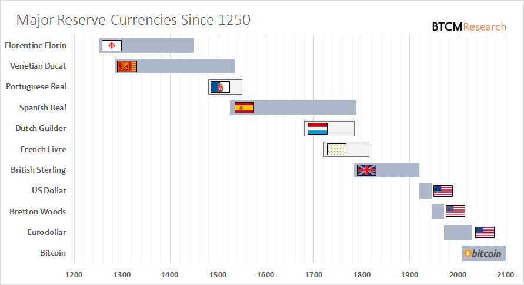

## Table of Contents

## What is a currency trade?

A currency trade is when people buy and sell different kinds of money from different countries. For example, if you want to travel to Japan, you might trade your U.S. dollars for Japanese yen. This happens in a big market called the foreign exchange market, where people trade currencies all the time. The prices of currencies change based on things like how strong a country's economy is or what people think will happen in the future.

People trade currencies for many reasons. Some do it to make money by guessing which currency will become more valuable. Others do it because they need to pay for things in another country, like buying goods or services. Big companies and banks also trade currencies to manage their money better. The foreign exchange market is open 24 hours a day during the week, so trading can happen anytime, anywhere in the world.

## Why are some currency trades considered notable?

Some currency trades are considered notable because they involve very large amounts of money. When big banks or countries trade huge sums, it can affect the value of currencies around the world. For example, if a country decides to sell a lot of its own currency to buy another, it might make its own currency less valuable and the other currency more valuable. These big trades can cause big changes in the market, so people pay attention to them.

Another reason some currency trades are notable is because they happen during important times. For example, if there is a big election or a major economic announcement, the trades that happen around that time can show what people think will happen next. If a lot of people start buying a certain currency, it might mean they think that country's economy will do well. These trades can give clues about what might happen in the future, so they are watched closely by people who study the market.

## Can you explain the basics of foreign exchange markets?

The foreign exchange market, often called the [forex](/wiki/forex-system) market, is where people buy and sell different countries' money. It's like a big global marketplace that's open all the time during the week. People trade currencies because they need to buy things from other countries, or because they think they can make money by guessing which currency will become more valuable. The prices of currencies change all the time, based on things like how well a country's economy is doing or what people think will happen in the future.

The forex market is very big and important because it helps countries and businesses do trade with each other. When you see the price of one currency compared to another, like how many U.S. dollars you need to buy one Euro, that's called an exchange rate. These rates change all the time because of supply and demand. If a lot of people want to buy a certain currency, its value goes up. If fewer people want it, its value goes down. Banks, big companies, and even regular people can trade in the forex market, making it a busy and exciting place.

## What was the Smithsonian Agreement and its impact on currency trades?

The Smithsonian Agreement was a deal made in 1971 by countries around the world. It happened because the old system of trading currencies, called the Bretton Woods system, was not working well anymore. The main idea of the Smithsonian Agreement was to change how currencies were valued. Before, many currencies were tied to the U.S. dollar, and the dollar was tied to gold. But under the new agreement, currencies could move up and down a little bit, within certain limits. This was called a "floating" exchange rate system.

The Smithsonian Agreement had a big impact on currency trades. It made it easier for currencies to change value based on what was happening in the world. This meant that people trading currencies had to pay more attention to things like a country's economy or big news events. The agreement didn't last long, though. By 1973, it fell apart because the limits on how much currencies could move were too tight. After that, many countries moved to a fully floating exchange rate system, where currencies could change value freely. This change made the foreign exchange market more exciting and unpredictable, but also more challenging for traders.

## How did the Plaza Accord affect global currency values?

The Plaza Accord was an agreement made in 1985 by big countries like the United States, Japan, Germany, France, and the United Kingdom. They met at the Plaza Hotel in New York and decided to work together to make the U.S. dollar less valuable. They did this because the dollar was too strong, and it was making it hard for American companies to sell things to other countries. By making the dollar weaker, they hoped to help the U.S. economy and make trade fairer.

The Plaza Accord had a big impact on global currency values. After the agreement, the countries started selling U.S. dollars and buying other currencies like the Japanese yen and the German mark. This made the dollar go down in value quickly. The yen and the mark became much stronger. This change helped American companies sell more things abroad, but it also caused some problems in Japan and Germany because their currencies were now too strong. The Plaza Accord showed how countries can work together to change currency values and affect the world economy.

## What role did George Soros play in the 1992 Black Wednesday?

George Soros played a big role in what is known as Black Wednesday on September 16, 1992. He is a famous investor who made a lot of money by betting against the British pound. At that time, the UK was part of a system called the European Exchange Rate Mechanism (ERM), which tried to keep different European currencies at certain values compared to each other. Soros thought the British pound was too strong and would have to be devalued. So, he borrowed a lot of pounds and sold them, betting that he could buy them back later at a lower price.

On Black Wednesday, Soros's bet paid off. The UK government tried to keep the pound strong by buying it with other currencies, but they couldn't keep up. They spent a lot of money and finally had to let the pound drop in value. This day was called Black Wednesday because it was a big loss for the UK. Soros made about a billion dollars from this trade, which made him famous as "the man who broke the Bank of England." His actions showed how one big investor could affect a whole country's currency.

## What were the consequences of the Asian Financial Crisis for currency trading?

The Asian Financial Crisis started in 1997 and had a big impact on currency trading. It began when Thailand could not keep its currency, the baht, strong anymore. The baht lost a lot of value very quickly, and this made people worried about other countries in Asia too. Many investors started selling their money in these countries, which made their currencies fall even more. This crisis showed that currencies could be very risky, and it made people more careful about trading them. It also led to new rules and ways to watch over the currency markets to try to stop big problems like this from happening again.

After the crisis, countries in Asia started to keep more money in reserve to protect their currencies. They also worked on making their economies stronger and less dependent on foreign money. For currency traders, the crisis meant they had to think more about the risks of trading in emerging markets. They started to use more tools and strategies to protect themselves from big losses. The Asian Financial Crisis changed how people thought about currency trading and made it a more careful and watched activity.

## How did the Swiss National Bank's decision in 2015 to remove the EUR/CHF peg affect markets?

In 2015, the Swiss National Bank made a big decision to stop keeping the Swiss franc (CHF) at a certain value compared to the Euro (EUR). Before this, they had been trying to keep the franc weak by buying a lot of Euros. But on January 15, 2015, they suddenly said they would not do this anymore. This made the Swiss franc become much stronger very quickly. People who were trading currencies were surprised and many lost a lot of money because they were not ready for this change.

The decision by the Swiss National Bank had a big effect on markets all over the world. Many traders had been betting that the Swiss franc would stay weak, so when it got strong, they lost a lot of money. Some companies that did business in Switzerland also had problems because their costs went up. The shock from this decision made people more careful about trading currencies and showed how important it is to be ready for big changes in the market.

## What are some of the largest single-day currency movements in history?

Some of the biggest single-day currency movements happened during big events. One of the biggest was on January 15, 2015, when the Swiss National Bank decided to stop keeping the Swiss franc weak compared to the Euro. This made the Swiss franc jump up in value by about 20% in just one day. People who were trading currencies were not ready for this, and many lost a lot of money.

Another big move happened on September 16, 1992, during what is called Black Wednesday. The British pound dropped a lot in value because the UK could not keep it strong anymore. A famous investor named George Soros made a lot of money by betting that the pound would fall. The pound lost about 15% of its value that day, which was a big shock to the markets.

## How have technological advancements influenced notable currency trades?

Technological advancements have made a big difference in how people trade currencies. With computers and the internet, trading can happen very quickly. People can buy and sell currencies from anywhere in the world, at any time. This means that big trades can happen faster than ever before. For example, when the Swiss National Bank decided to stop keeping the Swiss franc weak in 2015, traders around the world found out about it right away and could react quickly. This made the Swiss franc jump in value a lot in just one day.

Technology also helps traders use more tools to understand the market better. They can use computer programs to see patterns and make guesses about what will happen next. This can make big trades even bigger because traders can move a lot of money based on what the computers tell them. For example, during the Asian Financial Crisis, traders used technology to see that currencies in Asia were in trouble and quickly sold them, which made the crisis worse. So, technology has made currency trading faster and more powerful, but it can also make the market more risky.

## What are the key strategies used by expert traders during significant currency events?

Expert traders use several key strategies during big currency events. One important strategy is to stay informed. They keep an eye on news and economic reports to know when big changes might happen. For example, if a country is about to make a big announcement, traders will be ready to act quickly. They also use tools like charts and computer programs to see patterns and predict what might happen next. This helps them decide when to buy or sell a currency.

Another strategy is to manage risk carefully. Expert traders know that big events can make the market very unpredictable. So, they use things like stop-loss orders to limit how much money they can lose. They might also spread their money across different currencies to not put all their eggs in one basket. This way, if one currency goes down a lot, they won't lose everything. By being prepared and careful, expert traders can take advantage of big currency events while trying to keep their losses small.

## Can you analyze the long-term effects of major currency interventions on global economies?

Major currency interventions can have big effects on global economies over time. When a country or a group of countries decides to change the value of their currency, it can make their products cheaper or more expensive for other countries. For example, if a country makes its currency weaker, its exports become cheaper, which can help its businesses sell more things abroad. This can make the country's economy grow faster. But it can also cause problems for other countries. If many countries start doing this, it can lead to a "currency war," where everyone tries to make their currency weaker to help their own economy, but this can make the whole world's economy less stable.

Over the long term, these interventions can also change how people see a country's economy. If a country keeps making its currency weaker, other countries might start to trust it less. They might think the country is not managing its money well. This can make it harder for the country to borrow money or attract investments. On the other hand, if a country makes its currency stronger, it might attract more investment because people think the country's economy is doing well. But this can also make its exports more expensive, which can hurt its businesses. So, while currency interventions can help in the short term, they need to be used carefully to avoid big problems in the long run.

## References & Further Reading

[1]: Bergstra, J., Bardenet, R., Bengio, Y., & Kégl, B. (2011). ["Algorithms for Hyper-Parameter Optimization."](https://dl.acm.org/doi/10.5555/2986459.2986743) Advances in Neural Information Processing Systems 24.

[2]: ["Advances in Financial Machine Learning"](https://www.amazon.com/Advances-Financial-Machine-Learning-Marcos/dp/1119482089) by Marcos Lopez de Prado

[3]: ["Evidence-Based Technical Analysis: Applying the Scientific Method and Statistical Inference to Trading Signals"](https://www.amazon.com/Evidence-Based-Technical-Analysis-Scientific-Statistical/dp/0470008741) by David Aronson

[4]: ["Machine Learning for Algorithmic Trading"](https://github.com/stefan-jansen/machine-learning-for-trading) by Stefan Jansen

[5]: ["Quantitative Trading: How to Build Your Own Algorithmic Trading Business"](https://www.amazon.com/Quantitative-Trading-Build-Algorithmic-Business/dp/1119800064) by Ernest P. Chan