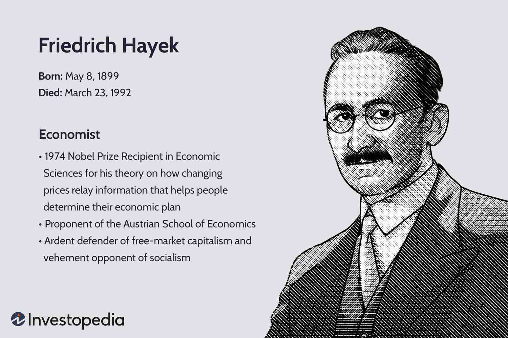

The Nobel Prize in Economics is a prestigious recognition awarded to individuals whose contributions have significantly influenced economic thought and practice worldwide. These honored economists expand our understanding of complex market dynamics and enrich the theoretical frameworks upon which modern financial practices are built. By dissecting economic phenomena and offering new insights, these theories lay the groundwork for innovations across financial systems, enhancing our ability to interpret market behavior and optimize decision-making processes.

Algorithmic trading represents one of the most transformative advances in financial markets. Leveraging economic theories and cutting-edge technologies, it employs advanced mathematical models and algorithms to execute trades at speeds and frequencies that surpass human capability. This evolution in trading practices underscores the profound impact that theoretically driven, technology-enabled mechanisms can have on market operations.



This article focuses on exploring the intersection between economic theories recognized by the Nobel Prize and their application within algorithmic trading. By examining this synergy, we aim to provide insights into how these groundbreaking theories contribute to enhancing the effectiveness and efficiency of modern trading systems. Through their application, traders and financial institutions can achieve greater precision, minimize risks, and maximize returns, ultimately driving innovation in the financial sector.

## Table of Contents

## Nobel Prize-Winning Economic Theories and Their Importance

The Nobel Prize in Economics, formally known as the Sveriges Riksbank Prize in Economic Sciences in Memory of Alfred Nobel, plays a pivotal role in recognizing and encouraging groundbreaking contributions in the field of economics. Since its establishment in 1969, the prize has acknowledged a wide spectrum of economic research that has profoundly impacted our understanding of markets, behaviors, and financial systems. These contributions have not only advanced theoretical frameworks but also significantly influenced real-world economic practices and policies.

One of the most influential economic theories recognized by the Nobel Prize is Game Theory. Pioneers like John Nash, who shared the award in 1994, developed foundational concepts including the Nash Equilibrium, which describes a stable state in competitive situations where no participant can gain by solely changing their strategy if others keep theirs unchanged. This theory is instrumental in analyzing strategies in competitive markets and has applications ranging from auction designs to antitrust regulations.

Behavioral Economics, another key theory, was brought to prominence with the awarding of the Nobel Prize to Daniel Kahneman in 2002. This field blends insights from psychology with economic theory to explore how cognitive biases and emotional factors influence market decisions and economic outcomes. By understanding phenomena like loss aversion, overconfidence, and heuristics, behavioral economics challenges the assumption of full rationality in traditional economic models, thereby reshaping economic policy development and corporate strategy to better account for actual human behavior.

Market Microstructure, though not a singular award-winning theory, encompasses the breadth of research focused on the processes and outcomes of exchanging assets under explicit trading rules. Robert F. Engle and Clive Granger, who won the prize in 2003, contributed to the understanding of time-series econometrics, which plays a critical role in analyzing high-frequency data common in market microstructure studies. The insights gained from this research are vital for improving market [liquidity](/wiki/liquidity-risk-premium) and transparency, and for developing more efficient and resilient trading systems.

These economic theories are invaluable not just for their theoretical contributions but for their practical applications in crafting policies and shaping financial systems worldwide. Game Theory informs competitive business strategies and regulatory frameworks. Behavioral Economics provides a more nuanced understanding of consumer behavior, influencing policy measures related to health, finance, and risk management. Meanwhile, Market Microstructure research underpins the development of efficient trading systems, essential for the smooth functioning of modern financial markets.

Collectively, these Nobel Prize-winning theories exemplify the transformative impact of economic research on global financial and economic landscapes. By enhancing our understanding of market mechanics and human behavior, these theories help foster more robust, efficient, and equitable financial systems. As financial markets evolve, the insights from these theories continue to guide policymakers, businesses, and investors in adapting to new challenges and opportunities.

## Algorithmic Trading: A Modern Financial Phenomenon

Algorithmic trading has become a prevalent component of modern financial markets, leveraging advanced technology to enhance trading processes. By deploying algorithms—precise sets of rules or instructions for calculations—market participants can execute orders with minimal human intervention. This automation facilitates strategies that are capable of analyzing vast amounts of market data in real time, thus transforming trading dynamics.

One primary aspect of [algorithmic trading](/wiki/algorithmic-trading) is high-frequency trading ([HFT](/wiki/high-frequency-trading-strategies)), which involves the execution of a large number of orders at extremely fast speeds. These strategies often capitalize on minute price discrepancies that exist for very short periods, typically seconds or milliseconds. The essence of HFT lies in rapid access to the [order book](/wiki/order-book-trading-strategies) and the speedy execution of trades to achieve small profit margins on numerous transactions.

The mechanics of algorithmic trading involve the use of sophisticated software and algorithms that adhere to predefined criteria such as timing, price, and quantity. These rules can incorporate various types of data inputs, including technical indicators, [fundamental analysis](/wiki/fundamental-analysis), and even news sentiment analysis. An example of a simple algorithmic trading strategy in Python might look like this:

```python
import yfinance as yf  # For more datasets, visit: https://paperswithbacktest.com/datasets
import numpy as np

# Fetch historical stock data
data = yf.download('AAPL', start='2023-01-01', end='2023-10-01', interval='1d')

# Calculate simple moving averages
data['SMA_50'] = data['Close'].rolling(window=50).mean()
data['SMA_200'] = data['Close'].rolling(window=200).mean()

# Generate signals: Buy when SMA_50 crosses above SMA_200, Sell otherwise
data['Signal'] = np.where(data['SMA_50'] > data['SMA_200'], 1, 0)

# Compute trading positions
data['Position'] = data['Signal'].diff()

# Display results
print(data[['Close', 'SMA_50', 'SMA_200', 'Signal', 'Position']].tail())
```

This code exemplifies a basic moving average crossover strategy, a common algorithmic approach where buying signals trigger when a short-term average surpasses a long-term average.

Algorithmic trading offers several advantages. It enhances speed and efficiency, allowing for immediate reaction to market events and thus taking advantage of fleeting opportunities. This swift execution reduces human error associated with manual trading, ensuring consistency and adherence to strategy. Moreover, it contributes to market liquidity, making it easier to buy and sell securities.

However, algorithmic trading is not without challenges. Market [volatility](/wiki/volatility-trading-strategies) can be exacerbated by algorithms making rapid and large trades, sometimes leading to "flash crashes," where markets can plunge and recover suddenly. Additionally, ethical concerns arise regarding the fairness of HFT practices, as they may give undue advantage to those able to afford the technology. There are also worries about market manipulation and the potential systemic risks posed by wide-scale algorithmic trading.

Successful algorithmic trading systems must balance the speed and precision of technology with the complexities and unpredictability of market behavior. While effectively reducing human errors, the reliance on technology necessitates robust risk management protocols to mitigate unforeseen anomalies within trading operations.

In conclusion, algorithmic trading, especially in its high-frequency form, represents a significant technological advancement in financial markets, combining automation with sophisticated analysis tools to enhance trading proficiency. While offering marked benefits, it also demands meticulous strategy design and ethical considerations to navigate the intricate landscape of modern trading environments.

## Economic Theories and Their Role in Algorithmic Trading

Nobel Prize-winning economic theories significantly enhance algorithmic trading strategies by providing foundational insights into market dynamics and human behavior. These theories shape the design, implementation, and optimization of trading algorithms in several ways.

Game Theory, awarded the Nobel Prize in 1994, is a crucial tool for developing competitive trading algorithms. It provides a framework for understanding strategic interactions among market participants. Traders employ concepts from Game Theory, such as Nash Equilibrium, to anticipate the actions of others and to optimize their strategies accordingly. For instance, in a competitive trading environment, algorithms might use repeated game strategies to better predict rival algorithms’ actions in order to maximize profits. This strategic anticipation allows traders to either undercut competitors or collaborate tacitly in achieving stable market positioning.

Behavioral Economics, recognized by the Nobel Committee in 2002 with the award to Daniel Kahneman, offers insights into the psychological factors influencing market behavior. Traders apply Behavioral Economics to create adaptive algorithms that respond effectively to market sentiment and psychological biases. Algorithms can be designed to detect and exploit patterns arising from cognitive biases such as overconfidence or risk aversion. For example, algorithms might adjust trading strategies based on the recognition of herd behavior during market bubbles or panics, enhancing their ability to capitalize on mispriced assets.

Market Microstructure theory, acknowledged through various Nobel Prizes including that for analyses of market microstructures by Robert F. Engle and Clive W. J. Granger in 2003, is vital for understanding the intricacies of high-frequency trading (HFT) and price formation. This theory explores the mechanisms through which securities prices form and evolve, which is critical for HFT algorithms aiming to execute trades extremely quickly. High-frequency traders leverage insights from Market Microstructure to optimize order execution and manage latency. These algorithms analyze order book dynamics and liquidity levels to determine optimal trade execution strategies, reducing transaction costs and capitalizing on momentary [arbitrage](/wiki/arbitrage) opportunities.

In conclusion, these Nobel Prize-winning economic theories not only inform but also actively improve the strategic deployment of algo trading systems. They facilitate the development of sophisticated trading algorithms capable of navigating complex market environments and adapting to rapid changes, thereby enhancing overall trading performance.

## Case Studies: Real-World Applications

A notable example in the domain of algorithmic trading is the quant-driven firm Renaissance Technologies, founded by Dr. James Simons, a former mathematician and quantitative analyst. The firm is renowned for developing complex statistical models that leverage economic theories, especially those recognized by the Nobel Prize, to predict market trends and execute trades with high precision.

One significant economic theory utilized by Renaissance Technologies involves Game Theory, pioneered and refined by John Nash and subsequent Nobel laureates. Game Theory provides a framework for modeling competitive situations where the outcomes depend on the actions of multiple [agents](/wiki/agents), each possessing potentially conflicting interests. In algorithmic trading, Game Theory aids in crafting strategies that anticipate and counteract market moves by competitors, thereby enhancing trade execution and profitability.

Moreover, Behavioral Economics, brought to prominence by Nobel laureates such as Daniel Kahneman and Richard Thaler, plays a critical role in understanding the psychological influences on investor behavior. Renaissance Technologies incorporates insights from Behavioral Economics to design algorithms that detect patterns reflective of irrational market behaviors, such as herding or overconfidence, allowing for adaptive responses that capitalize on these inefficiencies.

The firm's application of Market Microstructure theory, exemplified in the work of Robert Engle, another Nobel laureate, is integral to its high-frequency trading strategy. Market Microstructure examines the processes and outcomes of exchanging assets under explicit trading rules, providing a detailed understanding of price formation and liquidity. Renaissance Technologies employs these concepts to optimize the timing and pricing of trades, minimizing market impact and reducing transaction costs.

The impact of these Nobel-winning economic theories on Renaissance Technologies is evident in their consistently high returns, even during volatile market periods. These theories have not only enhanced the firm's trade execution efficiencies but also contributed to its strategic advantage in the highly competitive world of algorithmic trading.

From the integration of economic insights into trading algorithms at Renaissance, several lessons emerge. Firstly, the interdisciplinary approach—combining economics, mathematics, and technology—has proven indispensable in achieving superior trading results. Secondly, continuous adaptation and refinement of models are necessary to maintain effectiveness in dynamically changing markets. Lastly, embracing the unpredictability of human behavior through Behavioral Economics can uncover opportunities that purely technical analysis might overlook.

The future potential for collaboration between economic research and algorithmic trading remains vast. Emerging areas, such as [machine learning](/wiki/machine-learning) and [artificial intelligence](/wiki/ai-artificial-intelligence), present promising avenues for integrating economic theories in more sophisticated ways, potentially leading to the next generation of innovative trading algorithms. As economic research continues to reveal new insights into market dynamics and human behavior, algorithmic trading stands poised to benefit significantly, reinforcing the symbiotic relationship between these fields.

## The Future of Economic Theories and Algorithmic Trading

Emerging trends in economic research are continuously shaping the landscape of algorithmic trading, promising to lead to further advancements and refinements in trading strategies. One such trend is the increasing attention on machine learning models that incorporate economic theories to predict market movements. These models use vast amounts of data to enhance the precision and reliability of trading algorithms. For instance, advancements in sentiment analysis can allow algorithms to assess market sentiment from news sources and social media, integrating elements of behavioral economics to anticipate market shifts.

Potential innovations in algorithmic trading could arise from the integration of neural networks and [deep learning](/wiki/deep-learning) techniques with economic theories. These technologies have the capacity to handle complex data structures and identify patterns that traditional models might miss. A [neural network](/wiki/neural-network) model that understands the subtleties of Game Theory could, for instance, provide more adaptive strategies in competitive markets. This integration offers the potential for developing algorithms that can adapt dynamically and make autonomous decisions with enhanced accuracy.

Speculations surrounding future Nobel Economic Prize winners suggest that research focusing on the intersection of technology, data analytics, and economic behavior could have substantial impacts on the financial sector. Innovations such as quantum computing are anticipated to revolutionize trading speed and complexity, enabling the analysis of multiple trading strategies simultaneously. Nobel Prize recognition of breakthroughs in these areas could validate and accelerate their application in financial markets.

The ongoing importance of interdisciplinary approaches is underscored by the collaboration between economists, computer scientists, and financial experts. Such collaborations are crucial in transforming theoretical insights into practical tools for algorithmic trading. As economic theories evolve, incorporating these insights into sophisticated algorithms will drive both economic and technological advancements, enhancing market efficiency and transparency. This synergy promises a future where breakthroughs in economic theory continue to inform and transform the methodologies employed in algorithmic trading.

## Conclusion

The Nobel Prize in Economics has consistently spotlighted theories that underscore the complexities and advancements within economic paradigms, which have practical implications across various sectors. In the specific context of algorithmic trading, these award-winning economic theories have provided a robust framework that enhances market efficiency and sharpens decision-making processes. Game Theory, Behavioral Economics, and Market Microstructure, among others, have been instrumental in refining trading algorithms that are responsive and adaptive to market conditions.

Game Theory, for instance, aids in the formulation of trading strategies that anticipate competitor actions and market reactions. This strategic foresight is crucial in developing robust algorithmic systems capable of sustaining profitability amidst varying market dynamics. Similarly, insights from Behavioral Economics allow for the development of algorithms that can interpret and adapt to market sentiment and psychological factors, leading to more accurate predictions of market movements.

Furthermore, the theory of Market Microstructure has contributed significantly to the understanding of how prices are formed in markets, thereby optimizing high-frequency trading operations to serve both liquidity provisions and price discovery processes efficiently. This theoretical foundation empowers traders to execute orders with optimal timing and minimal market impact, thus enhancing overall market stability and efficiency.

The continuous evolution of financial markets is strongly influenced by these academic insights, which provide the underlying principles that guide technological advancements in trading systems. As economic theories evolve, they continuously offer new perspectives and methodologies that drive innovation in algorithmic trading.

The relationship between economic theory and practical applications in finance is characterized by a symbiotic synergy that propels forward the capabilities of financial markets. This evolving partnership not only reflects the dynamic nature of financial systems but also highlights the critical role of interdisciplinary research in shaping the future of finance. As these theories and their applications grow in complexity and scope, they will invariably contribute to the deeper understanding and evolution of financial markets, underscoring their continued relevance in contemporary and future financial landscapes.

## References & Further Reading

[1]: Bergstra, J., Bardenet, R., Bengio, Y., & Kégl, B. (2011). ["Algorithms for Hyper-Parameter Optimization."](https://dl.acm.org/doi/10.5555/2986459.2986743) Advances in Neural Information Processing Systems 24.

[2]: ["Advances in Financial Machine Learning"](https://www.amazon.com/Advances-Financial-Machine-Learning-Marcos/dp/1119482089) by Marcos Lopez de Prado

[3]: ["Evidence-Based Technical Analysis: Applying the Scientific Method and Statistical Inference to Trading Signals"](https://www.amazon.com/Evidence-Based-Technical-Analysis-Scientific-Statistical/dp/0470008741) by David Aronson

[4]: ["Machine Learning for Algorithmic Trading"](https://github.com/stefan-jansen/machine-learning-for-trading) by Stefan Jansen

[5]: ["Quantitative Trading: How to Build Your Own Algorithmic Trading Business"](https://www.amazon.com/Quantitative-Trading-Build-Algorithmic-Business/dp/1119800064) by Ernest P. Chan