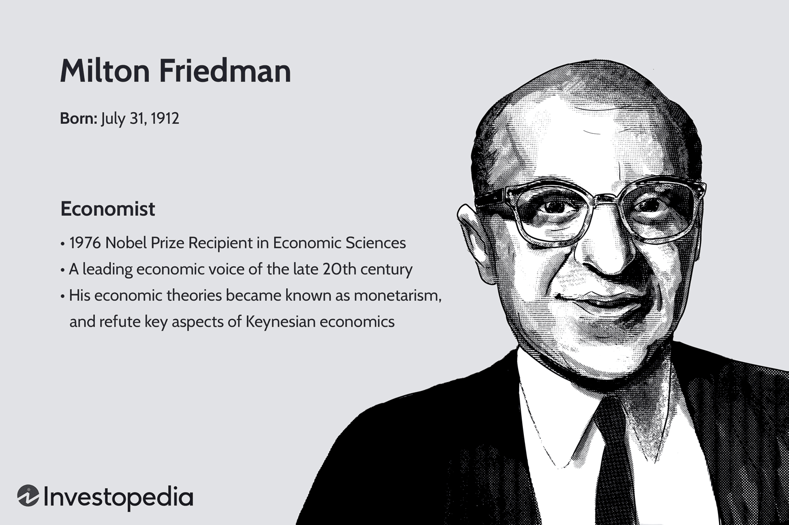

## Table of Contents

## What is the significance of the Nobel Prize in Economic Sciences?

The Nobel Prize in Economic Sciences is a very important award. It is given every year to people who have done great work in economics. This prize helps to show the world that economics is important. It also helps to encourage more people to study and work in this field. The prize started in 1968, and it is given by the same group that gives out the other Nobel Prizes.

Winning the Nobel Prize in Economic Sciences can change a person's life. It makes them famous and respected all over the world. Their ideas and work get more attention, and this can help to make the world a better place. For example, if someone wins for their work on how to fight poverty, more people might start using their ideas to help poor people. So, the prize not only honors the winners, but it also helps to spread good ideas and make a positive impact on society.

## Who was the first economist to win the Nobel Prize and what was their theory?

The first economist to win the Nobel Prize in Economic Sciences was Ragnar Frisch and Jan Tinbergen in 1969. They shared the prize because they both did important work in economics. Ragnar Frisch was from Norway, and Jan Tinbergen was from the Netherlands.

Ragnar Frisch helped to create a new way to study economics using math and [statistics](/wiki/bayesian-statistics). He called this new way "econometrics." Econometrics helps economists to use numbers and data to understand how the economy works. Jan Tinbergen worked on how to use math to make economic plans and policies. He showed how governments could use math to make better decisions about things like jobs and money. Both of their ideas have been very important for economics ever since.

## Can you explain Milton Friedman's theory of monetarism?

Milton Friedman's theory of monetarism focuses on the role of money supply in the economy. He believed that the amount of money in an economy is the main thing that affects how much prices go up or down, which is called inflation or deflation. Friedman thought that if the government or the central bank controls the money supply carefully, they can keep the economy stable. He said that if there is too much money, prices will go up too fast, and if there is too little money, prices might go down, which can cause problems.

Friedman also believed that the economy works best when the government does not interfere too much. He thought that markets should be free to work on their own, without a lot of rules and controls from the government. According to Friedman, if the money supply grows at a steady rate, the economy will grow in a healthy way. This idea was different from other economists who thought the government should do more to control the economy. Friedman's ideas about monetarism have been very influential and are still talked about today.

## What are the key points of John Maynard Keynes' economic theory?

John Maynard Keynes' economic theory, known as Keynesian economics, focuses on how governments can help the economy during tough times. He believed that when the economy is not doing well, like during a recession, the government should spend more money to help. This spending can create jobs and get people to start buying things again. Keynes thought that if people are not spending enough, the economy can get stuck in a bad place. So, the government needs to step in and spend money to get things moving again.

Another important part of Keynes' theory is about saving and spending. He said that when people save too much and spend too little, it can hurt the economy. If everyone is saving their money instead of spending it, businesses will not make as much money, and they might have to lay off workers. This can make the economy even worse. Keynes suggested that the government should encourage spending, maybe by lowering taxes or giving people money to spend. His ideas have been very important for how governments around the world try to manage their economies.

## How does Friedrich Hayek's theory of spontaneous order influence economic policy?

Friedrich Hayek's theory of spontaneous order suggests that complex systems, like economies, can work well without anyone planning them. He believed that when people are free to make their own choices, they create a kind of order naturally. This order comes from the actions of many people, each doing what they think is best for themselves. Hayek thought that trying to control the economy too much, like with strict government rules, can mess up this natural order. Instead, he believed that markets should be free to work on their own, with as little interference as possible.

Hayek's ideas have influenced economic policy by encouraging less government control over the economy. Many people who follow his ideas believe that if the government stays out of the way, the economy will find its own balance. This has led to policies that focus on free markets, where businesses and people can make their own decisions without a lot of rules. Hayek's theory has been important in shaping how some countries think about economic freedom and the role of the government in the economy.

## What is the contribution of Amartya Sen to welfare economics?

Amartya Sen has made big contributions to welfare economics, especially with his ideas about how to measure and improve people's well-being. He believes that we should look at more than just money when we try to understand if people are doing well. Sen thinks that things like being healthy, having a good education, and being able to do things you value are very important. He came up with the idea of "capabilities," which means looking at what people are actually able to do and be. This way of thinking helps us see that even if someone has money, they might not be able to live a good life if they are sick or not educated.

Sen's work has changed how people think about development and fighting poverty. He helped create the Human Development Index, which is a way to measure how well countries are doing by looking at health, education, and income together. His ideas have been used by governments and organizations around the world to make better policies that help people live better lives. Sen's focus on capabilities and well-being has shown that economics is not just about money, but about making sure everyone has the chance to live a good life.

## How does Robert Solow's growth model explain economic development?

Robert Solow's growth model explains how economies grow over time. He said that economic growth comes from three main things: how much people work, how much stuff they have to work with (like machines and buildings), and how well they use what they have. Solow thought that just adding more workers or more stuff isn't enough. He said that new ideas and better ways of doing things are really important. These new ideas help people use their stuff more efficiently, which makes the economy grow faster.

In Solow's model, he also talked about something called "technological progress." This means that as people come up with new inventions and better ways to do things, the whole economy can grow. Solow showed that even if the number of workers and the amount of stuff stays the same, the economy can still grow if technology gets better. His model helped economists understand that to keep growing, countries need to keep coming up with new ideas and ways to do things better.

## What are the implications of Joseph Stiglitz's work on asymmetric information?

Joseph Stiglitz's work on asymmetric information looks at what happens when one person in a deal knows more than the other. He showed that this can cause big problems in markets. For example, if a seller knows more about a product than the buyer, the buyer might not trust the seller. This can make the buyer less likely to buy, or they might only buy if the price is very low. Stiglitz called this problem "adverse selection." It can make markets work less well because people are scared to make deals.

Stiglitz also talked about another problem called "moral hazard." This happens after a deal is made, when one person might do something the other person doesn't know about. For example, if a bank gives someone a loan, the borrower might take more risks because they know the bank will lose money if they fail, not them. Stiglitz's ideas have helped people understand why some markets don't work as well as they could. His work has shown that governments and businesses need to find ways to share information better and reduce these problems to make markets work better for everyone.

## Can you describe the impact of Elinor Ostrom's work on the management of common resources?

Elinor Ostrom's work changed how people think about managing common resources, like forests, water, and fisheries. She showed that communities can manage these resources well without the government or private companies taking over. Ostrom studied many different places and found that when people work together and make their own rules, they can take care of shared resources better than if someone else tries to control everything. Her ideas went against the old belief that common resources would always be overused and ruined, which is called the "tragedy of the commons."

Ostrom's research showed that successful management of common resources often involves clear boundaries, rules that everyone agrees on, and ways to make sure people follow those rules. She also found that it's important for communities to be able to change their rules as things change, and to have ways to solve problems when they come up. Her work has helped many groups around the world find better ways to manage their shared resources, making sure they can be used for a long time without being destroyed.

## How does Paul Krugman's theory of New Trade Theory affect international trade?

Paul Krugman's New Trade Theory changed how people think about why countries trade with each other. Before Krugman, many people believed that countries traded because they were good at making different things. But Krugman said that trade can also happen because companies want to sell to more people. He explained that when companies can sell to more people in different countries, they can make more money. This can help them grow bigger and make things cheaper, which is good for everyone. Krugman's ideas showed that even if countries make the same things, they can still benefit from trading with each other.

Krugman's theory also talks about something called "economies of scale." This means that the more a company makes of something, the cheaper it can be to make each piece. When companies can sell to more countries, they can make more of their products and save money. This can lead to more trade and help countries grow their economies. Krugman's New Trade Theory has helped people understand that trade is not just about what countries are good at, but also about how companies can grow and save money by selling to more people around the world.

## What is the significance of Daniel Kahneman's work on behavioral economics?

Daniel Kahneman's work on behavioral economics has changed how we think about how people make choices. He showed that people don't always make decisions in a smart or logical way. Instead, they often use shortcuts and can be influenced by things like their feelings or what they see around them. Kahneman called these shortcuts "heuristics" and showed that they can lead to mistakes. His work helped start a new field called behavioral economics, which looks at how psychology affects the choices people make about money and other things.

Kahneman's ideas have been very important for many areas, like how governments make rules and how companies sell things. For example, if people often make mistakes because they use shortcuts, governments can make rules that help people make better choices. Companies can also use what Kahneman learned to make their products more appealing. His work has shown that understanding how people really think and feel can help make better policies and products. This has made a big difference in how we try to help people make good decisions.

## How does the work of Jean Tirole on market power and regulation influence modern economic policy?

Jean Tirole's work on market power and regulation has helped shape how governments and companies think about big businesses. He studied how big companies can use their size to control markets and make it hard for smaller companies to compete. Tirole showed that when one company is much bigger than others, it can set prices high and keep other companies out. This can be bad for customers because they might have to pay more for things. Tirole's ideas have helped governments make rules to stop big companies from using their power in unfair ways. These rules help make sure that markets stay open and fair for everyone.

Tirole also looked at how governments can use rules to help markets work better. He explained that good rules can help stop companies from doing things that hurt the economy or the environment. For example, rules can make sure companies don't pollute too much or treat their workers badly. Tirole's work has shown that smart rules can help balance the power of big companies and protect people. His ideas have influenced many countries to make better rules that help their economies grow in a fair and healthy way.

## References & Further Reading

[1]: Bergstra, J., Bardenet, R., Bengio, Y., & Kégl, B. (2011). ["Algorithms for Hyper-Parameter Optimization."](https://dl.acm.org/doi/10.5555/2986459.2986743) Advances in Neural Information Processing Systems 24.

[2]: ["Advances in Financial Machine Learning"](https://www.amazon.com/Advances-Financial-Machine-Learning-Marcos/dp/1119482089) by Marcos Lopez de Prado

[3]: ["Evidence-Based Technical Analysis: Applying the Scientific Method and Statistical Inference to Trading Signals"](https://www.amazon.com/Evidence-Based-Technical-Analysis-Scientific-Statistical/dp/0470008741) by David Aronson

[4]: ["Machine Learning for Algorithmic Trading"](https://github.com/stefan-jansen/machine-learning-for-trading) by Stefan Jansen

[5]: ["Quantitative Trading: How to Build Your Own Algorithmic Trading Business"](https://www.amazon.com/Quantitative-Trading-Build-Algorithmic-Business/dp/1119800064) by Ernest P. Chan