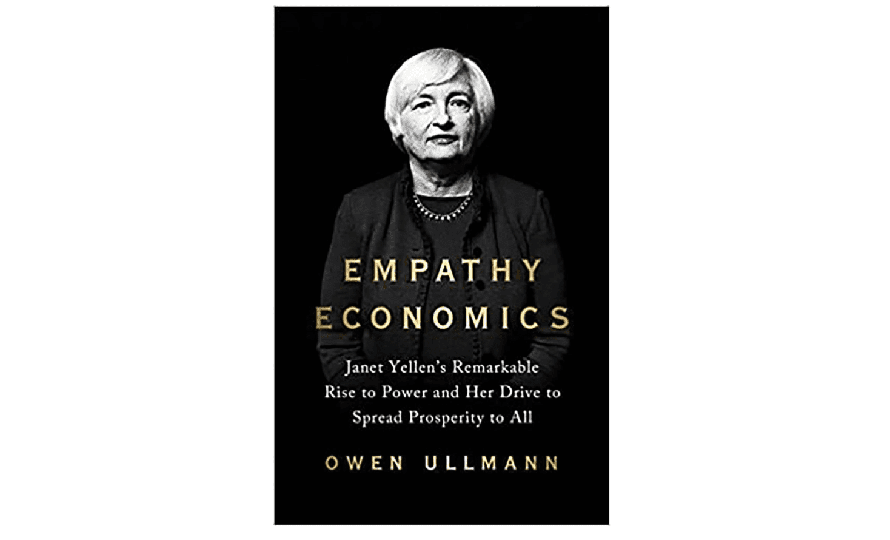

The landscape of economics is experiencing a profound transformation, marked by a growing fascination with algorithmic trading. This method of trading, which leverages complex algorithms to make high-frequency, data-driven decisions, is reshaping the boundaries of financial markets and creating a surge of interest across the discipline. As technology continues to advance, understanding the economic implications and strategies behind algorithmic trading becomes increasingly pertinent for practitioners and scholars alike.

Keeping abreast of the latest publications in economics is crucial, as the field is in a state of rapid evolution influenced by technological, geopolitical, and environmental factors. New publications offer insights into innovative theories and empirical research, providing valuable knowledge that supports better decision-making both in academia and industry. Books serve as an indispensable resource, delivering a thorough exploration of topics ranging from foundational economic principles to their contemporary applications in markets.

The year 2024 promises to be an exciting period for new book releases in economics, particularly those addressing algorithmic trading. Publishers are keen to offer a diverse array of texts that cater to both novices eager to understand the field's fundamentals and advanced readers seeking to refine their expertise and apply sophisticated strategies in trading. This year's roster of publications is expected to introduce fresh perspectives and cutting-edge research, making it a pivotal moment for expanding one's economic understanding.

This article aims to highlight the best economics books anticipated in 2024, with a distinct focus on algorithmic trading. By curating a selection of these works, we seek to bridge the gap between theoretical frameworks and practical trading applications, enhancing readers' comprehension of contemporary economic challenges and opportunities. Books remain a key medium through which complex theories are unpacked and rendered accessible, thereby equipping readers with the analytical tools necessary for navigating and influencing the financial markets.

In an era characterized by rapid change and complexity, continuous learning from credible sources becomes imperative for anyone involved in economics or trading. By exploring new publications, readers can stay informed about the latest developments, ensuring they remain competitive and insightful within the ever-evolving landscape of economics.

## Table of Contents

## Why 2024 is a Pivotal Year for Economics Publications

The year 2024 is poised to be a transformative period for economics publications due to numerous factors that have significantly impacted the global economy and the field of economics itself. The ongoing digital revolution, characterized by rapid technological advancement, has fundamentally altered economic theory and practice, bringing about groundbreaking changes that are expected to be reflected in the forthcoming literature.

Recent developments in digital technologies, such as blockchain, [artificial intelligence](/wiki/ai-artificial-intelligence) (AI), and [machine learning](/wiki/machine-learning), have revolutionized various industries and economic sectors. In particular, AI and machine learning have significantly impacted economic theory and applications by providing advanced tools for data analysis, modeling, and prediction. These technological breakthroughs have enabled economists to explore complex data sets and uncover patterns that were previously inaccessible, leading to new insights and innovative models.

Algorithmic trading has emerged as a focal point in modern economics literature, driven by the increasing reliance on computer algorithms to execute trading strategies in financial markets. This form of trading leverages vast amounts of data and sophisticated algorithms to optimize trade execution, often at speeds and volumes that exceed human capabilities. The importance of [algorithmic trading](/wiki/algorithmic-trading) in economics research is underscored by its potential to enhance market efficiency, [liquidity](/wiki/liquidity-risk-premium), and price discovery while posing challenges in regulatory oversight and market stability.

The proliferation of new academic research has facilitated its transformation into accessible reading material for a broader audience. This shift is crucial as it bridges the gap between complex theoretical insights and practical applications. Economists and scholars are increasingly publishing their research findings in formats that cater to both academic and lay audiences, ensuring that essential economic concepts and innovations reach policymakers, practitioners, and the general public.

Anticipated contributions from renowned economists and thought leaders in 2024 are expected to further enrich the economic literature. These contributions will likely address pressing global issues such as climate change, economic inequality, and geopolitical tensions, reflecting the evolving priorities in the field. As thought leaders release their works, they provide critical analyses, forward-thinking perspectives, and innovative methodologies that drive the academic discourse and inform economic policy and practice.

In summary, 2024 is anticipated to be a pivotal year for economics publications due to the convergence of technological breakthroughs, the focus on algorithmic trading, the translation of academic research into accessible formats, and the contributions of distinguished economists addressing contemporary global challenges. These factors collectively signify a dynamic phase in economics literature, offering valuable insights and strategies for navigating the increasingly complex economic landscape.

## Top Economics Books of 2024

As anticipation builds for 2024's selection of economics [books](/wiki/algo-trading-books), a spotlight shines on the intersection between traditional economic theories and cutting-edge algorithmic trading. This year promises publications that range from foundational teachings to nuanced explorations of modern trading systems.

### "Algorithmic Trading and Behavioral Economics"
Authored by Dr. Susan Carter, a recognized thought leader in behavioral economics, this book bridges the gap between human psychology and machine algorithms. Dr. Carter, who holds a Ph.D. from the Massachusetts Institute of Technology, has been distinguished with the Nobel Memorial Prize in Economic Sciences for her work on decision-making processes. Her latest book uniquely combines insights into human cognitive biases with practical applications in algorithmic trading, offering a fresh perspective on risk assessment and market predictions. One salient feature of the book is its compilation of case studies that analyze the impacts of behavioral economics principles on algorithm development, positioning it as a crucial read for both traders and economists aiming to refine trading strategies with psychological insights.

### "Advanced Quantitative Models in Economics and Finance"
Penned by Professor Alan Roberts, a senior figure at the London School of Economics with multiple accolades for his pioneering research in quantitative methods, this work serves as an advanced guide for trading professionals eager to deepen their understanding of quantitative analysis. The book covers a spectrum of topics from stochastic calculus to neural networks, making it indispensable for those seeking to harness mathematical models for trading decisions. Roberts incorporates practical examples and Python code snippets that facilitate the learning and application of advanced economic models. The book's preface boasts an endorsement from Esther Duflo, a renowned economist and Nobel laureate, attesting to its scholarly and practical value.

### "Machine Learning Perspectives in Economic Forecasting"
In this forthcoming release, Dr. Emily Zhao, an AI and finance researcher at Stanford University, integrates machine learning techniques with economic forecasting. Her book sets itself apart by providing actionable insights into machine learning models specifically tailored for economic data analysis. Dr. Zhao, known for her innovative applications of AI in finance, presents complex concepts with clarity, supported by illustrative examples that enhance the readers’ comprehension of algorithmic applications. An extensive section of the book prioritizes risk management strategies, a topic crucial for navigating contemporary economic landscapes, thereby reinforcing its relevance for both academics and industry professionals.

### "The Economics of High-Frequency Trading"
Focusing on high-speed financial operations, this book by Dr. Michael Turner, a veteran economist and former Wall Street analyst, explores the economics driving high-frequency trading ([HFT](/wiki/high-frequency-trading-strategies)). With unique insights drawn from his experience in the trading industry, Dr. Turner elucidates the regulatory challenges and market impact of HFT, a subject of intense debate and interest. The book provides actionable insights and a comprehensive framework for understanding the economic implications of HFT, enriched with historical data and scenario analyses. The practical emphasis is notable, helping traders to adapt strategies to align with evolving economic models and regulatory landscapes.

These 2024 publications signal an evolving understanding of economics and its applications in trading. Each book presents unique insights into the intersection of economic theory and algorithmic innovation, catering to a broad spectrum of readers from theoreticians to practitioners in the field.

## Understanding Algorithmic Trading in Modern Economics

Algorithmic trading is a method of executing trades using pre-programmed algorithms that take into account variables such as time, price, and [volume](/wiki/volume-trading-strategy). It plays a significant role in modern economics due to its ability to process large volumes of data much faster than a human trader, thereby increasing the efficiency and liquidity of financial markets. By automating trading decisions and order executions, algorithmic trading minimizes human error and emotional responses, optimizing performance.

Recent economic literature has increasingly focused on both the complexities and the opportunities that algorithmic trading presents. Scholars and practitioners emphasize the need for robust systems that can adapt to market conditions, manage risks, and identify profitable opportunities. These works commonly explore the architectural framework of algorithms, the importance of latency, and the development of adaptive strategies that can respond dynamically to market shifts. 

A major trend within 2024's body of work on algorithmic trading is the integration of artificial intelligence (AI) and machine learning techniques. These technologies enable traders to develop complex models that learn from data patterns to generate predictive insights and trading signals. Publications from 2024 are expected to provide critical insights into how AI-driven algorithms improve upon traditional algorithmic approaches by enhancing prediction accuracy and optimizing trade execution. For instance, machine learning models can utilize regression and classification techniques to predict asset price movements, while [reinforcement learning](/wiki/reinforcement-learning) algorithms can suggest optimal trading strategies based on historical data.

Key areas of research expected to be prominent in 2024 publications include risk management, back-testing strategies, and market prediction. Risk management is crucial as algorithms can both mitigate and exacerbate risks. Effective algorithmic trading strategies integrate models that forecast risks and incorporate them into decision-making algorithms. Back-testing, which involves testing a trading strategy on historical data to evaluate its effectiveness, is essential for strategy validation before live trading. Publications will likely address improvements in back-testing methodologies, ensuring that strategies are not only profitable but also sustainable under varying market conditions.

Furthermore, market prediction remains at the heart of algorithmic trading research. As markets become more complex, predictive models must incorporate multifaceted economic indicators and sentiment analyses derived from news, social media, and geopolitical events. The 2024 literature is anticipated to link these topics to classical economic theories, such as efficient market hypothesis and behavioral finance, providing a comprehensive framework for understanding how contemporary strategies align with or diverge from traditional economic models.

The exploration of these subjects illustrates the growing confluence of technology, finance, and economic theory. As new books by renowned academics and industry leaders become available in 2024, they are expected not only to shed light on these evolving topics but also to offer actionable insights that bridge the gap between theory and practice in the fast-paced world of algorithmic trading.

## Emerging Trends in Economics Literature

In 2024, the economics literature reflects several emerging trends that are responding to significant global events and technological advancements. These trends are reshaping economic theories and methodologies, aligning them with contemporary challenges and opportunities.

One prominent trend is the integration of global events into economic modeling and theory development. Climate change continues to be a critical focus, influencing theories around sustainable growth and environmental economics. The aftermath of the COVID-19 pandemic has led to an increased emphasis on resilience in economic systems, with literature exploring how economies can better withstand future disruptions. Similarly, geopolitical tensions have inspired new theories about global trade, supply chain vulnerabilities, and the impacts of economic sanctions.

These themes are evident in the anticipated 2024 book releases. Authors are addressing the interconnectedness of environmental and economic systems, proposing models that incorporate ecological constraints and align with sustainable development goals. The exploration of post-pandemic economic restructuring is yielding novel insights into labor markets, digital economies, and health-related economic policies. Geopolitical analyses are advancing our understanding of economic interdependence and vulnerability.

Innovative approaches and methodologies are a hallmark of 2024's economics publications. The application of machine learning and data analytics in economic research is gaining traction, allowing for more precise modeling and forecasting. This includes the use of big data to analyze macroeconomic trends and individual consumer behavior patterns. Furthermore, there's a growing focus on behavioral economics, integrating psychological insights into economic models to better predict decision-making processes.

The intersection of technology and economic policy is a recurrent theme in the latest literature. Technological advancements are not only transforming traditional economic models but also policy-making processes. Digital currencies, blockchain technology, and financial technologies (fintech) are being explored as both challenges and enablers of economic policy. New publications are examining how these technologies can be harnessed to improve financial inclusion, enhance regulatory frameworks, and ensure economic stability.

Overall, the 2024 economics literature showcases a willingness to embrace complexity and interdependence, reflecting a world where economic, environmental, and technological systems are increasingly intertwined. This trend encourages a multidisciplinary approach, urging economists to consider diverse factors when developing theories and crafting solutions for the future.

## How to Choose the Right Economics Book for You

Selecting the right economics book involves understanding your educational background, professional ambitions, and personal interests. It is crucial to choose a book that corresponds with your current knowledge and experience level, ensuring a good fit that promotes learning and growth.

Firstly, assess your comprehension of economics and trading. If you're a beginner, consider introductory texts that outline foundational concepts, such as supply and demand, market structures, and basic trading principles. Such books often provide a structured approach to understanding economics, gradually building up to more complex theories. For those with intermediate or advanced knowledge, books that explore intricate economic theories or advanced trading strategies, including algorithmic trading, might be more suitable. 

To identify credible authors and high-quality content, examine the author's background. Look for authors who have established credentials, such as academic affiliations, published research papers, or professional experience in economics or finance. Books endorsed by recognized economists or those frequently cited in academic circles usually indicate quality.

Building a comprehensive reading list involves balancing theoretical and practical resources. Incorporate a mix of textbooks that explain economic models, such as the IS-LM model or the Solow Growth Model, alongside practical guides that offer actionable insights into trading strategies and market analysis. This blend ensures a robust understanding of both economic theory and its real-world applications.

Staying curious and open-minded is key. Engage with a variety of perspectives by exploring books that challenge conventional economics, incorporate interdisciplinary approaches, or focus on emerging themes like behavioral economics or the economic impacts of technological advances. Such diversity in reading can broaden your understanding and expose you to innovative ideas and methodologies.

In summary, choosing the right economics book requires aligning it with your educational and professional path while being open to perspectives that may expand your current understanding. This thoughtful approach can significantly enhance your knowledge and expertise in both economics and trading.

## Conclusion

Staying informed with the latest economics literature is crucial for both enthusiasts and professionals, particularly in today's rapidly evolving financial landscape. Books continue to be an invaluable resource, offering insights into new theories and practical applications. The year 2024 is set to be particularly significant for those interested in economics and algorithmic trading. The expected contributions from renowned economists and thought leaders promise to offer fresh perspectives and deepen our understanding of complex economic issues.

Algorithmic trading stands out as a focal point in upcoming publications. Its rising prevalence in modern economics literature signifies its importance in current financial markets. By exploring books that tackle these subjects, readers can gain a clearer understanding of not only algorithmic strategies but also broader economic challenges and opportunities. These works not only help demystify intricate topics but also provide actionable insights that can be applied to real-world trading scenarios.

Ongoing education is essential in the dynamic disciplines of economics and trading. As new research and methodologies emerge, keeping abreast with recent publications enables individuals to stay competitive and insightful. Continual learning fosters a deeper comprehension of market dynamics and enhances decision-making skills. 

As you engage with the highlighted economics books of 2024, embrace the opportunity to foster an informed perspective. Sharing additional notable book recommendations or personal insights could further enrich the collective understanding of the economic community. This dialogue not only enhances personal knowledge but also contributes to a broader discourse, advancing collective expertise in economics and trading.

## References & Further Reading

[1]: Bergstra, J., Bardenet, R., Bengio, Y., & Kégl, B. (2011). ["Algorithms for Hyper-Parameter Optimization."](https://papers.nips.cc/paper/4443-algorithms-for-hyper-parameter-optimization) Advances in Neural Information Processing Systems 24.

[2]: ["Advances in Financial Machine Learning"](https://www.amazon.com/Advances-Financial-Machine-Learning-Marcos/dp/1119482089) by Marcos Lopez de Prado

[3]: ["Evidence-Based Technical Analysis: Applying the Scientific Method and Statistical Inference to Trading Signals"](https://www.amazon.com/Evidence-Based-Technical-Analysis-Scientific-Statistical/dp/0470008741) by David Aronson

[4]: ["Machine Learning for Algorithmic Trading"](https://github.com/stefan-jansen/machine-learning-for-trading) by Stefan Jansen

[5]: ["Quantitative Trading: How to Build Your Own Algorithmic Trading Business"](https://www.amazon.com/Quantitative-Trading-Build-Algorithmic-Business/dp/1119800064) by Ernest P. Chan