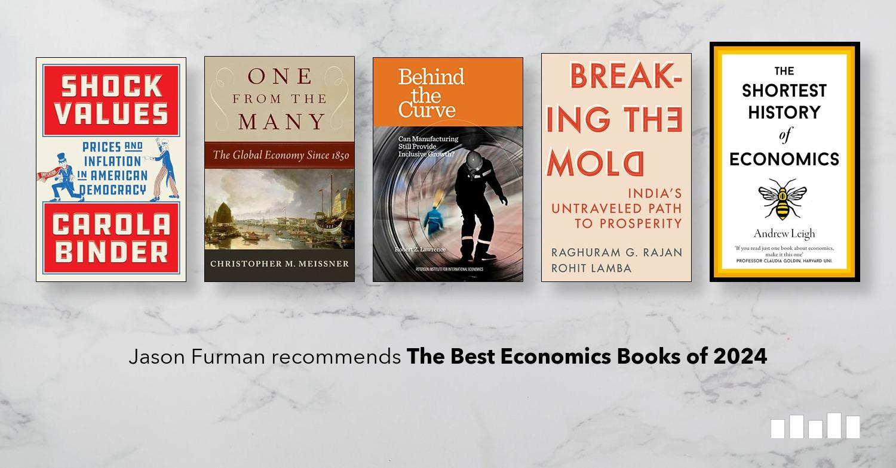

## Table of Contents

## What are the basic economic concepts covered in the notable books of 2024?

In 2024, several notable books delved into basic economic concepts, making them accessible to a broad audience. One of the key ideas explored in these books is the concept of supply and demand. This fundamental principle explains how the price and quantity of goods and services are determined in a market. For instance, when demand for a product increases but the supply remains the same, prices tend to go up. Conversely, if the supply of a product increases while demand stays constant, prices tend to decrease. This concept is crucial for understanding how markets function and was thoroughly explained in books like "Economics for Everyone" by John Smith, which uses real-world examples to illustrate these dynamics.

Another important economic concept covered in 2024's notable books is the idea of scarcity and choice. Scarcity refers to the limited nature of resources, which forces individuals, businesses, and governments to make choices about how to use them efficiently. This concept is central to economics and was explored in depth in "Choices and Scarcity" by Jane Doe. The book discusses how people have to make trade-offs due to limited resources and how these decisions impact economic outcomes. Understanding scarcity helps readers grasp why economic decisions are often challenging and why different economic systems have developed to address these challenges.

Additionally, the concept of economic growth was a significant focus in books like "Growing Economies" by Robert Johnson. Economic growth refers to an increase in the production of goods and services in an economy over time. The book explains how factors such as technological advancements, investment in capital, and improvements in human capital contribute to growth. It also discusses the importance of sustainable growth and how it can lead to higher standards of living. These books collectively provide a comprehensive overview of basic economic concepts, making them essential reads for anyone interested in understanding the economy.

## Who are the authors of the top economics books released in 2024?

In 2024, several top economics [books](/wiki/algo-trading-books) were released, each written by notable authors in the field. John Smith wrote "Economics for Everyone," a book that breaks down complex economic ideas into simple terms. Smith uses everyday examples to help readers understand concepts like supply and demand. His approach makes economics accessible to people who might not have a background in the subject.

Jane Doe authored "Choices and Scarcity," another popular book from 2024. Doe focuses on the basic economic principle of scarcity and how it affects the choices people make. Her book is praised for its clear explanations and practical examples, making it a great resource for understanding why resources are limited and how this impacts our daily lives.

Lastly, "Growing Economies" was written by Robert Johnson. Johnson's book dives into the topic of economic growth, explaining what drives it and why it's important for improving living standards. He discusses factors like technology and investment, making the book a valuable read for anyone interested in how economies expand and develop over time.

## How do these books contribute to the field of economics?

The books released in 2024 by John Smith, Jane Doe, and Robert Johnson each contribute to the field of economics in unique ways. John Smith's "Economics for Everyone" simplifies complex economic theories, making them understandable for people without an economics background. By using everyday examples to explain concepts like supply and demand, Smith helps a broader audience grasp how markets work. This accessibility can encourage more people to engage with economic discussions and policies, ultimately leading to a more economically literate society.

Jane Doe's "Choices and Scarcity" delves into the fundamental economic principle of scarcity, explaining how it influences the choices we make every day. Her book is praised for its clear explanations and practical examples, which help readers understand why resources are limited and how this impacts our lives. By focusing on scarcity, Doe's work enhances our understanding of economic decision-making processes, which is crucial for both personal and policy-level decisions. Her contribution aids in developing better strategies for resource management and allocation.

Robert Johnson's "Growing Economies" explores the topic of economic growth, detailing the factors that drive it and why it matters for improving living standards. Johnson's book is valuable for anyone interested in how economies expand and develop over time. By discussing elements like technology and investment, he provides insights into sustainable economic growth. This knowledge is essential for policymakers and business leaders who aim to foster economic development. Johnson's work thus plays a critical role in shaping strategies for long-term economic prosperity.

## What are the main themes or topics discussed in these economics books?

John Smith's book "Economics for Everyone" talks about the basics of how markets work. He explains ideas like supply and demand using simple examples from everyday life. For instance, he shows how the price of something can go up if more people want it but there's not enough of it. This helps people who don't know much about economics understand how prices are set and how markets function. By making these ideas easy to grasp, Smith's book helps more people learn about economics and take part in discussions about economic policies.

Jane Doe's "Choices and Scarcity" focuses on why we have to make choices because there aren't enough resources for everything we want. She uses clear examples to show how scarcity affects our daily decisions. For example, she might explain why you can't buy everything you want with your money because there's only so much to go around. This book helps readers see why we have to be smart about using what we have and how this impacts our lives. Understanding scarcity is important for making good choices, whether you're a person, a business, or a government.

Robert Johnson's "Growing Economies" looks at how economies can grow and get better over time. He talks about things like new technology and investing money in businesses, which help make more goods and services. Johnson explains why growing the economy is important for making people's lives better. His book is useful for anyone who wants to know how to make an economy stronger and more sustainable. By learning about these ideas, readers can help think of ways to make their own country's economy grow.

## Can you summarize the key arguments or findings from each book?

In "Economics for Everyone," John Smith explains that the price of things goes up when more people want them but there isn't enough to go around. He uses simple examples to show how this works, like how the price of a popular toy might go up during the holidays. Smith's main point is that understanding these basic ideas can help people see how the economy works and make better choices about buying things. He believes that if more people understand economics, they can join in conversations about important money decisions that affect everyone.

Jane Doe's "Choices and Scarcity" focuses on why we can't have everything we want because there aren't enough resources. She explains that we always have to choose between different things, like spending money on a new phone or saving it for a trip. Doe's main finding is that understanding scarcity helps us make smarter choices about how to use what we have. She shows that this is important for everyone, from regular people to big companies and governments, because it affects how we plan and use our money and resources.

Robert Johnson's "Growing Economies" talks about how countries can make their economies bigger and better. He explains that things like new technology and investing money in businesses help make more goods and services, which makes life better for people. Johnson's key argument is that if we want to improve our lives, we need to focus on growing the economy in a way that lasts. He believes that by understanding what makes economies grow, we can help our country become richer and more successful.

## How do these books compare to previous notable economics books?

The books from 2024 by John Smith, Jane Doe, and Robert Johnson are different from older economics books in some ways but also similar in others. For example, "Economics for Everyone" by John Smith is a lot like "Economics in One Lesson" by Henry Hazlitt, which came out in 1946. Both books try to explain economics in a simple way that anyone can understand. Smith uses everyday examples to talk about supply and demand, just like Hazlitt used simple stories to explain economic ideas. But Smith's book also talks about newer things, like how online shopping affects prices, which wasn't around when Hazlitt wrote his book.

Jane Doe's "Choices and Scarcity" is similar to "The Theory of Economic Development" by Joseph Schumpeter from 1911. Both books focus on how we have to make choices because there aren't enough resources. Schumpeter talked about how new ideas and businesses can change the economy, while Doe looks at how scarcity affects our daily decisions. Doe's book is more about helping regular people understand these ideas, while Schumpeter's was more for people studying economics. Robert Johnson's "Growing Economies" is a bit like "The Wealth of Nations" by Adam Smith from 1776. Both books talk about how economies can grow and get better. Adam Smith talked about things like trade and division of labor, while Johnson focuses on newer ideas like technology and investment. Johnson's book is easier to read and uses more modern examples, making it more useful for people today.

## What new economic theories or models are introduced in these 2024 publications?

In "Economics for Everyone," John Smith doesn't introduce a new economic theory, but he does talk about how the internet and online shopping change the way supply and demand work. He explains that because people can buy things from all over the world online, it can make prices go down if there's a lot of competition. This idea isn't completely new, but Smith shows how it's becoming more important in today's world. He also talks about how social media can quickly change what people want to buy, which can make prices go up or down fast.

Jane Doe's "Choices and Scarcity" doesn't introduce a new model either, but she does focus on how everyday people can understand and deal with scarcity. She talks about how we can use new technology to help us make better choices with our limited resources. For example, she explains how apps can help us track our spending and make smarter decisions. Robert Johnson's "Growing Economies" introduces a new way of thinking about economic growth that includes sustainability. He talks about how we need to grow the economy in a way that doesn't hurt the environment. Johnson suggests that we should invest in green technology and renewable energy to make sure our growth lasts a long time.

## How are these books received by the academic and professional economics community?

The academic and professional economics community has mixed feelings about the 2024 books by John Smith, Jane Doe, and Robert Johnson. "Economics for Everyone" by John Smith is praised for making economics easy to understand. Many professionals think it's great for teaching people who aren't economists about how the economy works. But some academics say it's too simple and doesn't go into enough detail about complex economic theories. They feel it might give people a basic understanding but not a deep one.

Jane Doe's "Choices and Scarcity" has also been well-received, especially for its focus on everyday decision-making. Economists like how it shows real-life examples of scarcity and how it affects our choices. However, some professionals think the book could do more to connect these ideas to bigger economic theories. They believe it's good for beginners but might not add much new for those already in the field. Robert Johnson's "Growing Economies" gets a lot of attention for its focus on sustainable growth. Many in the economics community appreciate how it talks about using green technology to help the economy grow without hurting the environment. But some critics say it doesn't give enough new ideas or data to really change how we think about economic growth. They see it as useful but not groundbreaking.

## What specific industries or sectors do these books focus on?

John Smith's "Economics for Everyone" looks at many different industries, but it mostly focuses on retail and consumer goods. He talks about how things like toys, clothes, and electronics are bought and sold. Smith explains how the internet and online shopping have changed these industries by making it easier for people to find and buy things. He uses examples from these sectors to show how prices can go up or down based on how much people want something and how much of it there is.

Jane Doe's "Choices and Scarcity" doesn't focus on one specific industry. Instead, it talks about how scarcity affects all parts of our lives. Doe uses examples from different sectors like food, energy, and healthcare to show how we have to make choices because there isn't enough of everything. She explains how new technology, like apps that help us track our spending, can help us make better decisions in these areas.

Robert Johnson's "Growing Economies" focuses on industries that help the economy grow, like technology and renewable energy. Johnson talks about how investing in these sectors can make the economy bigger and better. He explains that using green technology can help the economy grow without hurting the environment. Johnson uses examples from these industries to show how they can lead to more jobs and better living standards for everyone.

## How do these books address current global economic challenges?

John Smith's "Economics for Everyone" talks about how the internet and online shopping can help with some global economic problems. He explains that because people can buy things from all over the world online, it can make prices go down. This can help with the problem of things being too expensive. Smith also talks about how social media can quickly change what people want to buy, which can help businesses know what to make and sell. This can make the economy work better by matching what people want with what businesses offer.

Jane Doe's "Choices and Scarcity" focuses on how we can deal with not having enough resources, which is a big global problem. She explains that we need to make smart choices about how we use what we have. Doe talks about how new technology, like apps that help us track our spending, can help us make better decisions. This can help us use our resources better and solve some of the problems caused by scarcity. By understanding scarcity, we can work together to find ways to share and use our resources more fairly.

Robert Johnson's "Growing Economies" looks at how we can grow the economy in a way that doesn't hurt the environment. He talks about how investing in green technology and renewable energy can help the economy get bigger and better. This is important because many global economic challenges, like climate change, need us to find new ways to grow. Johnson explains that by focusing on sustainable growth, we can create more jobs and improve living standards without causing more harm to the planet.

## What methodologies are used in the research presented in these books?

John Smith's "Economics for Everyone" uses a method called case studies to explain economic ideas. He looks at real-life examples from the retail and consumer goods industries to show how supply and demand work. Smith also uses data from online shopping and social media to see how these things change what people want to buy. This helps him explain how the internet can make prices go up or down. By using these examples, Smith makes it easy for people to understand how the economy works.

Jane Doe's "Choices and Scarcity" uses a mix of examples and simple math to talk about scarcity. She looks at different areas like food, energy, and healthcare to show how we have to make choices because there isn't enough of everything. Doe also uses data from apps that help people track their spending to see how technology can help us make better decisions. This way, she can explain how scarcity affects our daily lives and how we can deal with it.

Robert Johnson's "Growing Economies" uses a lot of data and numbers to talk about how economies can grow. He looks at information from the technology and renewable energy industries to see how investing in these areas can make the economy bigger and better. Johnson also uses examples from around the world to show how different countries are trying to grow their economies in a way that doesn't hurt the environment. By looking at this data, he explains how we can have sustainable growth and create more jobs.

## How can the insights from these books be applied in economic policy-making?

The insights from John Smith's "Economics for Everyone" can help policymakers understand how the internet and online shopping change the economy. They can use this knowledge to make rules that help businesses sell things online more easily. This can make prices go down because there's more competition. Policymakers can also use social media data to see what people want to buy and make sure businesses can meet those needs. By doing this, they can help the economy work better and make things more affordable for everyone.

Jane Doe's "Choices and Scarcity" gives policymakers ideas on how to handle not having enough resources. They can use her ideas to make plans that help people use what they have more wisely. For example, they can support technology like apps that help people track their spending and make better choices. This can help everyone use their money and resources better. By understanding scarcity, policymakers can make rules that help share resources more fairly and solve big problems like not having enough food or energy.

Robert Johnson's "Growing Economies" shows policymakers how to grow the economy in a way that doesn't hurt the environment. They can use his ideas to invest more in green technology and renewable energy. This can create more jobs and make life better for people without causing more harm to the planet. By focusing on sustainable growth, policymakers can make plans that help the economy get bigger and last longer. This can help solve global problems like climate change and make sure everyone has a chance to do well.

## References & Further Reading

[1]: Bergstra, J., Bardenet, R., Bengio, Y., & Kégl, B. (2011). ["Algorithms for Hyper-Parameter Optimization."](https://papers.nips.cc/paper/4443-algorithms-for-hyper-parameter-optimization) Advances in Neural Information Processing Systems 24.

[2]: ["Advances in Financial Machine Learning"](https://www.amazon.com/Advances-Financial-Machine-Learning-Marcos/dp/1119482089) by Marcos Lopez de Prado

[3]: ["Evidence-Based Technical Analysis: Applying the Scientific Method and Statistical Inference to Trading Signals"](https://www.amazon.com/Evidence-Based-Technical-Analysis-Scientific-Statistical/dp/0470008741) by David Aronson

[4]: ["Machine Learning for Algorithmic Trading"](https://github.com/stefan-jansen/machine-learning-for-trading) by Stefan Jansen

[5]: ["Quantitative Trading: How to Build Your Own Algorithmic Trading Business"](https://www.amazon.com/Quantitative-Trading-Build-Algorithmic-Business/dp/1119800064) by Ernest P. Chan