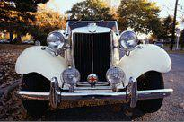

## Table of Contents

## What is considered an invention?

An invention is something new that someone creates. It can be a new tool, a new way of doing things, or a new product. People invent things to solve problems or make life easier. For example, the telephone was invented to help people talk to each other from far away.

Inventions can be big or small. They can change the world, like the internet, or they can be simple, like a new kind of kitchen tool. To be considered an invention, it has to be something that no one else has thought of before. When someone invents something, they can get a patent to protect their idea and make sure others don't copy it.

## How do inventions impact everyday life?

Inventions make our daily lives easier and more fun. For example, the refrigerator keeps our food fresh, so we don't have to go to the store every day. The car helps us travel quickly to different places, like work or school. Even small inventions like the zipper make our clothes easier to wear. These inventions save us time and effort, letting us do more things we enjoy.

Inventions also help us stay connected with others. The telephone and the internet let us talk to friends and family no matter where they are. We can use our phones to send messages, share pictures, and even play games together. These inventions make the world feel smaller and help us feel closer to the people we care about.

Overall, inventions change the way we live, work, and play. They solve problems and make life better. From big inventions like electricity to small ones like sticky notes, they all have an impact on our everyday lives.

## What are some criteria for an invention to be considered notable?

An invention is considered notable if it changes how people live or work. It should solve a big problem or make something much easier to do. For example, the light bulb changed how we live because it let us have light at night without using candles or oil lamps. This made it possible to work, read, or do other things after the sun went down.

Another criterion for a notable invention is if it leads to more inventions or new ways of thinking. The computer is a good example of this. It not only changed how we work and communicate, but it also led to the internet, smartphones, and many other technologies. When an invention inspires other inventions, it shows how important it is.

Lastly, an invention can be notable if it has a big impact on society or the economy. The steam engine, for example, helped start the Industrial Revolution. This changed how goods were made and moved, leading to big changes in how people lived and worked. When an invention affects many people and changes the world, it is considered very notable.

## Can you name an invention from the 19th century that improved daily life?

One important invention from the 19th century that improved daily life is the electric light bulb. Before the light bulb, people used candles or oil lamps for light at night. These were not very bright and could be dangerous because they could start fires. Thomas Edison made the first practical light bulb in 1879. This let people have safe, bright light at home and at work, even when it was dark outside. It changed how people lived because they could stay up later to read, work, or spend time with family.

Another invention from the 19th century that made daily life better is the refrigerator. Before refrigerators, people had to buy fresh food every day or use ice to keep it cold. This was hard and food often went bad quickly. In 1856, James Harrison made the first practical refrigerator. It used a machine to keep food cold, so people could store food longer and not have to go to the store every day. This made life easier and helped people eat healthier food.

## What modern invention has significantly changed communication?

The smartphone is a modern invention that has changed how we communicate a lot. Before smartphones, people used phones just to call or text. Now, with a smartphone, you can do so much more. You can send messages, make video calls, use social media, and even send emails from anywhere. This makes it easy to stay in touch with friends and family no matter where they are.

Smartphones have also made it easier to share information quickly. You can take a picture or record a video and send it to someone right away. This is great for sharing special moments or important news. Because of smartphones, the world feels smaller and people feel more connected.

## How has the invention of the internet affected daily routines?

The internet has changed our daily routines a lot. Before the internet, people had to do many things in person or by mail. Now, we can do things like shopping, banking, and even going to school online. This saves time and makes life easier. We can buy things we need without leaving home, check our bank accounts anytime, and learn new things from anywhere.

The internet also helps us stay connected with others. We can talk to friends and family who live far away using social media or video calls. This makes it feel like they are closer. We can also find information quickly when we need it, like looking up a recipe or getting directions. The internet has made our daily lives more convenient and connected.

## What are the societal impacts of the smartphone?

Smartphones have changed how we live together as a society. They make it easy to stay in touch with people all over the world. We can use social media and messaging apps to talk to friends and family anytime, no matter where they are. This helps us feel closer to each other even if we live far away. Smartphones also let us share news and information quickly. If something important happens, people can find out about it right away and share it with others.

Smartphones also change how we do things every day. We can use them to shop, pay bills, and even go to the doctor without leaving home. This saves time and makes life easier. But there are also some challenges. People can spend too much time on their phones and not talk to others in person. This can make us feel lonely or disconnected. Also, not everyone can afford a smartphone, so some people might feel left out of things that happen online.

## Can you discuss an invention that has improved health and hygiene?

One invention that has improved health and hygiene is the toilet. Before toilets, people used outhouses or just went outside. This was not very clean and could spread diseases. The toilet, invented in the 16th century but improved over time, helps keep waste away from where we live. It uses water to flush waste away, so it doesn't stay around to make people sick. This has made a big difference in keeping people healthy.

Another invention that has helped with health and hygiene is the washing machine. Before washing machines, people had to wash clothes by hand. This was hard work and took a lot of time. Dirty clothes can spread germs, so it's important to wash them well. The washing machine, first made in the 19th century, makes it easy to clean clothes. It uses water and soap to get rid of dirt and germs. This helps keep us clean and healthy.

## What role did the invention of electricity play in improving everyday life?

The invention of electricity made a big difference in our daily lives. Before electricity, people used candles or oil lamps for light. These were not very bright and could be dangerous because they could start fires. When electricity came along, people could use light bulbs. This gave them safe, bright light at home and at work, even when it was dark outside. This meant they could stay up later to read, work, or spend time with family. Electricity also let people use new machines like refrigerators and washing machines. These machines made life easier and helped keep people healthy.

Electricity also changed how we communicate. Before electricity, people had to send letters or travel to talk to each other. With electricity, we could use telephones to talk to people far away. Later, electricity helped make the internet possible. Now, we can use computers and smartphones to talk to anyone, anywhere, anytime. Electricity also powers TVs and radios, so we can learn about the world and enjoy entertainment. Overall, electricity has made our lives brighter, easier, and more connected.

## How have transportation inventions like the automobile changed daily life?

The automobile, or car, has changed daily life a lot. Before cars, people had to walk, ride horses, or use trains to get around. This took a long time and made it hard to go far. With cars, people can travel quickly and easily. They can drive to work, school, or the store without having to wait for a train or walk a long way. This saves time and makes it easier to do the things we need to do every day.

Cars have also changed how we live and where we live. Before cars, most people lived close to where they worked because it was hard to travel far. With cars, people can live farther away from their jobs. They can live in the suburbs or the countryside and still get to work easily. This has led to the growth of cities and new ways of living. Cars have made our world smaller and more connected, letting us go where we want, when we want.

## What are some lesser-known inventions that have had a big impact on daily life?

One lesser-known invention that has made a big difference in our daily lives is the barcode. It might seem small, but it helps stores keep track of what they sell and how much they have. When you buy something, the cashier scans the barcode, and it tells the computer what you bought and how much it costs. This makes shopping faster and helps stores know what people like to buy. Without barcodes, shopping would take longer, and stores might not have the things we need.

Another invention that has a big impact but isn't talked about much is the Post-it Note. It's just a small piece of paper with a sticky part, but it helps us remember things and organize our work. You can write a quick note and stick it anywhere, like on your computer or fridge. This makes it easy to remember important things without losing them in a pile of paper. Post-it Notes have changed how we work and keep track of our daily tasks.

## How do patents and intellectual property rights influence the development and spread of inventions?

Patents and intellectual property rights help inventors by giving them a way to protect their ideas. When someone invents something new, they can get a patent. This means that for a certain number of years, no one else can make, use, or sell that invention without their permission. This is important because it gives inventors a chance to make money from their inventions. If they didn't have this protection, other people might copy their ideas and sell them, and the inventor wouldn't get anything for their hard work.

These rights also help spread inventions in a good way. When inventors know their ideas are protected, they are more likely to share them with the world. They can license their patents to other companies, which means those companies can use the invention if they pay the inventor. This helps the invention reach more people and be used in more places. But it's a balance. If the rules are too strict, it might be hard for new ideas to grow. If they're too loose, inventors might not want to share their ideas at all.

## References & Further Reading

[1]: Bergstra, J., Bardenet, R., Bengio, Y., & Kégl, B. (2011). ["Algorithms for Hyper-Parameter Optimization."](https://papers.nips.cc/paper/4443-algorithms-for-hyper-parameter-optimization) Advances in Neural Information Processing Systems 24.

[2]: ["Advances in Financial Machine Learning"](https://www.amazon.com/Advances-Financial-Machine-Learning-Marcos/dp/1119482089) by Marcos Lopez de Prado

[3]: ["Evidence-Based Technical Analysis: Applying the Scientific Method and Statistical Inference to Trading Signals"](https://www.amazon.com/Evidence-Based-Technical-Analysis-Scientific-Statistical/dp/0470008741) by David Aronson

[4]: ["Machine Learning for Algorithmic Trading"](https://github.com/stefan-jansen/machine-learning-for-trading) by Stefan Jansen

[5]: ["Quantitative Trading: How to Build Your Own Algorithmic Trading Business"](https://www.amazon.com/Quantitative-Trading-Build-Algorithmic-Business/dp/1119800064) by Ernest P. Chan